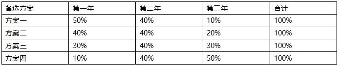
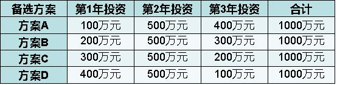

甲、乙、丙和丁四个公司投资相同项目，收益方案如下表（单位：万元）。若社会平均收益率为10%，根据资金时间价值原理，其投资收益最大的是（ &nbsp;）。 
<table border="1" cellspacing="0" style="border: none;"><tbody><tr class="firstRow"><td width="113" valign="top" style="width:114px;padding:0 7px 0 7px ;border-left:1px solid #000;border-right:1px solid #000;border-top:1px solid #000;border-bottom:1px solid #000">
公司
</td><td width="113" valign="top" style="width:114px;padding:0 7px 0 7px ;border-left:none;border-right:1px solid #000;border-top:1px solid #000;border-bottom:1px solid #000">
第1年
</td><td width="113" valign="top" style="width:114px;padding:0 7px 0 7px ;border-left:none;border-right:1px solid #000;border-top:1px solid #000;border-bottom:1px solid #000">
第2年
</td><td width="113" valign="top" style="width:114px;padding:0 7px 0 7px ;border-left:none;border-right:1px solid #000;border-top:1px solid #000;border-bottom:1px solid #000">
第3年
</td><td width="113" valign="top" style="width:114px;padding:0 7px 0 7px ;border-left:none;border-right:1px solid #000;border-top:1px solid #000;border-bottom:1px solid #000">
合计
</td></tr><tr><td width="113" valign="top" style="width:114px;padding:0 7px 0 7px ;border-left:1px solid #000;border-right:1px solid #000;border-top:none;border-bottom:1px solid #000">
甲公司
</td><td width="113" valign="top" style="width:114px;padding:0 7px 0 7px ;border-left:none;border-right:1px solid #000;border-top:none;border-bottom:1px solid #000">
200
</td><td width="113" valign="top" style="width:114px;padding:0 7px 0 7px ;border-left:none;border-right:1px solid #000;border-top:none;border-bottom:1px solid #000">
500
</td><td width="113" valign="top" style="width:114px;padding:0 7px 0 7px ;border-left:none;border-right:1px solid #000;border-top:none;border-bottom:1px solid #000">
300
</td><td width="113" valign="top" style="width:114px;padding:0 7px 0 7px ;border-left:none;border-right:1px solid #000;border-top:none;border-bottom:1px solid #000">
1000
</td></tr><tr style="height:6px"><td width="113" valign="top" style="width:114px;padding:0 7px 0 7px ;border-left:1px solid #000;border-right:1px solid #000;border-top:none;border-bottom:1px solid #000">
乙公司
</td><td width="113" valign="top" style="width:114px;padding:0 7px 0 7px ;border-left:none;border-right:1px solid #000;border-top:none;border-bottom:1px solid #000">
200
</td><td width="113" valign="top" style="width:114px;padding:0 7px 0 7px ;border-left:none;border-right:1px solid #000;border-top:none;border-bottom:1px solid #000">
400
</td><td width="113" valign="top" style="width:114px;padding:0 7px 0 7px ;border-left:none;border-right:1px solid #000;border-top:none;border-bottom:1px solid #000">
400
</td><td width="113" valign="top" style="width:114px;padding:0 7px 0 7px ;border-left:none;border-right:1px solid #000;border-top:none;border-bottom:1px solid #000">
1000
</td></tr><tr><td width="113" valign="top" style="width:114px;padding:0 7px 0 7px ;border-left:1px solid #000;border-right:1px solid #000;border-top:none;border-bottom:1px solid #000">
丙公司
</td><td width="113" valign="top" style="width:114px;padding:0 7px 0 7px ;border-left:none;border-right:1px solid #000;border-top:none;border-bottom:1px solid #000">
300
</td><td width="113" valign="top" style="width:114px;padding:0 7px 0 7px ;border-left:none;border-right:1px solid #000;border-top:none;border-bottom:1px solid #000">
500
</td><td width="113" valign="top" style="width:114px;padding:0 7px 0 7px ;border-left:none;border-right:1px solid #000;border-top:none;border-bottom:1px solid #000">
200
</td><td width="113" valign="top" style="width:114px;padding:0 7px 0 7px ;border-left:none;border-right:1px solid #000;border-top:none;border-bottom:1px solid #000">
1000
</td></tr><tr><td width="113" valign="top" style="width:114px;padding:0 7px 0 7px ;border-left:1px solid #000;border-right:1px solid #000;border-top:none;border-bottom:1px solid #000">
丁公司
</td><td width="113" valign="top" style="width:114px;padding:0 7px 0 7px ;border-left:none;border-right:1px solid #000;border-top:none;border-bottom:1px solid #000">
300
</td><td width="113" valign="top" style="width:114px;padding:0 7px 0 7px ;border-left:none;border-right:1px solid #000;border-top:none;border-bottom:1px solid #000">
400
</td><td width="113" valign="top" style="width:114px;padding:0 7px 0 7px ;border-left:none;border-right:1px solid #000;border-top:none;border-bottom:1px solid #000">
300
</td><td width="113" valign="top" style="width:114px;padding:0 7px 0 7px ;border-left:none;border-right:1px solid #000;border-top:none;border-bottom:1px solid #000">
1000
</td></tr></tbody></table>
A.甲公司
B.乙公司
C.丙公司  (正确)
D.丁公司
解析：
资金时间价值的影响因素： （1）资金的使用时间。资金使用时间越长，资金的时间价值越多。 （2）资金的数量。资金数量越多，资金的时间价值越多。 （3）资金投入和回收的特点。在总投资一定的情况下，前期投入的资金越多，资金的负效益就越大；反之，后期投入的资金越多，负效益越小。在资金回收额一定的情况下，离现在越近的时间回收的资金越多，资金的时间价值就越多；反之离现在越远的时间回收的资金越多，资金的时间价值越少。

【知识点】资金时间价值的概念 

【考点】影响资金时间价值的因素

【考查方向】概念释义

【难度】中等

【题库维护老师：hejiade】

下列关于资金时间价值的说法，错误的是（）。

A.单位时间的资金增值率一定的条件下，资金使用时间越长，资金的时间价值越大
B.在其他条件不变的情况下，资金数量越多，资金的时间价值越多
C.在总资金一定的情况下，前期投入的资金越多，资金的负效益越大
D.在资金回收额一定的情况下，离现在越远的时间回收的资金越多，资金的时间价值就多  (正确)
解析：
影响资金时间价值的因素：在总资金一定的情况下，前期投入的资金越多，资金的负效益越大；反之，后期投入的资金越多，资金的负效益越小。而在资金回收额一定的情况下，离现在越近的时间回收的资金越多，资金的时间价值就越多；反之，离现在越远的时间回收的资金越多，资金的时间价值就越少。

选项D错误的地方在“离现在越远”，应该是离现在越近。

【知识点】资金时间价值的概念

【考点】影响资金时间价值的因素

【考查方向】概念释义

【难度】易

【题库维护老师：hejiade】 

    某投资者有以下4种现金流量的技术方案可选，则最理想的方案是( &nbsp;)。

A.前期投入的资金越多 ，后期投入的资金越少
B.离现在近的时间回收的资金少，离现在远的时间回收的资金越多
C.离现在远的时间回收的资金越多，离现在近的时间回收的资金越少
D.在总资金一定的情况下，前期投入的资金越少，后期投入的资金越多  (正确)
解析：
    在总资金一定的情况下，前期投入的资金越多，资金的负效益越大；反之，后期投入的资金越多，资金的负效益越小。而在资金回收额一定的情况下，离现在越近的时间回收的资金越多，资金的时时价值就越多；反之，离现在越远的时间回收的资金越多，资金的时间价值就越少。

    【知识点】资金时间价值的概念

    【考点】影响资金时间价值的因素

    【考查方向】概念释义

    【难度】易

    【题库维护老师：hejiade】

考虑资金时间价值，<strong>两笔资金不能等值</strong>的情形是（　　）

A.金额不等，发生在相同的时点  (正确)
B.金额不等，发生在不同的时点
C.金额不等，但分别发生在初期和期末
D.金额相等，发生在相同的时点
解析：
影响资金时间价值的因素很多，其中主要有以下几点：

1.资金的使用时间。在单位时间的资金增值率一定的条件下，资金使用时间越长，则资金的时间价值越大；使用时间越短，则资金的时间价值越小。

2.资金数量的多少。在其他条件不变的情况下，资金数量越多，资金的时间价值就越多；反之，资金的时间价值则越少。

3.资金投入和回收的特点。在总资金一定的情况下，前期投入的资金越多，资金的

负效益越大；反之，后期投入的资金越多，资金的负效益越小。而在资金回收额一定的情况下，离现在越近的时间回收的资金越多，资金的时间价值就越多；反之，离现在越远的时间回收的资金越多，资金的时间价值就越少。

4.资金周转的速度。资金周转越怏，在一定的时间内等量资金的周转次数越多，资金的时间价值越多；反之，资金的时间价值越少。

总之，资金的时间价值是客观存在的，生产经营的一项基本原则就是充分利用资金的时间价值并最大限度地获得其时间价值，这就要加速资金周转，早期回收资金，并不断从事利润较高的投资活动；任何资金的闲置，都是损失资金的时间价值。

<strong>做此类资金等值的题目，有个三句话的总结：</strong>

<strong>相同周期，不同金额，时间价值不同。</strong>

<strong>不同周期，相同金额，时间价值不同。</strong>

<strong>不同周期，不同金额，时间价值可能相同。</strong>

【知识点】资金时间价值的概念

【考点】资金时间价值的概念

【考查方向】概念释义

【难度】易

【题库维护老师：hejiade】

 

下列关于资金时间价值的论述不正确的有（ ）。

A.资金时间价值是货币随着时间的推移而产生的一种增值，因而它是由时间创造的  (正确)
B.资金时间价值的实质是资金作为生产经营要素，在扩大再生产及其资金流通过程中，资金随时间周转使用的结果
C.资金的周转速度越快，资金的时间价值越多
D.同等数量的货币，其现在价值高于未来价值
解析：
资金是运动的价值，资金的价值是随时间变化而变化的，是时间的函数，随时间的推移而增值，其增值的这部分资金就是原有资金的时间价值。其实质是资金作为生产经营要素，在扩大再生产及其资金流通过程中，资金随时间周转使用的结果。 所以，选项里面出现单一的增值或者是贬值都是不正确的。

影响资金时间价值的因素很多，其中主要有以下几点：  （1）资金的使用时间。  （2）资金数量的多少。  （3）资金投入和回收的特点。在总资金一定的情况下，前期投入的资金越多，资金的负效益越大；反之，后期投入的资金越多，资金的负效益越小。而在资金回收额一定的情况下，离现在越近的时间回收的资金越多，资金的时间价值就越多；反之，离现在越远的时间回收的资金越多，资金的时间价值就越少。  （4）资金周转的速度。资金周转越快，在一定的时间内等量资金的周转次数越多，资金的时间价值越多；反之，资金的时间价值越少。

D选项正确，当前拥有的货币比未来收到的同样金额的货币具有更大的价值，因当前拥有的货币可以进行投资，复利。即使有通货膨胀的影响，只要存在投资机会，货币的现值就一定大于它的未来价值。

【知识点】资金时间价值的概念

【考点】资金时间价值的概念

【考查方向】概念释义

【难度】易

【题库维护老师：hejiade】

从资金的时间价值考虑，下列两笔资金一定等值的情况是（ ）。

A.金额相等，但分别发生在期初和期末
B.金额相等，但同时发生在期初  (正确)
C.金额不等，但同时发生在期初
D.金额不等，但分别发生在期初和期末
解析：
资金有时间价值，即使金额相同，因其发生在不同的时间，其价值就不相同。D 选项是有可能相等，只有 B 选项是一定等值的。

做此类资金等值的题目，有个四句话的总结：

相同周期，相同金额，时间价值肯定相同。 

相同周期，不同金额，时间价值不同。

不同周期，相同金额，时间价值不同。

不同周期，不同金额，时间价值可能相同。

【知识点】资金时间价值的概念

【考点】资金时间价值的概念

【考查方向】概念释义

【难度】易

【题库维护老师：hejiade】

关于资金时间价值的影响因素，以下说法正确的是( &nbsp; )。

A.在单位时间的资金增值率一定的条件下，资金使用时间越长，则资金的时间价值越小
B.在总资金一定的情况下，前期投入越多，资金正收益就越大。后期投入的越多，资金正收益越小
C.资金周转越快.在一定时间内等量资金的周转次数越多，资金的时间价值越少
D.在其他条件不变的情况下，资金数量越多，资金的时间价值就越多  (正确)
解析：
影响资金时间价值的因素主要有以下几点：

(1)资金的使用时间：在单位时间的<strong>资金增值率一定</strong>的条件下，资金<strong>使用时间越长</strong>，则资金的<strong>时间价值越大</strong>；(2)资金数量的多少：在<strong>其他条件不变</strong>的情况下，<strong>资金数量越多</strong>，资金的<strong>时间价值就越多</strong>；(3)资金投入和回收的特点：在<strong>总资金一定</strong>的情况下，<strong>前期</strong>投入越<strong>多</strong>，资金<strong>负效益越大</strong>，<strong>后期</strong>投入的越<strong>多</strong>，资金<strong>负效益越小</strong>；(4)资金周转的速度：资金<strong>周转越快</strong>，在一定时间内等量资金的<strong>周转次数越多</strong>，资金的<strong>时间价值越多</strong>。

由此可知ABC三个选项都是错误的。

【知识点】资金时间价值的概念

【考点】影响资金时间价值的因素

【考查方向】概念释义

【难度】易

【题库维护老师：hejiade】

关于资金时间价值的说法，正确的有（ &nbsp;）。

A.单位时间资金增值率一定的条件下、资金的时间价值与使用时间成正比  (正确)
B.资金随时间的推移而贬值的部分就是原有资金的时间价值
C.投入资金总额一定的情况下，前期投入的资金越多，资金的正效益越大
D.其他条件不变的情况下，资金的时间价值与资金数量成正比  (正确)
E.一定时间内等量资金的周转次数越多，资金的时间价值越多  (正确)
解析：
本题考查的是资金的时间的价值，C早收晚付，C错误。 （资金是时间函数，资金的价值随时间变化而变化的，选项里面单方面说贬值不恰当，所以B选项考试的时候建议不要选择。） 

影响资金时间价值的因素很多，其中主要有以下几点：

1. 资金的使用时间。在单位时间的资金增值率一定的条件下，资金<strong>使用时间越长，则资金的时间价值越大</strong>；使用时间越短，则资金的时间价值越小。

2. 资<strong>金数量的多少。在其他条件不变的情况下，资金数量越多，资金的时间价值就越多；反之，资金的时间价值则越少。</strong>

3. 资金投入和回收的特点。在总资金一定的情况下，<strong>前期投入的资金越多，资金的负效益越大</strong>；反之，后期投入的资金越多，资金的负效益越小。而在资金回收额一定的情况下，离现在越近的时间回收的资金越多，资金的时间价值就越多；反之，离现在越远的时间回收的资金越多，资金的时间价值就越少。 4.资金周转的速度。资金周转越怏，在一定的时间内等量资金的<strong>周转次数越多，资金的时间价值越多</strong>；反之，资金的时间价值越少。 

【知识点】资金时间价值的概念 

【考点】影响资金时间价值的因素

【考查方向】概念释义

【难度】易

【题库维护老师：hejiade】

影响资金时间价值的因素很多，主要有( &nbsp; )。

A.社会平均利润率的高低
B.资金数量的多少  (正确)
C.资金周转速度的快慢  (正确)
D.资金投入和回收的特点  (正确)
E.资金使用时间的长短  (正确)
解析：
    影响资金时间价值的因素有：①资金的使用时间；②资金数量的多少；③资金投入和回收的特点；④资金周转的速度。

    【知识点】资金时间价值的概念

    【考点】影响资金时间价值的因素

    【考查方向】概念释义

    【难度】易

    【题库维护老师：hejiade】

影响资金时间价值的因素有(　　)。

A.利息
B.资金周转的速度  (正确)
C.资金发生的时点  (正确)
D.资金量的大小  (正确)
E.资金等值换算方法
解析：
    影响资金时间价值的因素：1.资金的使用时间。2.资金数量的多少。3.资金投入和回收的特点。4.资金周转的速度。

    【知识点】资金时间价值的概念

    【考点】影响资金时间价值的因素

    【考查方向】概念释义

    【难度】易

    【题库维护老师：hejiade】

关于资金时间价值说法正确的是( &nbsp; &nbsp;)。

A.资金是运动的价值  (正确)
B.资金的价值是随时间而变化的  (正确)
C.资金的价值随时间推移而增值  (正确)
D.资金价值的实质是资金作为生产经营要素，资金随时间周转使用的结果  (正确)
E.在工程经济分析时，可不考虑资金发生的时间
解析：
资金是运动的价值，资金的价值是随时间变化而变化的，是时间的函数，随时间的推移而增值，其增值的这部分资金就是原有资金的时间价值。其实质是资金作为生产经营要素，在扩大再生产及其资金流通过程中，资金随时间周转使用的结果。

【知识点】资金时间价值的概念

【考点】资金时间价值的概念

【考查方向】概念释义

【难度】易

【题库维护老师：hejiade】

下列关于资金时间价值的说法中，正确的有（ &nbsp;）。

A.在单位时间资金增值率一定的条件下，资金使用时间越长，则时间价值就越大  (正确)
B.在其他条件不变的情况下，资金数量越多，则资金时间价值越少
C.在一定的时间内等量资金的周转次数越多，则资金时间价值越少
D.在总投资一定的情况下，前期投资越多，资金的负效益越大  (正确)
E.在回收资金额一定的情况下，在离现时点越远的时点上回收资金越多，资金时间价值越小  (正确)
解析：
影响资金时间价值的因素很多，其中主要有以下几点：

1.资金的使用时间。在单位时间的资金增值率一定的条件下，资金使用时间越长，则资金的时间价值越大；使用时间越短，则资金的时间价值越小。

2.资金数量的多少。在其他条件不变的情况下，资金数量越多，资金的时间价值就越多；反之，资金的时间价值则越少。

3.资金投入和回收的特点。在总资金一定的情况下，前期投入的资金越多，资金的负效益越大；反之，后期投入的资金越多，资金的负效益越小。而在资金回收额一定的情况下，离现在越近的时间回收的资金越多，资金的时间价值就越多；反之，离现在越远的时间回收的资金越多，资金的时间价值就越少。

4.资金周转的速度。资金周转越快，在一定的时间内等量资金的周转次数越多，资金的时间价值越多；反之，资金的时间价值越少。

【知识点】资金时间价值的概念

【考点】资金时间价值的概念

【考查方向】概念释义

【难度】易

【题库维护老师：hejiade】

下面关于资金时间价值的论述中，正确的有（ &nbsp; ）。

A.资金周转速度越快，资金时间价值越大  (正确)
B.资金作为生产要素，在任何情况下都能产生时间价值
C.资金投入生产经营才能增值，因此其时间价值是在生产、经营中产生的  (正确)
D.一般而言，资金时间价值应按间断复利计算方法计算  (正确)
E.资金时间价值常采用连续复利计算方法计算
解析：
影响资金时间价值的因素很多，其中主要有以下几点：

1.资金的使用时间。在单位时间的资金增值率一定的条件下，资金使用时间越长，则资金的时间价值越大；使用时间越短，则资金的时间价值越小。（正比）

2.资金数量的多少。在其他条件不变的情况下，资金数量越多，资金的时间价值就越多；反之，资金的时间价值则越少。（正比）

3.资金投入和回收的特点。在总资金一定的情况下，前期投入的资金越多，资金的负效益越大；反之，后期投入的资金越多，资金的负效益越小。而在资金回收额一定的情况下，离现在越近的时间回收的资金越多，资金的时间价值就越多；反之，离现在越远的时间回收的资金越多，资金的时间价值就越少。

4.资金周转的速度。资金周转越快，在一定的时间内等量资金的周转次数越多，资金的时间价值越多；反之，资金的时间价值越少。（正比）

【知识点】资金时间价值的概念

【考点】影响资金时间价值的因素

【考查方向】概念释义

【难度】易

【题库维护老师：hejiade】

某施工单位拟投资一项目，在投资总额和年收益不变的情况下，四个备选方案各年投资比例如下表（投资时点均相同），则对该单位较为有利的方案是（）。

A.方案一
B.方案二
C.方案三
D.方案四  (正确)
解析：
在总资金一定的情况下，前期投入的资金越多，资金的负效益越大；反之，后期投入的资金越多，资金的负效益越小。而在资金回收额一定的情况下，离现在越近的时间回收的资金越多，资金的时间价值就越多；反之，离现在越远的时间回收的资金越多，资金的时间价值就越少。所以应选前期投资较少的方案四。 

【知识点】资金时间价值的概念

【考点】影响资金时间价值的因素

【考查方向】概念释义

【难度】易

【题库维护老师：hejiade】

某施工单位拟投资一项目，在投资总额和年收益不变的情况下，四个备选方案各年投资比例如下表（投资时点均相同），则对该单位较为有利的方案是（）。

 

A.方案A  (正确)
B.方案B
C.方案C
D.方案D
解析：
在总资金一定的情况下，前期投入的资金越多，资金的负效益越大；反之，后期投入的资金越多，资金的负效益越小。而在资金回收额一定的情况下，离现在越近的时间回收的资金越多，资金的时间价值就越多；反之，离现在越远的时间回收的资金越多，资金的时间价值就越少。所以应选前期投资较少的方案四。

【知识点】资金时间价值的概念

【考点】影响资金时间价值的因素

【考查方向】概念释义

【难度】易

【题库维护老师：hejiade】

