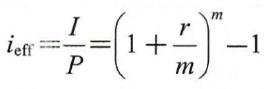

某公司2021年初从银行贷款1000万元用于上马某项目，年利率为6%，按季度计息并且支付利息，借期为3年。则借期内产生的利息总额为（）。

A.180万元  (正确)
B.60万元
C.45万元
D.120万元
解析：
由题干“按季度计息并支付利息”可知，该题考核利息计算中的单利计算，问的是一年支付的利息总计是多少，需要注意这里只是说利息，没有说本金，所以这一年以内的所以利息就是答案。

一年支付的利息总计=每一个季度的利息×一年有四个季节的利息。

=1000×6%×3=180万元。

此类题型计算较为简单，但是需要仔细认真，不然很容易出错，首先明确题目问的是什么，是求本利和还是单独的利息，然后再看利息的计算是单利还是复利，然后确定公式，带入数值可得。

【知识点】利息的计算

【考点】利息的计算

【考查方向】公式计算

【难度】易

【题库维护老师：hejiade】

某企业借款1500万元，期限2年，年利率8％，按年复利计息，到期一次性还本付息，则第2年应计的利息为（ &nbsp; &nbsp;）万元。

A.60.0
B.120.0
C.129.6  (正确)
D.249.6
解析：
第1年的本利和：1500×（1＋8％）＝1620万元；第2年应计利息：1620×8％＝129.6万元。需要注意的是本题问的是第2年应计的利息，是按照年复利计息。（21年教材第3页）

【知识点】利息的计算

【考点】利息的计算

【考查方向】公式计算

【难度】中等

【题库维护老师：hejiade】

    某公司以单利方式一次性借入资金2000万元，借款期限3年，年利率8%，每年年末付息，第三年末支付本金，则第三年末应偿还的本利和（ &nbsp; &nbsp;）万元。

A.2160  (正确)
B.2240
C.2480
D.2519
解析：
由题干可知是单利计息，每年末支付利息为 2000×8%=160 万。注意是每年末付息。 

该题的陷阱在于问题问的是“第 3 年末要偿还的本利和”，每年都要付利息 160 万，但第 3 年末还要还 本金 2000 万，所以第 3 年末偿还本利和为 2160万，本题需要计算的内容其实不难，细节过多容易出错，需要看清楚题目问的是什么。

2000+（2000×8%）=2160。

【知识点】利息的计算

【考点】利息的计算

【考查方向】公式计算

【难度】易

【题库维护老师：hejiade】

某企业拟存款200万元。下列存款利率和计息方式中，在第5年末存款本息和最多的是（ &nbsp;）。

A.年利率6%，按单利计算
B.年利率5.5%，每年复利一次  (正确)
C.年利率4%，每季度复利一次
D.年利率5%，每半年复利一次
解析：
A选项本利和200*（1+5*6%）=260万；

B选项200*（1+5.5%）5=261.39万；

C选项200*（1+1%）20=244.04万；

D选项200*（1+2.5%）10=256.02万。

可得最大的选项为B，本题需要计算内容较多，容易出错，需要沉着细心。

【知识点】利息的计算

【考点】利息的计算

【考查方向】公式计算

【难度】中等

【题库维护老师：hejiade】

某企业以单利计息的方式年初借款1000万元，年利率6%，每年末支付利息，第五年末偿还全部本金，则第三年末应支付的利息为（）万元。

A.300.00
B.180.00
C.71.46
D.60.00  (正确)
解析：
    根据题意可知本题以<strong>单利计息</strong>，则第三年末支付的利息为1000*6%=60.00万元。

    【知识点】 利息的计算

    【考点】利息的计算

    【考查方向】公式计算

    【难度】易

    【题库维护老师：hejiade】

利息是资金时间价值的一种重要表现形式，关于利息的说法错误的是（ ）。

A.利息是由贷款发生利润的一种再分配
B.利息是作为衡量资金时间价值的相对尺度  (正确)
C.利息常常被看成是资金的一种机会成本
D.利息常常是指占用资金所付的代价或者是放弃使用资金所得的补偿
解析：
    本题考查利息的概念。 利率是作为衡量资金时间价值的相对尺度，利息是作为衡量资金时间价值的绝对尺度。利息常常是指占用资金所付的代价或者是放弃使用资金所得的补偿。

    【知识点】利息的计算

    【考点】利息的计算

    【考查方向】原文挖空

    【难度】易

    【题库维护老师：hejiade】

某施工企业从银行借款 100 万元，期限 3 年，年利率 8%，按年计息并于每年末付息，则第 3 年末企业需偿还的本利和为（ ）万元。

A.100
B.124
C.108  (正确)
D.126
解析：
“按年计算并于每年末付息”，所以可以知道是单利计息，每年末支付利息为 100×8%=8 万。注意是每年末付息。

该题的陷阱在于问题问的是“第 3 年末要偿还的本利和”，每年都要付利息 8 万，但第 3 年末还要还 本金 100 万，所以第 3 年末偿还本利和为 108 万，本题需要计算的内容其实不难，细节过多容易出错，需要看清楚题目问的是什么。大家容易错误的选择 124 万。

【知识点】利息的计算

【考点】利息的计算

【考查方向】公式计算

【难度】中等

【题库维护老师：hejiade】

某项目期望在 2 年后获得一笔 100 万的投资额，在年利率为 10%情况下，每年年末应提存的金额是（ ）。

A.40 万
B.50 万
C.47.6 万  (正确)
D.45 万
解析：
该题本质考查已知 F 求 A 的公式，利率为 10%，n=2，代入公式即可求解。

如果公式记不住怎么办？用最原始的办法进行等值计算，2 年共存 2 笔资金 A，把这 2 笔资金都折算到第 2 年年末，然后求和与 100 万等值，即：A+A（1+10%）=100，求解 A=47.6，比代入公式求解简单。

【知识点】 利息的计算

【考点】利息的计算

【考查方向】公式计算

【难度】中等

【题库维护老师：hejiade】

某施工企业年初向银行贷款流动资金100万元,按季计算并支付利息,季度利率2%,则第二年年末支付的利息总和为（ &nbsp; ）万

A.16.00  (正确)
B.16.16
C.16.48
D.16.80
解析：
    由题干可知，按季度计算并支付利息即为单利计算，故两年利息共计：本金×每一季的利率×一年四个季节×一共是两年=二年年末支付的利息总，100×2%×4×2=16万元，故选A。

    此类题型计算较为简单，但是需要仔细认真，不然很容易出错，首先明确题目问的是什么，是求本利和还是单独的利息，然后再看利息的计算是单利还是复利，然后确定公式。

    【知识点】 利息的计算

    【考点】利息的计算

    【考查方向】公式计算

    【难度】易

    【题库维护老师：hejiade】

某人一次性存入银行20000元，年利率4%，每年末提取息。则第2年末取出银行存款本利和为( &nbsp; &nbsp;)元。

A.20800  (正确)
B.21632
C.22444
D.24929
解析：
    由题干“每年末提取息”可知，该题考核利息计算中的单利计算，问的是第2年末取出银行存款本利和。

    第2年末的本利和=本金+第二年的利息。 

    =20000+（4%×20000）=20800元。 

    此类题型计算较为简单，但是需要仔细认真，不然很容易出错，首先明确题目问的是什么，是求本利和还是单独的利息，然后再看利息的计算是单利还是复利，然后确定公式，带入数值可得。

    【知识点】 利息的计算

    【考点】利息的计算

    【考查方向】公式计算

    【难度】易

    【题库维护老师：hejiade】

甲公司从银行借入1000万元，年利率为8%，单利计息，借期5年，到期一次还本付息，则该公司第五年末一次偿还的本利和为( &nbsp; &nbsp;)万元。

A.1360
B.1324
C.1400  (正确)
D.1160
解析：
由题干可知，该题考核利息计算中的单利计算，还是到期一次还本付息，问的是第五年末一次偿还的本利和。

第五年末一次偿还的本利和=本金+这五年的全部利息（就是每年得到的利息乘以一个时间五年）。

=1000+（1000×8%×5）=1400元。

此类题型计算较为简单，但是需要仔细认真，不然很容易出错，首先明确题目问的是什么，是求本利和还是单独的利息，然后再看利息的计算是单利还是复利，然后确定公式，带入数值可得。

【知识点】利息的计算

【考点】利息的计算

【考查方向】公式计算

【难度】易

【题库维护老师：hejiade】

某公司以单利方式一次性借入资金2000万元，借款期限3年，年利率8%，期满一次还本付息，则第三年末应偿还的本利和为（ &nbsp;）万元。

A.2160
B.2240
C.2480  (正确)
D.2519
解析：
由题干可知，该题考核利息计算中的单利计算，还是期满一次还本付息，问的是第三年末应偿还的本利和是多少。

第三年末应偿还的本利和=本金+这三年的全部利息（就是每年得到的利息乘以一个时间三年）。

=2000+（2000×8%×3）=2480万元。

此类题型计算较为简单，但是需要仔细认真，不然很容易出错，首先明确题目问的是什么，是求本利和还是单独的利息，然后再看利息的计算是单利还是复利，然后确定公式，带入数值可得。

【知识点】 利息的计算

【考点】利息的计算

【考查方向】公式计算

【难度】易

【题库维护老师：hejiade】

某施工企业年初从银行借款200万元，按季度计息并支付利息，季度利率为1.5%，则该企业一年支付的利息总计为( &nbsp; )万元

A.6.00
B.6.05
C.12.00  (正确)
D.12.27
解析：
由题干“按季度计息并支付利息”可知，该题考核利息计算中的单利计算，问的是一年支付的利息总计是多少，需要注意这里只是说利息，没有说本金，所以这一年以内的所以利息就是答案。

一年支付的利息总计=每一个季度的利息×一年有四个季节的利息。

=200×1.5%×4=12万元。

此类题型计算较为简单，但是需要仔细认真，不然很容易出错，首先明确题目问的是什么，是求本利和还是单独的利息，然后再看利息的计算是单利还是复利，然后确定公式，带入数值可得。

【知识点】利息的计算

【考点】利息的计算

【考查方向】公式计算

【难度】易

【题库维护老师：hejiade】

甲公司从银行借入 1000 万元， 年利率为 8%， 单利计息， 借期 4年， 到期一次性还本付息，则该公司第四年末一次偿还的本利和为（ &nbsp; &nbsp;）万元。

A.1360
B.1324
C.1320  (正确)
D.1160
解析：
由题干可知，该题考核利息计算中的单利计算，还是到期一次还本付息，问的是第四年末一次偿还的本利和。

第四年末一次偿还的本利和=本金+这四年的全部利息（就是每年得到的利息乘以一个时间四年）。

=1000+（1000×8%×4）=1320万元。

此类题型计算较为简单，但是需要仔细认真，不然很容易出错，首先明确题目问的是什么，是求本利和还是单独的利息，然后再看利息的计算是单利还是复利，然后确定公式，带入数值可得。

【知识点】利息的计算

【考点】利息的计算

【考查方向】公式计算

【难度】易

【题库维护老师：hejiade】

某施工企业拟从银行借款500万元，期限为5年，年利率8%，下列还款方式中，施工企业支付本利和最多的还款方式是（ &nbsp; ）

A.每年年末偿还当期利息，第5年年末一次还清本金
B.第5年年末一次还本付息  (正确)
C.每年年末等额本金还款，另付当期利息
D.每年年末等额本息还款
解析：
在利率不变的情况下，在下一年需要偿还的费用越多，产生的利息也就越多，本利和也就越多。

用通俗的话来说就是，一直不还钱，最后一次性把本金和利息还完，利滚利，利生利，本利和就最多。如果做题的时候，你还是不确定，也没有理解这个概念，可以自己带两个数字进去按照选项都计算一下，最后再比较大小，但是比较耗费时间，不建议采用。

【知识点】利息的计算

【考点】利息的计算

【考查方向】概念释义

【难度】易

【题库维护老师：hejiade】

某施工企业从银行借款100万元期限为3年，年利率8%，按年计息并于每年末付息，则第3年末企业需偿还的本利和为（ &nbsp; &nbsp; &nbsp; ）万元。

A.100
B.124
C.126
D.108  (正确)
解析：
由题干可知，该题考核利息计算中的单利计算，问的第3年末企业需偿还的本利和是多少，因为题干有明确按年计息并于每年末付息，所以只需要计算本金和第三年的利息。

第3年末企业需偿还的本利和=本金+第三年的利息

=100+（100x8%）=108万元。

此类题型计算较为简单，但是需要仔细认真，不然很容易出错，首先明确题目问的是什么，是求本利和还是单独的利息，然后再看利息的计算是单利还是复利，然后确定公式，带入数值可得。

【知识点】利息的计算

【考点】利息的计算

【考查方向】公式计算

【难度】易

【题库维护老师：hejiade】

某施工企业向银行借款200万元，期限2年，年利率8%，半年复利计息一次，第二年末还本付息，则到期企业需支付给银行的利息为( &nbsp;)万元。

A.30.00
B.33.45
C.33.90
D.33.97  (正确)
解析：
    200×[(1+8%/2)4-1]=33.97

    有效利率的计算公式如下：  

    什么类型的题目用什么公式，主要是看题干的内容提示，本题题干有说半年复利计息一次，问题提问的是到期需支付的利息，这些都是这一章节里值得注意的细节。
    【知识点】 利息的计算

    【考点】利息的计算

    【考查方向】公式计算

    【难度】易

    【题库维护老师：hejiade】

