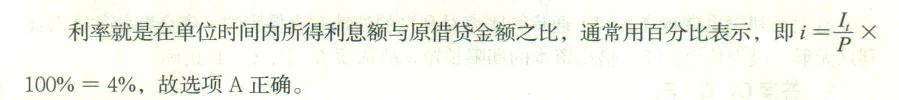

    某企业年初从银行借款1000万元，期限3年，年利率5%，银行要求每年末支付当年利息，则第3年末需偿还的本息和是（ &nbsp;）。

A.1050.00  (正确)
B.1100.00
C.1150.00
D.1157. 63
解析：
    本题考查的是利息的计算，每年末支付利息，按单利计算，最后一年换1000万本金+当年利息1000*5%=50万，合计1050万元。

    【知识点】利息的计算

    【考点】利息的计算

    【考查方向】公式计算

    【难度】易

    【题库维护老师：hejiade】

以信用方式筹集资金的特点在于（ ）， 其动力在于利息和利率。

A.强制性
B.灵活性
C.自愿性  (正确)
D.有偿性
解析：
以信用方式筹集资金有一个特点就是<strong>自愿性</strong>，而自愿性的动力在于利息和利率。 比如一个投资者，他首先要考虑的是投资某一项目所得到的利息是否比把这笔资金投人其他项目所得的利息多。如果多，他就可以在这个项目投资；如果所得的利息达不到其他项目的利息水平，他就可能不在这个项目投资。

【知识点】利息和利率的概念

【考点】利息和利率在工程经济活动中的作用

【考查方向】原文挖空

【难度】易

【题库维护老师：hejiade】

在通常情况下，( &nbsp; )是利率的最高界限。

A.社会最大利润率
B.社会平均利润率  (正确)
C.社会最大利税率
D.社会平均利税率
解析：
利率的高低首先取决于社会平均利润率的高低，并随之变动。在通常情况下，社会平均利润率是利率的最高界限。因为如果利率高于利润率，无利可图就不会去借款。 

【知识点】利息与利率的概念

【考点】利息与利率的概念

【考查方向】原文挖空

【难度】易

【题库维护老师：hejiade】

利率是各国发展国民经济的重要杠杆之一，其首要取决于（ &nbsp;）。。

A.社会平均利润率  (正确)
B.基准收益率
C.内部收益率
D.投资收益率
解析：
利率的高低首先取决于社会平均利润率的高低，并随之变动。在通常情况下，社会平均利润率是利率的最高界限。因为如果利率高于利润率，无利可图就不会去借款。

【知识点】利息与利率的概念

【考点】利息与利率的概念

【考查方向】原文挖空

【难度】易

【题库维护老师：hejiade】

在工程经济中，利息常常被视为资金的一种( &nbsp; )

A.沉没成本
B.机会成本  (正确)
C.管理成本
D.短缺成本
解析：
在工程经济分析中，利息常常被视为资金的一种机会成本。因为如果放弃资金的使用权利，相当于失去收益的机会，也就相当于付出了一定的代价。

【知识点】利息与利率的概念

【考点】利息与利率的概念

【考查方向】原文挖空

【难度】易

【题库维护老师：hejiade】

( &nbsp; &nbsp;)是利率高低的决定因素之一。

A.社会平均利润率  (正确)
B.基准收益率
C.内部收益率
D.投资收益率
解析：
1. 利率的高低首先取决于社会平均利润率的高低，并随之变动。 2. 在社会平均利润率不变的情况下，利率高低取决于金融市场上借贷资本的供求情况。借贷资本供过于求，利率便下降；反之，求过于供，利率便上升。3. 借出资本要承担一定的风险，风险越大，利率也就越高。4. 通货膨胀对利息的波动有直接影响，资金贬值往往会使利息无形中成为负值。 5. 借岀资本的期限长短。贷款期限长，不可预见因素多，风险大，利率就高；反之利率就低。

【知识点】利息与利率的概念

【考点】利息与利率的概念

【考查方向】概念释义

【难度】易

【题库维护老师：hejiade】

利率作为各国发展国民经济的重要杠杆，其高低由( &nbsp; )等因素决定。

A.社会平均利润率  (正确)
B.借出资本承担的风险  (正确)
C.通货膨胀  (正确)
D.借贷资本的供求情况  (正确)
E.资金数量
解析：
利率作为各国发展国民经济的重要杠杆，其高低由社会平均利润率、借贷资本的供求情况、借出资本承担的风险、通货膨胀、借出资本的期限长短等因素决定。

【知识点】利息与利率的概念

【考点】利息与利率的概念

【考查方向】概念释义

【难度】易

【题库维护老师：hejiade】

利率的高低由( &nbsp; )因素决定。

A.通货膨胀  (正确)
B.社会平均利润率  (正确)
C.借出资本的期限长短  (正确)
D.金融市场上借贷资本的供求情况  (正确)
E.投资者对库存的限制
解析：
利率的高低由社会平均利润率、借贷资本的供求情况、借出资本承担的风险、通货膨胀、借出资本的期限长短等因素决定。

【知识点】利息与利率的概念

【考点】利息与利率的概念

【考查方向】原文挖空

【难度】易

【题库维护老师：hejiade】

利息和利率的作用通常表现为( &nbsp;)。*

A.是以信用方式动员和筹集资金的动力  (正确)
B.促使投资者节约使用资金  (正确)
C.是投资者可选择的最佳投资手段之一
D.是宏观经济管理的重要杠杆  (正确)
E.是金融企业经营发展的重要条件  (正确)
解析：
利息和利率在工程经济活动中的作用 1.利息和利率是以信用方式动员和筹集资金的动力 2.利息促进投资者加强经济核算，节约使用资金 3.利息和利率是宏观经济管理的重要杠杆 4.利息与利率是金融企业经营发展的重要条件

【知识点】利息与利率的概念

【考点】利息与利率的概念

【考查方向】原文挖空

【难度】易

【题库维护老师：hejiade】

关于利率高低影响因素的说法，正确的有（ &nbsp; &nbsp;）

A.利率的高低首先取决于社会平均利润率的高低，并随之变动。  (正确)
B.借出资本所承担的风险越大，利率越低
C.资本借出期间的不可预见因素越多，利率越高  (正确)
D.社会平均利润率不变的情况下，借贷资本供过于求会导致利率上升
E.借出资本期限越长，利率越高  (正确)
解析：
利率是各国发展国民经济的重要杠杆之一，利率的高低由以下因素决定：

1.利率的高低首先取决于社会平均利润率的高低，并随之变动。在通常情况下，社会平均利润率是利率的最高界限。因为如果利率高于利润率，无利可图就不会去借款。 2.在社会平均利润率不变的情况下，利率高低取决于金融市场上借贷资本的供求情况，借贷资本供过于求，利率便下降；反之，求过于供，利率便上升。 3.借出资本要承担一定的风险，风险越大，利率也就越高。 4.通货膨胀对利息的波动有直接影响，资金贬值往往会使利息无形中成为负值。 5.借出资本的期限长短。贷款期限长，不可预见因素多，风险大，利率就高；反之利率就低。

【知识点】利息与利率的概念

【考点】利息与利率的概念

【考查方向】概念释义

【难度】易

【题库维护老师：hejiade】

利息和利率在工程经济活动中的作用通常表现为( &nbsp; )

A.利息和利率是以信用方式动员和筹集资金的动力  (正确)
B.利息促进投资者加强经济核算，节约使用资金  (正确)
C.利息和利率是微观经济学的重要计算基础
D.利息和利率是宏观经济管理的重要杠杆  (正确)
E.利息和利率是金融企业经营发展的重要条件  (正确)
解析：
利息和利率在工程经济活动中的作用包括：(1)利息和利率是以信用方式动员和筹集资金的动力；(2)利息促进投资者加强经济核算，节约使用资金；(3)利息和利率是宏观经济管理的重要杠杆；(4)利息和利率是金融企业经营发展的重要条件。

【知识点】利息与利率的概念

【考点】利息与利率的概念

【考查方向】概念释义

【难度】易

【题库维护老师：hejiade】

利率是各国发展国民经济的重要杠杆之一，下列因素中决定利率高低的因素有( &nbsp; )。

A.社会平均利润率的高低  (正确)
B.借出资本风险的大小  (正确)
C.通货膨胀率  (正确)
D.节约使用资金
E.金融市场上借贷资本的供求情况  (正确)
解析：
利率是各国发展国民经济的重要杠杆之一，利率的高低由以下因素决定：(1)利率的高低首先取决于社会平均利润率的高低，并随之变动；(2)在社会平均利润率不变的情况下，利率高低取决于金融市场上借贷资本的供求情况；(3)借出资本要承担一定的风险，风险越大，利率也就越高；(4)通货膨胀率对利息的波动有直接影响，资金贬值往往会使利息无形中成为负值；(5)借出资本的期限长短。故选项A、B、C、E正确。

【知识点】利息与利率的概念

【考点】决定利率高低的因素

【考查方向】概念释义

【难度】易

【题库维护老师：hejiade】

某公司从银行借款2000万元，1年后付息80万元，则年利率为(&nbsp; &nbsp; &nbsp; )。

A.4%  (正确)
B.5%
C.6%
D.8%
解析：

 

【知识点】利息与利率的概念

【考点】利息与利率的概念

【考查方向】概念释义

【难度】易

【题库维护老师：hejiade】

