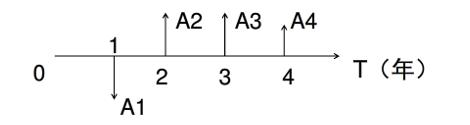
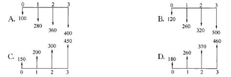
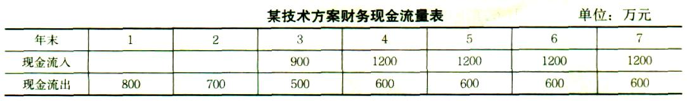

绘制现金流量图，需要把握的现金流量的要素有（ &nbsp; &nbsp;）。

A.时间单位
B.绘制比例
C.发生的时点  (正确)
D.现金流入或流出  (正确)
E.现金流量的大小  (正确)
解析：
要正确绘制现金流量图，必须把握好现金流量的三要素，即：现金流量的大小（现金流量数额）.方向（现金流入或现金流出）和作用点（现金流量发生的时点）。

【知识点】现金流量图的绘制

【考点】现金流量图的绘制

【考查方向】原文挖空

【难度】易

【题库维护老师：hejiade】

关于现金流量图绘图规则的说法，正确的有（　　）。

A.现金流量的性质对不同的人而言是相同的
B.箭线长短要能适当体现各时点现金流量数值大小的差异  (正确)
C.箭线与时间轴的交点表示现金流量发生的时点  (正确)
D.时间轴上的点通常表示该时间单位的起始时点
E.横轴是时间轴，向右延伸表示时间的延续  (正确)
解析：
1.以横轴为时间轴，向右延伸表示时间的延续，轴上每一刻度表示一个时间单位，可取年、半年、季或月等；<strong>时间轴上的点称为时点，通常表示的是该时间单位末的时点</strong>

2.相对于时间坐标的垂直箭线代表不同时点的现金流量情况，<strong>现金流量的性质（流人或流出）是对特定的人而言的。</strong>

3. 在现金流量图中，箭线长短与现金流量数值大小本应成比例，但由于技术方案中各时点现金流量常常差额悬殊而无法成比例绘出，<strong>故在现金流量图绘制中，箭线长短只要能适当体现各时点现金流量数值的差异，</strong>并在各箭线上方（或下方）注明其现金流量的数值即可 <strong>4.箭线与时间轴的交点即为现金流量发生的时点</strong>。

【知识点】现金流量图的绘制

【考点】现金流量图的绘制

【考查方向】概念释义

【难度】易

【题库维护老师：hejiade】

绘制现金流量图需要把握的现金流量的要素有（　　）

A.现金流量的大小  (正确)
B.绘制比例
C.时间单位
D.现金流入或流出  (正确)
E.发生的时点  (正确)
解析：
要正确绘制现金流量图，必须把握好现金流量的三要素，即：现金流量的大小(现金流量数额）、方向（现金流入或现金流出）和作用点（现金流量发生的时点）。

【知识点】现金流量图的绘制

【考点】现金流量图的绘制

【考查方向】原文挖空

【难度】易

【题库维护老师：hejiade】

关于绘制现金流量图规则的说法,正确的有( &nbsp; )。

A.横轴为时间轴,向右延伸表示时间间的延续  (正确)
B.对投资人而言,横轴上方的箭线表示现金流出
C.垂直箭线代表不同时点的现金流量情况  (正确)
D.箭线长短应体现各时点现金流量数值的差异  (正确)
E.箭线与时间轴的交点即为现金流量发生的时点  (正确)
解析：
现金流量图的作图方法和规则：

1.以<strong>横轴为时间轴，向右延伸表示时间的延续</strong>，轴上每一刻度表示一个时间单位，可取年、半年、季或月等；时间轴上的点称为时点，通常表示的是该时间单位末的时点；0表示时间序列的起点。整个横轴又可看成是我们所考察的“技术方案”。

2.相对于时间坐标的<strong>垂直箭线代表不同时点的现金流量情况</strong>，现金流量的性质（流入或流出）是对特定的人而言的。对投资人而言，在<strong>横轴上方的箭线表示现金流入，即表示收益</strong>；在横轴下方的箭线表示现金流出，即表示费用。 3.在现金流量图中，<strong>箭线长短与现金流量数值大小本应成比例</strong>。但由于技术方案中各时点现金流量常常差额悬殊而无法成比例绘出，故在现金流量图绘制中，箭线长短只要能适当体现各时点现金流量数值的差异，并在各箭线上方（或下方）注明其现金流量的数值即可。 4.<strong>箭线与时间轴的交点即为现金流量发生的时点</strong>。

选项B,对于投资人而言，横轴上方的线表示现金流入，所以是错误的选项，不选。

【知识点】现金流量图的绘制

【考点】现金流量图的绘制

【考查方向】概念释义

【难度】易

【题库维护老师：hejiade】

关于现金流量绘图规则的说法，正确的有（ &nbsp;） 。

A.箭线长短要能适当体现各时点现金流量数值大小的差异  (正确)
B.箭线与时间轴的交点表示现金流量发生的时点  (正确)
C.横轴是时间轴，向右延伸表示时间的延续  (正确)
D.现金流量的性质对不同的人而言是相同的
E.时间轴上的点通常表示该时间单位的起始时点
解析：
现金流量图的作图方法和规则： 

1.以<strong>横轴为时间轴，向右延伸表示时间的延续</strong>，轴上每一刻度表示一个时间单位，可取年、半年、季或月等；<strong>时间轴上的点称为时点，通常表示的是该时间单位末的时点</strong>；0表示时间序列的起点。整个横轴又可看成是我们所考察的“技术方案”。  2.相对于时间坐标的垂直箭线代表不同时点的现金流量情况，<strong>现金流量的性质（流入或流出）是对特定的人而言的</strong>。对投资人而言，在横轴上方的箭线表示现金流入，即表示收益；在横轴下方的箭线表示现金流出，即表示费用。 3.在现金流量图中，<strong>箭线长短与现金流量数值大小本应成比例</strong>。但由于技术方案中各时点现金流量常常差额悬殊而无法成比例绘出，故在现金流量图绘制中，箭线长短只要能适当体现各时点现金流量数值的差异，并在各箭线上方（或下方）注明其现金流量的数值即可。 4.<strong>箭线与时间轴的交点即为现金流量发生的时点</strong>。 总之，要正确绘制现金流量图，必须把握好现金流量的三要素，即：现金流量的大小（现金流量数额）、方向（现金流入或现金流出）和<strong>作用点（现金流量发生的时点）。</strong>

【知识点】现金流量图的绘制

【考点】现金流量图的绘制

【考查方向】概念释义

【难度】易

【题库维护老师：hejiade】

关于现金流量图绘制规则的说法,正确的有（ &nbsp; &nbsp; ）。

A.横轴为时间轴,向右延伸表示时间的延续  (正确)
B.对投资人而言，横轴上方的箭线表示现金流出
C.垂直箭线代表不同时点的现金流量情况  (正确)
D.箭线长短应体现各时点现金流量数值的差异  (正确)
E.箭线与时间轴的交点即为现金流量发生的时点  (正确)
解析：
本题考查的是现金流量图的绘制。选项B,对于投资人而言，横轴上方的线表示现金流入。

现金流量图的作图方法和规则

1.以横轴为时间轴，向右延伸表示时间的延续，轴上每一刻度表示一个时间单位，可取年、半年、季或月等；时间轴上的点称为时点，通常表示的是该时间单位末的时点；0表示时间序列的起点。整个横轴又可看成是我们所考察的“技术方案”。  2.相对于时间坐标的垂直箭线代表不同时点的现金流量情况，现金流量的性质（流入或流出）是对特定的人而言的。对投资人而言，在横轴上方的箭线表示现金流入，即表示收益；在横轴下方的箭线表示现金流出，即表示费用。 3.在现金流量图中，箭线长短与现金流量数值大小本应成比例。但由于技术方案中各时点现金流量常常差额悬殊而无法成比例绘出，故在现金流量图绘制中，箭线长短只要能适当体现各时点现金流量数值的差异，并在各箭线上方（或下方）注明其现金流量的数值即可。 4.箭线与时间轴的交点即为现金流量发生的时点。 总之，要正确绘制现金流量图，必须把握好现金流量的三要素，即：现金流量的大小（现金流量数额）、方向（现金流入或现金流出）和作用点（现金流量发生的时点）。

【知识点】现金流量图的绘制

【考点】现金流量图绘制规则

【考查方向】概念释义

【难度】易

【题库维护老师：hejiade】

现金流入与现金流出之差称为（ &nbsp; &nbsp;）。

A.现金流量
B.净现金流量  (正确)
C.净现金
D.利润
解析：
在考察技术方案整个期间各时点t上实际发生的资金流出或资金流入称为现金流量，其中流出系统的资金称为现金流出，用符号COt表示；流入系统的资金称为现金流入，用符号CIt表示；现金流入与现金流出之差称为净现金流量，用符号（CI－CO）t，表示。

【知识点】现金流量图的绘制

【考点】现金流量图的绘制

【考查方向】原文挖空

【难度】易

【题库维护老师：hejiade】

关于现金流量图的绘制规则的说法，正确的是（　　）

A.对投资人来说，时间轴上方的箭线表示现金流出
B.箭线长短与现金流量的大小没有关系
C.箭线与时间轴的交点表示现金流量发生的时点  (正确)
D.时间轴上的点通常表示该时间单位的起始时点
解析：
现金流量图的作图方法和规则：

1.以横轴为时间轴，向右延伸表示时间的延续，轴上每一刻度表示一个时间单位，可取年、半年、季或月等；<strong>时间轴上的点称为时点，通常表示的是该时间单位末的时点</strong>；0表示时间序列的起点。整个横轴又可看成是我们所考察的“技术方案”。

2.相对于时间坐标的垂直箭线代表不同时点的现金流量情况，现金流量的性质（流入或流出）是对特定的人而言的。对投资人而言，<strong>在横轴上方的箭线表示现金流入，即表示收益</strong>；在横轴下方的箭线表示现金流出，即表示费用。

3.在现金流量图中，<strong>箭线长短与现金流量数值大小本应成比例</strong>。但由于技术方案中各时点现金流量常常差额悬殊而无法成比例绘出，故在现金流量图绘制中，箭线长短只要能适当体现各时点现金流量数值的差异，并在各箭线上方（或下方）注明其现金流量的数值即可。

4.<strong>箭线与时间轴的交点即为现金流量发生的时点。</strong>

【知识点】现金流量图的绘制

【考点】现金流量图的绘制

【考查方向】原文挖空

【难度】易

【题库维护老师：hejiade】

要正确绘制现金流量图，必须把握好现金流量的三要素，这三要素不包括(　　)。

A.现金流量数额
B.现金流入或现金流出
C.现金流量终止的时点  (正确)
D.现金流量发生的时点
解析：
要正确绘制现金流量图，必须把握好现金流量的三要素，即：现金流量的大小（现金流量数额）、方向（现金流入或现金流出）和作用点（现金流量发生的时点）。

【知识点】现金流量图的绘制

【考点】现金流量的三要素

【考查方向】原文挖空

【难度】易

【题库维护老师：hejiade】

关于现金流量图的作图方法和规则的说法，错误的是( &nbsp; )

A.以横轴为时间轴，向右延伸表示时间的延续，轴上每一刻度表示一个时间单位，可取年、半年、季或月等
B.相对于时间坐标的垂直箭线代表不同时点的现金流量情况，现金流量的性质(流人或流出)是对特定的人而言的
C.在现金流量图中，箭线长短与现金流量数值无关  (正确)
D.箭线与时间轴的交点即为现金流量发生的时点
解析：
现金流量图的作图方法和规则：

(1)以横轴为时间轴，向右延伸表示时间的延续，轴上每一刻度表示一个时间单位，可取年、半年、季或月等；时间轴上的点称为时点，通常表示的是该时间单位末的时点；0表示时间序列的起点。整个横轴又可看成是我们所考察的“技术方案”。

(2)相对于时间坐标的垂直箭线代表不同时点的观金流量情况，现金流量的性质(流入或流出)是对特定的人而言的。对投资人而言，在横轴上方的箭线表示现金流入，即表示收益；在横轴下方的箭线表示现金流出，即表示费用。(3)<strong>在现金流量图中，箭线长短与现金流量数值大小本应成比例。但由于技术方案中各时点现金流量常常差额悬殊而无法成比例绘出，故在现金流量图绘制中，箭线长短只要能适当体现各时点现金流量数值的差异，</strong>并在各箭线上方(或下方)注明其现金流量的数值即可。

(4)箭线与时间轴的交点即为现金流量发生的时点。

【知识点】现金流量图的绘制

【考点】现金流量图的绘制

【考查方向】概念释义

【难度】易

【题库维护老师：hejiade】

关于现金流量图绘制的说法，正确的是()。

A.箭线长短与现金流量大小没有关系
B.对投资人来说，时间轴上方的箭线表示现金流出
C.箭线与时间轴的交点表示现金流量发生的时点  (正确)
D.时间轴上的点通常表示时间单位的起始时点
解析：
选项A错误，能适当体现各时点现金流量数值的差异。

选项B、D错误，对投资人而言，在横轴上方的箭线表示现金流入，即表示收益。

现金流量图的作图方法和规则：

1.以横轴为时间轴，向右延伸表示时间的延续，轴上每一刻度表示一个时间单位，可取年、半年、季或月等；<strong>时间轴上的点称为时点，通常表示的是该时间单位末的时点</strong>；0表示时间序列的起点。整个横轴又可看成是我们所考察的“技术方案”。

2.相对于时间坐标的垂直箭线代表不同时点的现金流量情况，现金流量的性质（流入或流出）是对特定的人而言的。<strong>对投资人而言，在横轴上方的箭线表示现金流入，即表示收益</strong>；在横轴下方的箭线表示现金流出，即表示费用。

3.在现金流量图中，箭线长短与现金流量数值大小本应成比例。但由于技术方案中各时点现金流量常常差额悬殊而无法成比例绘出，<strong>故在现金流量图绘制中，箭线长短只要能适当体现各时点现金流量数值的差异</strong>，并在各箭线上方（或下方）注明其现金流量的数值即可。

<strong>4.箭线与时间轴的交点即为现金流量发生的时点。</strong>

【知识点】现金流量图绘制

【考点】现金流量图的绘制

【考查方向】概念释义

【难度】易

【题库维护老师：hejiade】

现金流量图中现金流量的三大要素包括( &nbsp; &nbsp;)。

A.现金流人的大小、方向和时间点
B.投入现金的额度、时间和回收点
C.现金流量的大小、方向和作用点  (正确)
D.现金流出的额度、方向和时间点
解析：
现金流量的三要素：现金流量的大小（现金流量数额）、方向（现金流入或现金流出）和作用点（现金流量发生的时点）。

【知识点】现金流量图的绘制

【考点】现金流量图的绘制

【考查方向】概念释义

【难度】易

【题库维护老师：hejiade】

    若折现率大于0，现金流量图如下图所示。下列正确的说法包括（　）。

    

A.A1为现金流出  (正确)
B.A2发生在第3年年初  (正确)
C.A3发生在第3年年末  (正确)
D.A4的流量大于A3的流量
E.若A2与A3流量相等，则A2与A3的价值相等
解析：
根据现金流量图的作图方法和规则，箭线越长，现金流量越大，D选项有误，应该是A4的流量小于A3的流量。

如果A2与A3流量相等，但由于发生的时点（时间不同），则A2与A3的价值一定不相等，E选项有误。 

这样的题就需要理解并且看图了，并理解各种组成代表的东西。

【知识点】现金流量图的绘制

【考点】现金流量图的绘制

【考查方向】概念释义

【难度】中

【题库维护老师：hejiade】

已知折现率i大于0,所给现金流量图表示（ &nbsp; &nbsp;）。

 

A.A1为现金流出  (正确)
B.A2发生在第3年年初  (正确)
C.A3发生在第3年年末  (正确)
D.A4的流量大于A3的流量
E.若A2与A3流量相等，则A2与A3的价值相等
解析：
因为箭线长短与现金流量数值大小本应成比例，所以选项D错误，应该是A4的流量小于A3的流量，

选项E，若A2与A3即使流量相等，也要考虑时间价值。 

现金流量图的作图方法和规则

1.以横轴为时间轴，向右延伸表示时间的延续，轴上每一刻度表示一个时间单位，可取年、半年、季或月等；时间轴上的点称为时点，通常表示的是该时间单位末的时点；0表示时间序列的起点。整个横轴又可看成是我们所考察的“技术方案”。  2.相对于时间坐标的垂直箭线代表不同时点的现金流量情况，现金流量的性质（流入或流出）是对特定的人而言的。对投资人而言，在横轴上方的箭线表示现金流入，即表示收益；在横轴下方的箭线表示现金流出，即表示费用。 3.在现金流量图中，箭线长短与现金流量数值大小本应成比例。但由于技术方案中各时点现金流量常常差额悬殊而无法成比例绘出，故在现金流量图绘制中，箭线长短只要能适当体现各时点现金流量数值的差异，并在各箭线上方（或下方）注明其现金流量的数值即可。 4.箭线与时间轴的交点即为现金流量发生的时点。 总之，要正确绘制现金流量图，必须把握好现金流量的三要素，即：现金流量的大小（现金流量数额）、方向（现金流入或现金流出）和作用点（现金流量发生的时点）。

【知识点】现金流量图的绘制

【考点】现金流量图的绘制

【考查方向】概念释义

【难度】中

【题库维护老师：hejiade】

在资金时间价值的作用下，下列现金流量图（单位：万元）中，有可能与现金流入现值1200万元等值的是（ &nbsp; &nbsp;）。

 

 

A.A
B.B
C.C
D.D  (正确)
解析：
首先我们要先学会看这个现金流量图。

横轴是时间轴，向右延伸表示时间的延续，轴上每一刻度表示一个时间单位，可取年、半年、季或月等等。 

在横轴上方的箭线表示现金流人(或现金净流入) , 即表示收益;在横轴下方的箭线表示现金流出(或现金净流出) ，即表示费用。可以简单记忆为上入下出。知道这些我们再来选项：

选项A.B箭线向下，标示为现金流出，选项错误。

选项C，150＋200×（1＋i）－1＋300×（1＋i）－2＋450×（1＋i）-3＜1200万元，选项D和C是相同公式计算＞1200万元是正确选项。

考试时如果是这样的单选，其实只需要对比一下CD两个选项的大小即可知道D是最符合题目要求的选项，不用计算节约时间，这里提出来仅供参考，具体题目需要具体分析，没有通用性。

【知识点】现金流量图的绘制

【考点】现金流量图的绘制

【考查方向】概念释义

【难度】中

【题库维护老师：hejiade】

 

某技术方案寿命期为7年，各年现金流量如下表所示，该技术方案静态回收期为（ &nbsp; ）。

A.4.4
B.4.8  (正确)
C.5.0
D.5.4
解析：
绘制现金流量图由公式计算可得pt=4+5/6=4.8  

【知识点】资金等值计算及应用

【考点】资金等值计算及应用

【考查方向】概念释义

【难度】易

【题库维护老师：hejiade】

