
在某等额支付系列现金流量中，已知每年年末收入的等额支付现金金额，欲通过查表的方式计算期末本息之和，应查（ &nbsp;）表。

A.（F/A，i，n）  (正确)
B.（A/F，i，n）
C.（P/A，i，n）
D.（F/P，i，n）
解析：
在（F/P，i，n）这类符号中，括号内斜线上的符号表示所求的未知数，斜线下的符号表示已知数。所以本题在已知现值A的情况下求F，所以选择A选项。

【知识点】终值和现值计算

【考点】一次支付现金流量的终值和现值计算

【考查方向】概念释义

【难易】易

【题库维护】yxf

老周买彩票中奖500万元（扣除个人所得税后实际到手400万元），老周打算将彩金存入银行，零存整取，每月取一笔钱用于生活开销，40年后取完。在存款利率i一定的情况下，则计算每月可取金额，应使用的系数为（）。

A.（P/A，i，n）
B.（F/A，i，n）
C.（A/P，i，n）  (正确)
D.（A/F，i，n）
解析：
在（F/P，i，n）这类符号中，括号内斜线上的符号表示所求的未知数，斜线下的符号表示已知数。所以本题在已知现值P的情况下求A，所以选择C选项。 【知识点】终值和现值计算 【考点】一次支付现金流量的终值和现值计算 【考查方向】概念释义 【难易】易 【题库维护】yxf

某公司年初借入资金1000万元，期限3年，按年复利计息，年利率10%，到期一次还本付息。则第三年末应偿还的本利和为（ &nbsp;）万元。

A.1210
B.1300
C.1331  (正确)
D.1464
解析：
由题干可知，该题考察一次支付现金流量的终值F和现值P的计算，即F=P*(1+i)^n，问的是第三年末应偿还的本利和是多少，也就是F。其中，P=1000，i=10%，n=3。

第三年末应偿还的本利和=现值本金+这三年的全部利息（因为是复利，所以计算利息的时候需要把利息产生的利息也计算进去，所以计算需要用到F=P*(1+i)^n）。

F=P*(1+i)^n=1000×(1+10%)^3=1331万元。

此类题型计算需要和前面章节的单利区分，不然很容易出错，首先明确题目问的是什么，是求本利和还是单独的利息，然后再看利息的计算是单利还是复利，然后确定公式，带入数值可得。

【知识点】终值和现值计算

【考点】终值和现值计算

【考查方向】公式计算

【难度】易

【题库维护老师：hejiade】

关于现值P、终值F、年金A、利率i、计息期数n之间关系的说法，正确的是（）。

A.F一定、i相同时，n越长，p越大
B.P一定、n相同时，i越高，F越小
C.F一定、n相同时，i越高，P越小  (正确)
D.P一定、i相同时，n越长，F越小
解析：
本题考核的是等值的计算。在P一定，n相同时，i越高，F越大；在i相同时，n越长，F越大。在F一定，n相同时，i越高，P越小；在i相同时，n越长，P越小。

【知识点】终极和现值计算

【考点】一次支付现金流量的终值和现值计算

【考察方向】概念释义

【难度】易

【题库维护老师：ZKQ】

某公司借款800万元，年复利i=9%。则该公司5年末连本带利一次需偿还（）万元。

A.1088.39
B.1230.90  (正确)
C.1175.46
D.1160.00
解析：
由题干可知，该题考察一次支付现金流量的终值F和现值P的计算，即F=P*(1+i)^n，问的是第5年末的本利和是多少，也就是F。其中，P=800，i=9%，n=5。

第五年末应偿还的本利和=现值本金+这五年的全部利息（因为是复利，所以计算利息的时候需要把利息产生的利息也计算进去，所以计算需要用到F=P*(1+i)^n）。

F=P*(1+i)^n=800×(1+9%)^5=1230.9万元。

此类题型计算需要和前面章节的单利区分，不然很容易出错，首先明确题目问的是什么，是求本利和还是单独的利息，然后再看利息的计算是单利还是复利，然后确定公式，带入数值可得。

【知识点】终值和现值计算

【考点】终值和现值计算

【考查方向】公式计算

【难度】易

【题库维护老师：hejiade】

 

某借款年利率为 8%，半年复利计息一次，则该借款年有效利率比名义利率高（　　）。

A.0.16%  (正确)
B.1.25%
C.4.16%
D.0.64%
解析：
（1+8%/2）2—1—0.08=0.0016

【知识点】终值和现值的计算

【考点】终值和现值的计算

【考查方向】概念释义

【难度】易

【题库维护老师：hejiade】

 

下列关于现值 P、终值F、利率 i、计息期数 n 之间关系的描述中，正确的是（ ）。

A.F 一定、n 相同时，i 越高、P 越大
B.P 一定、n 相同时，i 越高、F 越小
C.i、n 相同时，F 与 P 呈同向变化  (正确)
D.i、n 相同时，F 与 P 呈反向变化
解析：
现值与终值的概念和计算方法正好相反，因为现值系数与终值系数是互为倒数。总结一下就是下面的几句：

在 P 一 定，n 相同时，i 越高，F 越大；

在 i 相同时，n 越长，F 越大。

在 F 一定，n 相同时，i 越高，P 越小；

在 i 相同时，n 越长，P 越小。

【知识点】终值和现值计算

【考点】终值和现值计算

【考查方向】公式计算

【难度】中等

【题库维护老师：hejiade】

某企业的银行存款期限为10年，到期时可得到现金10000元，如果5年时全部取回，设折现率为10%，则企业可取回现金为( &nbsp; )元。

A.4660
B.7500
C.5000
D.6209  (正确)
解析：
根据题干部分我们已知F1=10000元，i=10%，n1=10年，我们就可以求p。

P=F1/（1+i）^n1=10000/(1+i）^10=3855.50；

现在题目问的是5年时全部取回的本利和，因为上面已经求出了P=3855.5，i=10%不变，时间由十年变成了五年，n2=5。我们可以求到5年时全部取回的本利和F。

F2=P（1+i）^n2=3855.50*(1+i）^5=6209

【知识点】终值和现值计算

【考点】终值和现值计算

【考查方向】公式计算

【难度】中等

【题库维护老师：hejiade】

某施工企业每年年末存入银行100万元，用于3年后的技术改造，已知银行存款年利率为5%，按年复利计息，则到第3年末可用于技术改造的资金总额为(　)。

A.331.01
B.330.75
C.315.25  (正确)
D.315.00
解析：
根据题干可知，本题考查的是终值计算(已知A求 F)。其中，{（1+i）n-1}/i，称为等额支付系列终值系数或年金终值系数。带入题干已知的数据，A=100，i=5%，n=3

F=A(F/A,i,n)=A[(1+i)n-1]/i=100万元*[(1+5%)3-1]/5%=315.25万元

【知识点】终值和现值计算

【考点】终值计算

【考查方向】公式计算

【难度】易

【题库维护老师：hejiade】

某企业第 1 年<strong>年初</strong>和第 1 年<strong>年末</strong><strong>分别</strong>向银行借款 30 万元，年利率均为10%，<strong>复利</strong>计息，第 3-5年年末<strong>等额本息偿还全部借款</strong>。则每年年末应偿还金额为（　　）。

A.20.94
B.23.03
C.27.87  (正确)
D.31.57
解析：
所谓复利是指在计算某一计息周期的利息时，其先前周期上所累积的利息要计算利息，即“利生利”、“利滚利”的计息方式。其表达式如下：

It=i×Ft-1 &nbsp; &nbsp; &nbsp; &nbsp; &nbsp; &nbsp; &nbsp; &nbsp; &nbsp; &nbsp; &nbsp; &nbsp;

式中——计息周期复利利率；

——表示第（t－1）期末复利本利和。

而第t期末复利本利和的表达式如下：

Ft=Ft-1×（1+i） &nbsp; &nbsp; 

第一年的利息=本金×利率=30×10%=3万元。

第二年的利息=本金×利率=第1年和第2 年的本金加上第1年的利息×利率=（30+30+3）×0.1=6.3万元。

第二年的<strong>本息和</strong>=本金+利息=30+30+3+6.3=69.3万元。

根据题目，第 3-5年年末<strong>等额本息偿还全部借款。</strong> 

第五年F=P×（1+i）^n=69.3×（1+0.1）^3=92.24；

Fi=A×[（1+i）^n-1]：A=92.24X0.1/0.331=27.87

【知识点】终值和现值计算

【考点】终值和现值计算

【考查方向】公式计算

【难度】难

【题库维护老师：hejiade】

某施工企业现在对外投资200万元，5年后一次性收回本金与利息， 若年基准收益率为8%，则总计可以收回资金（ &nbsp;）万元。 已知：（F/P, 8% ,5）=1.4693;（F/A, 8%, 5）=5.8666；（A/P, 8%, 5） =0.2505

A.234.66
B.250.50
C.280.00
D.293.86  (正确)
解析：
已知：P=200、n=5、i=8%,求F。 F=（F/P, i, n） =200*1.4693=293.86。 （考查我们对公式是否熟悉）

【知识点】终值和现值计算

【考点】终值和现值计算

【考查方向】公式计算

【难度】中等

【题库维护老师：hejiade】

某公司以单利方式一次性借入资金 2000 万元，借款期限 3 年，年利率 8%，到期一次还本付息，则第三年末应当偿还的本利和为（ &nbsp;）万元。

A.2160
B.2240
C.2480  (正确)
D.2519
解析：
由题干“单利方式”可知，该题考核利息计算中的单利计算，问的是第三年末应当偿还的本利和是多少，需要注意这里说的是“到期一次还本付息。”所以这三年的利息都是第三年的时候付。

第三年末应当偿还的本利和=本金+（借款期限 3 年×每一个年的单利）

F=P+In=P（1+n×i单）=2000*(1+8%*3)=2480(万元)

此类题型计算较为简单，但是需要仔细认真，不然很容易出错，首先明确题目问的是什么，是求本利和还是单独的利息，然后再看利息的计算是单利还是复利，然后确定公式，带入数值可得。

【知识点】终值和现值计算

【考点】终值和现值计算

【考查方向】公式计算

【难度】易

【题库维护老师：hejiade】

现存款1000元，存款年利率为12%，按季复利计息，则第2年年末的本利和为( &nbsp; )元。

A.1240
B.1254
C.1267  (正确)
D.1305
解析：
本题考查复利的计算，需要注意几个细节，首先是按季复利计息，但前面的利率是年利率。容易出错。

F=1000X(F/P,12%/4，8)=1267元 

【知识点】终值和现值计算

【考点】终值和现值计算

【考查方向】公式计算

【难度】中等

【题库维护老师：hejiade】

年利率为12%，半年复利计息一次，第5年年末的本利和为1000元，现在存款为（ &nbsp; ）。

A.558元  (正确)
B.567元
C.582元
D.625元
解析：
我们先看题干内容，半年复利计息一次，年利率为12%，所以我们需要先计算出每年的实际利率是多少。根据F=P(1+i)n可得：

实际利率=（1+12%/2）2-1=12.36%

然后由题干得知：第5年年末的本利和为1000元，问现在的存款,即现值P，P=F/(1+i)n

=复利现值=1000/（1+12.36%）5=558.39

【知识点】终值和现值计算

【考点】终值和现值计算

【考查方向】公式计算

【难度】中等

【题库维护老师：hejiade】

某技术方案建设期为3年。建设期间共向银行贷款1500万元，其中第1年初贷款1000万元，第2年初贷款500万元；贷款年利率6%，复利计息。则该技术方案的贷款在建设期末的终值为( &nbsp;)万元。

A.1653.60
B.1702.49
C.1752.82  (正确)
D.1786.52
解析：
本题考核P求F，F=1000×(1+6%)3+500×（1+6%)2=1191.02+561.8=1752.82(万元)。

需要注意的是，该技术方案建设期为3年，所以第1年初贷款计算终值时，n=3，第2年初贷款计算终值时，n=2。

【知识点】终值和现值计算

【考点】终值计算

【考查方向】公式计算

【难度】中等

【题库维护老师：hejiade】

某企业年初投资6000万元，10年内等额回收，若基准收益率为8%，则每年年末应回收的资金是( &nbsp; )。

A.600万元
B.826万元
C.894万元  (正确)
D.964万元
解析：
已知P求A，根据公式A=P*(1+i）n*i/[(1+i)n-1]

=6000*1.0810*0.08/(1.0810-1)=894

【知识点】终值和现值计算

【考点】终值和现值计算

【考查方向】公式计算

【难度】中等

【题库维护老师：hejiade】

现在存款1000元，年利率10%，半年复利一次。问5年末存款金额为多少？ 

解析：
有两种计算的方式：

（1）按年实际利率计算：

ieff=（1+10%/2）2-1=10.25%

则F=1000*(1+10.25%)5=1628.89

（2）按计息周期利率计算

F=1000（F/P，10%/2, 2*5）=1000*（1+5%）10=1628.89

【知识点】终值和现值的计算

【考点】终值和现值的计算

【考查方向】概念释义

【难度】易

【题库维护老师：hejiade】

现金流量的分布情况，说明( &nbsp; &nbsp; )。

A.从收益方面来看，获得时间越早，数额越大，其现值越大  (正确)
B.从收益方面来看，获得时间越早，数额越小，其现值越大
C.建设项目早投产，早获收益，多获收益，才能达到最佳经济效益  (正确)
D.在投资额一定的情况下，投资支出的时间越晚，数额越小，现值越小  (正确)
E.在投资额一定的情况下，投资支出的时间越晚，数额越小，现值越大
解析：
从收益方面来看，获得的时间越早、数额越多，其现值也越大。因此，应使技术方案早日完成，早日实现生产能力，早获收益，多获收益，才能达到最佳经济效益。从投资方面看，在投资额一定的情况下，投资支出的时间越晚、数额越少，其现值也越小。

【知识点】终值和现值计算

【考点】终值和现值计算

【考查方向】原文挖空

【难度】易

【题库维护老师：hejiade】

某企业第1年年初向银行借款100万元，年利率10%，复利计息，第1-4年年末等额本息偿还全部借款。则每年年末应偿还金额为（ &nbsp;）万元。

A.35
B.37.27
C.31.55  (正确)
D.21.55
解析：
 A=100×10%×（1+10%）4/[（1+10%）4-1]=31.547 【知识点】终值和现值计算 【考点】等额支付 【考查方向】计算 【难度】易 【题库维护】yxf

老铁自2011年年末开始，每年年末储存一笔存款5万元，一年定期自动约转，年利率为5%不变。在此情况下，至2015年年末，老铁的存款本息合计金额共计（ &nbsp;）万元。

A.26.25
B.34.77
C.27.63  (正确)
D.31.25
解析：
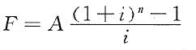 根据上式：F=5×[（1+5%）5-1]/5%=27.628 【知识点】终值和现值计算 【考点】终值和现值计算 【考查方向】计算 【难度】易 【题库维护】yxf

甲公司从银行借入100万元，年利率为10%，复利计息，借期5年，到期一次还本付息，则该公司第5年末一次偿还的本利和为（　）万元。

A.161  (正确)
B.150
C.1320
D.1160
解析：
F=P×（1+i）n=100×（1+10%）5=161 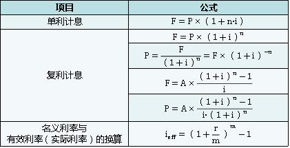 【知识点】终值和现值的计算 【知识点】终值和现值的计算 【考查方向】计算 【难度】易 【题库维护】yxf

某投资者有以下4种现金流量的技术方案可选，则最理想的方案是( &nbsp; )。

A.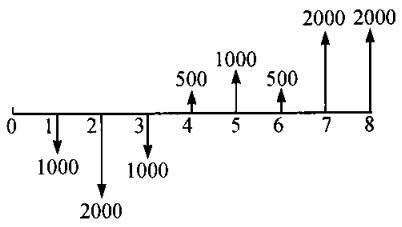
B.
C.
D.  (正确)
解析：
从投资方面看，在投资额一定的情况下，投资支出的时间越晚、数额越少，其现值也越小；故相对而言，CD项现值较小，投资较小。从收益方面来看，获得的时间越早、数额越多，其现值也越大；D项与C项相比，D项收益较大。综上，D项为最理想方案。

【知识点】终值和现值计算

【考点】终值和现值计算

【考查方向】公式计算

【难度】易

【题库维护老师：hejiade】

某公司计划3年以后购买1台200万元的机械设备，拟从银行存款中提取，银行存款年利率为5%，则现应存入银行的资金为（）万元。

A.63.44
B.73.44
C.95.67
D.172.77  (正确)
解析：
    本题考核的是一次支付现值的计算。(已知 F求P)，本题的计算过程为：

    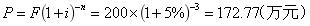

    【知识点】终值和现值计算

    【考点】一次支付现金流量的终值和现值计算

    【考察方向】公式计算

    【难度】易

    【题库维护老师：ZKQ】

某投资者6年内每年年末投资500万元，若基准收益率为8%，复利计息，则6年末可一次性回收的本利和为（）万元。

A.
B.  (正确)
C.
D.
解析：
如下公式：（已知A求F）  

上面的公式其实就是终值计算(已知A求 F)。其中，{（1+i）n-1}/i，称为等额支付系列终值系数或年金终值系数。考试简单题型就是上面这种，比较简单。

【知识点】终值和现值计算

【考点】终值计算

【考查方向】公式计算

【难度】中等

【题库维护老师：hejiade】

某人连续5年每年末存入银行20万元，银行年利率6%，按年复利计算，第5年年末一次性收回本金和利息，则到期可以回收的金额为（　）万元。

A.104.80
B.106.00
C.107.49
D.112.74  (正确)
解析：
此题为已知A求F： 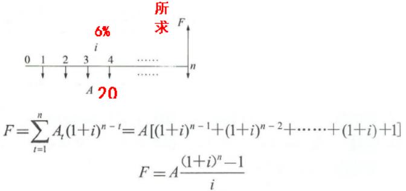

上面的公式其实就是终值计算(已知A求 F)。其中，{（1+i）n-1}/i，称为等额支付系列终值系数或年金终值系数。带入题干给的数据，A=20，i=6%，n=5 

F=20（1.065-1）/0.06=112.74万元 

【知识点】终值和现值的计算

【考点】终值计算

【考查方向】公式计算

【难度】易

【题库维护老师：hejiade】

某人连续5年每年末存入银行30万元，银行年利率6%，按年复利计算，第5年年末一次性收回本金和利息，则到期可以收回的金额为（ &nbsp; &nbsp;）万元。

A.169.11  (正确)
B.167.49
C.166.00
D.164.80
解析：
    根据题干可知，本题考查的是终值计算(已知A求 F)。其中，{（1+i）n-1}/i，称为等额支付系列终值系数或年金终值系数。带入题干已知的数据，A=30，i=6%，n=5

    F=A(F/A,i,n)=A[(1+i)n-1]/i=30×[(1+6%)5-1]/6%=169.11（万元）。

    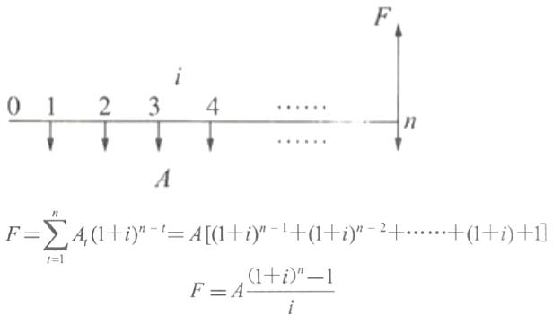

    【知识点】终值和现值计算

    【考点】终值计算

    【考查方向】公式计算

    【难度】易

    【题库维护老师：hejiade】

某人连续3年每年末存入银行10万元，银行年利率6％，按复利计息，第5年年末一次性收回本金和利息，则到期可以回收的金额为( &nbsp; )万元。

A.31.84
B.33.75
C.35.77  (正确)
D.40.15
解析：
等额支付系列终值公式：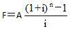

根据题干可知，本题先求出前三年的终值，终值计算(已知A求 F)。其中，{（1+i）n-1}/i，称为等额支付系列终值系数或年金终值系数。带入题干已知的数据，A=10，i=6%，n=3，注意是连续3年存钱，问的是第五年才取钱，所以这里n=3。

F=A(F/A,i,n)=A[(1+i)n-1]/i=10×[(1+6%)3-1]/6%=31.836(万元)

根据一次支付终值计算公式：F＝P(1＋i)n计算第5年年末的本息和＝31.836×(1＋6%)2＝35.77(万元)。 

【知识点】终值和现值计算

【考点】终值计算

【考查方向】公式计算

【难度】中等

【题库维护老师：hejiade】

在其他条件不变的情况下，考虑资金时间价值时，下列现金流量图中效益最好的是( &nbsp; &nbsp;)。 

A.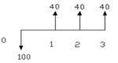
B.
C.  (正确)
D.
解析：
从收益方面来看，获得的时间越早、数额越多，其现值也越大。因此，应使技术方案早日完成，早日实现生产能力，早获收益，多获收益，才能达到最佳经济效益。从投资方面看，在投资额一定的情况下，投资支出的时间越晚、数额越少，其现值也越小。因此，应合理分配各年投资额，在不影响技术方案正常实施的前提下，尽量减少建设初期投资额，加大建设后期投资比重。

【知识点】终值和现值计算

【考点】终值和现值计算

【考查方向】原文挖空

【难度】易

【题库维护老师：hejiade】

某施工企业拟对外投资，但希望从现在开始的5年内每年年末等额回收本金和利息200万元，若按年复利计息，年利率8 %，则企业现在应投资( &nbsp; &nbsp; &nbsp;)万元。已知：（P/F, 8% ,5）=0.6808;（P/A, 8%, 5）=3.9927；（F/A, 8%, 5） =5.8666

A.680. 60
B.798. 54  (正确)
C.1080. 00
D.1173. 32
解析：
已知：A=200、n=5、i=8%,求P。

P=（P/A, i, n） =200*3.9927=798.54。 （考查我们对公式是否熟悉） 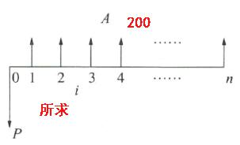 

【知识点】终值和现值计算

【考点】终值和现值计算

【考查方向】公式计算

【难度】中等

【题库维护老师：hejiade】

某项目建设期2年，各年初投资额分别为300万元、400万元，银行贷款年利率为10%，则该项目的投资估算是()万元。

A.700
B.803  (正确)
C.800
D.806
解析：
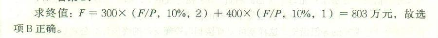

其实这个题目有两笔投资，需要分开计算然后相加。一笔三百万，两年，需要复利计算。一笔四百万，一年，因为利率是一年计算，所以就可以当做是单利。所以就如上图公式，带入求和。 

【知识点】终值和现值计算

【考点】终值和现值计算

【考查方向】公式计算

【难度】易

【题库维护老师：hejiade】

某人期望5年内每年年初从银行提款10000元，银行存款年利率为10%，按年复利计息，则期初应存入银行的金额是( &nbsp; )元。

A.37910
B.41699  (正确)
C.43550
D.50000
解析：
第一种方式：

第二种：已知A求P在加上第一年的10000 P=A[(1+i)n-1]/i(1+i)n=10000x(1.14-1)/(0.1x1.14)=31698.65,加上10000=41699，如下图：  

【知识点】终值和现值计算

【考点】终值和现值计算

【考查方向】公式计算

【难度】中等

【题库维护老师：hejiade】

某企业拟实施一项技术方案，方案建设期2年。建成后该方案可以立即投入运营并获利，运营期预计为10年，每年净收益为500万元，且每年净收益的80%可用于偿还银行贷款。银行贷款年利率为6%，复利计息，借款期限为6年。如果运营期各年年末还款，则该企业期初最大贷款额度为( &nbsp; )万元。

A.1234  (正确)
B.1308
C.1499
D.1589
解析：
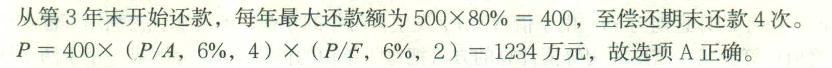

【知识点】终值和现值计算

【考点】终值和现值计算

【考查方向】公式计算

【难度】易

【题库维护老师：hejiade】

某公司年初借款500万，年利率i=10%，每年计息一次，到期一次还本付息。则第5年末连本带利一次需偿还的金额是( &nbsp; )万元。

A.638.155
B.734.655
C.805.255  (正确)
D.881.155
解析：
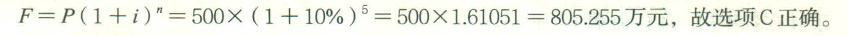

根据题干内容，“每年计息一次”，可知是复利计算，p=500，i=10%，n=5。带入公式计算出结果即可。

【知识点】终值和现值计算

【考点】终值和现值计算

【考查方向】公式计算

【难度】易

【题库维护老师：hejiade】

每半年末存款2000元，年利率4%，每季复利计息一次。则2年末存款本息和为( &nbsp;)元。

A.8160.00
B.8243.22
C.8244.45  (正确)
D.8492.93
解析：
该题考核已知A，求F，A=每半年末存款2000元，则n=4，对应的i为半年的利率。

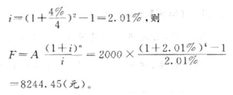

因为每半年末存款 2000 元，则年金 A=2000 元，以半年作为年金 A 的一个单位时间，则需要算出半年的实际利率。

半年的实际利率=（1+4%/4）2-1=2.01%&nbsp;

求 2 年末的存款本息，是已知 A 求 F，

计算公式是：F=A×（F/A，2.01%，4）

=2000×{（1+2.01%）4-1]/2.01%}=8244.45 元

【知识点】终值和现值计算

【考点】终值和现值计算

【考查方向】公式计算

【难度】中等

【题库维护老师：hejiade】

期望5年内每年年末从银行提款5000元，年利率为10%，按复利计，期初应存入银行（ &nbsp; ）。

A.18954元  (正确)
B.20850元
C.21775元
D.25000元
解析：
将A=5000，i=10%代入下列 公式可得p=18954 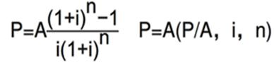 

【知识点】现值和现值计算

【考点】现值计算

【考查方向】公式计算

【难度】易

【题库维护老师：hejiade】

某企业年初投资5000万元，10年内等额回收本利，若基准收益率为8%，则每年年末应回收的资金是( &nbsp; )。

A.500万元
B.613万元
C.745万元  (正确)
D.784万元
解析：
 

 

很典型的已知现值，求终值。根据该公式代入p=5000，i=8%，n=10，算出 A=745

【知识点】终值和现值计算

【考点】终值计算

【考查方向】公式计算

【难度】易

【题库维护老师：hejiade】

