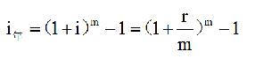
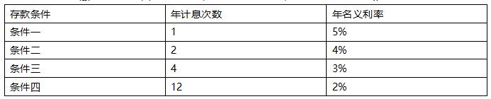
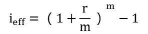
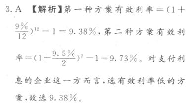
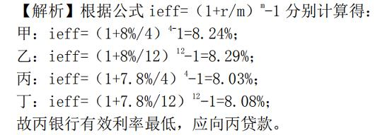
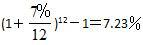
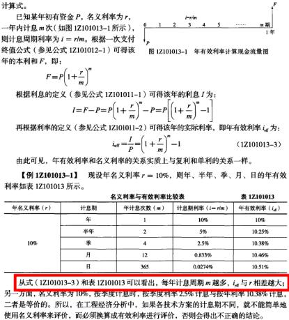

某施工企业希望从银行借款500万元，借款期限2年，期满一次还本。经咨询有甲、乙、丙、丁四家银行愿意提供贷款，年利率均为7%。其中，甲要求按月计算并支付利息，乙要求按季度计算并支付利息，丙要求按半年计算并支付利息，丁要求按年计算并支付利息。则对该企业来说，借款实际利率最低的银行是（ ）。

A.甲
B.乙
C.丙
D.丁  (正确)
解析：
计息周期越短，实际利率越高，所以本题选丁。

关于有效利率和名义利率关系的说法，正确的是（ &nbsp; &nbsp;）。

A.当每年计息周期数大于1时，名义利率大于年有效利率
B.只要名义利率大于零，则据此计算出来的年有效利率一定大于名义利率
C.年有效利率比名义利率更能准确反映资金的时间价值  (正确)
D.复利计息时，名义利率和有效利率没有差异
解析：
选项A错误，当每年计息周期数大于1时，名义利率小于年有效利率；

选项B错误，当名义利率大于零，但计息周期与利率周期相同时，有效利率和名义利率是相等的。

选项D错误，单利计息时，名义利率和有效利率没有差异。

【知识点】有效利率的计算

【考点】有效利率的计算

【考查方向】概念释义

【难度】易

【题库维护老师：hejiade】

年名义利率 12%，每季度复利计息一次，则半年的实际利率为（ ）。

A.6%
B.6.09%  (正确)
C.6.24%
D.12.55%
解析：
考查实际利率的计算。半年的实际利率=（1+12%/4）^2-1=6.09%。

【知识点】有效利率的计算

【考点】有效利率的计算

【考查方向】公式计算

【难度】易

【题库维护老师：hejiade】

某企业从金融机构借款 100 万元，月利率 1%，按月复利计息，每季度付息一次，则该企业一年需向金融机构支付利息（ ）万元。

A.12.00
B.12.12  (正确)
C.12.55
D.12.68
解析：
按季度付息，则每年付息 4 次，需要算出来每个季度的利息步骤如下：  方法一：  季度有效利率=（1+1%）^3-1=3.03%  每个季度的利息=100×3.03%=3.03 万元  每年支付利息=3.03×4=12.12 万元 方法二：  季度本利和=100×（1+1%）^3=103.03 万元  季度利息=103.03-100=3.03 万元  每年支付利息=3.03×4=12.12 万元 （虽然是复利，但是是以季度付息，所以是每季度结清一次利息，利息不在进入下一个季度利滚利了。）

【知识点】有效利率的计算

【考点】有效利率的计算

【考查方向】公式计算

【难度】中等

【题库维护老师：hejiade】

已知年名利率为8%，每季度复利计息一次，则年有效利率为(　)。

A.8.8%
B.8.24%  (正确)
C.8.16%
D.8.00%
解析：
ieff=(1+r/m)m-1=(1+8%/4)4-1=8.24%

【知识点】有效利率的计算

【考点】有效利率的计算

【考查方向】公式计算

【难度】易

【题库维护老师：hejiade】

某企业向银行借贷一笔资金，按月计息，月利率为1.2%，则年名义利率和年实际利率分别为( &nbsp; &nbsp;)。

A.13.53 %和14.40%
B.13.53%和15.39%
C.14.40%和15.39%  (正确)
D.14.40%和15.62%
解析：
    年名义利率=1.2%*12=14.4%，

    年实际利率=（1+1.2%）12 -1=15.39%。 

    【知识点】有效利率的计算

    【考点】有效利率的计算

    【考查方向】公式计算

    【难度】易

    【题库维护老师：hejiade】

某借款年利率为18%，半年复利计息一次，则该借款年有效利率比名义利率高( &nbsp; &nbsp;)。

A.0.81%  (正确)
B.1.25%
C.18.81%
D.19.25%
解析：
年有效利率=（1+18%/2）2-1=18.81%，18.81%-18%=0.81%

【知识点】有效利率的计算

【考点】有效利率的计算

【考查方向】公式计算

【难度】中等

【题库维护老师：hejiade】

名义利率12%，每季复利计息一次，则年实际利率为（ &nbsp; &nbsp; &nbsp;）。

A.12. 68%
B.12. 55%  (正确)
C.12. 49%
D.12. 00%
解析：
有效利率＝ieff=(1+12%/4)4-1= 12.55%

【知识点】有效利率的计算

【考点】有效利率的计算

【考查方向】公式计算

【难度】易

【题库维护老师：hejiade】

若名义利率12%，每季度复利计息一次，则实际年有效利率为( &nbsp; )

A.12.68%
B.12.55%  (正确)
C.12.49%
D.12.00%
解析：
年有效利率计算公式：ieff＝(1+r/m)m－1，

式中r——名义利率；m——计息周期数。

由题意可得实际年有效利率＝(1＋12％/4)4－1＝12.55%。 

【知识点】有效利率的计算

【考点】有效利率的计算

【考查方向】公式计算

【难度】中等

【题库维护老师：hejiade】

年名义利率为12%，按月计息，则半年的实际利率（有效利率）为( &nbsp; &nbsp; )。

A.6%
B.6.34 %
C.6.15%  (正确)
D.6.6%
解析：
年有效利率ieff=(1+r/m)m-1=(1+12%/12)6-1=6.15%

【知识点】有效利率的计算

【考点】有效利率的计算

【考查方向】公式计算

【难度】易

【题库维护老师：hejiade】

某建设项目有四个借贷方案，A方案年贷款利率为6．11％；B方案年贷款利率为6％，每季度复利一次；C方案年贷款利率为6％，每月复利一次；D方案年贷款利率为6％，每半年复利一次。则贷款利率最少的是(　　)。

A.A方案
B.B方案
C.C方案
D.D方案  (正确)
解析：

ieff=（1+ r/m ）m -1 ，计算出D选项的有效年利率是6.09%最少

【知识点】有效利率的计算

【考点】有效利率的计算

【考查方向】公式计算

【难度】易

【题库维护老师：hejiade】

某人在第一年末向银行存入20000元，计划2年后取出。有三种计息方式，甲：年利率10%，半年计息一次；乙：年利率9.8%，每个季度计息1次，丙：年利率9.6%，每个月计息1次，要取得最大收益则应选择( &nbsp; &nbsp;)。

A.甲  (正确)
B.乙
C.丙
D.都可以
解析：
本题考核有效利率计算， 甲：年有效利率：（1+10%/2）2-1=10.25% 乙：年有效利率：（1+9.8%/4）4-1=10.17%； 丙：年有效利率：（1+9.6%/12）12-1=10.03%

【知识点】有效利率的计算

【考点】有效利率的计算

【考查方向】公式计算

【难度】易

【题库维护老师：hejiade】

某企业向银行借款100万元，借期5年，借款的年利率为10％，半年复利一次，第5年末一次归还本利和的计息公式为( &nbsp; )

A.100(F/P)，10％，5)
B.100(F/P)，5％，5)
C.100(F/P)，5％，10)  (正确)
D.100(F/P)，10.25％，5)  (正确)
E.100(A/P，5％，10)(F/A，5％，10)  (正确)
解析：
    已知借款5年，年利率为10％，半年复利一次，若以半年为1期，相当于借款10期，每期利率为10％/2＝5％；若以一年为1期，相当于借款5期，每期有效利率ieff＝(1+r/m)m－1＝(1+10％/2)2－1＝10.25％。故选项C、D正确。

    (A/P，5％，10)(F/A，5％，10)＝(F/P，5％，10)，故选项E也正确。

    

    【知识点】有效利率的计算

    【考点】有效利率的计算

    【考查方向】公式计算

    【难度】中等

    【题库维护老师：hejiade】

年名义利率12%，按季度计息，则年有效利率为（ &nbsp;）。

A.3%
B.12.55%  (正确)
C.14.26%
D.15.08%
解析：
 根据上式：F=（1+3%）4-1=0.1255 【知识点】有效利率的计算 【考点】有效利率的计算 【考查方向】公式计算 【难度】易 【题库维护】yxf

某企业面对金融机构提出的四种存款条件，相关数据如下表，最有利的选择是（）。

 

A.条件一  (正确)
B.条件二
C.条件三
D.条件四
解析：
条件一：实际利率=5%； 条件二：实际利率=(1+4%/2)2-1=4.04%； 条件三：实际利率=(1+3%/4)4-1=3.03%； 条件四：实际利率=(1+2%/12)12-1=2.02%； 综上，条件一的年实际利率最高为最有利的选择。  

【知识点】有效利率的计算

【考点】有效利率的计算

【考查方向】公式计算

【难度】易

【题库维护老师：hejiade】

年名义利率12%，按月计息，年有效利率为（）。

A.10.96%
B.12.00%
C.12.68%  (正确)
D.13.16%
解析：
 i=（1+1.01）12-1=0.126825 【知识点】有效利率的计算 【考点】有效利率的计算 【考查方向】公式计算 【难度】易 【题库维护】xyf

某企业计划向银行贷款，有两种计息方式：一种为年利率9%，按月计息；另一种为年利率9.5%，按半年计息，则企业应选择的有效利率为(　　)。

A.9.38%  (正确)
B.9.73%
C.9%
D.9.5%
解析：
    

    【知识点】有效利率的计算

    【考点】有效利率的计算

    【考查方向】公式计算

    【难度】易

    【题库维护老师：hejiade】

某企业需向银行贷款，现有 4 种借款方案，甲银行贷款年利率 8%，按季计息；乙银行贷款年利率 8%，按月计息；丙银行贷款年利率 7.8%，按季计息；丁银行贷款年利率 7.8%，按月计息，则该企业应向（ ）银行进行贷款。

A.甲
B.乙
C.丙  (正确)
D.丁
解析：
    

    【知识点】有效利率的计算

    【考点】有效利率的计算

    【考查方向】公式计算

    【难度】中等

    【题库维护老师：hejiade】

某企业计划向银行贷款，有两种计息方式：一种为年利率7％，按月计息；另一种为年利率8.5％，按半年计息，则企业应选择的有效利率为( &nbsp; )。

A.7.23％  (正确)
B.8.68％
C.7％
D.8.5％
解析：
第一种方案有效利率＝ ， 第二种方案有效利率＝ 。 对支付利息的企业这一方而言，选有效利率低的方案，故选7.23％。

【知识点】有效利率的计算

【考点】有效利率的计算

【考查方向】公式计算

【难度】易

【题库维护老师：hejiade】

年利率9%，按季度复利计息，则半年期实际利率为( &nbsp; &nbsp;)。

A.4.5%
B.4.55%  (正确)
C.4.65%
D.4.12%
解析：
    ( 1+9%/4)2-1=4.55%。 

    【知识点】有效利率的计算

    【考点】有效利率的计算

    【考查方向】公式计算

    【难度】易

    【题库维护老师：hejiade】

某人从现在起每年年末存款1000元，存款年利率为12%，复利半年计息一次，期末一次支付利息。则第5年年末本利和为( &nbsp;)元。

A.5637
B.6353
C.6398  (正确)
D.13181
解析：

【知识点】有效利率的计算

【考点】有效利率的计算

【考查方向】公式计算

【难度】中等

【题库维护老师：hejiade】

某企业预计从现在起连续3年每年年末有4万元的专项支出，为此准备存入银行一笔专项基金。如果银行存款年利率为12%，复利半年计息一次，现在存入银行专项基金的最小额度是( &nbsp; )万元。

A.9.548  (正确)
B.9.652
C.10.692
D.19.668
解析：

【知识点】有效利率的计算

【考点】有效利率的计算

【考查方向】公式计算

【难度】难

【题库维护老师：hejiade】

关于有效利率和名义利率关系的说法，正确的有（)

A.年有效利率和名义利率的关系实质上与复利和单利的关系一样  (正确)
B.每年计息周期数越多，则年有效利率和名义利率的差异越大  (正确)
C.只要名义利率大于零，则据此计算出来的年有效利率一定大于年名义利率
D.计息周期与利率周期相同时，周期名义利率与有效利率相等  (正确)
E.单利计息时，名义利率和有效利率没有差异  (正确)
解析：
1、由公式ieff=(1+r/m)^m-1得知年有效利率和名义利率的关系实质上与复利和单利的关系一样； 2、每年计息周期m越多，ieff与r相差越大； 3、不一定大于，考察的实质是单利与复利 

【知识点】有效利率的计算

【考点】有效利率和名义利率的关系

【考查方向】概念释义

【难度】中等

【题库维护老师：hejiade】

