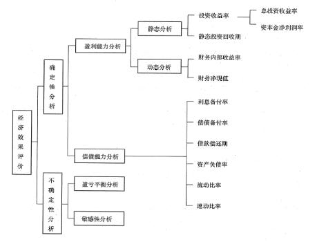
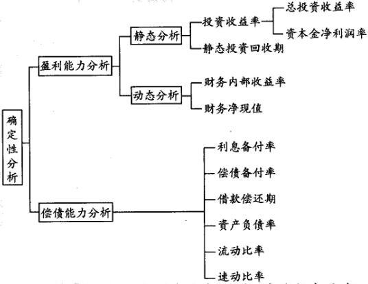
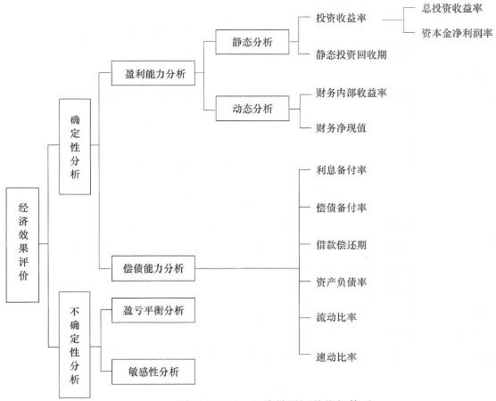
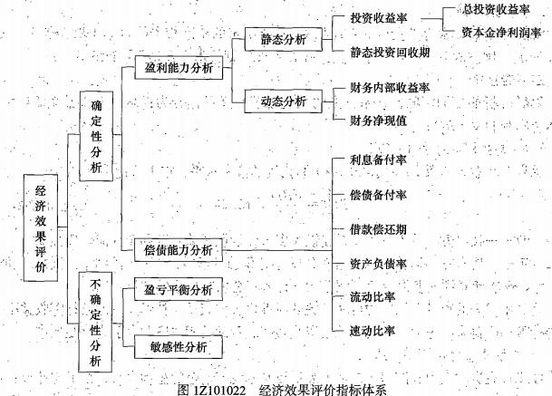
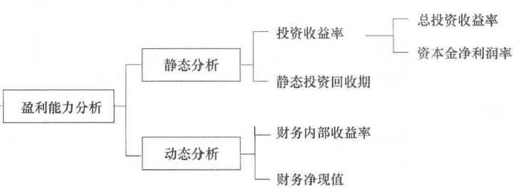

下列关于建设项目财务评价指标的说法中，不正确的是（ &nbsp; ）。

A.动态评价指标考虑了资金时间价值
B.静态评价指标没有考虑资金时间价值
C.动态评价指标反映了项目的盈利能力
D.静态评价指标的特点是考虑时间因素  (正确)
解析：
静态分析指标的最大特点是不考虑时间因素，计算简便。

动态分析指标强调利用复利方法计算资金时间价值，它将不同时间内资金的流人和流出，换算成同一时点的价值，从而为不同技术方案的经济比较提供了可比基础，并能反映技术方案在未来时期的发展变化情况。

【知识点】经济效果评价指标体系

【考点】经济效果评价指标体系

【考查方向】概念释义

【难度】易

【题库维护老师：hejiade】

下列选项中，属于经济效果评价盈利能力分析中动态分析的指标的有（ &nbsp;）。

A.总投资收益率
B.财务内部收益率  (正确)
C.财务净现值  (正确)
D.资本金净利润率
E.利息备付率
解析：
AD属于静态分析指标，E属于偿债能力指标。  

【知识点】经济效果评价指标体系 【考点】经济效果评价指标体系 【考查方向】概念释义 【难易】易 【题库维护】yxf

下列工程经济效果评价指标中，属于盈利能力分析中动态分析指标的有( &nbsp; )

A.财务净现值  (正确)
B.投资收益率
C.借款偿还期
D.流动比率
E.财务内部收益率  (正确)
解析：
经济效果评价的基本方法包括确定性评价方法与不确定性评价方法两类。其中，确定性分析的经济效果评价指标体系如下图所示。

【知识点】 经济效果评价指标体系

【考点】经济效果评价指标体系

【考查方向】概念释义

【难度】易

【题库维护老师：hejiade】

偿债能力指标包括( &nbsp; )。

A.投资回收期
B.偿债备付率  (正确)
C.利息备付率  (正确)
D.资产负债率  (正确)
E.累计盈余资金
解析：
偿债能力指标包括利息备付率、偿债备付率、借款偿还期、资产负债率、流动比率、速动比率；A项是盈利能力指标，E项是财务生存能力指标。 如下图： 

【知识点】 经济效果评价指标体系

【考点】偿债能力指标

【考查方向】概念释义

【难度】易

【题库维护老师：hejiade】

下列各项中，属于技术方案静态分析指标的是( &nbsp; )。

A.内部收益率
B.投资收益率  (正确)
C.净现值率
D.净现值
解析：
静态分析指标有投资收益率、静态投资回收期。 

 

【知识点】 经济效果评价指标体系

【考点】经济效果评价指标体系

【考查方向】概念释义

【难度】易

【题库维护老师：hejiade】

投资收益率和财务净现值两个经济评价指标都是( &nbsp; &nbsp;)。

A.静态分析指标
B.动态分析指标
C.反映偿债能力的指标
D.反映盈利能力的指标  (正确)
解析：
    投资收益率和财务净现值都是反映盈利能力的指标，投资收益率是静态指标，财务净现值是动态指标。

    

    【知识点】经济效果评价指标体系

    【考点】经济效果评价指标体系

    【考查方向】概念释义

    【难度】易

    【题库维护老师：hejiade】

下列经济效果评价指标中，属于盈利能力动态分析指标的有（ &nbsp; &nbsp; ） 。

A.总投资收益率
B.财务净现值  (正确)
C.资本金净利润
D.财务内部收益率  (正确)
E.速度比率
解析：
盈利能力动态分析指标有财务净现值和财务内部收益率。

【知识点】经济效果评价指标体系

【考点】盈利能力动态分析指标

【考查方向】概念释义

【难度】易

【题库维护老师：hejiade】

下列选项属于盈利能力分析静态指标的有（）。

A.财务净现值
B.总投资收益率  (正确)
C.财务内部收益率
D.资产负债率
解析：
盈利能力分析静态指标（如下图）：  【知识点】经济效果评价体系 【考点】经济效果评价体系 【考查方向】原文挖空 【难度】易 【题库维护】yxf

下列经济效果评价指标中，属于动态指标的是（ &nbsp;）。

A.财务净现值  (正确)
B.流动比率
C.资金净利润率
D.投资收益率
解析：
财务净现值和财务内部收益率属于经济效果评价的动态指标。 &nbsp; &nbsp;   

【知识点】经济效果评价指标体系

【考点】动态指标

【考查方向】概念释义

【难度】易

【题库维护老师：hejiade】

下列经济效果评价指标中，属于偿债能力分析指标的是（ &nbsp;）。

A.盈亏平衡点
B.速动比率  (正确)
C.总投资收益率
D.财务净现值
解析：
    本题考查的是经济效果评价指标体系，A是不确定性分析指标，CD是盈利能力分析指标。

    

    【知识点】经济效果评价指标体系

    【考点】偿债能力分析指标

    【考查方向】概念释义

    【难度】易

    【题库维护老师：hejiade】

下列工程经济效果评价指标中，属于盈利能力分析动态指标的是（　　）。

A.财务净现值  (正确)
B.投资收益率
C.借款偿还期
D.流动比率
解析：
如下图： 

【知识点】经济效果评价指标体系

【考点】盈利能力分析动态指标

【考查方向】概念释义

【难度】易

【题库维护老师：hejiade】

