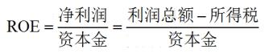
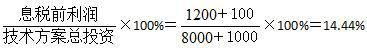
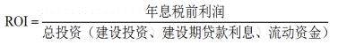

某技术方案总投资为11000万元，其中债务资金6000万元，上马该项目达产期每年的利润总额为800万元，企业所得税200万元。则该项目的资本金净利润率为（）。

A.8%
B.10%
C.12%  (正确)
D.15%
解析：
资本金净利润率=净利润/资本金=(800−200)/(11000−6000)=0.12

【知识点】应用式

【考点】应用式

【考查方向】公式计算

【难度】易

【题库维护】yxf

某技术方案总投资为11000万元，其中建设投资5500万元，不包含在建设投资中的建设期贷款利息500万元，则该项目流动资金为（）万元。

A.4000
B.6000
C.7000
D.5000  (正确)
解析：
总投资=建设投资+建设期贷款利息+流动资金，流动资金=11000-5500-500=5000万元。 【知识点】应用式 【考点】应用式 【考查方向】计算 【难度】易 【题库维护】yxf

某技术方案的总投资1500万元，其中债务资金700万元，技术方案在正常年份年利润总额400万元，所得税100万元，年折旧80万元，则该方案的资本金净利润率为（）。

A.26.7%
B.37.5%  (正确)
C.42.9%
D.47.5%
解析：
息税前利润-利息=利润总额 利润总额-所得税=净利润 （400-100）/（1500-700）=0.375 【知识点】应用式 【考点】应用式 【考查方向】公式计算 【难易程度】易 【题库维护老师】yxf

总投资收益率指标中，“EBIT”是指技术方案（）。

A.运营期内正常生产年份的年税前利润或运营期内年平均税前利润
B.运营期内正常生产年份的年税后利润或运营期内年平均税后利润
C.运营期内正常生产年份的年息税前利润或运营期内年平均息税前利润  (正确)
D.投产期和达产期的盈利总和
解析：
本题考核的是总投资收益率指标。总投资收益率指标中的“EBIT”，是指技术方案运营期内正常年份的年息税前利润或运营期内年平均息税前利润。“TI”指技术方案总投资（包括建设投资、建设期贷款利息和全部流动资金）。

【知识点】总投资收益率

【考点】总投资收益率指标

【考查方向】概念释义

【难度】易

【题库维护老师：hejiade】

 

某技术方案建设投资额6580万元（不含建设期贷款利息），建设期贷款利息为340万元，全部流动资金650万元，技术方案投产后正常年份的息税前利润820万元，则该技术方案的总投资收益率为（）。

A.8.28%
B.10.83%  (正确)
C.11.34%
D.12.46%
解析：
本题考核的是总投资收益率的计算。总投资收益率（ROI）表示技术方案总投资的盈利水平，计算公式为：ROI=(EBIT/TI)×100%，式中，EBIT表示技术方案运营期内正常年份的年息税前利润或运营期内年平均息税前利润；TI表示技术方案总投资（包括建设投资、建设期贷款利息和全部流动资金）。本题的计算过程为ROI=[820/(6580＋340+650)]×100%=10.83%

【知识点】总投资收益率

【考点】总投资收益率

【考查方向】概念释义

【难度】易

【题库维护老师：hejiade】

 

某项目建设投资额6000万元（含建设期贷款利息），工程建设其他费用500万元，全部流动资金800万元，项目投产后正常年份的息税前利润850万元，则该项目的总投资收益率为（ &nbsp; &nbsp;）。

A.11.64％
B.12.50％  (正确)
C.14.17％
D.16.35％
解析：
总投资收益率（ROI）表示总投资的盈利水平，按下式计算：ROI＝（EBIT/TI）×100％，式中，EBIT表示技术方案正常年份的年息税前利润或运营期内年平均息税前利润；TI表示技术方案总投资（包括建设投资.建设期贷款利息和全部流动资金）。

本题的计算过程为：ROI＝[850/（6000＋800）]×100％＝12.50％。

【知识点】投资收益率分析应用式

【考点】总投资收益率计算

【考查方向】概念释义

【难度】易

【题库维护老师：hejiade】

某技术方案投资，自有资金5000万元，银行贷款1000万元，建设期利息100万元，全部流动资金500万元，技术方案投产后正常年份的利润总额为1200万元，所得税费用为300万元，则资本金净利润率为(　　)。

A.22.5%
B.21.43%
C.18%  (正确)
D.16.07%
解析：
ROE=NP/EC×100%=（1200-300）/5000×100%=18%

【知识点】应用式

【考点】资本金净利润率 (ROE)

【考察方向】公式计算

【难度】易

【题库维护老师：ZKQ】

关于技术方案总投资收益率的说法，正确的是（）。

A.总投资收益率高于同期银行贷款利率时，举债不利于提高技术方案收益
B.总投资收益率指标充分体现了资金的时间价值
C.总投资收益率越高，说明技术方案获得的收益越多  (正确)
D.总投资收益率指标作为主要的决策依据比较客观，不受人为因素影响
解析：
    选项A错误，收益率高于银行，说明我们越要借银行的钱来提高收益。

    选项B错误，总投资收益率指标不可以体现资金的时间价值，是静态要素。

    选项D错误，总投资收益率指标作为主要的决策依据带有一定的不确定性和人为因素。

    总投资收益率越高，从技术方案所获得的资本金净利润率(ROE) 则是用来衡量技术方案资本金的获利能力，资本金净利润率(ROE) 越高，资本金所取得的利润就越多，权益投资盈利水平也就越高;反之，则情况相反。对于技术方案而言，若总投资收益率或资本金净利润率高于同期银行利率，适度举债是有利的;反之，过高的负债比率将损害企业和投资者的利益。由此可以看出，总投资收益率或资本金净利润率指标不仅可以用来衡量技术方案的获利能力，还可以作为技术方案筹资决策参考的依据。 投资收益率(R) 指标没有考虑技术方案投资收益的时间因素，忽视了资金具有时间价值的重要性;指标的计算主观随意性太强，技术方案正常生产年份的选择比较困难，其确定带有一定的不确定性和人为因素。

    【知识点】应用式

    【考点】总投资收益率

    【考查方向】概念释义

    【难度】中等

    【题库维护老师：hejiade】

某建设项目建设投资为 5000 万元，流动资金为 450 万元，项目建设期利息为 420 万元。达到设计生产能力的正常年份年利润总额为 1200 万元，利息 90 万元，则该项目正常年份的总投资收益率约为（ ）。

A.13%
B.14%
C.20%
D.22%  (正确)
解析：
总投资收益率=技术方案正常年份的息税前利润或运营期内年平均息税前利润/技术方案总投资，技术方案总投资中包括建设投资、建设期贷款利息和全部流动资金。

故总投资收益率=（1200+90）/（5000+420+450）*100%=21.98%。

【知识点】总投资收益率计算

【考点】总投资收益率计算

【考查方向】概念释义

【难度】易

【题库维护老师：hejiade】

某项目建设投资为9700万元(其中:建设期贷款利息700万元),全部流动资金为900万元,项目投产后正常年份的年息税前利润为950万元,则该项目的总投资收益率为（）。

A.10.56%
B.9.79%
C.9.60%
D.8.96%  (正确)
解析：
总投资收益率=运营期内正常年份的年息税前利润或运营期内年平均息税前利润/技术方案总投资（建设投资+建设期贷款利息+全部流动资金）=950/（9700+900）=8.96%。

【知识点】投资收益率分析——应用式

【考点】总投资收益率

【考查方向】公式计算

【难度】易

【题库维护老师：hejiade】

某工业项目建设投资额8250万元（不含建设期贷款利息），建设期贷款利息为1200万元，全部流动资金700万元，项目投产后正常年份的息税前利润500万元，则该项目的总投资收益率为（ &nbsp;）。

A.4.92%  (正确)
B.5.67%
C.5.64%
D.6.67%
解析：
    总投资收益率=技术方案正常年份的息税前利润或运营期内年平均息税前利润/技术方案总投资，技术方案总投资中包括建设投资、建设期贷款利息和全部流动资金。

    即：（ROI）=EBIT/TI×100%

    总投资收益率=500/（8250+1200+700）×100%=4.92%

    【知识点】投资收益率分析——应用式

    【考点】总投资收益率计算

    【考查方向】公式计算

    【难度】易

    【题库维护老师：hejiade】

某项目建设投资额5000万元，其中自有资金3600万元，1400万元贷款本金，建设期贷款利息为220万元，项目投产后运营期内正常年份的利润总额为300万元，同时需缴纳所得税为98万元，则该项目的资本金净利润率为( &nbsp; &nbsp; )。

A.5.57%
B.5.61%  (正确)
C.5.64%
D.5.67%
解析：
资本金净利润率=净利润/资本金=(300-98)/3600*100%=5.61%

【知识点】投资收益率分析——应用式

【考点】资本金净利润率计算

【考查方向】概念释义

【难度】易

【题库维护老师：hejiade】

某项目建设投资为3000万元，全部流动资金为450万元，项目投产期年息税前利润总额为500万元，运营期正常年份的年平均息税前利润总额为800万元，则该项目的总投资收益率为（ &nbsp;）。

A.18.84％
B.26.67％
C.23.19％  (正确)
D.25.52％
解析：
根据总投资收益率（ROI）的应用式，即ROI=EBIT÷TI×100％，则该项目的总投资收益率=800÷（3000+450）×100％=23.19％。

需要注意，题目中有个500万元这里就是不用去理会的，我们要的是正常年份的年平均息税前利润，题目告诉你是800万元，我们直接用即可。

【知识点】投资收益率分析——应用式

【考点】总投资收益率

【考查方向】公式计算

【难度】易

【题库维护老师：hejiade】

某技术方案总投资1500万元，其中资本金1000万元，运营期年平均利息18万元，年平均所得税40.5万元。若项目总投资收益率为12%，则项目资本金净利润率为（ &nbsp;）。

A.16.20%
B.13.95%
C.12.15%  (正确)
D.12.00%
解析：
根据总投资1500万元，总投资收益率为12%可计算得出，息税前利润=总投资×总投资收益率=180万元。

技术方案资本金净利润率（ROE）：ROE=净利润/技术方案资本金×100%，净利润=利润总额-所得税=息税前利润-利息-所得税。

最后可得资金本净利润率=（180-18-40.5）/1000=12.15%。

【知识点】投资收益率分析——应用式

【考点】资本金净利润率

【考查方向】公式计算

【难度】中等

【题库维护老师：hejiade】

某项目建设投资为5000万元（不含建设期贷款利息），建设期贷款利息为550万元，全部流动资金为450万元，项目投产期年息税前利润为900万元，达到设计生产能力的正常年份年息税前利润为1200万元，则该项目的总投资收益率为（ &nbsp;）。

A.24.00%
B.17.50%
C.20.00%  (正确)
D.15.00%
解析：
总投资收益率=技术方案正常年份的息税前利润或运营期内年平均息税前利润/技术方案总投资，技术方案总投资中包括建设投资、建设期贷款利息和全部流动资金。

故总投资收益率=1200÷（5000+550+450）×100％＝20％

需要注意计算时使用达到产后的正常年份年息税前利润，1200万元。

【知识点】投资收益率分析——应用式

【考点】总投资收益率

【考查方向】公式计算

【难度】易

【题库维护老师：hejiade】

某技术方案的总投资2000万元，其中债务资金700万元，技术方案在正常年份年利润总额400万元，所得税100万元，年折旧费100万元，则该方案的资本金净利润率为( &nbsp; )

A.23.1%  (正确)
B.37.5%
C.42.9%
D.47.5%
解析：
资本金净利润率ROE表示技术方案资本金的盈利水平。

其计算公式：ROE＝NP/EC×100％，式中NP——技术方案正常年份的年净利润或运营期内年平均净利润，净利润＝利润总额－所得税；EC——技术方案资本金。

由题意可得NP＝400－100＝300(万元)，EC＝2000－700＝1300(万元)，则ROE＝NP/EC×100％＝300/1300×100％＝23.1％。

【知识点】投资收益率分析——应用式

【考点】资本金净利润率（ROE）

【考查方向】概念释义

【难度】易

【题库维护老师：hejiade】

某技术方案建设期3年，生产经营期15年；建设投资5500万元(不包括建设期利息)；流动资金500万元；建设期贷款1500万元，期未还款总额为1725万元。则该技术方案的总投资为( &nbsp; )万元。

A.6000
B.6225  (正确)
C.7500
D.7725
解析：
技术方案总投资包括建设投资、建设期贷款利息和全部流动资金，建设期利息是指项目借款在建设期内发生并计入固定资产的利息。

由题意得该技术方案的总投资＝建设投资＋建设期贷款利息＋全部流动资金＝5500＋(1725－1500)＋500＝6225(万元)。

【知识点】投资收益率分析——应用式

【考点】总投资计算

【考查方向】公式计算

【难度】易

【题库维护老师：hejiade】

某技术方案建设期3年，生产期17年。建设投资5500万元，流动资金500万元。建设期第1年初贷款2000万元，年利率9%，贷款期限5年，约定每年复利计息一次，到期一次还本付息，贷款管理费及手续费率0.5%。则该技术方案的总投资为( &nbsp; )万元。

A.6000
B.6672
C.6600  (正确)
D.8000
解析：
总投资=建设投资+建设期利息+流动资金，其中，建设期利息包括银行借款和其他债务资金的利息，以及其他融资费用。其他融资费用是指某些债务融资中发生的手续费、承诺费、管理费、信贷保险费等融资费用。因此，总投资=5500+[2000×(1+0.09)3-2000+2000×0.005]+500=6600万元。故选项C正确。

【知识点】投资收益率分析——应用式

【考点】资本金净利润率计算

【考查方向】公式计算

【难度】易

【题库维护老师：hejiade】

技术方案资本金净利润率(ROE)表示技术方案资本金的盈利水平，是技术方案正常年份的某项指标与技术方案资本金的比率，该项指标是()。

A.利润总额
B.利润总额-所得税  (正确)
C.利润总额-所得税-贷款利息
D.利润总额+折旧费
解析：
技术方案正常年份的年净利润或运营期内年平均净利润，净利润＝利润总额－所得税。

【知识点】投资收益率分析——应用式

【考点】资本金净利润率（ROE）

【考查方向】概念释义

【难度】易

【题库维护老师：hejiade】

若某个项目的总投资收益率或资本金利润率高于同期银行贷款利率，为了提高方案的获利能力，可以采取的做法是( &nbsp; )。

A.适度举债  (正确)
B.加大投资规模
C.调整投资方案
D.缩减投资规模
解析：
对于技术方案而言，若总投资收益率或资本金净利润率高于同期银行利率，适度举债是有利的。

【知识点】投资收益率分析——应用式

【考点】应用式

【考查方向】概念释义

【难度】易

【题库维护老师：hejiade】

某技术方案固定资产投资为5000万元，流动资金为450万元，该技术方案投产期年息税前利润总额为900万元，达到设计生产能力的正常年份年息税前利润总额为1200万元，则该技术方案正常年份的总投资收益率为( &nbsp;)。

A.17%
B.18%
C.22%  (正确)
D.24%
解析：
总投资收益率是达到设计生产能力的正常年份的年息税前利润总额与方案投资总额的比率。

根据定义，分子应采用达到设计生产能力的正常年份的年息税前利润总额1200万元，而不是技术方案投产期年息税前利润总额900万元；分母应采用投资总额，即固定资产投资5000万元与流动资金450万元之和5450万元。总投资收益率=1200÷5450×100%=22%。故选项C正确。

【知识点】投资收益率分析——应用式

【考点】总投资收益率计算

【考查方向】公式计算

【难度】易

【题库维护老师：hejiade】

某建设项目，建设期为3年，向银行贷款2000万元，第一年贷款400万元，第二年贷款1000万元，第三年贷款600万元，年利率为10%，则建设期贷款利息为( &nbsp; )。

A.92万元
B.181.2万元
C.293.2万元  (正确)
D.393.2万元
解析：
第一年利息=（400／2）×10％=20万元

第二年利息=（1 000／2+400+20）×10％=92万元

第三年利息=（600／2+400+20+1 000+92）×10%=181.2万元

建设期贷款利息为：20+92+181.2=293.2万元 &nbsp;

【知识点】投资收益率分析——应用式

【考点】应用式

【考查方向】公式计算

【难度】中等

【题库维护老师：hejiade】

关于总投资收益率（ROI）的说法，正确的有()。

A.总投资收益率用来衡量整个技术方案的获利能力  (正确)
B.总投资收益率应大于行业的平均投资收益率  (正确)
C.总投资收益率越高，从技术方案所获得的收益就越多  (正确)
D.总投资收益率高于同期银行利率，适度举债是有利的  (正确)
E.总投资收益率不能作为技术方案筹资决策参考的依据
解析：
总投资收益率（ROI）是用来衡量整个技术方案的获利能力，要求技术方案的总投资收益率（ROI）应大于行业的平均投资收益率；总投资收益率越高，从技术方案所获得的收益就越多。而资本金净利润率（ROE）则是用来衡量技术方案资本金的获利能力，资本金净利润率（ROE）越高，资本金所取得的利润就越多，权益投资盈利水平也就越高；反之，则情况相反。对于技术方案而言，若总投资收益率或资本金净利润率高于同期银行利率，适度举债是有利的；反之，过高的负债比率将损害企业和投资者的利益。由此可以看出，总投资收益率或资本金净利润率指标不仅可以用来衡量技术方案的获利能力，还可以作为技术方案筹资决策参考的依据。故选项A、B、C、D正确。

【知识点】 投资收益率分析——应用式

【考点】总投资收益率（ROI）

【考查方向】概念释义

【难度】易

【题库维护老师：hejiade】

某技术方案，总投资金额10000万元，其中自有资金和债务资金分别为4000万元和6000万元，年利润总额2000万元，所得税金额500万元，债务资金年利率10%，则该技术方案资本金净利润率为（ &nbsp;）。

A.26%
B.20%
C.37.5%  (正确)
D.50%
解析：
 根据上式：ROE=（2000-500）/4000=0.375 【知识点】应用式 【考点】资本金净利润率 【考查方向】计算 【难度】易 【题库维护】yxf

某投资方案建设投资(含建设期利息)为8000万元，流动资金为1000万元，正常生产年份的利润总额1200万元，正常生产年份贷款利息为100万元，则投资方案的总投资收益率为( &nbsp; )。

A.13.33%
B.14.44%  (正确)
C.15.00%
D.16.25%
解析：
总投资收益率＝

【知识点】投资收益率分析——应用式

【考点】总投资收益率计算

【考查方向】概念释义

【难度】易

【题库维护老师：hejiade】

某技术方案投资，自有资金4000万元，银行贷款1000万元，建设期利息100万元，全部流动资金500万元，技术方案投产后正常年份的利润总额为1500万元，所得税费用为350万元，则资本金净利润率为( &nbsp; )。

A.28.75％  (正确)
B.22.55％
C.37.5％
D.16.07％
解析：
资本金净利润率＝

【知识点】投资收益率分析——应用式

【考点】资本金净利润率计算

【考查方向】概念释义

【难度】易

【题库维护老师：hejiade】

某技术方案，总投资金额10000万元，其中自有资金和债务资金分别为4000万元和6000万元，年利润总额2000万元，所得税金额500万元，债务资金年利率10%，则该技术方案的总投资收益率为（ &nbsp;）。

A.26%  (正确)
B.20%
C.37.5%
D.50%
解析：
 根据上式：ROI=（2000+6000×10%）/10000=0.26 【知识点】应用式 【考点】总投资收益率 【考查方向】计算 【难度】易 【题库维护】yxf

