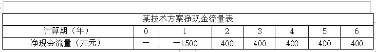
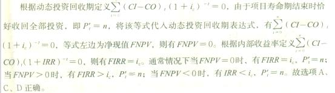
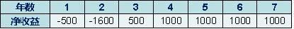
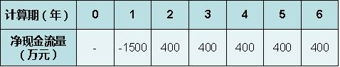

某投资方案建设期为1年，第一年年初投资8000万元，第二年年初开始盈利，运营期为4年，运营期每年年末净收益为3000万元，净残值为零。若基准率为10%，则该投资方案的财务净现值和静态投资回收期分别为（ &nbsp;&nbsp;）。

A.1510万元和3.67年
B.1510万元和2.67年
C.645万元和2.67年
D.645万元和3.67年  (正确)
解析：
直接利用静态投资回收期的计算公式可以算出静态投资回收期为3.67年。至于净现值，逐个折现也可以，当然因为各年收益相等，直接利用已知A求P的公式计算收益的现值也可以，然后减去8000万，则可以算出净现值为645万，选D。

下面是具体计算公式及流程。

静态投资回收期可根据公式 得出（4-1）+|-2000|/3000=3.67 年。

因为收益是等额的，所以根据现值年金公式 A（P/A,i,n）可计算出运营期的财务净现值P=3000[（1+10%）^4-1]/10%（1+10%）^4=9509.60。

此时 P 为第一年末的现值，需折算到 0 时点，9509.60 （P/F，10%,1）=8645，投资方案的财务净现值为 8645-8000=645 万元。

【知识点】投资收益率分析概念

【考点】投资收益率分析概念

【考察方向】公式计算

【难度】中等

【题库维护老师：hejiade】

某技术方案建设期1年，总投资900万元，其中流动资金100万元。建成投产后每年净收益为150万元。自建设开始年起，该技术方案的静态投资回收期为（ &nbsp; &nbsp;）年。

A.6
B.7  (正确)
C.7.	33
D.8
解析：
当技术方案实施后各年的净收益（即净现金流量）均相同时，静态投资回收期的计算公式如下：Pt＝I/A，式中，I为技术方案总投资；A为技术方案每年的净收益，即A＝（CI－CO）t。

投资回收期可自项目建设开始年算起，也可自项目投产年开始算起，但应予以注明。则该技术方案的静态投资回收期＝1＋900/150＝7年。

【知识点】投资回收期分析应用式

【考点】投资回收期分析应用式

【考查方向】公式计算

【难度】中等

【题库维护老师：hejiade】

技术方案静态投资回收期是在不考虑资金时间价值的条件下，以技术方案的净收益回收总投资所需要的时间。这里的总投资指的是()。

A.建设投资
B.权益投资
C.建设投资+流动资金  (正确)
D.权益投资+自有流动资金
解析：
技术方案静态投资回收期是在不考虑资金时间价值的条件下，以技术方案的净收益回收其总投资（包括建设投资和流动资金）所需要的时间。

【知识点】投资回收期分析——概念

【考点】概念

【考查方向】概念释义

【难度】易

【题库维护老师：hejiade】

与计算静态投资回收期无关的变量是( &nbsp; &nbsp;)。

A.基准收益率  (正确)
B.现金流入
C.现金流出
D.净现金流量
解析：
技术方案静态投资回收期（Pt）是在不考虑资金时间价值的条件下，以技术方案的净收益回收其总投资（包括建设投资和流动资金）所需要的时间，一般以年为单位。

【知识点】投资回收期分析——概念

【考点】静态投资回收期

【考查方向】概念释义

【难度】易

【题库维护老师：hejiade】

某技术方案的净现金流量见下表，则该方案的静态投资回收期为（ &nbsp; &nbsp;）年。

A.3.25
B.3.75
C.4.25
D.4.75  (正确)
解析：
如下图

【知识点】1Z101024 投资回收期分析

【考点】应用式

【考查方向】公式计算

【难度】易

【题库维护老师：hejiade】

某技术方案寿命期为n年，基准收益率为iC，当技术方案寿命期结束时恰好收回全部投资，则下列表达式一定成立的有()。

A.FNPV=0  (正确)
B.FNPV>0
C.P＇t=n  (正确)
D.FIRR=ic  (正确)
E.FIRR>ic
解析：

【知识点】 投资回收期分析——概念

【考点】动态投资回收期

【考查方向】概念释义

【难度】中等

【题库维护老师：hejiade】

某技术方案，实施后各年净收益如下表所述。该技术方案静态投资回收期为（ &nbsp;）年。 

A.4.4年
B.4.6年  (正确)
C.5.4年
D.5.6年
解析：
 根据上表：P=4+600/（400+600）=4.6年 【知识点】概念（投资回收期） 【考点】概念（投资回收期） 【考查方向】计算 【难度】易 【题库维护】yxf

某技术方案的净现金流量如下表。则该方案的静态投资回收期为（ &nbsp;）。 

A.3.25
B.3.75
C.4.25
D.4.75  (正确)
解析：
 4+300/（100+300）=4.75年

【知识点】概念（投资回收期） 【考点】【知识点】概念（投资回收期） 【考查方向】计算 【难度】易 【题库维护】yxf

