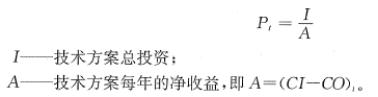
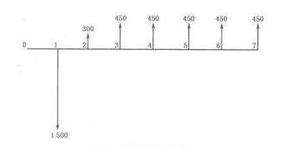
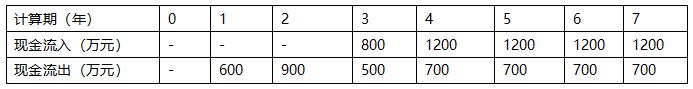
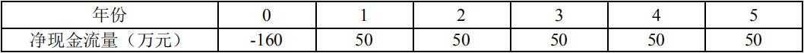
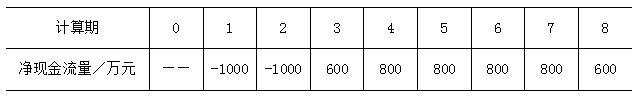

某投资方案建设期为 1 年，第 1 年年初投资 8000 万元，第 2 年年初开始运营，运营期为 4 年，运营期每年年末净收益为 3000 万元，净残值为零。若基准收益率为 10%，则该投资方案的财务净现值和静态投资回收期分别为（）。

A.645 万元和 3.67 年  (正确)
B.1510 万元和 3.67 年
C.1510 万元和 2.67 年
D.645 万元和 2.67 年
解析：
因为收益是等额的，所以根据现值年金公式 A（P/A,i,n）可计算出运营期的财务净现值P=3000[（1+10%）^4-1]/10%（1+10%）^4=9509.60。

此时 P 为第一年末的现值，需折算到 0 时点，9509.60 （P/F，10%,1）=8645，投资方案的财务净现值为 8645-8000=645 万元。

静态投资回收期可根据公式 得出（4-1）+|-2000|/3000=3.67 年。

【知识点】投资回收期分析——应用式

【考点】静态投资回收期的计算

【考查方向】公式计算

【难度】中等

【题库维护老师：hejiade】

已知技术方案正常年份的利润总额 400 万元，所得税 100 万元，当期应付利息 50 万元。项目总投资为 5000 万元，项目债务资金 2000 万元。则该技术方案资本金净利润率为（ ）。

A.8%
B.9%
C.10%  (正确)
D.11%
解析：
资本金=总投资资金-借贷资金=5000-2000=3000  ROE=净利润/项目资本金=（400-100）/3000 =10%。

【知识点】投资回收期分析——应用式

【考点】资本金净利润率的计算

【考查方向】公式计算

【难度】易

【题库维护老师：hejiade】

某技术方案总投资5000万元，实施后各年净收益均为800万元。则该技术方案静态投资回收期为（ &nbsp;）年。

A.6
B.7
C.6.75
D.6.25  (正确)
解析：
 根据上式计算得出P=5000/800=6.25年 【知识点】应用式 【考点】技术方案总投资 【考查方向】计算 【难度】易 【题库维护】yxf

某建设项目现金流量图如下图所示，则该项目的静态投资回收期为(　　)。  

A.5.6年
B.4.4年
C.5.4年
D.4.7年  (正确)
解析：
    当技术方案实施后各年的净收益不相同时，静态投资回收期可根据累计净现金流量求得，也就是在技术方案投资现金流量表中累计净现金流量由负值变为零的时点。其计算公式为：

     

    =7-1+（-1500-300+450X4）/-450=4.7

    【知识点】投资回收期分析应用式

    【考点】静态投资回收期的计算

    【考查方向】公式计算

    【难度】中等

    【题库维护老师：hejiade】

某技术方案的现金流量如下表，设基准收益率（折现率）为8%，则静态投资回收期为（）年。 

A.2.25
B.3.58
C.5.40  (正确)
D.6.60
解析：
根据题目可列表如下：  &nbsp; &nbsp;  P1=(6-1)+|-200|/500=5.40年 【知识点】投资回收期分析——应用式 【考点】静态投资回收期的计算

【考查方向】公式计算 【难度】中等 【题库维护老师：hejiade】

某项目各年净现金流量如下表，设基准收益率为 10%，则该项目的财务净现值和静态投资回收期分别为（ ）。

A.32.02 万元，3.2 年
B.32.02 万元，4.2 年
C.29.54 万元，4.2 年
D.29.54 万元，3.2 年  (正确)
解析：
一个题考查 2 个指标的计算。  FNPV=-160+50（1+10）-1 +50（1+10）-2 +50（1+10）-3 +50（1+10）-4 +50（1+10）-5 =29.54   各年净收益相等，都为 50，所以静态投资回收期为：160/50=3.2 年。

【知识点】投资回收期分析——应用式

【考点】财务净现值和静态投资回收期

【考查方向】公式计算

【难度】中等

【题库维护老师：hejiade】

某投资方案现金流量表的数据见下表，则该方案的静态投资回收期为( &nbsp; )年。

A.3.75
B.4.00
C.4.75  (正确)
D.6.00
解析：
当技术方案实施后各年的净收益不相同时，静态投资回收期可根据累计净现金流量求得，也就是在技术方案投资现金流量表中累计净现金流量由负值变为零的时点。其计算公式： 

，式中T——技术方案各年累计净现金流量首次为正或零的年数；

——技术方案第(T—1)年累计净现金流量的绝对值；(CI—CO)T，——技术方案第T年的净现金流量。由题意可知第4年累计净现金流量为-600万元，第5年累计净现金流量200万元，代入数值计算可得Pt＝(5－1)＋|-600|/800＝4.75(年)。 

【知识点】投资回收期分析——应用式

【考点】静态投资回收期计算

【考查方向】公式计算

【难度】中等

【题库维护老师：hejiade】

