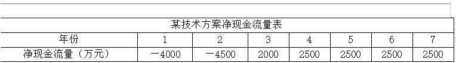
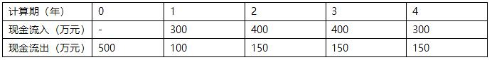
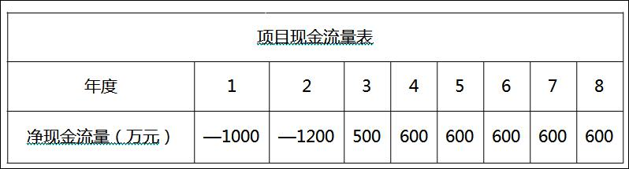
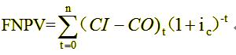
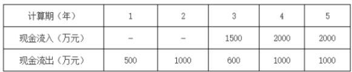
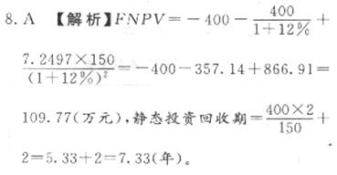

某企业年初借款2000万元，按年复利计息，年利率8％。第3年末还款1200万元，剩余本息在第5年末全部还清，第5年末需还（&nbsp; &nbsp;）万元。

A.1388.80
B.1484.80
C.1538.98  (正确)
D.1738.66
解析：
设第五年末需要还款x元，则2000=1200/（1+8%）3+x/（1+8%）5 ，解方程即可。 【知识点】概念 【考点】概念 【考查方向】计算 【难易程度】中等 【题库维护老师】yxf

某技术方案现金流量表如下，若基准收益率为8%，则该方案财务净现值为（ &nbsp;）万元。
<table width="100%" border="1" bordercolor="#000000"><tbody><tr><td style="width:16%;text-align:center;">现金流量（万元）</td><td style="width:16%;text-align:center;">第0年 </td><td style="width:16%;text-align:center;">第1年 </td><td style="width:16%;text-align:center;">第2年 </td><td style="width:16%;text-align:center;">第3年 </td><td style="width:16%;text-align:center;">第4年 </td></tr><tr><td style="width:16%;text-align:center;">现金流入 </td><td style="width:16%;text-align:center;"> </td><td style="width:16%;text-align:center;">1000</td><td style="width:16%;text-align:center;">6000</td><td style="width:16%;text-align:center;">3000</td><td style="width:16%;text-align:center;">6000</td></tr><tr><td style="width:16%;text-align:center;">现金流出 </td><td style="width:16%;text-align:center;">3700</td><td style="width:16%;text-align:center;">4000</td><td style="width:16%;text-align:center;">2000</td><td style="width:16%;text-align:center;">3000</td><td style="width:16%;text-align:center;">2000</td></tr></tbody></table>
A.-1300.00
B.-100.40
C.-108.30  (正确)
D.126.91
解析：
该方案财务净现值FNPV=-3700-3000（1+8%）-1+4000（1+8%）-2+0+4000（1+8%）-4=-108.30万元。

【知识点】应用式

【考点】财务净现值应用式

【考查方向】公式计算

【难度】中等

【题库维护老师：hejiade】

已知某技术方案现金流量见下表，设ic＝10％，则财务净现值为（ &nbsp; &nbsp;）万元。

A.82.4
B.101.2  (正确)
C.110.4
D.204.9
解析：
    如下图

    

    【知识点】财务净现值分析应用式

    【考点】财务净现值计算

    【考查方向】公式计算

    【难度】中等

    【题库维护老师：hejiade】

某技术方案现金流量表如下，基准收益率为8%，该技术方案的财务净现值为（ ）万元。 &nbsp; &nbsp;  &nbsp; &nbsp;

A.208.23  (正确)
B.58.23
C.192.81
D.347.12
解析：
FNPV=-500+200（1+8%）-1+250（1+8%）-2+250（1+8%）-3+150（1+8%）-4=-500+185.19+214.33+198.46+110.25=208.23

【知识点】&nbsp;财务净现值分析概念

【考点】&nbsp;财务净现值分析概念

【考查方向】公式计算

【难度】中等

【题库维护老师：hejiade】

某项目现金流量表见下表，设ic＝10％则该项目的财务净现值为（ &nbsp; &nbsp;）万元。

A.34.15
B.96.23
C.183.68  (正确)
D.273.86
解析：
    如下图  

    【知识点】财务净现值应用式

    【考点】财务净现值计算

    【考查方向】公式计算

    【难度】中等

    【题库维护老师：hejiade】

某建设项目的现金流量为常规现金流量，当基准收益率为8%时，项目财务净现值为800万元。若基准收益率变为10%，该项目的财务净现值将（ &nbsp; ）。

A.大于800万元
B.小于800万元  (正确)
C.等于800万元
D.不确定
解析：
财务净现值（FNPV）是反映技术方案在计算期内盈利能力的动态评价指标。技术方案的财务净现值是指用一个预定的基准收益率（或设定的折现率） ，分别把整个计算期间内各年所发生的净现金流量都折现到技术方案开始实施时的现值之和。

【知识点】财务净现值分析——概念

【考点】概念

【考查方向】公式计算

【难度】易

【题库维护老师：hejiade】

某技术方案的现金流量如下表。若基准收益率为10%，则该方案的财务净现值是（）万元。 

A.699.12  (正确)
B.769.03
C.956.22
D.1400.00
解析：
本题考查的是财务净现值的计算。 

 

视频解析的答案存在错误，计算出来就是选项A。

【知识点】财务净现值应用式

【考点】财务净现值的计算

【考查方向】公式计算

【难度】难

【题库维护老师：hejiade】

某投资方案建设期为2年，建设期内每年年初投资400万元，运营期每年年末净收益为150万元。若基准收益率为12%，运营期为18年，残值为零，并已知(P/A，12%．18)=7.2497则该投资方案的财务净现值和静态投资回收期分别为(　　)。

A.109.77万元和7.33年  (正确)
B.109.77万元和6.33年
C.16.89万元和7.33年
D.16.89万元和6.33年
解析：
    

    【知识点】财务净现值计算

    【考点】财务净现值计算

    【考查方向】公式计算

    【难度】易

    【题库维护老师：hejiade】

