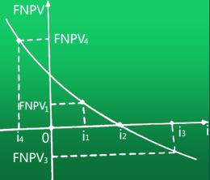
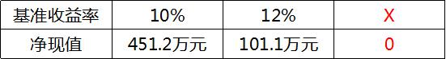
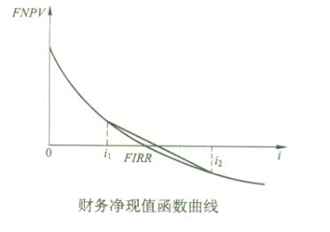

对于常规技术方案来说，在计算期内净现金流量现值累计为0时的折现率，是（ &nbsp;）。

A.基准收益率
B.资本金净利润率
C.财务内部收益率  (正确)
D.流动比率
解析：
对常规技术方案，财务内部收益率其实质就是使技术方案在计算期内各年净现金流量的现值累计等于零时的折现率。 【知识点】财务内部收益率的概念 【考点】财务内部收益率的概念 【考查方向】概念释义 【难易】易 【题库维护】yxf

某具有常规现金流量的技术方案，经计算FNPV(13%)=300、FNPV(15%)=100，则FIRR的取值范围为(&nbsp; &nbsp;)。

A.<13%
B.13%～14%
C.14%～15%
D.>15%  (正确)
解析：
在平面直角坐标系 找出这两个坐标点 然后连线和x轴交点 就是内部收益率。 【知识点】财务内部收益率的概念 【考点】财务内部收益率的概念 【考查方向】概念释义 【难度】易 【题库维护老师：hejiade】

关于财务内部收益率的说法，正确的是（ &nbsp;&nbsp;）。

A.财务内部收益率大于基准收益率时，技术方案在经济上可以接受  (正确)
B.财务内部收益率是一个事先确定的基准折现率
C.财务内部收益率受项目外部参数的影响较大
D.独立方案用财务内部收益率评价与财务净现值评价，结论通常不一致
解析：
本题考查的是财务内部收益率的判断和优劣。财务内部收益率与财务净现值，原理相通、互为逆运算。其中，<strong>财务内部收益率大于或等于基准收益率时，技术方案在经济上可以接受</strong>。

选项B，财务内部收益率是一个未知的折现率。

选项C，财务内部收益率 的大小不受外部参数影响，完全取决于投资过程现金流量。

选项D,对独立常规技术方案应用 财务内部收益率 评价与应用财务净现值评价均可，其结论是一致的。

【知识点】财务内部收益率的概念

【考点】财务内部收益率的判断和优劣

【考查方向】概念释义

【难度】易

【题库维护老师：hejiade】

关于财务内部收益率的说法，正确的是（ &nbsp;）。

A.其大小易受基准收益率等外部参数的影响
B.任一技术方案的财务内部收益率均存在唯一解
C.可直接用于互斥方案之间的比选
D.考虑了技术方案在整个计算期内的经济状况  (正确)
解析：
财务内部收益率指标考虑了资金的时间价值以及技术方案在整个计算期内的经济状况，不仅能反映投资过程的收益程度，而且的大小不受外部参数影响，完全取决于技术方案投资过程净现金流量系列的情况。这种技术方案内部决定性，使它在应用中具有一个显著的优点，即避免了像财务净现值之类的指标那样须事先确定基准收益率这个难题，而只需要知道基准收益率的大致范围即可。

【知识点】财务内部收益率的概念

【考点】财务内部收益率的概念

【考查方向】概念释义

【难度】易

【题库维护老师：hejiade】

常规现金流量技术方案分析时，若采用的折现率提高，则（ &nbsp; &nbsp;）。

A.财务净现值减小，技术方案可行
B.财务净现值增加，技术方案可行
C.财务净现值减小，技术方案不可行  (正确)
D.财务净现值增加，技术方案不可行
解析：
对具有常规现金流量（即在计算期内，开始时有支出而后才有收益，且方案的净现金流量序列的符号只改变一次的现金流量）的技术方案，其财务净现值的大小与折现率的高低有直接的关系。随着折现率的逐渐增大，财务净现值由大变小，由正变负。折现率定得越高，技术方案被接受的可能性越小。

【知识点】财务内部收益率的概念

【考点】财务内部收益率的概念

【考查方向】概念释义

【难度】易

【题库维护老师：hejiade】

某常规技术方案，当贷款利率为10%时，净现值为180万元；当贷款利率为12%时，净现值为-130万元，则该方案财务内部收益率的取值范围为( &nbsp; )。

A.＜10%
B.11%～12%  (正确)
C.12%～13%
D.＞12%
解析：
内插法计算财务内部收益率的近似值，根据公式：FIRR＝i1＋[FNPV1／(FNPV1＋|FNPV2|)×(i2－i1)]，财务内部收益率＝10%＋180／(180＋130)×(12%－10%)＝11.16%。则该方案财务内部收益率的取值范围为11%～12%。

【知识点】财务内部收益率的概念

【考点】内部收益率

【考查方向】概念释义

【难度】易

【题库维护老师：hejiade】

关于财务内部收益率的说法，错误的是( &nbsp; )。

A.财务内部收益率适用于独立方案之间的比选
B.财务内部收益率的大小完全取决于技术方案投资过程净现金流量系列的情况
C.对常规技术方案，财务内部收益率是使技术方案在计算期内各年净现金流量的现值累计等于零时的折现率
D.财务净现值相等的两个方案，其财务内部收益率相等  (正确)
解析：
对独立常规技术方案应用财务内部收益率评价与应用财务净现值评价均可，其结论是一致的。故选项A正确。

财务内部收益率的大小不受外部参数影响，完全取决于技术方案投资过程净现金流量系列的情况。故选项B正确。

对常规技术方案，财务内部收益率其实质就是使技术方案在计算期内各年净现金流量的现值累计等于零时的折现率。故选项C正确。

选项D错误，两个方案的净现值相等，其内部收益率不一定相等。

【知识点】财务内部收益率的概念

【考点】财务内部收益率的概念

【考查方向】概念释义

【难度】易

【题库维护老师：hejiade】

使技术方案财务净现值为零的折现率称为(　　)。

A.资金成本率
B.财务内部收益率  (正确)
C.财务净现值率
D.基准收益率
解析：
对常规技术方案，财务内部收益率其实质就是使技术方案在整个计算期内各年净现金流量的现值累计等于零时的折现率，它是考察项目盈利能力的相对量指标。

【知识点】财务内部收益率的概念

【考点】财务净现值

【考查方向】概念释义

【难度】易

【题库维护老师：hejiade】

财务内部收益率其实质就是使技术方案在特定的时间范围内，各年财务净现金流量的现值累计等于零时的折现率。这一特定的时间范围指的是技术方案的( &nbsp; )。

A.自然寿命期
B.生产经营期
C.整个计算期  (正确)
D.建设期
解析：
对常规技术方案，财务内部收益率其实质就是使技术方案在整个计算期内各年净现金流量的现值累计等于零时的折现率，它是考察项目盈利能力的相对量指标。

【知识点】财务内部收益率的概念

【考点】财务内部收益率的概念

【考查方向】概念释义

【难度】易

【题库维护老师：hejiade】

对常规技术方案，财务内部收益率实质就是使技术方案在整个计算期内各年净现金流量的现值累计等于零时的折现率，它考察的是()。

A.项目与类似项目相比较的盈利能力
B.项目相对于折现率的净值
C.偿还到期借款的能力
D.项目自身的盈利能力  (正确)
解析：
    对常规技术方案，财务内部收益率实质就是使技术方案在整个计算期内各年净现金流量的现值累计等于零时的折现率，它考察的是项目自身的盈利能力

    【知识点】财务内部收益率的概念

    【考点】财务内部收益率的概念

    【考查方向】概念释义

    【难度】易

    【题库维护老师：hejiade】

某常规技术方案的净现值函数曲线如图所示，则该方案的内部收益率（）。 

A.i4
B.i3
C.i2  (正确)
D.i1
解析：
但由于FNPV（i）是i的递减函数，故折现率i定得越高，技术方案被接受的可能性越小。很明显，i可以大到使FNPV（i）=0，这时FNPV（i）曲线与横轴相交，i达到了其临界值i*，可以说i*是财务净现值评价准则的一个分水岭。i*就是财务内部收益率(FIRR)。

【知识点】财务内部收益率分析的概念

【考点】财务内部收益率分析的概念

【考查方向】概念释义

【难度】易

【题库维护老师：hejiade】

 

某技术方案，在基准收益率为10%时，财务净现值为451.2万元；在基准收益率为12%时，财务净现值为101.1万元。则该项目的财务内部收益率（）。

A.大于12%  (正确)
B.小于10%
C.在10%~11%之间
D.在11%~12%之间
解析：
 【知识点】财务内部收益率的概念 【考点】财务内部收益率的概念 【考查方向】概念释义 【难度】易 【题库维护】yxf

对于常规的技术方案，在采用直线内插法近似求解财务内部收益率时，近似解与精确解之间存在的关系是( &nbsp; )。

A.近似解<精确解
B.近似解>精确解  (正确)
C.近似解=精确解
D.不确定关系
解析：
对于常规技术方案，财务净现值函数曲线呈下凹状，如下图所示。可以看出，近似解大于精确解。故选项B正确。

【知识点】财务内部收益率的概念

【考点】财务内部收益率的概念

【考查方向】概念释义

【难度】易

【题库维护老师：hejiade】

