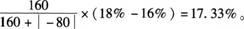

下列关于财务内部收益率的说法正确的是（ &nbsp; ）

A.财务内部收益率与财务净现值成反比
B.若财务内部收益率小于等于基准收益率，则技术方案在经济上可以接受
C.对某一技术方案，可能不存在财务内部收益  (正确)
D.财务内部收益率受众多外部参数的影响
解析：
财务内部收益率大于等于基准收益率，则技术方案在经济上可以接受；对于具有非常规现金流量的技术方案来讲，其财务内部收益率在某些情况下甚至不存在或存在多个内部收益率；FIRR的大小不受外部参数影响，完全取决于投资过程现金流量。

【知识点】FIRR与FNPV比较

【考点】FIRR与FNPV比较

【考查方向】概念释义

【难度】易

【题库维护老师：hejiade】

某常规技术方案，FNPV（16%）=160万元，FNPV（18%）=-80万元，则方案的FIRR最可能为（　）。

A.15.98%
B.16.21%
C.17.33%  (正确)
D.18.21%
解析：
对常规技术方案，财务内部收益率的实质就是使技术方案在计算期内各年净现金流量的现值累计等于零时的折现率。可采用试算法确定财务内部收益率：FIRR=16%+

【知识点】FIRR与FNPV比较

【考点】FIRR与FNPV比较

【考查方向】公式计算

【难度】易

【题库维护老师：hejiade】

若A、B两个具有常规现金流量的方案互斥，对于任意给定的折现率i，其财务净现值FNPV(i)A&gt;FNPV(i)B，则下列关系一定成立的是( &nbsp; )。

A.FIRRA>FIRRB  (正确)
B.FIRRA=FIRRB
C.FIRRA<FIRRB
D.FIRRA与FIRRB的关系不能确定
解析：

【知识点】FIRR与FNPV比较

【考点】FIRR与FNPV比较

【考查方向】概念释义

【难度】易

【题库维护老师：hejiade】

