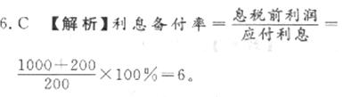
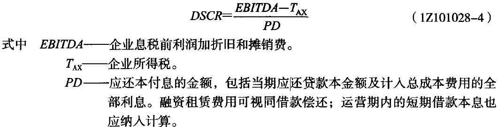
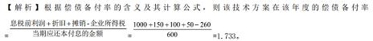

下列关于偿债备付率的说法，错误的是（）

A.偿债备付率应分年计算
B.偿债备付率表示企业可用于还本付息的资金偿还借款本息的保证倍率
C.偿债备付率低，说明偿付债务本息的资金不充足，偿债风险大
D.一般情况下，偿债备付率不宜低于1.2  (正确)
解析：
参考国际经验和国内行业的具体情况，根据我国企业历史数据统计分析，一般情况下，偿债备付率不宜低于1.30

【知识点】偿债备付率 (DSCR)

【考点】偿债备付率 (DSCR)

【考查方向】概念释义

【难度】易

【题库维护老师：hejiade】

根据国家财税规定，企业可以用来偿还投资借款的资金来源是（　　）

A.利润、折旧、应交税金
B.利润、折旧、摊销款  (正确)
C.折旧、摊销费、应付工资
D.未分配利润、应付工资、折旧
解析：
应交税金、应付工资都属于确确实实的负债，不能作为借款偿还资金的来源。

【知识点】偿债能力指标

【考点】偿债能力指标

【考查方向】概念释义

【难度】易

【题库维护老师：hejiade】

技术方案的经济效果评价，属于偿债能力分析指标的是( &nbsp; )。

A.静态投资回收期
B.总投资收益率
C.速动比率  (正确)
D.资本金净利润率
解析：
偿债能力分析指标包括利息备付率、偿债备付率、借款偿还期、资产负债率、流动比率、速动比率；A项、B项、D项都是盈利能力分析指标。

【知识点】偿债能力分析指标

【考点】偿债能力分析指标

【考查方向】概念释义

【难度】易

【题库维护老师：hejiade】

对于没有预先给定借款偿还期的技术方案，在判断偿债能力时经常采用的指标是(　　)。

A.借款偿还期  (正确)
B.利息备付率
C.投资回收期
D.偿债备付率
解析：
借款偿还期指标适用于那些不预先给定借款偿还期限，且按最大偿还能力计算还本付息的技术方案；它不适用于那些预先给定借款偿还期的技术方案。对于预先给定借款偿还期的技术方案，应采用利息备付率和偿债备付率指标分析企业的偿债能力。

【知识点】偿债能力分析

【考点】借款偿还期

【考查方向】概念释义

【难度】易

【题库维护老师：hejiade】

当年资金来源不足以偿付当期债务时，常常表现为偿债备付率(　　)。

A.小于1  (正确)
B.小于1.5
C.小于2
D.小于3
解析：
正常情况偿债备付率应当大于1，并结合债权人的要求确定。当指标小于1时，表示企业当年资金来源不足以偿付当期债务，需要通过短期借款偿付已到期债务。

【知识点】偿债能力指标

【考点】偿债备付率 (DSCR)

【考查方向】概念释义

【难度】易

【题库维护老师：hejiade】

资产负债率反映企业的（ &nbsp; &nbsp;）。

A.资产管理效率
B.发展能力
C.盈利能力
D.偿债能力  (正确)
解析：
偿债能力指标主要有：借款偿还期、利息备付率、偿债备付率、资产负债率、流动比率和速动比率。其中资产负债表、流动比率、速动比率等指标是技术方案偿债能力分析中考察企业财务状况的主要指标。

【知识点】偿债能力指标

【考点】偿债能力指标

【考查方向】原文填空

【难度】易

【题库维护老师：hejiade】

要保证技术方案生产运营期有足够资金支付到期利息，方案的利息备付率最低不应低于（ &nbsp;） 。

A.0.5
B.1  (正确)
C.3
D.5
解析：
正常情况下利息备付率应大于 1，一般情况下不宜低于 2。

【知识点】偿债能力指标

【考点】利息备付率（ICR）

【考查方向】概念释义

【难度】易

【题库维护老师：hejiade】

偿债备付率低，说明偿付债务本息的资金不充足，偿债风险大。当年资金来源不足以偿付当期债务时，常常表现为偿债备付率()。

A.小于1  (正确)
B.小于1.5
C.小于2
D.小于3
解析：
正常情况偿债备付率应当大于1，并结合债权人的要求确定。当指标小于1时，表示企业当年资金来源不足以偿付当期债务，需要通过短期借款偿付已到期债务。

【知识点】偿债能力指标

【考点】偿债备付率 (DSCR)

【考查方向】概念释义

【难度】易

【题库维护老师：hejiade】

如果技术方案没有足够资金支付利息，偿债风险很大，常常表现为利息备付率低于( &nbsp; )。

A.1  (正确)
B.1.5
C.2
D.3
解析：
当利息备付率低于1时，表示企业没有足够资金支付利息，偿债风险很大。

【知识点】偿债能力指标

【考点】利息备付率（ICR）

【考查方向】概念释义

【难度】易

【题库维护老师：hejiade】

在计算偿债备付率时，公式中的分子采用技术方案借款偿还期内各年的( &nbsp; )。

A.销售收入
B.利润总额
C.可用于还本付息的资金  (正确)
D.息税前利润
解析：
偿债备付率是从偿债资金来源的充裕性角度反映偿付债务本息的能力，指在技术方案借款偿还期内，各年可用于还本付息的资金（EBITDA－TAX）与当期应还本付息金额（PD）的比值。

 

【知识点】偿债能力指标

【考点】偿债备付率 (DSCR)

【考查方向】概念释义

【难度】易

【题库维护老师：hejiade】

对于那些不预先给定借款偿还期、且按最大还款能力计算技术方案偿债能力进行评价时，适宜采用的指标是( &nbsp; )。

A.利息备付率
B.借款偿还期  (正确)
C.偿债备付率
D.技术方案经济寿命期
解析：
借款偿还期指标适用于那些不预先给定借款偿还期限，且按最大偿还能力计算还本付息的技术方案；对于预先给定借款偿还期的技术方案，应采用利息备付率和偿债备付率指标分析技术方案的偿债能力。故选项B正确。

【知识点】偿债能力指标

【考点】借款偿还期

【考查方向】概念释义

【难度】易

【题库维护老师：hejiade】

在计算利息备付率时，其公式的分子是采用技术方案在借款偿还期内各年可用于支付利息的( &nbsp; )。

A.息税前利润  (正确)
B.息税后利润
C.总收入
D.利润总额
解析：
利息备付率也称已获利息倍数，指在技术方案借款偿还期内各年企业可用于支付利息的息税前利润（EBIT）与当期应付利息（PI）的比值。

【知识点】偿债能力指标

【考点】利息备付率（ICR）

【考查方向】概念释义

【难度】易

【题库维护老师：hejiade】

如果项目没有足够资金支付利息，偿债风险很大，常常表现为利息备付率低于( &nbsp; )。

A.3
B.2
C.1.3
D.1  (正确)
解析：
    利息备付率高，说明利息支付的保证度大，偿债风险小。正常情况下利息备付率应当大于1，并结合债权人的要求确定。否则，表示企业的付息能力保障程度不足。尤其是当利息备付率低于1时，表示企业没有足够资金支付利息，偿债风险很大。

    【知识点】1Z101028 偿债能力分析

    【考点】利息备付率（ICR）

    【考查方向】概念释义

    【难度】易

    【题库维护老师：hejiade】

某企业借贷资金8万元，偿还期为4年，年利率10%，按复利计算，有A、B、C、D四种还款方式，各还款方式中支付总金额最多的是( &nbsp; )。

A.每年年末偿还2万元本金和所欠利息
B.每年年末只偿还所欠利息，第4年年末一次还清本金
C.在4年中每年年末等额偿还
D.在第4年末一次还清本息  (正确)
解析：
D支付总金额最高。

A为等额本金还款法还款.

还贷总额=80000*(1+10%*(1+4)/2)=100000元

B每年还息到期一次还本。

还贷总额=80000*(1+10%*4)=112000元

C为等额本息还款法还款。

还贷总额=80000*10%/(1-(1+10%)-4)*4=100950.66元

D为先四年复利计息,再等额本息还款.(即为延期年金资本回收计算)

还贷总额=80000*(1+10%)4*10%/(1-(1+10%)-4)*4=147801.86元

【知识点】偿债能力指标

【考点】偿债能力指标

【考查方向】公式计算

【难度】中等

【题库维护老师：hejiade】

技术方案偿债能力评价指标有（ ）。

A.财务内部收益率
B.资产负债率  (正确)
C.生产能力利用率
D.借款偿还期  (正确)
E.流动比率  (正确)
解析：
技术方案的偿债能力是指分析和判断财务主体的偿债能力，偿债能力指标：利息备付率、偿债备负率、借款偿还期、资产负债率、流动比率和速动比率。

【知识点】偿债能力指标

【考点】偿债能力指标

【考查方向】原文挖空

【难度】易

【题库维护老师：hejiade】

下列技术方案经济效果评价指标中，属于偿债能力分析指标的有（ ）。

A.借款偿还期  (正确)
B.资本积累率
C.财务内部收益率
D.投资回收期
E.流动比率  (正确)
解析：
    偿债能力指标主要有: 借款偿还期、利息备付率、偿债备付率、资产负债率、流动比率和速动比率。

    【知识点】偿债能力指标

    【考点】偿债能力指标

    【考查方向】原文挖空

    【难度】易

    【题库维护老师：hejiade】

技术方案的偿债能力评价指标有( &nbsp; &nbsp;)。

A.资产负债率  (正确)
B.投资回收期
C.财务净现值
D.生产能力利用率
E.速动比率  (正确)
解析：
常用的长期偿债能力比率包括资产负债率、产权比率、权益乘数等。短期偿债能力分为流动比率，速动比率

【知识点】偿债能力指标

【考点】偿债能力指标

【考察方向】原文挖空

【难度】易

【题库维护老师：ZKQ】

下列技术方案的经济效果评价中，属于偿债能力指标的是( &nbsp; )

A.借款偿还期  (正确)
B.资本积累率
C.财务内部收益率
D.投资回收期
E.流动比率  (正确)
解析：
偿债能力指标主要有: 借款偿还期、利息备付率、偿债备付率、资产负债率、流动比率和速动比率。

【知识点】偿债能力指标

【考点】偿债能力指标

【考查方向】原文填空

【难度】易

【题库维护老师：hejiade】

下列投资方案经济效果评价指标中，可用于偿债能力分析的有（ &nbsp;） 。

A.利息备付率  (正确)
B.投资收益率
C.流动比率  (正确)
D.借款偿还期  (正确)
E.投资回收期
解析：
偿债能力指标主要有：借款偿还期、利息备付率、偿债备付率、资产负债率、流动比率和速动比率。

【知识点】偿债能力指标

【考点】偿债能力指标

【考查方向】原文填空

【难度】易

【题库维护老师：hejiade】

关于利息备付率的说法，正确的有()。

A.利息备付率应分年计算  (正确)
B.利息备付率高，说明利息支付的保证度大，偿债风险小  (正确)
C.正常情况下利息备付率应当大于1，并结合债权人的要求确定  (正确)
D.利息备付率低于1时，表示企业没有足够资金支付利息，偿债风险很大  (正确)
E.一般情况下，利息备付率不宜低于3
解析：
利息备付率应分年计算，它从付息资金来源的充裕性角度反映企业偿付债务利息的能力，表示企业使用息税前利润偿付利息的保证倍率。偿债备付率低，说明偿付债务本息的资金不充足，偿债风险大。正常情况下利息备付率应当大于1，并结合债权人的要求确定。否则，表示企业的付息能力保障程度不足。尤其是当利息备付率低于1时，表示企业没有足够资金支付利息，偿债风险很大。参考国际经验和国内行业的具体情况，根据我国企业历史数据统计分析，一般情况下，利息备付率不宜低于2，而且需要将该利息备付率指标与其他同类企业进行比较，分析决定本企业的指标水平。故选项A.B.C.D正确。

【知识点】偿债能力指标

【考点】利息备付率 (ICR)

【考查方向】概念释义

【难度】易

【题库维护老师：hejiade】

反映技术方案偿债能力的指标包括( &nbsp; )。

A.借款偿还期  (正确)
B.投资回收期
C.利息备付率  (正确)
D.偿债备付率  (正确)
E.财务内部收益率
解析：
偿债能力指标主要有：借款偿还期、利息备付率、偿债备付率、资产负债率、流动比率和速动比率。其中资产负债表、流动比率、速动比率等指标是技术方案偿债能力分析中考察企业财务状况的主要指标

【知识点】偿债能力指标

【考点】偿债能力指标

【考查方向】概念释义

【难度】易

【题库维护老师：hejiade】

某技术方案运营期第3年，有关财务数据为：利润总额1000万元，全部为应纳所得税基数，税率25%,当年折旧400万元，摊销不计。当年付息200万元。则该技术方案运营期第3年的利息备付率为(　　)。

A.3.15
B.5.75
C.6.00  (正确)
D.8.00
解析：
    

    【知识点】偿债能力分析

    【考点】利息备付率

    【考查方向】公式计算

    【难度】易

    【题库维护老师：hejiade】

在计算偿债备付率时，偿债备付率计算公式中的分子是技术方案借款偿还期内各年的( &nbsp; )

A.销售收入总额
B.利润总额
C.可用于还本付息的资金  (正确)
D.息税前利润
解析：
偿债备付率是指在技术方案借款偿还期内，<strong>各年</strong>可用于还本付息的资金与<strong>当期</strong>应还本付息金额的比值。其表达式：偿债备付率＝  

【知识点】偿债能力指标

【考点】偿债备付率 (DSCR)

【考查方向】概念释义

【难度】易

【题库维护老师：hejiade】

某技术方案在某年度税前利润为 1000 万元，企业所得税为 260 万元，折旧为 100 万元，摊销为 50 万元，应付利息为 150 万元，应还本付息金额为 600 万元。则该技术方案在该年度的偿债备付率为（ ）。

A.1.48
B.1.73  (正确)
C.1.92
D.6.93
解析：
如图

 息税前利润=税前利润+应付利息

【知识点】偿债能力指标

【考点】偿债备付率 (DSCR)

【考查方向】公式计算

【难度】易

【题库维护老师：hejiade】

