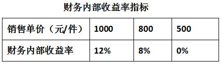

项目盈亏平衡分析时，一般应列入固定成本的是（ &nbsp; &nbsp;）。

A.生产工人工资
B.外购原材料费用
C.外购燃料动力费用
D.固定资产折旧费  (正确)
解析：
固定成本是指在技术方案一定的产量范围内不受产品产量影响的成本，即不随产品产量的增减发生变化的各项成本费用，如工资及福利费（计件工资除外）、折旧费、修理费、无形资产及其他资产摊销费.其他费用等。

【知识点】总成本与固定成本、可变成本

【考点】固定成本

【考查方向】原文挖空

【难度】易

【题库维护老师：hejiade】

在项目盈亏平衡分析中，可视为变动成本的是（ &nbsp; &nbsp;）。

A.无形资产摊销费
B.计件工人工资  (正确)
C.管理费用
D.固定资产折旧费用
解析：
    可变成本是随技术方案产品产量的增减而成正比例变化的各项成本，如原材料、燃料、动力费、包装费和计件工资等。

    【知识点】总成本与固定成本、可变成本

    【考点】可变成本

    【考查方向】原文挖空

    【难度】易

    【题库维护老师：hejiade】

下列关于盈亏平衡分析的说法，正确的是（）。

A.盈亏平衡分析将技术方案的总成本费用划分为固定成本和运行成本
B.原材料、燃料、动力费及包装费属于固定成本
C.盈亏平衡点反映了技术方案对市场变化的适应能力和抗风险能力  (正确)
D.盈亏平衡点越高，说明技术方案投产后盈利的可能性越大
解析：
盈亏平衡分析：根据成本费用与产量（或工程量）的关系可以将技术方案总成本费用分解为可变成本、固定成本和半可变（或半固定）成本。  （1）固定成本：工资及福利费（计件工资除外） 、折旧费、修理费、无形资产及其他资产摊销费、其他费用等。  （2）可变成本：原材料、燃料、动力费、包装费和计件工资等。  （3）半可变（或半固定）成本  盈亏平衡点反映了技术方案对市场变化的适应能力和抗风险能力。盈亏平衡点越低，技术方案投产后盈利的可能性越大，适应市场变化的能力越强，抗风险能力也越强。

【知识点】总成本与固定成本、可变成本

【考点】总成本与固定成本、可变成本

【考查方向】原文挖空

【难度】易

【题库维护老师：hejiade】

下列不属于可变成本的费用是( &nbsp; )。

A.折旧费  (正确)
B.包装费
C.计件工资
D.原材料消耗
解析：
可变成本是随技术方案产品产量的增减而成正比例变化的各项成本，如原材料、燃料、动力费、包装费和计件工资等。折旧费属于固定成本，故选A项。

【知识点】总成本与固定成本、可变成本

【考点】可变成本

【考查方向】原文挖空

【难度】易

【题库维护老师：hejiade】

以下属于固定成本的是( &nbsp; )。

A.运输费
B.原材料费
C.折旧费  (正确)
D.生产人员工资
解析：
固定成本是指在技术方案一定的产量范围内不受产品产量影响的成本，即不随产品产量的增减发生变化的各项成本费用，如工资及福利费（计件工资除外）、折旧费、修理费、无形资产及其他资产摊销费、其他费用等。

可变成本是随技术方案产品产量的增减而成正比例变化的各项成本，如原材料、燃料、动力费、包装费和计件工资等。

【知识点】总成本与固定成本、可变成本

【考点】固定成本

【考查方向】原文挖空

【难度】易

【题库维护老师：hejiade】

在进行盈亏平衡分析中，关于固定成本、可变成本和半可变(或半固定)成本的说法正确的是(　　)。

A.固定成本是随产品产量的增减发生变化的各项成本费用
B.可变成本是随技术方案产品产量的增减而成反比例变化的各项成本
C.半可变(或半固定)成本是随技术方案产量增长而增长，但不成正比例变化的成本  (正确)
D.长期借款利息应视为半可变(或半固定)成本
解析：
固定成本是指在技术方案一定的产量范围内不受产品产量影响的成本，即不随产品产量的增减发生变化的各项成本费用。可变成本是随技术方案产品产量的增减而成正比例变化的各项成本。半可变（或半固定）成本是指介于固定成本和可变成本之间，随技术方案产量增长而增长，但不成正比例变化的成本。

【知识点】总成本与固定成本、可变成本

【考点】固定成本

【考查方向】概念释义

【难度】易

【题库维护老师：hejiade】

根据成本费用与产量(或工程量)的关系可以将技术方案总成本费用分解为可变成本、固定成本和半可变(或半固定)成本。下列属于可变成本费用的是( &nbsp; )

A.固定资产折旧费
B.燃料、动力费  (正确)
C.无形资产摊销费
D.长期借款利息
解析：
技术方案可变成本是随技术方案产品产量的增减而成正比例变化的各项成本，如原材料、燃料、动力费、包装费和计件工资等。

【知识点】总成本与固定成本、可变成本

【考点】可变成本

【考查方向】原文挖空

【难度】易

【题库维护老师：hejiade】

某技术方案有一笔长期借款，每年付息80万元，到期一次还本。该技术方案年折旧费为120万元，正常生产年份的原材料费用每年为1000万元，管理人员工资福利费每年为100万元。则上述构成固定成本的费用额为每年( &nbsp;)万元。

A.300  (正确)
B.1200
C.1220
D.1300
解析：
长期借款利息属于固定成本，技术方案折旧费及非计件性质的管理人员工资福利费也属于固定成本；原材料费用属变动成本。则构成固定成本的费用额=长期借款利息+年折旧费+管理人员工资福利费=80+120+100=300万元／年，故选项A正确

【知识点】总成本与固定成本、可变成本

【考点】固定成本

【考查方向】概念释义

【难度】易

【题库维护老师：hejiade】

可变成本是随产品产量的增减而成正比例变化的各项成本。下列不属于可变成本费用的是( &nbsp; )。

A.原材料消耗
B.燃料、动力费
C.包装费和计件工资
D.管理人员工资  (正确)
解析：
可变成本是随技术方案产品产量的增减而成正比例变化的各项成本，如原材料、燃料、动力费、包装费和计件工资等。

【知识点】总成本与固定成本、可变成本

【考点】可变成本

【考查方向】原文挖空

【难度】易

【题库维护老师：hejiade】

进行盈亏平衡分析时，不属于总成本费用的是()。

A.生产成本  (正确)
B.固定成本
C.可变成本
D.半可变成本
解析：
根据成本费用与产量（或工程量）的关系，可以将技术方案总成本费用分解为可变成本、固定成本和半可变（或半固定）成本。故选项A正确。

【知识点】总成本与固定成本、可变成本

【考点】总成本与固定成本、可变成本

【考查方向】概念释义

【难度】易

【题库维护老师：hejiade】

固定成本是指在一定的产量范围内不受生产数量变化影响的成本费用，下列属于固定成本的费用是（ &nbsp; ）

A.材料费
B.燃料动力费
C.计时工资  (正确)
D.计件工资
解析：
固定成本是指在技术方案一定的产量范围内不受产品产量影响的成本，即不随产品产量的增减发生变化的各项成本费用，如工资及福利费（计件工资除外）、折旧费、修理费、无形资产及其他资产摊销费、其他费用等。

可变成本是随技术方案产品产量的增减而成正比例变化的各项成本，如原材料、燃料、动力费、包装费和计件工资等。

【知识点】总成本与固定成本、可变成本

【考点】固定成本

【考查方向】原文挖空

【难度】易

【题库维护老师：hejiade】

下列选项中，属于可变成本的是( &nbsp;)。*

A.原料费  (正确)
B.燃料、动力费  (正确)
C.计件工人工资  (正确)
D.借款利息
E.折旧费
解析：
可变成本是随技术方案产品产量的增减而成正比例变化的各项成本，如原材料、燃料、动力费、包装费和计件工资等。

【知识点】总成本与固定成本、可变成本

【考点】可变成本

【考查方向】原文挖空

【难度】易

【题库维护老师：hejiade】

下列各项支出中，属于可变成本的有()。

A.原料费  (正确)
B.燃料、动力费  (正确)
C.计件工人工资  (正确)
D.借款利息
E.折旧费
解析：
可变成本是随技术方案产品产量的增减而成正比例变化的各项成本，如原材料、燃料、动力费、包装费和计件工资等。

【知识点】总成本与固定成本、可变成本

【考点】可变成本

【考查方向】原文挖空

【难度】易

【题库维护老师：hejiade】

盈亏平衡分析方法中根据成本费用与产量关系可将总成本费用分解为( &nbsp; )。

A.生产成本
B.可变成本  (正确)
C.固定成本  (正确)
D.直接成本
E.半固定成本  (正确)
解析：
根据成本费用与产量（或工程量）的关系可以将技术方案总成本费用分解为可变成本、固定成本和半可变（或半固定）成本。

【知识点】总成本与固定成本、可变成本

【考点】总成本与固定成本、可变成本

【考查方向】原文挖空

【难度】易

【题库维护老师：hejiade】

某企业欲引进生产线。已知引进甲生产线需投资400万元，单位产品可变成本为0.6元；引进乙生产线需投资600万元，单位产品可变成本为0.4元。则正确的决策有( &nbsp; )。

A.产量为800万件时，选择甲生产线  (正确)
B.产量为800万件时，选择乙生产线
C.产量为1200万件时，选择甲生产线
D.产量为1200万件时，选择乙生产线  (正确)
E.任何时候都选择甲生产线
解析：
产量800万件：甲生产线：400+800×0.6=880 &nbsp;

乙生产线：600=800×0.4=920 &nbsp; 选择甲生产线

产量为1200万件：甲生产线：400+1200×0.6=1120

乙生产线：600+1200×0.4=1080 &nbsp;选择乙生产线

【知识点】总成本与固定成本、可变成本

【考点】总成本与固定成本、可变成本

【考察方向】公式计算

【难度】易

【题库维护老师：ZKQ】

某技术方案ic=8%，财务内部收益率FIRR为分析指标，产品销售单价为单因素敏感系数，两者之间的关系如表3所示，则该方案销售单价的盈亏平衡点和临界点分别为（）。

表3 财务内部收益率指标（单价800时，内部收益率为8%） &nbsp;

A.500,800  (正确)
B.800,500
C.800,1000
D.500,1000
解析：
盈亏平衡点利润=0，则收益率=0，此时，销售单价为500，产品价格下降到临界点时，财务内部收益率=基准收益率8%，此时，销售单价为800。

【知识点】总成本与固定成本、可变成本

【考点】总成本与固定成本、可变成本

【考查方向】概念释义

【难度】易

【题库维护老师：hejiade】

