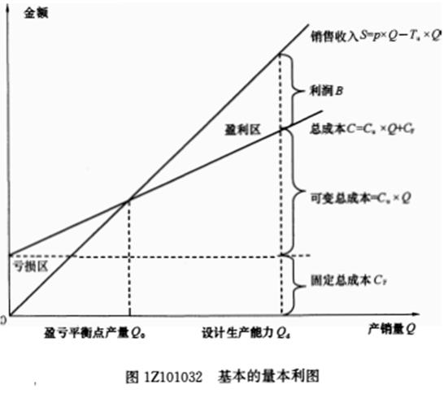

下列条件中，属于线性盈亏平衡分析模型假设条件的有（）。

A.产销量和单位可变成本保持不变
B.生产量等于销售量  (正确)
C.生产多种产品的，可以换算为单一产品计算  (正确)
D.产量超过一定规模时，固定成本线性增加
E.产销量和销售单价不变
解析：
假设条件：生产量等于销售量；产销量变化，单位可变成本不变，总生产成本是产销量的线性函数；产销量变化，销售单价不变，销售收入是产销量的线性函数；只生产单一产品（生产多种产品，可以换算为单一产品计算，且不同产品的生产负荷率的变化应保持一致）

【知识点】量本利模型

【考点】假设条件

【考查方向】原文挖空

【难度】易

【题库维护老师：hejiade】

下列关于量本利图的说法正确的是（ &nbsp; &nbsp; ）。

A.销售收入线与总成本线的交点是盈亏平衡点  (正确)
B.在盈亏平衡点的基础上，满足设计生产能力增加产销量，将出现亏损
C.产品总成本是固定成本和变动成本之和  (正确)
D.盈亏平衡点的位置越高，适应市场变化的能力越强
E.盈亏平衡点的位置越高，项目投产后盈利的可能性越小  (正确)
解析：
B选项，在盈亏平衡点的基础上，满足设计生产能力增加产销量，将出现盈利。D选项，盈亏平衡点的位置越高，适应市场变化的能力越弱。

【知识点】量本利模型

【考点】量本利模型

【考查方向】概念释义

【难度】易

【题库维护老师：hejiade】

技术方案盈亏平衡点（BEP）的表达形式有多种，可以用绝对值表示的有( &nbsp; )。

A.实物产销量  (正确)
B.年销售收入  (正确)
C.单位产品售价  (正确)
D.年固定总成本  (正确)
E.生产能力利用率
解析：
技术方案盈亏平衡点(BEP)的表达形式有多种。可以用绝对值表示，如以实物产销量、单位产品售价、单位产品的可变成本、年固定总成本以及年销售收入等表示的盈亏平衡点；也可以用相对值表示，如以生产能力利用率表示的盈亏平衡点。故选项A、B、C、D正确。

【知识点】量本利模型

【考点】量本利模型

【考查方向】概念释义

【难度】易

【题库维护老师：hejiade】

关于盈亏平衡分析的说法，正确的有( &nbsp;)。

A.通过计算技术方案达产年盈亏平衡点，分析技术方案成本与收入的平衡关系  (正确)
B.用来判断技术方案对不确定性因素导致产销量变化的适应能力和抗风险能力  (正确)
C.可以用绝对值表示，如以实物产销量、单位产品售价等表示的盈亏平衡点  (正确)
D.以产销量和生产能力利用率表示的盈亏平衡点应用最为广泛  (正确)
E.只能用绝对值表示，不可以用相对值表示
解析：
盈亏平衡分析是通过计算技术方案达产年盈亏平衡点（BEP），分析技术方案成本与收入的平衡关系，判断技术方案对不确定性因素导致产销量变化的适应能力和抗风险能力。技术方案盈亏平衡点（BEP）的表达形式有多种。可以用绝对值表示，如以实物产销量、单位产品售价、单位产品的可变成本、年固定总成本以及年销售收入等表示的盈亏平衡点；也可以用相对值表示，如以生产能力利用率表示的盈亏平衡点。其中以产销量和生产能力利用率表示的盈亏平衡点应用最为广泛。故选项A、B、C、D正确。

【知识点】量本利模型

【考点】量本利模型

【考查方向】概念释义

【难度】易

【题库维护老师：hejiade】

某技术方案，年设计生产能力为 8 万台，年固定成本为 100 万元，单位产品售价为 50 元，单位产品变动成本为售价的 55%，单位产品销售税金及附加为售价的 5%，则达到盈亏平衡点时的生产能力利用率为（ ）。

A.55.50%
B.60.00%
C.62.50%  (正确)
D.41.67%
解析：
该题本质仍然考查盈亏平衡点的计算，需要先计算出达到盈亏平衡点的产销量，然后再计算生产能力利用率。  据盈亏平衡公式，得出盈亏平衡产销量=100/50（1-55%-5%）=5 万件，则生产能力利用率为5/8=62.5%。

【知识点】量本利模型

【考点】盈亏平衡点的计算

【考查方向】公式计算

【难度】易

【题库维护老师：hejiade】

盈亏平衡点反映了技术方案对不确定性因素变化导致产销量变化的( &nbsp; &nbsp;)。

A.适应能力和盈利能力
B.生存能力和适应能力
C.生存能力和抗风险能力
D.适应能力和抗风险能力  (正确)
解析：
    盈亏平衡点反映了技术方案对不确定性因素变化导致产销量变化的适应能力和抗风险能力。 

    【知识点】量本利模型

    【考点】盈亏平衡点概念

    【考查方向】概念释义

    【难度】易

    【题库维护老师：hejiade】

某技术方案设计年生产能力为100万件，每件售价90元，固定成本每年800万元，变动成本为50元1件，销售税金及附加费5元1件，按量本利模型计算该技术方案可获得的利润为( &nbsp; &nbsp;)万元。

A.2000
B.2700  (正确)
C.3200
D.3500
解析：
利润=(90-50-5)×100-800=2700万元。

【知识点】量本利模型

【考点】量本利模型

【考查方向】公式计算

【难度】易

【题库维护老师：hejiade】

在基本的量本利图中，销售收入线与总成本线的交点是盈亏平衡点，这个点也称为( &nbsp; )，

A.盈利点
B.临界点
C.亏损点
D.保本点  (正确)
解析：
销售收入线与总成本线的交点是技术方案盈利与亏损的转折点，这个转折点被称为盈亏平衡点（BEP），也叫保本点。

【知识点】量本利模型

【考点】量本利模型

【考查方向】概念释义

【难度】易

【题库维护老师：hejiade】

技术方案盈亏平衡点的表达式有多种，可以用相对值表示盈亏平衡点的是( &nbsp; )：

A.生产能力利用率  (正确)
B.实物产销量
C.单位产品售价
D.年销售收入
解析：
盈亏平衡分析是通过计算技术方案达产年盈亏平衡点(BEP)，分析技术方案成本与收入的平衡关系，判断技术方案对不确定性因素导致产销量变化的适应能力和抗风险能力。技术方案盈亏平衡点（BEP）的表达形式有多种。可以用绝对值表示，如以实物产销量、单位产品售价、单位产品的可变成本、年固定总成本以及年销售收入等表示的盈亏平衡点；也可以用相对值表示，如以生产能力利用率表示的盈亏平衡点。故选项A正确。

【知识点】量本利模型

【考点】量本利模型

【考查方向】概念释义

【难度】易

【题库维护老师：hejiade】

盈亏平衡分析是将项目投产后的产销量作为不确定因素，通过计算企业或项目盈亏平衡点的产销量，分析判断不确定性因素对方案经济效果的影响程度，说明项目（ &nbsp; ）。

A.承担风险的能力  (正确)
B.盈利的能力
C.财务生存的能力
D.偿债的能力
解析：

盈亏平衡分析是通过计算技术方案达产年盈亏平衡点（BEP），分析技术方案成本与收入的平衡关系，判断技术方案对不确定性因素导致产销量变化的适应能力和抗风险能力。

【知识点】量本利模型

【考点】量本利模型

【考查方向】概念释义

【难度】易

【题库维护老师：hejiade】

在基本的量本利图中，当一定时期内，产品价格不变时，销售收入随产销数量增加而增加，呈线性函数关系；当单位产品的变动成本不变时，总成本也呈线性变化。销售收入线与总成本线的交点是（ &nbsp; ）。

A.盈利点
B.临界点
C.亏损点
D.保本点  (正确)
解析：
 

 

图1Z101032中的横坐标为产销量，纵坐标为金额（成本和销售收入）。

从图1Z101032可知，销售收入线与总成本线的交点是技术方案盈利与亏损的转折点，这个转折点被称为盈亏平衡点（BEP），也叫保本点。

【知识点】量本利模型

【考点】量本利模型

【考查方向】概念释义

【难度】易

【题库维护老师：hejiade】

