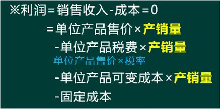
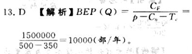
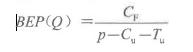
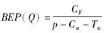
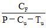

某厂生产产品，拟定售价240元/个，该厂年生产消耗固定成本24万元，单位产品变动成本100元，单位产品税金及附加为售价的5%。在此情况下，该厂生产该产品的年盈亏平衡产量为（ &nbsp;）。

A.1575
B.1875  (正确)
C.2000
D.2425
解析：
设盈亏平衡产量为Q，则列式：240Q-240000-100Q-240×5%·Q=0，求解Q=1875个 【知识点】产销量（工程量）盈亏平衡分析的方法 【考点】产销量（工程量）盈亏平衡分析的方法 【考查方向】计算 【难易程度】易 【题库维护老师】yxf

某厂生产产品，年消耗固定成本24万元，单位产品变动成本100元，假设该厂年产量为4000件，在不考虑产品税金及附加的情况下，为保证盈利，最低售价应控制在（ &nbsp;）以上。

A.160元  (正确)
B.180元
C.200元
D.240元
解析：
设盈亏平衡时售价为x，则4000x-240000-100×4000=0，求解x=160元

【知识点】产销量（工程量）盈亏平衡分析的方法

【考点】产销量（工程量）盈亏平衡分析的方法

【考查方向】计算

【难易程度】易

【题库维护老师】yxf

某技术方案的设计年产量为8万件，单位产品销售价格为100元/件，单位产品可变成本为20元/件，单位产品营业税金及附加为5元/件，按设计生产能力生产时，年利润为200万元，则该技术方案的盈亏平衡点产销量为（ &nbsp;&nbsp;）万件。

A.5.33  (正确)
B.5.00
C.4.21
D.4.00
解析：
销售收入=8万件×100元/件-8万件×5元/件=760万元；

总成本=销售收入-利润=(760-200)万元=560万元，固定成本=560万元-20元／件×8万件=400万元，产销量表示的盈亏平衡点BEP(Q)=400万元/(100-20-5)元/件=5．33万件。

【知识点】产销量(工程量)盈亏平衡分析的方法

【考点】产销量(工程量)盈亏平衡分析的方法

【考察方向】公式计算

【难度】中等

【题库维护老师：ZKQ】

某技术方案年设计生产能力为10万台，年固定成本为1200万元，产品单台销售价格为900元，单台产品可变成本为560元，单台产品营业税金及附加为120元，则当技术方案产销量大于（ &nbsp; &nbsp;）台时，技术方案盈利。

A.54500
B.45454
C.54545  (正确)
D.45400
解析：
本题的计算过程为：12000000÷（900－560－120）＝54545台。

计算结果表明，当技术方案产销量低于54545台时，技术方案亏损；当技术方案产销量大于54545台时，技术方案盈利。

【知识点】产销量(工程量)盈亏平衡分析的方法

【考点】产销量(工程量)盈亏平衡分析的方法

【考查方向】公式计算

【难度】中等

【题库维护老师：hejiade】

某化工建设项目设计年生产能力 5 万台，预计年固定总成本为 800 万元，产品销售价格 1500 元/台，产品销售税金及附加为销售收入的 10%，产品变动成本 1150 元/台，则该项目用生产能力利用率表示的盈亏平衡点是（ ）。

A.100%
B.40%
C.80%  (正确)
D.55%
解析：
先求产量盈亏平衡点 Q，再用产量盈亏平衡点除设计能力得到生产能力利用率。  1500Q-8000000- 1150Q-1500 × 10%Q=0 ，

Q=40000 台， BEP （ % ） =BEP （ Q ） /QD ×100%=40000/50000=80% 。

【知识点】产销量(工程量)盈亏平衡分析的方法

【考点】产销量(工程量)盈亏平衡分析的方法

【考查方向】公式计算

【难度】中等

【题库维护老师：hejiade】

某公司生产单一产品，设计年生产能力为3万件，单位产品的售价为380元/件，单位产品可变成本为120元/件，单位产品税金及附加为70元/件，年固定成本为285万元。该公司盈亏平衡点的产销量为( &nbsp; &nbsp;)。

A.20000
B.19000
C.15000  (正确)
D.7500
解析：
直接采用盈亏平衡点产销量的计算公式，盈亏平衡点产销量的计算和设计生产能力无关。经过计算，BEP(Q)=2850000/(380-120-70)=15000件

【知识点】产销量(工程量)盈亏平衡分析的方法

【考点】产销量(工程量)盈亏平衡分析的方法

【考查方向】公式计算

【难度】易

【题库维护老师：hejiade】

某构件厂设计年产销量为6万件，每件售价为400元，单件产品的变动成本为150元，单件产品营业税及附加为50元，年固定成本为300万元。该厂年利润达到100万元时的年产销量是( &nbsp;)万件。

A.2  (正确)
B.4
C.6
D.8
解析：
根据产销量盈亏平衡分析，该厂年利润达到100万元时的年产销量Q=(B+CF)／（p-Cu-Tu）=(1000000+3000000)／(400-150-50)=20000件。故选项A正确。

【知识点】产销量(工程量)盈亏平衡分析的方法

【考点】产销量(工程量)盈亏平衡分析的方法

【考查方向】公式计算

【难度】易

【题库维护老师：hejiade】

某技术方案年设计生产能力为20万台，产品单台售价为1600元，生产人员基本工资1600万元／年，设备折旧费850万元／年，管理费750万元／年，原材料费16000万元／年，包装费1400万元／年，生产用电费800万元／年，单台产品销售税金及附加为200元。则该技术方案的盈亏平衡点的产销量为(&nbsp; &nbsp; &nbsp; &nbsp; )台。

A.20000
B.46300
C.65306  (正确)
D.80000
解析：
根据成本费用性质划分为固定成本和变动成本，固定成本包括：生产人员基本工资、设备折旧费和管理费，求和等于3200万元；变动成本包括：原材料费、包装费和生产用电费，年变动成本=16000+1400+800=18200万元，换算成单台产品可变成本为910元，运用计算公式算出盈亏平衡点BEP(Q)一CF/（p-Cu-Tu）=3200/(1600-910-200)=65306台。故选项C正确。

【知识点】产销量(工程量)盈亏平衡分析的方法

【考点】产销量(工程量)盈亏平衡分析的方法

【考查方向】公式计算

【难度】易

【题库维护老师：hejiade】

某技术方案年设计生产能力为15万台，年固定成本为1500万元，产品单台销售价格为800元，单台产品可变成本为500元，单台产品销售税金及附加为80元，该技术方案盈亏平衡点的产销量BEP(Q)为()台。

A.58010
B.60000
C.60100
D.68182  (正确)
解析：
根据盈亏平衡点的产销量计算公式，BEP(Q)=CF/（p-Cu-Tu）=15000000/(800-500-80)=68182台。故选项D正确。

【知识点】产销量(工程量)盈亏平衡分析的方法

【考点】产销量(工程量)盈亏平衡分析的方法

【考查方向】公式计算

【难度】易

【题库维护老师：hejiade】

某项目设计年生产能力为15万台，年固定成本为1500万元，单台产品销售价格为1200元，单台产品可变成本为650元，单台产品营业税金及附加为150元。则该项目产销量的盈亏平衡点是（ 　）台。

A.12500
B.18750
C.27272
D.37500  (正确)
解析：
盈亏平衡点计算的本质是收入=支出，设销量的盈亏平衡点为BEP（Q），则有：BEP（Q）×1200=1500万元+BEP（Q）×650+BEP（Q）×150，BEP（Q）×400=1500万元；BEP（Q）=15000000/400=37500台。

【知识点】产销量(工程量)盈亏平衡分析的方法

【考点】产销量(工程量)盈亏平衡分析的方法

【考查方向】公式计算

【难度】易

【题库维护老师：hejiade】

技术方案盈亏平衡分析中，若其他条件不变，则可以提高盈亏平衡点时产销量的途径有( &nbsp; )

A.提高固定成本  (正确)
B.降低设计生产能力
C.降低产品售价  (正确)
D.降低单位产品变动成本
E.提高单位产品营业税金及附加率  (正确)
解析：
以产销量表示的盈亏平衡点的计算公式：BEP(Q)＝CF/(p－Cu－Tu)，式中CF——固定成本；Cu——单位产品变动成本；p——单位产品销售价格；Tu——单位产品营业税金及附加。对上述公式进行分析可知，若其他条件不变，要提高盈亏平衡点时的产销量，可在允许范围内通过提高固定成本；降低单位产品销售价格；提高单位产品变动成本、单位产品营业税金及附加来实现。

【知识点】产销量(工程量)盈亏平衡分析的方法

【考点】产销量(工程量)盈亏平衡分析的方法

【考查方向】概念释义

【难度】中等

【题库维护老师：hejiade】

某厂生产产品，拟定售价240元/个，该厂年生产消耗固定成本24万元，单位产品变动成本100元，每件产品税金及附加共20元。在此情况下，该厂生产该产品的年盈亏平衡产量为（）。

A.1000
B.1200
C.2000  (正确)
D.2400
解析：
 根据题意列式：240Q-20Q-240000-100Q=0，Q=2000，选择C选项。 【知识点】盈亏平衡分析的方法 【考点】盈亏平衡分析的方法 【考查方向】计算 【难易程度】易 【题库维护老师】yxf

某新建项目生产一种通信产品，根据市场预测，估计该产品每部售价为500元，已知单位产品变动成本为350元，年固定成本为150万元，则该项目的盈亏平衡产量为(　　)部／年。

A.4235
B.12000
C.14285
D.10000  (正确)
解析：
    

    【知识点】产销量(工程量)盈亏平衡分析的方法

    【考点】产销量(工程量)盈亏平衡分析的方法

    【考查方向】公式计算

    【难度】易

    【题库维护老师：hejiade】

某技术方案年设计生产能力为10万台，单台产品销售价格（含税）为2000元，单台产品可变成本（含税）为1000元，单台产品税金及附加为150元。若盈亏平衡点年产量为5万台，则该方案的年固定成本为（）万元。

A.5000
B.4250  (正确)
C.5750
D.9250
解析：
    根据题意可知，  

    5=F/（2000-1000-150），F=4250万元。

    【知识点】产销量(工程量)盈亏平衡分析的方法

    【考点】产销量(工程量)盈亏平衡分析的方法

    【考查方向】公式计算

    【难度】易

    【题库维护老师：hejiade】

某项目设计年生产能力为50万件，年固定成本为300万元，单位产品可变成本80元，单位产品营业税金及附加为5元。则以单位产品价格表示的盈亏平衡点是（ ）元。

A.91.00  (正确)
B.86.00
C.95.00
D.85.00
解析：
以产销量表示的盈亏平衡点BEP（Q）的计算公式为：

式中，p为单位产品销售价格；Q为销量；Cu为单位产品变动成本；CF为固定成本；Tu为单位产品营业税金及附加。 则本题中，以单位产品价格表示的盈亏平衡点＝年固定成本÷年生产能力＋单位产品可变成本＋单位产品营业税金及附加＝300÷50＋80＋5＝91（元）。

【知识点】产销量(工程量)盈亏平衡分析的方法

【考点】产销量(工程量)盈亏平衡分析的方法

【考查方向】公式计算

【难度】中等

【题库维护老师：hejiade】

某项目设计年产销量为7万台，每台售价为1200元，单位产品可变成本为450元，单位产品营业税金及附加为250元，年固定成本为560万元，则该项目盈亏平衡点时的产销量为( &nbsp; )万台。

A.0.77
B.1.12  (正确)
C.1.26
D.1.40
解析：
以产销量表示的盈亏平衡点BEP(Q)的计算公式：BEP(Q)＝ 

式中BEP(Q)——盈亏平衡点时的产销量；CF——固定成本；Cu——单位产品变动成本；P——单位产品销售价格；Tu——单位产品营业税金及附加。代入数值计算可得盈亏平衡点时的产销量＝560×104/(1200－450－250)＝11200(台)，即1.12万台。

【知识点】产销量(工程量)盈亏平衡分析的方法

【考点】产销量(工程量)盈亏平衡分析的方法

【考查方向】公式计算

【难度】中等

【题库维护老师：hejiade】

