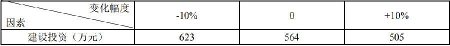

关于敏感度系数的说法，正确的是（）。

A.敏感度系数可以用于对敏感因素敏感性程度的排序  (正确)
B.敏感度系数大于零，表明评价指标与不确定因素反方向变化
C.利用敏感度系数判别敏感因素的方法是绝对测定法
D.敏感度系数的绝对值越大，表明评价指标对于不确定因素越不敏感
解析：
B选项，敏感度系数大于零，表明评价指标与不确定因素同方向变化； C选项，利用敏感度系数判别敏感因素的方法是相对测定法； D选项，敏感度系数的绝对值越大，表明评价指标对于不确定因素越敏感 【知识点】敏感性分析的内容 【考点】敏感性分析的内容

关于技术方案不确定因素临界点的说法，正确的是( &nbsp; &nbsp; )。

A.基准收益率固定，某不确定性因素的临界点百分比缩小，则该方案对该因素就越敏感  (正确)
B.对同一个技术方案，随着基准收益率的提高，临界点也会变高
C.不确定因素临界点的高低，不能作为判定风险的依据
D.临界点是客观存在的，与设定的指标判断标准无关
解析：
    B错误，对同一个技术方案，随着设定基准收益率的提高，临界点就会变低(即临界点表示的不确定因素的极限变化变小)。C错误，把临界点与未来实际可能发生的变化幅度相比较，就可大致分析该技术方案的风险情况。D错误，临界点的高低与设定的指标判断标准有关。

    【知识点】敏感性分析的内容

    【考点】敏感性分析的内容

    【考查方向】概念释义

    【难度】易

    【题库维护老师：hejiade】

关于敏感系数的说法，正确的是（）。

A.敏感度系数可以用于对敏感因素敏感性程度的排序  (正确)
B.敏感度系数大于零，表明评价指标与不确定因素反方向变化
C.利用敏感度系数判别敏感因素的方法是绝对测定法
D.敏感度系数的绝对值越大，表明评价指标对于不确定因素越不敏感
解析：
SAF&gt; 0，表示评价指标与不确定因素同方向变化SAF &lt; 0，表示评价指标与不确定因素反方向变化，故B错； 计算敏感度系数判别敏感因素的方法是一种相对测定法，故C错；|SAF|越大，表明评价指标A对于不确定因素F越敏感；反之，则不敏感。据此可以找出哪些因素是最关键的因素，故D错。

【知识点】 敏感性分析的内容

【考点】单因素敏感性分析的步骤

【考查方向】概念释义

【难度】易

【题库维护老师：hejiade】

某技术方案具有常规现金流量，当基准收益率为 12%时，财务净现值为-67 万元；当基准收益率为 8%时，财务净现值为 242.76 万元；当基准收益率为 6%时，财务净现值为 341.76 万元。则该技术方案的内部收益率最可能的范围为（ ）。

A.小于 6%
B.大于 6%，小于 8%
C.大于 12%
D.大于 8%，小于 12%  (正确)
解析：
财务净现值大于0的基准收益率有2个，8%和6%，因为12%对应的净现值小于0，所以哪个与12%最接近，即为内部收益率的最可能范围。

【知识点】1Z101033 敏感性分析

【考点】敏感性分析的内容

【考查方向】概念释义

【难度】易

【题库维护老师：hejiade】

某技术方案进行单因素敏感性分析的结果是：产品售价下降10%时内部收益率的变化率为55%；原材料价格上涨10%时内部收益率的变化率为39%；建设投资上涨10%时内部收益率的变化率为50%；人工工资上涨10%时内部收益率的变化率为30%。则该技术方案的内部收益率对（ &nbsp; &nbsp; ）最敏感。

A.人工工资
B.产品售价  (正确)
C.原材料价格
D.建设投资
解析：
产品售价55＞建设投资50＞原材料价格39＞人工工资30产品售价因素对内部收益率影响最敏感。

【知识点】敏感性分析的内容

【考点】敏感性分析的内容

【考查方向】概念释义

【难度】易

【题库维护老师：hejiade】

关于敏感性分析的说法，正确的是（ &nbsp; &nbsp;）。

A.敏感性分析有助于搞清技术方案对不确定因素的不利变动所能容许的风险程度  (正确)
B.敏感性分析有助于鉴别何者是敏感因素  (正确)
C.敏感性分析主要依靠分析人员凭借主观经验来分析判断，存在片面性  (正确)
D.敏感性分析在分析某一因素的变动时，能确切说明不确定因素发生变动的可能性是大还是小
E.敏感性分析在一定程度上对不确定因素的变动对技术方案经济效果的影响作了定量的描述  (正确)
解析：
敏感性分析在一定程度上对不确定因素的变动对技术方案经济效果的影响作了定量的描述，有助于搞清技术方案对不确定因素的不利变动所能容许的风险程度，有助于鉴别何者是敏感因素，从而能够及早排除对那些无足轻重的变动因素的注意力，把进一步深入调查研究的重点集中在那些敏感因素上，或者针对敏感因素制定出管理和应变对策，以达到尽量减少风险.增加决策可靠性的目的。但敏感性分析也有其局限性，它主要依靠分析人员凭借主观经验来分析判断，难免存在片面性。在技术方案的计算期内，各不确定性因素相应发生变动幅度的概率不会相同，这意味着技术方案承受风险的大小不同。而敏感性分析在分析某一因素的变动时，并不能说明不确定因素发生变动的可能性是大还是小。

【知识点】敏感性分析的内容

【考点】敏感性分析的内容

【考查方向】概念释义

【难度】易

【题库维护老师：hejiade】

某项目采用净现值指标进行敏感性分析，有关数据见下表，则各因素的敏感程度由大到小的顺序是（ ）。 

A.建设投资—营业收入—经营成本
B.营业收入—经营成本—建设投资
C.营业收入—建设投资—经营成本  (正确)
D.经营成本—营业收入—建设投资
解析：
该题是历年考察敏感因素排序最难的一个题目。如果没有灵活掌握该知识点，找不到答 题技巧，该题会占用考生较多宝贵的考试时间。  首先通过“建设投资敏感度系数”的计算，介绍计算方法：

 通过以上计算可以看出，对于其他两个因素，其敏感度系数的计算，分母都是 10%，分子的计算都是 564 做分母，所以无需真正把敏感度系数求解出来，而只需比较因素变化幅度所对应的两个净现值的差额即可。

【知识点】敏感性分析的内容

【考点】敏感性分析的内容

【考查方向】概念释义

【难度】中等

【题库维护老师：hejiade】

