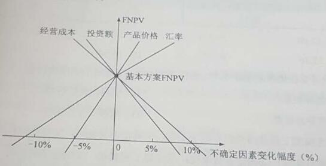
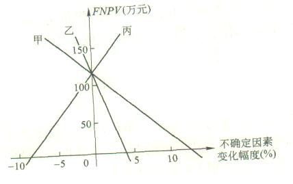
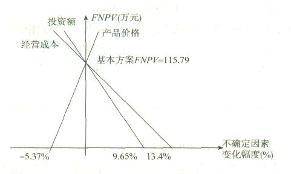
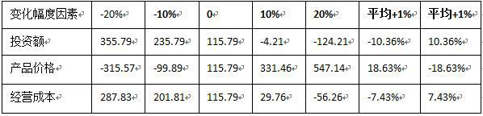
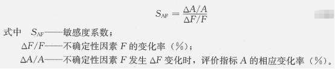
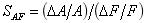
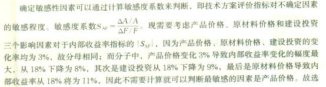
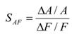
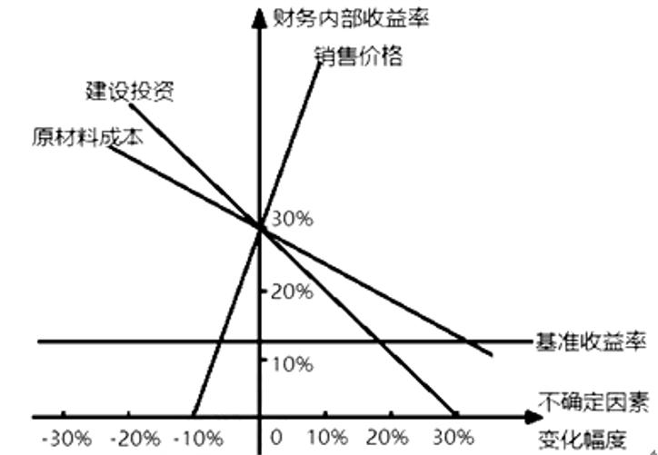
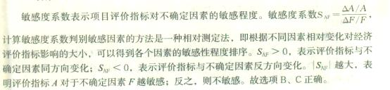

进行单因素敏感性分析，进行敏感度系数计算，甲乙丙丁四个不确定性因素的敏感性系数分别为：2.3、-3、-1.4、1。则各项不确定性因素的敏感性从高到底排列依次为（ &nbsp;）。

A.甲乙丙丁
B.甲丁丙乙
C.乙甲丙丁  (正确)
D.丙乙甲丁
解析：
敏感性系数的绝对值越大，表明评价指标A对于不确定因素F越敏感；反之，则不敏感。据此可以找出哪些因素是最关键的因素。 

【知识点】单因素敏感性分析的步骤

【考点】单因素敏感性分析的步骤

【考查方向】概念释义

【难度】易

【题库维护】yxf

关于敏感性分析，下列选项说法正确的是（）。

A.敏感度系数越大，不确定性因素越敏感
B.临界点越大，不确定性因素越敏感
C.敏感度系数＜0，评价指标随不确定性因素的变化反向变化  (正确)
D.计算敏感度系数，应明确不确定性因素和评价指标的变化值
解析：
A选项错误，敏感度系数的绝对值越大，不确定性因素越敏感； B选项错误，临界点绝对值越小，不确定性因素越敏感； D选项错误，计算敏感度系数，应明确不确定性因素和评价指标的变化率之比 【知识点】单因素敏感性分析的步骤 【考点】单因素敏感性分析的步骤 【考查方向】概念释义 【难度】易 【题库维护】yxf

已知某投资方案财务内部收益率(FIRR)为10%，现选择4个影响因素分别进行单因素敏感性分析，计算结果如下:当产品价格上涨10%时，FIRR=11.0%;当原材料价格上涨10%时，FIRR=9.5%:当建设投资上涨10%时，FIRR=9.0%，当人民币汇率上涨10%时，FIRR=8.8%。根据上述条件判断，最敏感的因素是（ &nbsp;）。

A.建设投资
B.原材料价格
C.人民币汇率  (正确)
D.产品价格
解析：
有些因素发生较小幅度的变化就能引起经济效果评价指标发生大的变动，变化越大表明越敏感。

【知识点】单因素敏感性分析的步骤

【考点】单因素敏感性分析的步骤

【考查方向】概念释义

【难度】易

【题库维护老师：hejiade】

下列关于敏感性分析中临界点的说法，错误的是（）。

A.临界点是指技术方案允许不确定因素向不利方向变化的极限值
B.临界点的高低与设定的指标判断标准无关  (正确)
C.对于同一个技术方案，随着设定基准收益率的提高，临界点就会变低
D.对若干不确定性因素中，临界点越低，说明该因素对技术方案经济效果指标影响越大，技术方案对该因素就越敏感
解析：
临界点的高低与设定的指标判断标准有关。

如财务内部收益率的判断标准为基准收益率，则不确定性因素变化的临界点是财务内部收益率等于基准收益率。对于同一个技术方案，随着设定基准收益率的提高，临界点就会变低（即临界点表示的不确定因素的极限变化变小）。

【知识点】单因素敏感性分析的步骤

【考点】确定敏感性因素

【考查方向】概念释义

【难度】易

【题库维护老师：hejiade】

 

单因素敏感性分析中，如果主要分析产品价格波动对技术方案超额净收益的影响，可选用（ &nbsp; &nbsp;）作为分析指标。

A.静态投资回收期
B.财务净现值  (正确)
C.资本金净利润
D.财务内部收益率
解析：
单因素敏感性分析中，如果主要分析技术方案状态和参数变化对技术方案投资回收快慢的影响，则可选用静态投资回收期作为分析指标；如果主要分析产品价格波动对技术方案超额净收益的影响，则可选用财务净现值作为分析指标；如果主要分析投资大小对技术方案资金回收能力的影响，则可选用财务内部收益率指标等。

【知识点】单因素敏感性分析的步骤

【考点】单因素敏感性分析

【考查方向】概念释义

【难度】易

【题库维护老师：hejiade】

在单因素敏感性分析指标的选择上，如果主要分析产品价格波动对方案超额净收益的影响，可选用( &nbsp; &nbsp;)作为分析指标。

A.投资收益率
B.财务净现值  (正确)
C.财务内部收益率
D.财务净现值率
解析：
在单因素敏感性分析指标的选择上，如果主要分析产品价格波动对方案超额净收益的影响，可选用财务净现值作为分析指标。 &nbsp; 如果主要分析技术方案状态和参数变化对技术方案投资回收快慢的影响，则可选用静态投资回收期作为分析指标。 如果主要分析投资大小对技术方案资金回收能力的影响，则可选用财务内部收益率指标等。

【知识点】单因素敏感性分析的步骤

【考点】单因素敏感性分析的步骤

【考查方向】概念释义

【难度】易

【题库维护老师：hejiade】

项目敏感性分析方法的主要局限是（）。

A.计算工程比盈亏平衡分析复杂
B.不能说明不确定性因素发生变动的可能性大小  (正确)
C.需要主观确定不确定性因素变动的概率
D.不能找出不确定性因素变动的临界点
解析：
敏感性分析主要依靠分析人员凭借主观经验来分析判断，难免存在片面性。在技术方案的计算期内，各不确定性因素相应发生变动幅度的概率不会相同，这意味着技术方案承受风险的大小不同。而敏感性分析在分析某一因素的变动时，并不能说明不确定因素发生变动的可能性是大还是小。对于此类问题，还要借助于概率分析等方法。

【知识点】单因素敏感性分析的步骤

【考点】单因素敏感性分析的步骤

【考查方向】概念释义

【难度】易

【题库维护老师：hejiade】

单因素敏感性分析中，设甲、乙、丙、丁四个因素分别发生 5%，10%，10%，15%的变化，使评价指标相应地分别产生 10%，15%，25%，25%的变化，则最敏感的因素是（ ）。

A.甲
B.乙
C.丙  (正确)
D.丁
解析：
敏感度系数 SAF=评价指标的相应变化率/不确定性因素的变化率。SAF甲=0.1/0.05=2；SAF乙=0.15/0.1=1.5；SAF丙=0.25/0.1=2.5；SAF丁=0.25/0.15=1.67。丙的敏感度系数最大，因此敏感因素为丙。

【知识点】单因素敏感性分析的步骤

【考点】单因素敏感性分析的步骤

【考查方向】概念释义

【难度】易

【题库维护老师：hejiade】

单因素敏感性分析过程包括：①确定敏感因素；②确定分析指标；③选择需要分析的不确定性因素；④分析每个不确定因素的波动程度及其对分析指标可能带来的增减变化情况。正确的排列顺序是（　　）。

A.③②④①
B.①②③④
C.②④③①
D.②③④①  (正确)
解析：
单因素敏感性分析一般按以下步骤进行。

（一）确定分析指标

（二）选择需要分析的不确定性因素

（三）分析每个不确定性因素的波动程度及其对分析指标可能带来的增减变化情况

（四）确定敏感性因素

【知识点】单因素敏感性分析的步骤

【考点】单因素敏感性分析的步骤

【考查方向】概念释义

【难度】易

【题库维护老师：hejiade】

对于单因素敏感性分析的主要步骤正确的是( &nbsp; )。

A.确定分析指标→选择不确定性因素→分析不确定因素波动程度→确定敏感性因素  (正确)
B.确定分析指标→确定敏感性因素→选择不确定性因素→分析不确定因素波动程度
C.选择不确定性因素→分析不确定因素波动程度→确定分析指标→确定敏感性因素
D.选择不确定性因素→确定分析指标→确定敏感性因素→分析不确定因素波动程度
解析：
单因素敏感性分析的步骤：①确定分析指标；②选择需要分析的不确定性因素；③分析每个不确定性因素的波动程度及其对分析指标可能带来的增减变化情况；④确定敏感性因素。

【知识点】单因素敏感性分析的步骤

【考点】单因素敏感性分析的步骤

【考查方向】概念释义

【难度】易

【题库维护老师：hejiade】

关于敏感度系数SAF的说法，正确的是()。

A.SAF越大，表示评价指标A对于不确定因素F越敏感
B.SAF＞0表示评价指标A与不确定因素F同方向变化  (正确)
C.SAF>0表示不确定因素F的变化额与评价指标A的变化额之间的比例
D.SAF可以直接显示不确定因素F变化后评价指标A的值
解析：
|SAF|越大，表明评价指标A对于不确定因素F越敏感；反之，则不敏感。SAF＞0，表示评价指标与不确定因素同方向变化；SAF＜0，表示评价指标与不确定因素反方向变化。<strong>SAF表示不确定性因素F的变化率与不确定性因素F发生变化时，评价指标A的相应变化率。</strong>从公式中可以看出，SAF不可以直接显示不确定因素F变化后评价指标A的值。

【知识点】单因素敏感性分析的步骤

【考点】确定敏感性因素

【考查方向】概念释义

【难度】易

【题库维护老师：hejiade】

敏感性分析指标的确定，如果主要分析产品价格波动对方案超额净收益的影响，则可选用( &nbsp; &nbsp;)作为分析指标。

A.投资回收期
B.财务净现值  (正确)
C.财务内部收益率
D.基准收益率
解析：
如果主要分析技术方案状态和参数变化对技术方案投资回收快慢的，影响，则可选用静态投资回收期作为分析指标；如果主要分析产品价格波动对技术方案超额净收益的影响，则可选用财务净现值作为分析指标；如果主要分析投资大小对技术方案资金回收能力的影响，则可选用财务内部收益率指标。

【知识点】单因素敏感性分析的步骤

【考点】单因素敏感性分析的步骤

【考查方向】概念释义

【难度】易

【题库维护老师：hejiade】

关于敏感性分析的表述中，不正确的是（ &nbsp;）。

A.敏感性分析有助于搞清技术方案对不确定因素的不利变动所能容许的风险程度
B.敏感性分析有助于鉴别何者是敏感因素
C.敏感性分析主要依靠分析人员凭借主观经验来分析判断，难免存在片面性
D.敏感性分析在分析某因素变动时，能确切说明不确定因素发生变动的可能性是大还是小  (正确)
解析：
敏感性分析在一定程度上对不确定因素的变动对技术方案经济效果的影响作了定量的描述，有助于搞清技术方案对不确定因素的不利变动所能容许的风险程度，有助于鉴别何者是敏感因素，从而能够及早排除对那些无足轻重的变动因素的注意力，把进一步深人调查研究的重点集中在那些敏感因素上，或者针对敏感因素制定出管理和应变对策，以达到尽量减少风险、增加决策可靠性的目的。但敏感性分析也有其局限性，它主要依靠分析人员凭借主观经验来分析判断，难免存在片面性。在技术方案的计算期内，各不确定性因素相应发生变动幅度的概率不会相同，这意味着技术方案承受风险的大小不同。而敏感性分析在分析某一因素的变动时，并不能说明不确定因素发生变动的可能性是大还是小。

【知识点】单因素敏感性分析的步骤

【考点】单因素敏感性分析的步骤

【考查方向】概念释义

【难度】易

【题库维护老师：hejiade】

在建设项目敏感性分析中,确定敏感性因素可以通过计算敏感度系数和(&nbsp; &nbsp; &nbsp; )来判断.

A.盈亏平衡点
B.评价指标变动率
C.临界点  (正确)
D.不确定因素变动概率
解析：
确定敏感性因素：敏感性分析的目的在于寻求敏感因素，这可以通过计算敏感度系数和临界点来判断。

【知识点】单因素敏感性分析的步骤

【考点】确定敏感性因素

【考查方向】概念释义

【难度】易

【题库维护老师：hejiade】

关于敏感度系数SAF的说法，正确的是（ &nbsp;）。

A.SAF越大，表示评价指标A对于不确定因素F越敏感
B.SAF >0表示评价指标A与不确定因素F同方向变化  (正确)
C.SAF表示不确定因素F的变化额与评价指标A的变化额之间的比例
D.S AF 可以直接显示不确定因素F变化后评价指标A的值
解析：
SAF绝对值越大，表示评价指标A对于不确定因素F越敏感；SAF表示不确定因素F的变化率与评价指标A的变化率之间的比例；SAF不能显示不确定因素F变化后评价指标A的值

【知识点】单因素敏感性分析的步骤

【考点】敏感度系数

【考查方向】概念释义

【难度】易

【题库维护老师：hejiade】

关于敏感度系数的说法，错误的是( &nbsp; )

A.敏感度系数表示技术方案经济效果评价指标对不确定因素的敏感程度
B.|SAF|越大，表明评价指标A对于不确定因素F越敏感
C.敏感系数提供了各不确定因素变动率与评价指标变动率之间的比例，但不能直接显示变化后评价指标的值
D.SAF＜0，表示评价指标与不确定因素同方向变化  (正确)
解析：
敏感度系数SAF表示技术方案经济效果评价指标对不确定因素的敏感程度。SAF＞0，表示评价指标与不确定因素同方向变化；SAF＜0，表示评价指标与不确定因素反方向变化。|SAF|越大，表明评价指标A对于不确定因素F越敏感；反之，则不敏感。敏感系数提供了各不确定因素变动率与评价指标变动率之间的比例，但不能直接显示变化后评价指标的值。为了弥补这种不足，有时需要编制敏感性分析表，列示各因素变动率及相应的评价指标值。

【知识点】单因素敏感性分析的步骤

【考点】确定敏感性因素

【考查方向】概念释义

【难度】易

【题库维护老师：hejiade】

在进行单因素敏感性分析时，如果主要分析投资大小对方案资金回收能力的影响，一般选用( &nbsp; )为分析指标。

A.财务内部收益率  (正确)
B.静态投资回收期
C.财务净现值
D.总投资收益率
解析：
在进行单因素敏感性分析时，如果主要分析技术方案状态和参数变化对技术方案投资回收快慢的影响，则可选用静态投资回收期作为分析指标；如果主要分析产品价格波动对技术方案超额净收益的影响，则可选用财务净现值作为分析指标；如果主要分析投资大小对技术方案资金回收能力的影响，则可选用财务内部收益率指标等。

【知识点】单因素敏感性分析的步骤

【考点】单因素敏感性分析的步骤

【考查方向】概念释义

【难度】易

【题库维护老师：hejiade】

进行敏感性分析的目的是对不同的技术方案进行选择，一般选择的技术方案应符合( &nbsp; )。

A.敏感程度大、承受风险能力强、可靠性大
B.敏感程度小、承受风险能力强、可靠性大  (正确)
C.敏感程度大、承受风险能力弱、可靠性大
D.敏感程度小、承受风险能力弱、可靠性大
解析：
如果进行敏感性分析的目的是对不同的技术方案进行选择，一般应选择敏感程度小、承受风险能力强、可靠性大的技术方案。

【知识点】单因素敏感性分析的步骤

【考点】选择方案

【考查方向】概念释义

【难度】易

【题库维护老师：hejiade】

进行单因素敏感性分析，如果主要分析技术方案状态和参数变化对技术方案投资回收快慢的影响，则可选用的分析指标是()。

A.财务净现值
B.静态投资回收期  (正确)
C.投资收益率
D.财务内部收益率
解析：
如果主要分析技术方案状态和参数变化对技术方案投资回收快慢的影响，则可选用静态投资回收期作为分析指标。

【知识点】单因素敏感性分析的步骤

【考点】单因素敏感性分析的步骤

【考查方向】概念释义

【难度】易

【题库维护老师：hejiade】

分析指标的确定与进行分析的目标和任务有关，一般是根据技术方案的特点、实际需求情况和指标的重要程度来选择。如果主要分析方案状态和参数变化对方案投资回收快慢的影响，则可选用( &nbsp; &nbsp;)作为分析指标。

A.投资回收期  (正确)
B.财务净现值
C.财务内部收益率
D.基准收益率
解析：
如果主要分析技术方案状态和参数变化对技术方案投资回收快慢的影响，则可选用静态投资回收期作为分析指标；如果主要分析产品价格波动对技术方案超额净收益的影响，则可选用财务净现值作为分析指标；如果主要分析投资大小对技术方案资金回收能力的影响，则可选用财务内部收益率指标等。

【知识点】单因素敏感性分析的步骤

【考点】单因素敏感性分析的步骤

【考查方向】概念释义

【难度】易

【题库维护老师：hejiade】

某技术方案经济评价指标对甲、乙、丙三个不确定因素的敏感度系数分别为-0.1、0.05、0.09，据此可以得出的结论有（ &nbsp; ）。

A.经济评价指标对甲因素最敏感  (正确)
B.甲因素下降10%，方案达到盈亏平衡
C.经济评价指标与丙因素反向变化
D.经济评价指标对乙因素最不敏感  (正确)
E.丙因素上升 9%，方案由可行转为不可行
解析：
敏感度系数的绝对值越小越不敏感;SAF&gt;0，表示评价指标与不确定因素同方向变化。敏感度系数与盈亏平衡无关。

【知识点】单因素敏感性分析的步骤

【考点】单因素敏感性分析的步骤

【考查方向】概念释义

【难度】易

【题库维护老师：hejiade】

关于敏感性分析，下列说法正确的有( &nbsp; &nbsp;)。

A.敏感度系数是指评价指标变化率与不确定因素变化率之比  (正确)
B.敏感度系数绝对值越大，技术方案抗风险的能力越强
C.敏感度系数绝对值越大，技术方案抗风险的能力越弱  (正确)
D.单因素敏感性分析图中，斜率越大的因素越敏感  (正确)
E.敏感性分析仅适用于财务评价
解析：
敏感度系数表示技术方案经济效果评价指标对不确定因素的敏感程度。|SAF|越大，表明评价指标A对于不确定因素F越敏感；反之，则不敏感。每一条直线的斜率反映技术方案经济效果评价指标对该不确定因素的敏感程度，斜率越大敏感度越高。盈亏平衡分析只适用于项目的财务评价，而敏感性分析则可同时用于财务评价和国民经济评价。

【知识点】单因素敏感性分析的步骤

【考点】)确定敏感性因素

【考查方向】概念释义

【难度】易

【题库维护老师：hejiade】

对某技术方案的财务净现值(FNPV)进行单因素敏感性分析，投资额、产品价格、经营成本以及汇率四个因素的敏感性分析如下图所示，则对财务净现值指标来说最敏感的因素是(　)。

A.投资额
B.产品价格  (正确)
C.经营成本
D.汇率
解析：
斜率最大最陡的最敏感。 每一条直线的斜率反映技术方案经济效果评价指标对该不确定因素的敏感程度，斜率越大敏感度越高。

【知识点】单因素敏感性分析的步骤

【考点】单因素敏感性分析的步骤

【考查方向】概念释义

【难度】易

【题库维护老师：hejiade】

现对某技术方案进行单因素敏感性分析，选择财务净现值作为分析对象&#39;如下图所示，甲、乙、丙三个不确定因素按敏感性由大到小的顺序排列为()。

A.甲一乙一丙
B.乙一甲一丙
C.甲一丙一乙
D.乙—丙一甲  (正确)
解析：
每一条直线的斜率反映技术方案经济效果评价指标对该不确定因素的敏感程度，斜率越大敏感度越高。

【知识点】单因素敏感性分析的步骤

【考点】确定敏感性因素

【考查方向】概念释义

【难度】易

【题库维护老师：hejiade】

根据下面的单因素敏感性分析图，投资额、产品价格、经营成本三个不确定性因素对方案的影响程度由高到低依次为()。

A.产品价格→投资额→经营成本  (正确)
B.投资额→产品价格→经营成本
C.投资额→经营成本→产品价格
D.经营成本→投资额→产品价格
解析：
根据所给敏感性分析图可知，投资额、产品价格、经营成本三个不确定性因素的临界点分别为9.65%、-5.37%、13.4%。临界点（绝对值）越低，说明该因素对方案评价指标影响越大，方案对该因素的变化就越敏感。故选项A正确。

【知识点】单因素敏感性分析的步骤

【考点】单因素敏感性分析的步骤

【考查方向】概念释义

【难度】易

【题库维护老师：hejiade】

某投资方案财务净现值为115.79万元，方案经济效果可行。现对该项目进行单因素敏感性分析，选取投资额、产品价格和经营成本三个不确定因素，令其在初始值的基础上按±10%、±20%的变化幅度变动，分别计算相应的财务净现值如下表。该项目对三个因素的敏感程度由高到低依次为( &nbsp; )。

A.投资额一产品价格一经营成本
B.产品价格一投资额一经营成本  (正确)
C.投资额一经营成本一产品价格
D.产品价格一经营成本一投资额
解析：
敏感度系数表示技术方案经济效果评价指标对不确定因素的敏感程度。敏感度系数的绝对值越大，则说明此敏感因素、越敏感。因此敏感程度依次为：产品价格→投资额→经营成本

【知识点】单因素敏感性分析的步骤

【考点】确定敏感性因素

【考查方向】概念释义

【难度】易

【题库维护老师：hejiade】

某单因素敏感性分析示意图如下。下列选项中说法错误的是（ &nbsp;）。 

A.投资额因素最敏感  (正确)
B.经营成本因素最不敏感
C.产品价格因素比经营成本因素敏感
D.经营成本因素不如投资额因素敏感
解析：
每一条直线的斜率反映技术方案经济效果评价指标对该不确定因素的敏感程度，斜率绝对值越大越敏感。

【知识点】单因素敏感性分析的步骤

【考点】敏感性分析的内容

【考查方向】概念释义

【难度】中等

【题库维护老师：hejiade】

进行单因素敏感性分析，进行敏感度系数计算，发现某不确定性因素发生增减变化10%时，评价指标随之反向增减变化5%。则该不确定性因素的敏感度系数为（ &nbsp;）。

A.0.5
B.-0.5  (正确)
C.2
D.-2
解析：
敏感度系数&gt;0，表示评价指标与不确定因素同方向变化；敏感度系数&lt;0，表示评价指标与不确定因素反方向变化。  

【知识点】单因素敏感性分析的步骤

【考点】单因素敏感性分析的步骤

【考查方向】概念释义

【难度】易

【题库维护】yxf

某技术方案财务内部收益率为14%，原料价格上涨20%时，技术方案财务内部收益率降为10%。若基准收益率为10%，则该原料价格的敏感度系数和临界点分别为（）。

A.-1.43，20%  (正确)
B.1.43，-20%
C.2，-20%
D.-2，20%
解析：
本题考核的是敏感度系数和临界点的计算。

敏感度系数的计算公式为：，式中，表示评价指标A对于不确定性因素F的敏感度系数，表示不确定性因素F的变化率(%);表示不确定性因素F发生变化时，评价指标A的相应变化率（%）。则项目原料价格的敏感度系数＝(10%-14%)/14%/20% =-1.43；不确定因素变化的临界点是财务内部收益率等于基准收益率，临界点即原料价格上涨20%

【知识点】单因素敏感性分析的步骤

【考点】敏感度系数和临界点的计算

【考查方向】公式计算

【难度】难

【题库维护老师：hejiade】

现对某技术方案进行评价，确定性评价得到技术方案的内部收益率为18%，选择3个影响因素对其进行敏感性分析，当产品价格下降3%、原材料上涨3%、建设投资上涨3%时，内部收益率分别降至8%、11%、9%。据此推断，该技术方案的内部收益率最敏感性因素是( &nbsp; )。

A.建设投资
B.原材料价格
C.产品价格  (正确)
D.内部收益率
解析：

【知识点】单因素敏感性分析的步骤

【考点】确定敏感性因素

【考查方向】概念释义

【难度】易

【题库维护老师：hejiade】

对某技术方案进行单因素敏感性分析中，设甲、乙、丙、丁四个因素分别发生5%、10%、10%、15%的变化，使评价指标财务净现值分别产生10%、10%、25%、25%的变化，相比而言，最敏感的因素是（ &nbsp; ）。

A.甲
B.乙
C.丙  (正确)
D.丁
解析：

SAF——评价指标A对于不确定性因素F的敏感度系数；

&nbsp;△F/F——不确定性因素F的变化率（％）；

&nbsp;△A/A——不确定性因素F发生△F变化时，评价指标A的相应变化率（％）

【知识点】单因素敏感性分析的步骤

【考点】确定敏感性因素

【考查方向】概念释义

【难度】易

【题库维护老师：hejiade】

敏感度系数可以表达为( &nbsp; &nbsp;)。

A.不确定因素的变化／评价指标的变化
B.不确定因素的变化率／评价指标的变化率
C.不确定因素的变化率／评价指标的变化
D.评价指标的变化率／不确定因素的变化率  (正确)
解析：
 

=指标变化率/因素变化率。

【知识点】单因素敏感性分析的步骤

【考点】确定敏感性因素

【考查方向】概念释义

【难度】易

【题库维护老师：hejiade】

某方案单因素敏感性分析示意图如下。根据该图，可以得出的结论有( &nbsp; )。 

A.销售价格的临界点小于10%  (正确)
B.原材料成本比建设投资更敏感
C.建设投资的临界点大于10%  (正确)
D.销售价格是最敏感的因素  (正确)
E.建设投资比销售价格更敏感
解析：
本题考查的是敏感性分析的内容。 如下图：  

【知识点】单因素敏感性分析的步骤

【考点】敏感性分析的内容

【考查方向】概念释义

【难度】中等

【题库维护老师：hejiade】

敏感度系数提供了各个不确定因素变动率与评价指标变动率之间的比例，下列关于敏感度系数的说法，正确的有( &nbsp; )。

A.敏感度系数的绝对值越小，表明评价指标对于不确定性因素越敏感
B.敏感度系数的绝对值越大，表明评价指标对于不确定性因素越敏感  (正确)
C.敏感度系数大于零，评价指标与不确定性因素同方向变化  (正确)
D.敏感度系数小于零，评价指标与不确定性因素同方向变化
E.敏感度系数越大，表明评价指标对于不确定性因素越敏感
解析：

【知识点】单因素敏感性分析的步骤

【考点】单因素敏感性分析的步骤

【考查方向】概念释义

【难度】易

【题库维护老师：hejiade】

