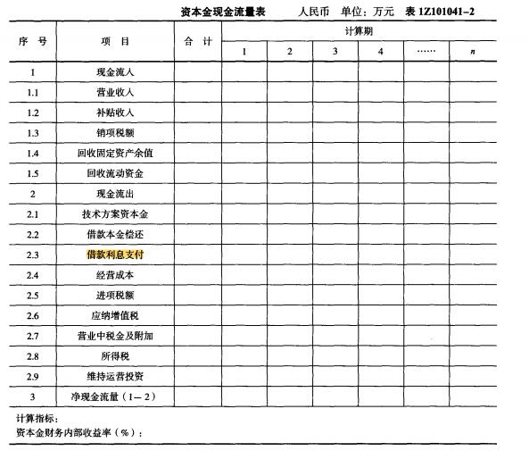

某项目建设投资为5000万元，其中自有资金4000万元，借款1000万元，借款年利率为5%。流动资金1000万元全部为借款，借款年利率为4%。建设期计息不付息。编制资本金现金流量表时，建设期现金流出的金额是（ &nbsp;）万元。

A.2000
B.4090
C.4000  (正确)
D.6000
解析：
资本金现金流量表中属于现金流出项目：技术方案资本金、借款本金偿还、借款利息支付、经营成本、进项税额、应纳增值税、营业税金及附加、所得税及维持运营投资等。因建设期内只计息不付息，故建设期现金流出的金额为自有资金4000万元，故选择C选项。

【知识点】资本金现金流量表

【考点】资本金现金流量表

【考查方向】概念释义

【难度】易

【题库维护老师：hejiade】

资本金现金流量表是以技术方案资本金作为计算的基础，站在（ &nbsp; &nbsp;）的角度编制的。

A.项目发起人
B.债务人
C.项目法人  (正确)
D.债权人
解析：
资本金现金流量表是从技术方案权益投资者整体（即项目法人）角度岀发，以技术方案资本金作为计算的基础，把借款本金偿还和利息支付作为现金流出，用以计算资本金财务内部收益率，反映在一定融资方案下投资者权益投资的获利能力，用以比选融资方案，为投资者投资决策.融资决策提供依据。

【知识点】资本金现金流量表

【考点】资本金现金流量表

【考查方向】概念释义

【难度】易

【题库维护老师：hejiade】

在资本金现金流量表中，列出现金流出项目的是()。*

A.政府补贴
B.借款本金偿还  (正确)
C.回收固定资产余值
D.增值税销项税额
解析：
资本金现金流量表是从技术方案权益投资者整体（即项目法人）角度出发，以技术方案资本金作为计算的基础，把借款本金偿还和利息支付作为现金流出，用以计算资本金财务内部收益率，反映在一定融资方案下投资者权益投资的获利能力，用以比选融资方案，为投资者投资决策、融资决策提供依据。

【知识点】资本金现金流量表

【考点】资本金现金流量表

【考查方向】概念释义

【难度】易

【题库维护老师：hejiade】

属于项目资本现金流量表中现金流出构成的是( &nbsp;)。

A.建设投资
B.借款本金偿还  (正确)
C.流动资金
D.调整所得税
解析：
资本金现金流量表是从技术方案权益投资者整体（即项目法人）角度出发，以技术方案资本金作为计算的基础，把借款本金偿还和利息支付作为现金流出，用以计算资本金财务内部收益率，反映在一定融资方案下投资者权益投资的获利能力，用以比选融资方案，为投资者投资决策、融资决策提供依据。

【知识点】资本金现金流量表

【考点】资本金现金流量表

【考查方向】概念释义

【难度】易

【题库维护老师：hejiade】

在资本金现金流量表中，列入现金流出项目的是（　）。（2016）

A.政府补贴
B.借款本金偿还  (正确)
C.回收固定资产余值
D.增值税销项税额
解析：
资本金现金流量表是从技术方案权益投资者整体（即项目法人）角度出发，以技术方案资本金作为计算的基础，把借款本金偿还和利息支付作为现金流出，用以计算资本金财务内部收益率，反映在一定融资方案下投资者权益投资的获利能力，用以比选融资方案，为投资者投资决策、融资决策提供依据。

【知识点】资本金现金流量表

【考点】资本金现金流量表

【考查方向】概念释义

【难度】易

【题库维护老师：hejiade】

某技术方案总投资220万元，业主资本金投入60万元，计算期为20年，建设期为2年。技术方案投资支出在2013年为130万元（其中资本金投入20万元），2014年为90万元（其中资本金投入40万元），银行贷款在2013年末累计余额110万元，2014年发生新增银行贷款50万元，以项目业主为考察对象，其2014年的净现金流量是( &nbsp; )万元。

A.-200
B.-40  (正确)
C.120
D.140
解析：
资本金现金流量表是以技术方案业主所投资本金作为计算基础，考察资本金的获利能力的一种现金流量分析表。本题求资本金财务现金流量表中第二年的净现金流量，该表中建设期内无现金流入，而现金流出只考虑第二年业主资本金支出40万元，故选项B正确。

【知识点】资本金现金流量表

【考点】资本金现金流量表

【考查方向】概念释义

【难度】易

【题库维护老师：hejiade】

资本金现金流量表中，现金流出不包括()。

A.流动资金  (正确)
B.借款本金偿还
C.技术方案资本金
D.借款利息支付
解析：
流动资金属于现金流入。 

【知识点】资本金现金流量表

【考点】资本金现金流量表

【考查方向】概念释义

【难度】易

【题库维护老师：hejiade】

技术方案资本金现金流量表中，不属于现金流出的是()。

A.借款本金偿还
B.销项税额  (正确)
C.应纳增值税
D.进项税额
解析：
销项税额属于现金流入

【知识点】资本金现金流量表

【考点】资本金现金流量表

【考查方向】概念释义

【难度】易

【题库维护老师：hejiade】

技术方案资本金现金流量表的计算基础是( &nbsp; &nbsp;)。

A.工程资本金
B.技术方案资本金  (正确)
C.工程投资额
D.技术方案投资额
解析：
资本金现金流量表是从技术方案权益投资者整体（即项目法人）角度出发，以技术方案资本金作为计算的基础，把借款本金偿还和利息支付作为现金流出，用以计算资本金财务内部收益率，反映在一定融资方案下投资者权益投资的获利能力，用以比选融资方案，为投资者投资决策、融资决策提供依据。

【知识点】资本金现金流量表

【考点】资本金现金流量表

【考查方向】概念释义

【难度】易

【题库维护老师：hejiade】

资本金现金流量表可为决策提供依据，这里的决策主要包括()。

A.比选融资方案  (正确)
B.投资者投资决策  (正确)
C.投资各方利益分配
D.融资决策  (正确)
E.调整所得税
解析：
资本金现金流量表是从技术方案权益投资者整体（即项目法人）角度出发，以技术方案资本金作为计算的基础，把借款本金偿还和利息支付作为现金流出，用以计算资本金财务内部收益率，反映在一定融资方案下投资者权益投资的获利能力，用以比选融资方案，为投资者投资决策、融资决策提供依据。

【知识点】资本金现金流量表

【考点】资本金现金流量表

【考查方向】概念释义

【难度】易

【题库维护老师：hejiade】

资本金现金流量表用以计算资本金财务内部收益率，反映在一定融资方案下投资者权益投资的获利能力，资本金现金流量表可为下列决策提供依据，主要包括( &nbsp; )。

A.比选融资方案  (正确)
B.投资者投资决策  (正确)
C.投资各方利益分配
D.融资决策  (正确)
E.调整所得税
解析：
资本金现金流量表是从技术方案权益投资者整体（即项目法人）角度出发，以技术方案资本金作为计算的基础，把借款本金偿还和利息支付作为现金流出，用以计算资本金财务内部收益率，反映在一定融资方案下投资者权益投资的获利能力，用以比选融资方案，为投资者投资决策、融资决策提供依据。融资后分析用于比选融资方案，帮助投资者做出融资决策。

【知识点】资本金现金流量表

【考点】资本金现金流量表

【考查方向】概念释义

【难度】易

【题库维护老师：hejiade】

资本金现金流量表中，作为现金流出的项目有（ &nbsp;）

A.借款本金偿还  (正确)
B.回收固定资产余值
C.回收流动资金
D.借款利息支付  (正确)
E.经营成本  (正确)
解析：

【知识点】资本金现金流量表

【考点】资本金现金流量表

【考查方向】概念释义

【难度】易

【题库维护老师：hejiade】

