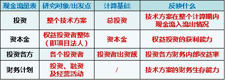
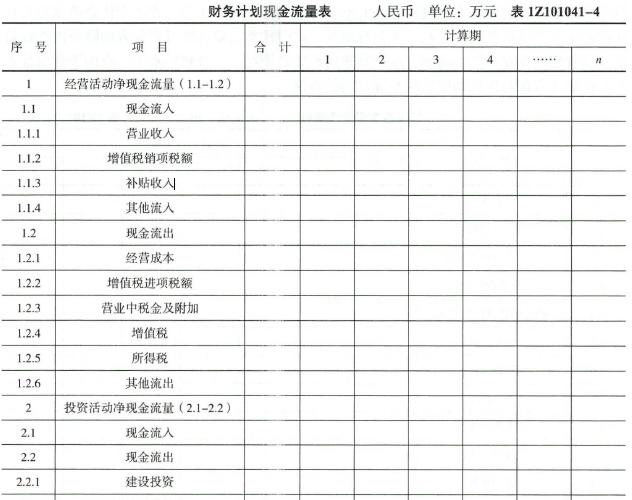

下列财务计划现金流量表的构成项中，属于投资活动净现金流量的有（ &nbsp;）。

A.建设投资借款
B.建设投资  (正确)
C.维持运营投资  (正确)
D.偿还债务本金
E.流动资金  (正确)
解析：
对于财务计划现金流量表中属于投资活动净现金流量的有：建设投资、维持运营投资、流动资金和其他流出。

【知识点】财务计划现金流量表

【考点】财务计划现金流量表

【考查方向】概念释义

【难度】易

【题库维护老师：hejiade】

可反映技术方案计算期各年的投资、融资及经营活动的现金流入和流出，用于计算累计盈余资金，并可分析技术方案的财务生存能力的是（ ）。

A.投资现金流量表
B.资本金现金流量表
C.投资各方现金流量表
D.财务计划现金流量表  (正确)
解析：
财务计划现金流量表反映技术方案计算期各年的投资、融资及经营活动的现金流入和流出，用于计算累计盈余资金，分析技术方案的财务生存能力。

【知识点】财务计划现金流量表

【考点】财务计划现金流量表

【考查方向】概念释义

【难度】易

【题库维护老师：hejiade】

反映技术方案计算期各年的投资、融资及经营活动所产生的现金流入和流出，用于计算净现金流量和累计盈余资金，考察资金平衡和余缺情况，分析技术方案的财务生存能力的技术方案现金流量表是( &nbsp; )。

A.投资现金流量表
B.投资各方现金流量表
C.资本金现金流量表
D.财务计划现金流量表  (正确)
解析：
财务计划现金流量表反映技术方案计算期各年的投资、融资及经营活动的现金流入和流出，用于计算净现金流量和累计盈余资金，考察资金平和和余缺情况，分析技术方案的财务生存能力。

【知识点】财务计划现金流量表

【考点】财务计划现金流量表

【考查方向】概念释义

【难度】易

【题库维护老师：hejiade】

分析项目的财务生存能力，可以通过（ &nbsp; ）进行。

A.项目投资现金流量表
B.投资各方现金流量表
C.项目资本金现金流量表
D.财务计划现金流量表  (正确)
解析：
财务计划现金流量表反映技术方案计算期各年的投资、融资及经营活动的现金流入和流出，用于计算净现金流量和累计盈余资金，考察资金平和和余缺情况，分析技术方案的财务生存能力，即分析技术方案是否能为企业创造足够的净现金流量维持正常运营，进而考察实现财务可持续性的能力。

【知识点】财务计划现金流量表

【考点】财务计划现金流量表

【考查方向】概念释义

【难度】易

【题库维护老师：hejiade】

可据以计算累计盈余资金，分析技术方案财务生存能力的现金流量表是（　　）

A.投资各方现金流量表
B.资本金现金流量表
C.投资现金流量表
D.财务计划现金流量表  (正确)
解析：
财务计划现金流量表反映技术方案计算期各年的投资、融资及经营活动的现金流入和流出，用于计算累计盈余资金，分析技术方案的财务生存能力。   

【知识点】财务计划现金流量表

【考点】财务计划现金流量表

【考查方向】概念释义

【难度】易

【题库维护老师：hejiade】

在工程经济分析中，下列( &nbsp; &nbsp;)不属于技术方案财务计划现金流量表的构成要素。

A.营业收入
B.折旧费  (正确)
C.建设投资
D.补帖收入
解析：
    营业收入、建设投资和补贴收入均是财务计划现金流量表的构成要素。  

    【知识点】财务计划现金流量表

    【考点】财务计划现金流量表的构成要素

    【考查方向】概念释义

    【难度】易

    【题库维护老师：hejiade】

某垃圾处理项目得到政府 300 万元的财政补贴，则这 300 万元应计入财务计划现金流量表中的（ &nbsp;）。 &nbsp;（2013）

A.经营活动净现金流量  (正确)
B.投资活动净现金流量
C.筹资活动净现金流量
D.营业收入
解析：
政府补贴属于经营活动净现金流量。 

【知识点】财务计划现金流量表

【考点】财务计划现金流量表

【考查方向】概念释义

【难度】易

【题库维护老师：hejiade】

