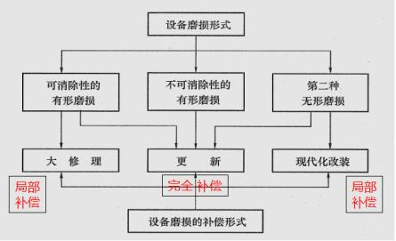
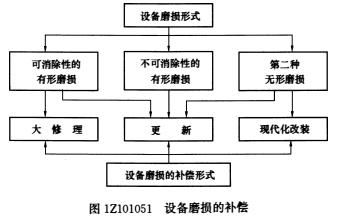

关于设备磨损补偿方式的说法，正确的是（ &nbsp;）。

A.设备的无形磨损可以通过修理进行补偿
B.设备的综合磨损只能通过更新进行补偿
C.可消除的有形磨损只能通过现代化改装进行补偿
D.不可消除的有形磨损可以通过更新进行补偿  (正确)
解析：
选项D正确，不可消除的有形磨损只可以通过更新进行补偿。

选项A，设备无形磨损的局部补偿是现代化改装。

选项B，设备的综合磨损要以确定恰当的补偿方式进行补偿，

选项C，设备有形磨损的局部补偿是修理。

【知识点】设备磨损的补偿方式

【考点】设备磨损的补偿方式

【考查方向】概念释义

【难度】易

【题库维护老师：hejiade】

对设备第二种无形磨损进行补偿的方式有（ ）。

A.日常保养
B.大修理
C.更新  (正确)
D.经常性修理
解析：
鉴于设备磨损形式与补偿方式的对应关系，现代化改装适合于设备（第二种形式）无形磨损的局部补偿，更新适合于设备有形、无形磨损的完全补偿。

【知识点】设备磨损的补偿方式

【考点】设备磨损的补偿方式

【考查方向】概念释义

【难度】易

【题库维护老师：hejiade】

对于设备不可消除性的有形磨损，采用的补偿方式是(　　)。

A.保养
B.更新  (正确)
C.大修理
D.现代化改装
解析：
对于设备不可消除性的有形磨损，采用的补偿方式是更新。

【知识点】设备磨损的补偿方式

【考点】设备磨损的补偿方式

【考查方向】概念释义

【难度】易

【题库维护老师：hejiade】

企业所使用的设备在使用一段时间后会发生运行故障，经修理后又可继续使用，这种修理属于（ &nbsp; &nbsp;）。

A.有形磨损的局部补偿  (正确)
B.有形磨损的完全补偿
C.无形磨损的局部补偿
D.无形磨损的完全补偿
解析：
设备有形磨损的局部补偿是修理，设备无形磨损的局部补偿是现代化改装。设备有形磨损和无形磨损的完全补偿是更新。

【知识点】设备磨损的补偿方式

【考点】设备磨损的补偿方式

【考查方向】概念释义

【难度】易

【题库维护老师：hejiade】

家庭的半自动洗衣机，经过多次维修也无法使用，准备购买全自动的新洗衣机，这一措施属于对( &nbsp; &nbsp;)。

A.有形磨损的局部补偿
B.有形磨损的完全补偿  (正确)
C.无形磨损的局部补偿
D.无形磨损的完全补偿
解析：
无法使用换新的是有形磨损的完全补偿。

【知识点】设备磨损的补偿方式

【考点】设备磨损的补偿方式

【考查方向】概念释义

【难度】易

【题库维护老师：hejiade】

无形磨损的局部补偿形式是 (&nbsp; &nbsp; &nbsp; &nbsp; &nbsp; )。

A.保养
B.修理
C.更新
D.现代化改装  (正确)
解析：
设备有形磨损的局部补偿是修理，设备无形磨损的局部补偿是现代化改装。设备有形磨损和无形磨损的完全补偿是更新。

【知识点】设备磨损的补偿方式

【考点】设备磨损的补偿方式

【考查方向】概念释义

【难度】易

【题库维护老师：hejiade

对第二种无形磨损的局部补偿可采用现代化改装，其主要目的是（ &nbsp; ）。

A.恢复设备生产功能和效率
B.增加设备生产功能和效率  (正确)
C.保持设备生产功能和效率
D.补偿设备使用价值
解析：
设备发生磨损后，需要进行补偿，以恢复设备的生产能力。由于设备遭受磨损的形式不同，补偿磨损的方式也不一样。补偿分局部补偿和完全补偿。设备有形磨损的局部补偿是修理，设备无形磨损的局部补偿是现代化改装。设备有形磨损和无形磨损的完全补偿是更新。设备大修理是更换部分已磨损的零部件和调整设备，以恢复设备的生产功能和效率为主；设备现代化改造是对设备的结构作局部的改进和技术上的革新，如增添新的、必需的零部件，以增加设备的生产功能和效率为主；更新是对整个设备进行更换。

【知识点】设备磨损的补偿方式

【考点】设备磨损的补偿方式

【考查方向】概念释义

【难度】易

【题库维护老师：hejiade】

关于设备磨损补偿方案的说法，错误的是( &nbsp; )。

A.对于陈旧落后的设备，应当用较先进的设备尽早替代
B.对整机性能尚可，个别技术经济指标落后的设备，应加以改造和现代化改装
C.最好的方案是有形磨损期与无形磨损期相互接近
D.最不可取是当设备需要进行大修理时，恰好到了更换的时刻  (正确)
解析：
在设备磨损补偿工作中，最好的方案是有形磨损期与无形磨损期相互接近，这是一种理想的“无维修设计”（也就是说，当设备需要进行大修理时，恰好到了更换的时刻）。但是大多数的设备，通常通过修理可以使有形磨损期达到20〜30年甚至更长，但无形磨损期却比较短。在这种情况下，就存在如何对待已经无形磨损但物质上还可使用的设备的问题。此外还应看到，第二种无形磨损虽使设备贬值，但它是社会生产力发展的反映，这种磨损愈大，表示社会技术进步愈快。因此应该充分重视对设备磨损规律性的研究，加速技术进步的步伐。 

【知识点】设备磨损的补偿方式

【考点】设备磨损的补偿方式

【考查方向】概念释义

【难度】易

【题库维护老师：hejiade】

设备磨损的补偿方式是( &nbsp; )。

A.经常性修理
B.更新  (正确)
C.现代化改装  (正确)
D.大修理  (正确)
E.日常保养
解析：
设备磨损的局部补偿方式是大修理和现代化改装，完全补偿方式是更新。

【知识点】设备磨损的补偿方式

【考点】设备磨损的补偿方式

【考查方向】概念释义

【难度】易

【题库维护老师：hejiade】

设备磨损的局部补偿方式是( &nbsp; &nbsp;)。

A.经常性修理
B.更新
C.现代化改装  (正确)
D.大修理  (正确)
E.日常保养
解析：
设备有形磨损的局部补偿是修理，设备无形磨损的局部补偿是现代化改装。设备有形磨损和无形磨损的完全补偿是更新。

【知识点】设备磨损的补偿方式

【考点】设备磨损的补偿方式

【考查方向】概念释义

【难度】易

【题库维护老师：hejiade】

由于工作要求，某人对已有的台式电脑新安装了宽带装置，这种补偿方法属（ &nbsp; &nbsp;）补偿方法。

A.修理
B.局部  (正确)
C.现代化改装  (正确)
D.更新
E.完全补偿
解析：
电脑本身未更新，故仅是对第二种无形磨损的局部补偿——现代化改装。

【知识点】设备磨损的补偿方式

【考点】设备磨损的补偿方式

【考查方向】概念释义

【难度】易

【题库维护老师：hejiade】

对设备可消除性的有形磨损进行补偿的方式有（ &nbsp; &nbsp; &nbsp;）（2012）

A.更新  (正确)
B.现代化改装
C.大修理  (正确)
D.日常保养
E.淘汰
解析：
可消除的有形磨损可通过大修理和更新进行补偿;不可消除的有形磨损只能通过更新补偿;第二种无形磨损通过更新.现代化改装补偿。

【知识点】设备磨损的补偿方式

【考点】设备磨损的补偿方式

【考查方向】概念释义

【难度】易

【题库维护老师：hejiade】

关于设备磨损补偿方案的说法，正确的有()。

A.对于陈旧落后的设备，应当用较先进的设备尽早替代  (正确)
B.对于个别技术经济指标落后的设备，应不断地加以改造和现代化改装  (正确)
C.最好的方案是有形磨损期与无形磨损期相互接近  (正确)
D.大多数设备通过修理可使有形磨损期达到20～30年甚至更长，无形磨损期也较长
E.第二种无形磨损愈大，表示社会技术进步愈快  (正确)
解析：
对于陈旧落后的设备，即消耗高、性能差、使用操作条件不好、对环境污染严重的设备，应当用较先进的设备尽早替代；对整机性能尚可，有局部缺陷，个别技术经济指标落后的设备，应选择适应技术进步的发展需要，吸收国内外的新技术，不断地加以改造和现代化改装。在设备磨损补偿工作中，最好的方案是有形磨损期与无形磨损期相互接近，也就是说，当设备需要进行大修理时，恰好到了更换的时刻。但是大多数的设备，通常通过修理可以使有形磨损期达到20～30年甚至更长，但无形磨损期却比较短。在这种情况下，就存在如何对待已经无形磨损但物质上还可使用的设备的问题。此外还应看到，第二种无形磨损虽使设备贬值，但它是社会生产力发展的反映，这种磨损愈大，表示社会技术进步愈快。故选项A、B、C、E正确。

【知识点】设备磨损的补偿方式

【考点】设备磨损的补偿方式

【考查方向】概念释义

【难度】易

【题库维护老师：hejiade

更新是对整个设备进行更换，属于完全补偿，适用于设备的磨损形式包括()。

A.可消除性的有形磨损  (正确)
B.第一种无形磨损
C.不可消除性的有形磨损  (正确)
D.无形磨损
E.第二种无形磨损  (正确)
解析：
补偿分局部补偿和完全补偿。设备有形磨损的局部补偿是修理，设备无形磨损的局部补偿是现代化改装。设备有形磨损和无形磨损的完全补偿是更新。可消除性的有形磨损、不可消除性的有形磨损、第二种无形磨损适用于完全补偿。

【知识点】设备磨损的补偿方式

【考点】设备磨损的补偿方式

【考查方向】概念释义

【难度】易

【题库维护老师：hejiade

第二种无形磨损可采用（）方式进行局部补偿。

A.现代化改装  (正确)
B.更新
C.大修理
D.第二种无形磨损无需补偿
解析：
如下图：  

【知识点】设备磨损的补偿方式

【考点】设备磨损的补偿方式

【考查方向】原文挖空

【难度】易

【题库维护】yxf

可以采用大修理方式进行补偿的设备磨损是（ &nbsp; &nbsp;）。（2014）

A.不可消除性有形磨损
B.第一种无形磨损
C.可消除性有形磨损  (正确)
D.第二种无形磨损
解析：

【知识点】设备磨损的补偿方式

【考点】设备磨损的补偿

【考查方向】概念释义

【难度】易

【题库维护老师：hejiade

