
确定设备经济寿命期的原则包括( &nbsp; &nbsp;)。

A.使设备在经济寿命期内一次性投资和各种经营费总和最小  (正确)
B.不考虑设备的沉没成本
C.在经济寿命期内逐年滚动比较
D.确定经济寿命期应站在客观的立场分析问题
解析：
确定设备经济寿命期的原则：使设备在经济寿命内平均每年净收益（纯利润）达到最大；使设备在经济寿命内一次性投资和各种经营费总和达到最小。

【知识点】设备经济寿命的估算

【考点】设备经济寿命期

【考查方向】概念释义

【难度】易

【题库维护老师：hejiade】

某设备目前实际价值为30000元，有关资料如下表所示，则该设备的经济寿命为（ &nbsp;）年。
<table border="0" cellpadding="0" cellspacing="0" style="width: 908px; height: 160px;" width="908"><tbody><tr height="39" style="height:40px" class="firstRow"><td style="width: 252px; border-width: 1px; border-style: solid;" width="252">
继续使用年限（年）
</td><td style="width: 103px; border-width: 1px; border-style: solid;" width="103">
1
</td><td style="width: 93px; border-width: 1px; border-style: solid;" width="94">
2
</td><td style="width: 92px; border-width: 1px; border-style: solid;" width="92">
3
</td><td style="width: 100px; border-width: 1px; border-style: solid;" width="100">
4
</td><td style="width: 100px; border-width: 1px; border-style: solid;" width="100">
5
</td><td style="width: 83px; border-width: 1px; border-style: solid;" width="83">
6
</td><td style="width: 81px; border-width: 1px; border-style: solid;" width="82">
7
</td></tr><tr height="39" style="height:40px"><td style="width: 252px; border-width: 1px; border-style: solid;" width="252">
年末净残值（元）
</td><td style="width: 103px; border-width: 1px; border-style: solid;" width="103">
15000
</td><td style="width: 93px; border-width: 1px; border-style: solid;" width="94">
7500
</td><td style="width: 92px; border-width: 1px; border-style: solid;" width="92">
3750
</td><td style="width: 100px; border-width: 1px; border-style: solid;" width="100">
3000
</td><td style="width: 100px; border-width: 1px; border-style: solid;" width="100">
2000
</td><td style="width: 83px; border-width: 1px; border-style: solid;" width="83">
900
</td><td style="width: 81px; border-width: 1px; border-style: solid;" width="82">
600
</td></tr><tr height="39" style="height:40px"><td style="width: 252px; border-width: 1px; border-style: solid;" width="252">
年运行成本（元）
</td><td style="width: 103px; border-width: 1px; border-style: solid;" width="103">
5000
</td><td style="width: 93px; border-width: 1px; border-style: solid;" width="94">
6000
</td><td style="width: 92px; border-width: 1px; border-style: solid;" width="92">
7000
</td><td style="width: 100px; border-width: 1px; border-style: solid;" width="100">
9000
</td><td style="width: 100px; border-width: 1px; border-style: solid;" width="100">
11500
</td><td style="width: 83px; border-width: 1px; border-style: solid;" width="83">
14000
</td><td style="width: 81px; border-width: 1px; border-style: solid;" width="82">
18200
</td></tr><tr height="39" style="height:40px"><td style="width: 252px; border-width: 1px; border-style: solid;" width="252">
年平均使用成本（元）
</td><td style="width: 103px; border-width: 1px; border-style: solid;" width="103">
20000
</td><td style="width: 93px; border-width: 1px; border-style: solid;" width="94">
16750
</td><td style="width: 92px; border-width: 1px; border-style: solid;" width="92">
14750
</td><td style="width: 100px; border-width: 1px; border-style: solid;" width="100">
13500
</td><td style="width: 100px; border-width: 1px; border-style: solid;" width="100">
13300
</td><td style="width: 83px; border-width: 1px; border-style: solid;" width="83">
13600
</td><td style="width: 81px; border-width: 1px; border-style: solid;" width="82">
14300
</td></tr></tbody></table>
A.3
B.4
C.5  (正确)
D.6
解析：
本题考查的是经济寿命的计算方法。设备经济寿命为年平均消耗成本+年平均运行成本最小值，也就是年平均使用成本最小值。

【知识点】设备经济寿命的估算

【考点】经济寿命的计算

【考查方向】公式计算

【难度】中等

【题库维护老师：hejiade】

确定设备经济寿命期的原则是（ &nbsp; &nbsp;）。

A.使设备在经济寿命内平均使用年限达到最大
B.使设备在经济寿命内营业外支出达到最小
C.使设备在经济寿命内营业收入达到最大
D.使设备在经济寿命内一次性投资和各种经营费总和达到最小  (正确)
E.使设备在经济寿命内平均每年纯利润达到最大  (正确)
解析：
确定设备经济寿命期的原则是：（1）使设备在经济寿命内平均每年净收益（纯利润）达到最大；（2）使设备在经济寿命内一次性投资和各种经营费总和达到最小。

【知识点】设备经济寿命的估算

【考点】设备经济寿命期

【考查方向】概念释义

【难度】易

【题库维护老师：hejiade】

关于确定设备经济寿命的说法，正确的有（ &nbsp; ）。

A.使设备在自然寿命期内一次性投资最小
B.使设备的经济寿命与自然寿命.技术寿命尽可能保持一致
C.使设备在经济寿命期平均每年净收益达到最大  (正确)
D.使设备在经济寿命期年平均使用成本最小  (正确)
E.使设备在可用寿命期内总收入达到最大
解析：
确定设备经济寿命期的原则是：使设备在经济寿命内平均每年净收益（纯利润）达到最大；使设备在经济寿命内一次性投资和各种经营费总和达到最小。

【知识点】设备经济寿命的估算

【考点】设备经济寿命期

【考查方向】概念释义

【难度】易

【题库维护老师：hejiade】

某设备在不同使用年限时的平均年度资产消耗成本和平均年度运行成本数据见下表，则该设备的经济寿命为( &nbsp; &nbsp; )年。 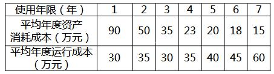

A.7
B.5
C.4  (正确)
D.3
解析：
我们称设备从开始使用到其年平均使用成本最小(或年盈利最高)的使用年限N。为设备的经济寿命。由题意可知．该设备的年平均使用成本依次为120万元、85万元、65万元、58万元、60万元、63万元、75万元。故该设备的经济寿命为4年。

【知识点】设备经济寿命的估算

【考点】设备经济寿命的估算

【考查方向】公式计算

【难度】中等

【题库维护老师：hejiade】

钢筋加工设备年度费用曲线如下图所示。依据该图判断，该设备的经济寿命为( &nbsp; )年。

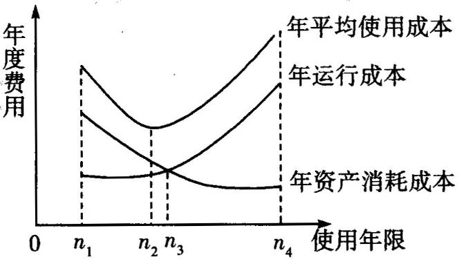

A.n4
B.n3
C.n2  (正确)
D.n1
解析：
设备从开始使用到其年平均使用成本最小(或年盈利最高)的使用年限为设备的经济寿命。由题意可知，n2为设备年平均使用成本最低的使用年限，所以n2为设备的经济寿命。

【知识点】设备经济寿命的估算

【考点】设备经济寿命的估算

【考查方向】概念释义

【难度】易

【题库维护老师：hejiade】

某设备年度费用曲线如下图所示，则该设备的经济寿命为（&nbsp;）年。 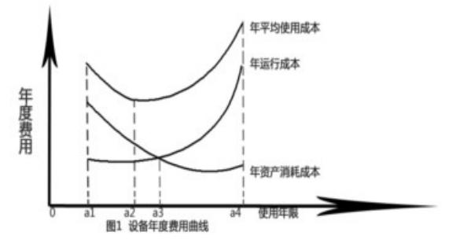

A.a1
B.a2  (正确)
C.a3
D.a4
解析：
设备从开始使用到其年平均使用成本最小(或年盈利最高)的使用年限为设备的经济寿命。由题意可知，a2为设备年平均使用成本最低的使用年限，所以a2为设备的经济寿命。 【知识点】设备经济寿命的估算 【考点】设备经济寿命的估算 【考查方向】概念释义 【难度】易 【题库维护老师：hejiade】

某设备使用各年运行成本和资产消耗成本如下表所示（单位：万元），则其经济寿命为（ &nbsp;）年。 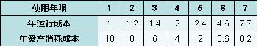

A.3
B.4
C.5
D.6  (正确)
解析：
 计算出年平均使用成本，其最小时为设备经济寿命。 【知识点】设备经济寿命的估算 【考点】设备经济寿命的估算 【考查方向】计算 【难度】易 【题库维护老师：hejiade】

某机械设备购置安装费用共计20万元，预计残值2万元，年劣化值为4万元，则该设备经济寿命为（ &nbsp;）年。

A.3  (正确)
B.4
C.5
D.6
解析：
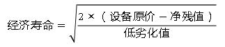 根据上式：N=[2×（200000-20000）/40000]^(0.5)=3年 【知识点】设备经济寿命的估算 【考点】设备经济寿命的确定方法 【考查方向】计算 【难度】易 【题库维护老师：hejiade】

某设备的年度费用曲线见图1所示，依据图1判断，该设备的经济寿命为（ ）年。&nbsp;

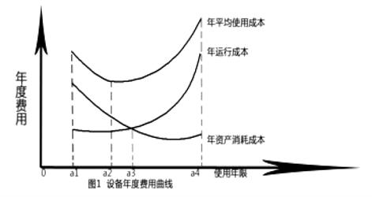

A.a1
B.a2  (正确)
C.a3
D.a4
解析：
经济寿命应当选择年平均使用成本最低点所对应的年份数（时间） 。 【知识点】设备经济寿命的估算 【考点】设备经济寿命的估算 

某建设单位，拥有一台设备，目前实际价值8000元，预计残值2000元，第1年的设备运行成本600元，第2年的设备运行成本900元，每年设备的劣化增量是均等的，年劣化值480元，则该设备的经济寿命为（ &nbsp; &nbsp;）年。

A.3
B.4
C.5  (正确)
D.8
解析：
    如下图 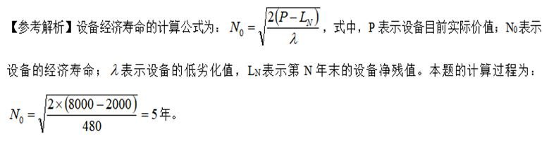

    【知识点】设备经济寿命的估算

    【考点】设备经济寿命的估算

    【考查方向】公式计算

    【难度】易

    【题库维护老师：hejiade】

已知有一台设备，目前实际价值为10000元，预计残值为1000元，第1年的设备运行成本为800元，每年设备的劣化增量是均等的，年劣化值为500元，则该设备的经济寿命为（ &nbsp; &nbsp;）年。

A.3.7
B.5
C.6  (正确)
D.7
解析：
如下图  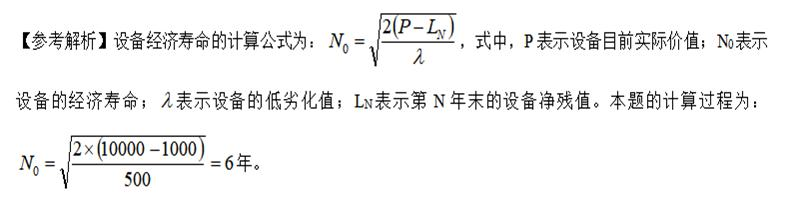

【知识点】设备经济寿命的估算

【考点】设备经济寿命的估算

【考查方向】公式计算

【难度】易

【题库维护老师：hejiade】

某技术方案在7年的使用期中，平均年资产消耗成本分别为900元、500元、350元、230元、200元、180元、150元，平均年度运行成本分别为200元、250元、300元、350元、400元、450元、500元，这台设备的经济寿命为(　　)。

A.3年
B.4年  (正确)
C.5年
D.6年
解析：
计算各年年平均使用成本如下表所示，可知第4年的580元为最低，故该设备的经济寿命为4年。 

在已知设备现金流量的情况下，逐年计算出从寿命1年到N年全部使用期的年平均使用成本从中找出年平均使用成本的最小值及其所对应的年限，从而确定设备的经济寿命。

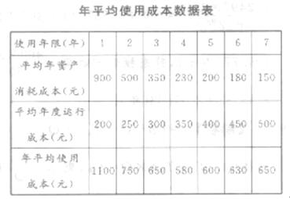 

【知识点】设备经济寿命的估算

【考点】设备经济寿命的估算

【考查方向】概念释义

【难度】易

【题库维护老师：hejiade】

某设备目前的实际价值为 8000 元，预计残值 800 元，第 1 年设备运行成本 600 元，每年设备的劣化增量是均等的，年劣化值为 300 元，则该设备的经济寿命是（ ）。

A.5 年
B.6 年
C.7 年  (正确)
D.8 年
解析：
如图

 

【知识点】设备经济寿命的估算

【考点】设备经济寿命的估算

【考查方向】概念释义

【难度】易

【题库维护老师：hejiade】

设有一台设备，目前实际价值为7500元，预计残值为800元，第1年的设备运行成本为550元，设备的年劣化值为200元，并且每年设备的劣化增量是均等的，则该设备的经济寿命为( &nbsp; )年。

A.5
B.8  (正确)
C.7
D.6
解析：
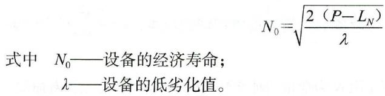 本题计算过程为：该设备的经济寿命＝

【知识点】设备经济寿命的估算

【考点】设备经济寿命的估算

【考查方向】公式计算

【难度】易

【题库维护老师：hejiade】

某设备目前实际价值为20万元，预计残值为2万元，第1年设备运行成本为1600元，每年设备的劣化增量是均等的，年劣化值为400元，则此设备的经济寿命是( &nbsp; &nbsp;)年。

A.10
B.20
C.30  (正确)
D.40
解析：
    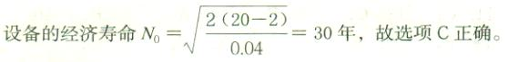

    【知识点】设备经济寿命的估算

    【考点】设备经济寿命的估算

    【考查方向】公式计算

    【难度】易

    【题库维护老师：hejiade】

某设备在不同使用年限(1至8年)时的平均年度资产消耗成本和平均年度运行成本如下表所示。则该设备在静态模式下的经济寿命为( &nbsp; )年。

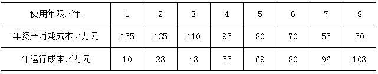

A.3
B.4
C.5  (正确)
D.6
解析：
经济寿命是指设备从投入使用开始，到继续使用在经济上不合理而被更新所经历的时间。随着设备使用年限的增加，一方面需要更多的维修费维持原有功能；另一方面设备的操作成本及原材料、能源耗费也会增加，年运行时间、生产效率、质量将下降。因此，年资产消耗成本的降低，会被年度运行成本的增加或收益的下降所抵消。在整个变化过程中存在着某一年份，设备年平均使用成本最低，经济效益最好，如下图所示，在N0年时，设备年平均使用成本达到最低值。我们称设备从开始使用到其年平均使用成本最小(或年盈利最高)的使用年限N0为设备的经济寿命。结合上述内容，根据题意可得设备的年平均使用成本，具体数据见下表。在第5年年平均使用成本最低，即该设备在静态模式下的经济寿命为5年。

【知识点】设备寿命的概念

【考点】设备的经济寿命

【考查方向】概念释义

【难度】易

【题库维护老师：hejiade】

2年前以8500元购进一台设备，目前该设备价值4000元，预计残值400元，此后第一年的运行成本为1000元，此后每年设备的劣化增量是均等的，年劣化值为200元，求该设备的总经济寿命为( &nbsp; &nbsp;)年。

A.6
B.7
C.8  (正确)
D.9
解析：
设备剩余的经济寿命公式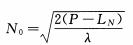

P=4000,LN=400

求得N0=6,

则总经济寿命=6+2＝8（年）。

【知识点】设备经济寿命的估算

【考点】设备经济寿命的估算

【考查方向】公式计算

【难度】易

【题库维护老师：hejiade】

某设备目前的实际价值为5500元，预计残值500元，第一年设备运行成本600元，每年设备的劣化增量是均等的，年劣化值为400元，则该设备的经济寿命是（ &nbsp; ）。

A.4年
B.5年  (正确)
C.6年
D.7年
解析：
 

N0——设备的经济寿命；

λ——设备的低劣化值。

【知识点】设备经济寿命的估算

【考点】设备经济寿命的估算

【考查方向】公式计算

【难度】易

【题库维护老师：hejiade】

