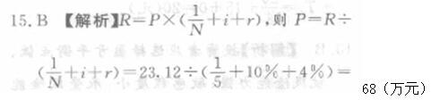

关于设备融资租赁的说法，正确的是（ &nbsp;）。

A.租赁期的设备租金总额低于直接购置设备的费用
B.租赁容易导致承租人资产负债状况恶化
C.租赁期间承租人可以将租用设备用于抵押贷款
D.设备融资租赁的租期通常较长  (正确)
解析：
承租人在租赁期间所交的租金总额一般比直接购置设备的费用要高；长年支付租金，形成长期负债；在租赁期间承租人对租用设备无所有权，只有使用权，故承租人无权随意对设备进行改造，不能处置设备，也不能用于担保、抵押贷款；融资租赁最主要的外部特征是租期长。

【知识点】设备租赁的概念

【考点】设备租赁的概念

【考查方向】概念释义

【难度】易

【题库维护老师：hejiade】

关于设备租赁的说法，错误的是（ &nbsp;）。

A.融资租赁通常适用于长期使用的贵重设备
B.临时使用的设备适宜采用经营租赁方式
C.经营租赁的任一方可以以一定方式在通知对方后的规定期限内取消租约
D.租赁期内，融资租赁承租人拥有租赁设备的所有权  (正确)
解析：
设备租赁是设备使用者（承租人）按照合同规定，按期向设备所有者（出租人）支付一定费用而取得设备使用权的一种经济活动。设备租赁一般有融资租赁和经营租赁两种方式。在融资租赁中，租赁双方承担确定时期的租让和付费义务，而不得任意中止和取消租约，贵重的设备（如重型机械设备等）宜采用这种方法；而在经营租赁中，租赁双方的任何一方可以随时以一定方式在通知对方后的规定期限内取消或中止租约，临时使用的设备（如车辆、仪器等）通常采用这种方式。

【知识点】设备租赁的概念

【考点】设备租赁的概念

【考查方向】概念释义

【难度】易

【题库维护老师：hejiade】

设备融资租赁与经营租赁的主要不同点是（ &nbsp;）。（2012）

A.租金的支付方式
B.可用于租赁的设备
C.租赁双方的根本目的
D.租赁双方承担义务的约束力  (正确)
解析：
设备租赁一般有融资租赁和经营租赁两种方式。在<strong>融资租赁</strong>中，租赁双方承担确定时期的租让和付费义务，<strong>而不得任意中止和取消租约</strong>，贵重的设备（如重型机械设备等）宜采用这种方法；而在<strong>经营租赁</strong>中，租赁双方的任何一方<strong>可以随时</strong>以一定方式在通知对方后的规定期限内<strong>取消或中止租约</strong>，临时使用的设备（如车辆、仪器等）通常采用这种方式。将租赁作为一种筹资方式，主要是针对融资租赁而言的，典型的融资租赁是指长期的、完全补偿的、不可撤销的、由承租人负责维护的租赁。

【知识点】设备租赁的概念

【考点】设备租赁的概念

【考查方向】概念释义

【难度】易

【题库维护老师：hejiade】

对于承租人来说，设备租赁与设备购买相比，不足之处主要在于（ &nbsp;）。

A.长年支付租金，形成长期负债  (正确)
B.不能获得良好的技术服务
C.不能享受税费上的利益
D.容易受利率波动的冲击
解析：
租赁的缺点：（1）在租赁期间承租人对租用设备无所有权，只有使用权，故承租人无权随意对设备进行改造，不能处置设备，也不能用于担保、抵押贷款；（2）承租人在租赁期间所交的租金总额一般比直接购置设备的费用要高；（3）长年支付租金，形成长期负债；（4）融资租赁合同规定严格，毁约要赔偿损失，罚款较多等。

优点：（1）在资金短缺的情况下，既可用较少资金获得生产急需的设备，也可以引进先进设备，加速技术进步的步伐；（2）可获得良好的技术服务；（3）可以保持资金的流动状态，防止呆滞，也不会使企业资产负债状况恶化；（4）可避免通货膨胀和利率波动的冲击，减少投资风险；（5）设备租金可在所得税前扣除，能享受税费上的利益。

【知识点】设备租赁的概念

【考点】租赁的缺点

【考查方向】概念释义

【难度】易

【题库维护老师：hejiade】

对于购买人来说，设备购买与设备租赁相比，其优越性在于( &nbsp; )

A.可以保持资金的流动状态，防止呆滞
B.对设备即享有使用权，又具有所有权  (正确)
C.可用较少资金获得生产急需的设备
D.可以减少投资风险
解析：
对于承租人来说，<strong>设备租赁</strong>与设备购买相比的<strong>优越性在于</strong>：(1)在资金短缺的情况下，既可用<strong>较少资金获得生产急需的设备</strong>，也可以引进先进设备，加速技术进步的步伐；(2)可获得良好的技术服务；(3)可以保持资金的流动状态，<strong>防止呆滞</strong>，也不会使企业资产负债状况恶化；(4)可避免通货膨胀和利率波动的冲击，<strong>减少投资风险</strong>；(5)设备租金可在所得税前扣除，能享受税费上的利益。 <strong>设备租赁的不足之处在于（也就是相对于购买来说）</strong>：(1)<strong>在租赁期间承租人对租用设备无所有权，只有使用权</strong>，故承租人无权随意对设备进行改造，不能处置设备，也不能用于担保，抵押贷款；(2)承租人在租赁期间所交的租金总额一般比直接购置设备的费用要高；(3)长年支付租金，形成长期负债；(4)融资租赁合同规定严格，毁约要赔偿损失，罚款较多等。<strong>【此题要用排除法，防止掉坑】</strong>

【知识点】设备租赁的概念

【考点】设备租赁的概念

【考查方向】概念释义

【难度】易

【题库维护老师：hejiade】

在设备融资租赁中，如果租赁双方承担确定时期的租让和付费义务，而不得任意终止和取消租约。宜采用这种方法的设备是类型()。

A.车辆
B.仪器
C.搅拌机
D.重型机械设备  (正确)
解析：
在融资租赁中，租赁双方承担确定时期的租让和付费义务，而不得任意中止和取消租约，贵重的设备（如重型机械设备等）宜采用这种方法。

【知识点】设备租赁的概念

【考点】设备租赁的概念

【考查方向】概念释义

【难度】易

【题库维护老师：hejiade】

对于承租人来说，设备租赁与设备购买相比的优越性不包括()。

A.可用较少资金获得生产急需的设备
B.可获得良好的技术服务
C.可用于抵押贷款  (正确)
D.能享受税费上的利益
解析：
对于承租人来说，设备租赁与设备购买相比的优越性在于：(1)在资金短缺的情况下，既可用较少资金获得生产急需的设备，也可以引进先进设备，加速技术进步的步伐；(2)可获得良好的技术服务；(3)可以保持资金的流动状态，防止呆滞，也不会使企业资产负债状况恶化；(4)可避免通货膨胀和利率波动的冲击，减少投资风险；(5)设备租金可在所得税前扣除，能享受税费上的利益。但在租赁期间承租人对租用设备无所有权，只有使用权，故承租人无权随意对设备进行改造，不能处置设备，也不能用于担保、抵押贷款。故选项C正确。

【知识点】设备租赁的概念

【考点】设备租赁的概念

【考查方向】概念释义

【难度】易

【题库维护老师：hejiade】

设备租赁的不足之处在于（ &nbsp; &nbsp;）。

A.承租人不能将设备用于担保.抵押贷款  (正确)
B.承租人在租赁期间所交的租金总额一般比直接购置设备的费用要高  (正确)
C.长年支付租金，形成长期负债  (正确)
D.没有良好的技术服务
E.融资租赁合同规定严格，毁约要赔偿损失，罚款较多  (正确)
解析：
设备租赁的不足之处在于：（1）在租赁期间承租人对租用设备无所有权，只有使用权，故承租人无权随意对设备进行改造，不能处置设备，也不能用于担保抵押贷款；（2）承租人在租赁期间所交的租金总额一般比直接购置设备的费用要高；（3）长年支付租金，形成长期负债；（4）融资租赁合同规定严格，毁约要赔偿损失，罚款较多等。

【知识点】设备租赁的概念

【考点】设备租赁的不足

【考查方向】概念释义

【难度】易

【题库维护老师：hejiade】

对于承租人来说，设备租赁与设备购买相比的优越性有（）。

A.设备可以用于担保、抵押贷款
B.不需要考虑设备的维护保养
C.能用较少资金获得生产急需设备  (正确)
D.设备租金可在所得税前扣除  (正确)
E.可获得设备出租方的技术服务  (正确)
解析：
对于承租人来说，设备租赁与设备购买相比的优越性在于: (1)在资金短缺的情况下，既可用较少资金获得生产急需的设备，也可以引进先进设备，加速技术进步的步伐; (2)可获得良好的技术服务; (3)可以保持资金的流动状态，防止呆滞，也不会使企业资产负债状况恶化; (4)可避免通货膨胀和利率波动的冲击，减少投资风险; (5)设备租金可在所得税前扣除，能享受税费上的利益。

【知识点】设备租赁的概念

【考点】设备租赁的概念

【考查方向】概念释义

【难度】易

【题库维护老师：hejiade】

对承包人来说，经营性租赁设备与购买设备相比的优点有（ ） 。

A.可以避免设备的第一种无形磨损
B.可缓解短期内资金不足的困难  (正确)
C.可以根据需要随时处置设备
D.可以享受税费上的利益  (正确)
E.可以租赁设备进行抵押贷款
解析：
设备租赁的优点（对于承租人而言） ① 在资金短缺的情况下，既可用较少资金获得生产急需的设备，也可以引进先进设备，加速技术进步的步伐； ②可获得良好的技术服务； ③可以保持资金的流动状态，防止呆滞，也不会使企业资产负债状况恶化； ④可避免通货膨胀和利率波动的冲击，减少投资风险； ⑤经营租赁设备租金可在所得税前扣除，能享受税费上的利益。 注意：融资租赁的优点 。租赁费中的利息、手续费以及融资租赁设备的折旧费均可在税前支付，可以减轻所得税负担。

【知识点】设备租赁的概念

【考点】设备租赁的概念

【考查方向】概念释义

【难度】易

【题库维护老师：hejiade】

某施工企业以经营租赁的方式向设备租赁公司租赁了自卸汽车一辆，在租赁期间，施工企业不能将该自卸汽车( &nbsp; )。

A.已经磨损的轮胎进行更换
B.为防止扬尘的需要进行改装  (正确)
C.交由多位驾驶员驾驶使用
D.用于为另一施工企业的贷款提供担保  (正确)
E.用做本企业抵押贷款的担保物  (正确)
解析：
在租赁期间承租人对租用设备无所有权，只有使用权，故承租人无权随意对设备进行改造，不能处置设备，也不能用于担保、抵押贷款。

【知识点】设备租赁的概念

【考点】设备租赁的概念

【考查方向】概念释义

【难度】易

【题库维护老师：hejiade】

对于承租人来说，设备租赁相对于设备购买的优越性有( &nbsp; )。

A.可以将承租的设备用于担保、抵押贷款
B.可用较少的资金获得生产急需的设备  (正确)
C.可以自主对设备进行改造
D.租金可在税前扣除，享受税费上的利益  (正确)
E.可避免通货膨胀和利率波动的冲击  (正确)
解析：
对于承租人来说，设备租赁与设备购买相比的优越性在于：(1)在资金短缺的情况下，既可用较少资金获得生产急需的设备，也可以引进先进设备，加速技术进步的步伐；(2)可获得良好的技术服务；(3)可以保持资金的流动状态，防止呆滞，也不会使企业资产负债状况恶化；(4)可避免通货膨胀和利率波动的冲击，减少投资风险；(5)设备租金可在所得税前扣除，能享受税费上的利益。

【知识点】设备租赁的概念

【考点】设备租赁的概念

【考查方向】概念释义

【难度】易

【题库维护老师：hejiade】

对承租人来说，设备租赁与设备购买相比的优点有( &nbsp; )

A.可以减少投资风险  (正确)
B.可以获得良好的技术服务  (正确)
C.可以根据需要随时处置设备
D.可以享受税费上的利益  (正确)
E.可以用租赁设备进行抵押贷款
解析：
对于承租人来说，设备租赁与设备购买相比的优越性在于：(1)在资金短缺的情况下，既可用较少资金获得生产急需的设备，也可以引进先进设备，加速技术进步的步伐；(2)可获得良好的技术服务；(3)可以保持资金的流动状态，防止呆滞，也不会使企业资产负债状况恶化；(4)可避免通货膨胀和利率波动的冲击，减少投资风险；(5)设备租金可在所得税前扣除，能享受税费上的利益。

【知识点】设备租赁的概念

【考点】设备租赁与设备购买相比的优越性

【考查方向】概念释义

【难度】易

【题库维护老师：hejiade】

对于承租人来说，设备租赁与设备购买相比的优越性主要体现在()。

A.可以根据需要随时处置设备
B.可以获得良好的技术服务  (正确)
C.可以保持资金的流动状态，防止呆滞  (正确)
D.可以避免通货膨胀和利率波动的冲击  (正确)
E.可以享受税费上的利益  (正确)
解析：
对于承租人来说，设备租赁与设备购买相比的优越性在于：(1)在资金短缺的情况下，既可用较少资金获得生产急需的设备，也可以引进先进设备，加速技术进步的步伐；(2)可获得良好的技术服务；(3)可以保持资金的流动状态，防止呆滞，也不会使企业资产负债状况恶化；(4)可避免通货膨胀和利率波动的冲击，减少投资风险；(5)设备租金可在所得税前扣除，能享受税费上的利益。故选项B、C、D、E正确。

【知识点】设备租赁的概念

【考点】设备租赁的概念

【考查方向】概念释义

【难度】易

【题库维护老师：hejiade】

施工企业经营租赁设备比购买设备的优越性有( &nbsp; &nbsp;)。

A.可以改善自身的投资结构
B.可以获得出租方良好的技术服务  (正确)
C.不必承担设备维修和管理的责任
D.可避免通货膨胀和利率波动的冲击  (正确)
E.可提高自身资金的流动性  (正确)
解析：
对于承租人来说，设备租赁与设备购买相比的优越性在于：①在资金短缺的情况下，即可用较少资金获得生产急需的设备，也可引进先进设备，加速技术进步的步伐；②可获得良好的技术服务；③可以保持资金的流动状态，防止呆滞，也不会使企业，资产负债情况恶化；④可避免通货膨胀和利率波动的冲击，减少投资风险；⑤设备租金可在所得税前扣除，能享受税费的利益。

【知识点】设备租赁的概念

【考点】设备租赁的概念

【考查方向】概念释义

【难度】易

【题库维护老师：hejiade】

某租赁公司出租设备的年租金为23.12万元，租期为5年，每年年末支付租金，折现率为10%，附加率为4%，这台设备的价格为(　　)万元。

A.65
B.68  (正确)
C.71
D.74
解析：
    

    【知识点】设备租聘的概念

    【考点】设备价格计算

    【考查方向】公式计算

    【难度】易

    【题库维护老师：hejiade】

