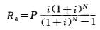
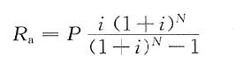
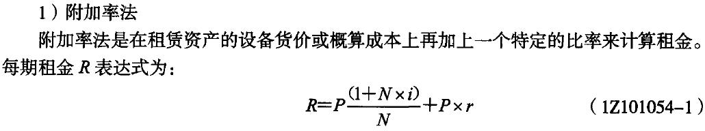
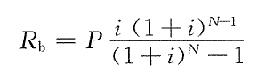
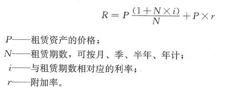
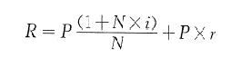
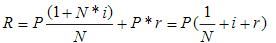
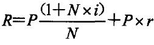
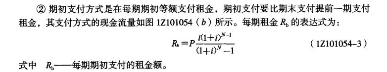
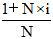

某企业进行设备租赁和购买方案比选。甲方案为租赁设备，租赁费每年50万，租期5年；乙方案为购买设备，购置费200万元，全部来源银行借款，借款单利计息，年利率10%，借款期限5年，设备可使用年限5年，预计净残值为0。企业所得税率25%。其他条件不考虑，关于方案的比选，正确的是（ &nbsp;&nbsp;）。

A.考虑税收影响时，甲方案优于乙方案  (正确)
B.考虑税收影响时，甲.乙方案税后成本相同
C.考虑税收影响时，乙方案优于甲方案
D.设备方案比选不应考虑税收的影响
解析：
在工程经济互斥方案分析中，为了简化计算，常常只需比较它们之间的差异部分。而设备租赁与购置方案经济比选，最简单的方法是在假设所得到设备的营业收入相同的条件下，将租赁方案和购买方案的费用进行比较。根据互斥方案比选的增量原则，只需比较它们之间的差异部分，即设备租赁：所得税率×租赁费－租赁费；设备购置：所得税率×（折旧+贷款利息）－设备购置费－贷款利息。本题中的净现金流量差异部分，设备租赁：（25%×50－50）×5＝-187.5（万元）；设备购置：25%×（200/5＋200×10%）×5－200－200×10%×5＝-225（万元）。由于每个企业都要依利润大小缴纳所得税，按财务制度规定，租赁设备的租金允许计入成本；购买设备每期计提的折旧费也允许计入成本；若用借款购买设备，其每期支付的利息也可以计入成本。甲方案计入成本的数额为：50×5=250（万元），乙方案计入成本的数额为：200×10%×5+200=300（万元）。在其他费用保持不变的情况下，计入成本越多，则利润总额越少，企业交纳的所得税也越少。因此，在充分考虑各种方式的税收优惠影响下，应该选择税后收益更大或税后成本更小的方案。综上，甲方案优于乙方案。

【知识点】设备方案的比选

【考点】设备方案的比选

【考察方向】公式计算

【难度】中等

【题库维护老师：ZKQ】

企业拟向租赁公司承租一台施工机械，机械价格为100万元，租期4年，每年年末支付租金，折现率为8%，附加率为3%，按照附加率法计算，该企业每年应支付的租金为（ &nbsp;&nbsp;）万元。

A.36  (正确)
B.32
C.33
D.44
解析：
附加率法年租金为P=100×（1+4×8%）/4+100×3%=36（万元）。

【知识点】设备方案的比选

【考点】设备方案的经济比选方法

【考察方向】公式计算

【难度】易

【题库维护老师：ZKQ】

某设备10年前的原始成本是100000元，目前的账面价值是30000，现在的市场价值为20000元。关于该设备沉没成本和更新决策时价值的说法，正确的是（ &nbsp;）。

A.沉没成本为10000元，更新决策时价值应为40000元
B.沉没成本为80000元，更新决策时价值应为30000元
C.沉没成本为10000元，更新决策时价值应为20000元  (正确)
D.沉没成本为70000元，更新决策时价值应为70000元
解析：
沉没成本=设备账面价值-当前市场价值=10000。

【知识点】设备方案的比选

【考点】沉没成本计算

【考查方向】概念释义

【难度】易

【题库维护老师：hejiade】

对承租人而言，租赁设备的租赁费用主要包括租赁保证金、租金和（ ）

A.贷款利息
B.折旧费用
C.运转成本
D.担保费  (正确)
解析：
租赁费用主要包括：租赁保证金、租金、担保费。  租赁合同结束时，租赁保证金将被退还给承租人或在偿还最后一期租金时加以抵消。承租人付给担保人一定数目的费用就是担保费。影响租金的因素很多，如设备的价格、融资的利息及费用、各种税金、租赁保证金、运费等。对于租金的计算主要有附加率法和年金法。

【知识点】设备方案的比选

【考点】设备经营租赁与购置方案的经济比选方法

【考查方向】概念释义

【难度】易

【题库维护老师：hejiade】

企业拟向租赁公司承租一台施工机械，机械价格为 200 万元，租期 4 年，每年年末支付租金，折现率为 8%，附加率为 3%,按照附加率法计算，该企业每年应支付的租金为（ ）万元。

A.72  (正确)
B.32
C.33
D.44
解析：
附加率法年租金为 P=200×（1+4×8%）/4+200×3%=72（万元）。

【知识点】设备方案的比选

【考点】附加率法

【考查方向】公式计算

【难度】中等

【题库维护老师：hejiade】

某施工企业拟租赁一施工设备，租金按附加率法计算，每年年末支付。已知设备的价格为95万元，租期为6年，折现率为8%，附加率为5%，则该施工企业每年年末应付租金为( &nbsp; )万元。

A.23.43
B.28.18  (正确)
C.17.89
D.20.58
解析：
附加率法计算租金的公式为：R＝P×(1＋N×i)／N＋P×r。式中，P表示租赁资产的价格；N表示租赁期数，可按月、季、半年、年计；i表示与租赁期数相对应的利率；r表示附加率。由此可得：该施工企业每年年末应付租金＝95×[(1＋6×8%)／6]＋95×5%＝28.18万元。

【知识点】设备方案的比选

【考点】附加率法

【考查方向】公式计算

【难度】中等

【题库维护老师：hejiade】

某企业拟租赁一台设备，设备的价格为60万元，租期为6年，每年年末支付租金，折现率为12%，附加率为4%，则每年的租金为( &nbsp; )万元。

A.11.44
B.13.24
C.14.40
D.19.60  (正确)
解析：
附加率法计算租金的计算公式为：R＝P(1＋N×i)／N＋P×r，式中，P表示租赁资产的价格；N表示租赁期数，可按月、季、半年、年计；i表示与租赁期数相对应的利率；r表示附加率。本题的计算过程为：R＝60×(1＋6×12%)／6＋60×4%＝19.60万元。

【知识点】设备方案的比选

【考点】附加率法

【考查方向】公式计算

【难度】中等

【题库维护老师：hejiade】

某施工企业拟租赁一台设备,该设备价格为100万元,寿命期和租期均为6年，每年年末支付租金,折现率为6%,附加率为3%,则按附加率法计算每年租金为（）万元。

A.18
B.22.67
C.25.67  (正确)
D.36.00
解析：
R=[P（1+N×i）]/N+P×r，即R=[100（1+6×6%）]/6+100×3%=25.67

【知识点】设备方案的比选

【考点】附加率法

【考查方向】公式计算

【难度】易

【题库维护老师：hejiade】

租赁公司购买一台设备用于出租，设备的价格为128万元，可以租赁6年，每年年末支付租金，折现率为10%，附加率为4%，租赁保证金和担保费的时间价值忽略不计。则按附加率法计算的年租金为（ &nbsp; &nbsp;）万元。

A.34.99
B.28.59
C.39.25  (正确)
D.24.32
解析：
附加率法是在租赁资产的设备货价或概算成本上再加上一个特定的比率来计算租金。每期租金R表达式为： R=P（1+N×i）/N+P×r（1Z101062-3） 因此R=128×（1+6×10%）/6+128×4%=39.25

【知识点】设备方案的比选

【考点】附加率法

【考查方向】公式计算

【难度】易

【题库维护老师：hejiade】

某企业从设备租赁公司租借一台设备，该设备的价格为48万元，租期6年，折现率为12%，附加率为5%，按附加率法计算，则该企业每年年末支付的租金为( &nbsp; &nbsp;)万元。

A.16.16  (正确)
B.11.67
C.10.42
D.8.8
解析：
附加率法求租金的公式: R=P（1+N×i）/N+P×r =[48×(1+12%×6)]/6+48×5%=16.16万元。

【知识点】设备方案的比选

【考点】附加率法

【考查方向】公式计算

【难度】易

【题库维护老师：hejiade】

某施工企业拟租赁给某企业一施工设备，按附加率法计算，每年年末支付。已知设备的价格为95万元，租期为6年。折现率为10%，附加率为5%，按附加率法计算，该施工企业每年年末应付租金为（ &nbsp; &nbsp;）万元。

A.26.13
B.29.13
C.30.08  (正确)
D.36.62
解析：
每期租金R=P（1+N×i）/N+P×r = [95×（1+6×10%）]/6+95×5%=30.08万元。

【知识点】设备方案的比选

【考点】年金法

【考查方向】公式计算

【难度】易

【题库维护老师：hejiade】

施工企业拟向租赁公司承租一台设备，设备价格120万元，租期6年，年末支付租金，折现率 10%,附加率4%。按照附加率法计算，应付租金为（ &nbsp; &nbsp;）万元。（2015）

A.25.0
B.27.5
C.33.5
D.36.8  (正确)
解析：
每期租金R=P×（1+N×i）/N+P×r=120×（1+6×10%）/6+120×4%=36.8（万元）。

【知识点】设备方案的比选

【考点】设备方案的经济比选方法

【考查方向】公式计算

【难度】易

【题库维护老师：hejiade】

 

将租赁资产价值按动态等额分摊到未来各租赁期间的租金计算方法是( &nbsp; )

A.低劣化值法
B.折现率法
C.附加率法
D.年金法  (正确)
解析：
年金法是将一项租赁资产价值按动态等额分摊到未来各租赁期间内的租金计算方法。年金法计算有期末支付和期初支付租金之分。

【知识点】设备方案的比选

【考点】设备方案的经济比选方法

【考查方向】公式计算

【难度】易

【题库维护老师：hejiade】

某租赁公司出租给某企业一台设备，年租金按年金法计算，折现率为12%，租期为5年，设备价格为68万元，承租企业年末支付租金与年初支出租金的租金差值为( &nbsp; )万元。

A.2.00
B.2.02  (正确)
C.2.03
D.2.04
解析：
若按年末支付方式：R=68×[12%×（1+12%）5/（1+12%）5-1]=18.86

若按年初支付方式：R=68×[12%×（1+12%）5-1/（1+12%）5-1]=16.84

租金差值为18.86-16.84=2.02

【知识点】设备方案的比选

【考点】设备方案的比选

【考查方向】公式计算

【难度】易

【题库维护老师：hejiade】

在进行设备租赁与设备购置的选择时，设备租赁与购置的经济比选是互斥方案的选优问题。寿命期相同时，可以采用的比选指标是()。

A.净现值指数
B.财务内部收益率
C.投资回收期
D.财务净现值  (正确)
解析：
互斥方案比较不能用相对值指标，投资回收期是辅助指标；寿命期相同时，可以用净现值作为评价尺度，寿命期不同时，只能采用净年值。故选项D正确。

【知识点】设备方案的比选

【考点】设备方案的比选

【考查方向】概念释义

【难度】易

【题库维护老师：hejiade】

在购买设备方案的现金流量表中，现金流入包括营业收入和()。

A.进项税额
B.贷款利息
C.销项税额  (正确)
D.营业税金
解析：
现金流入：营业收入、销项税额、回收固定资产余值

【知识点】资本金现金流量表

【考点】资本金现金流量表

【考查方向】概念释义

【难度】易

【题库维护老师：hejiade】

在进行设备购买与设备租赁方案经济比较时，应将购买方案与租赁方案视为( &nbsp; )。

A.独立方案
B.相关方案
C.互斥方案  (正确)
D.组合方案
解析：
设备租赁方案与设备购买方案之间比选，是互斥方案优选的问题。

【知识点】设备方案的比选

【考点】设备方案的比选

【考查方向】概念释义

【难度】易

【题库维护老师：hejiade】

对二手设备的选用要慎重。经论证确实需要二手设备时，需要说明对二手设备的考察情况、选用理由，但不包括()。

A.技术水平
B.能耗水平
C.环保及安全指标
D.与建设进度相匹配  (正确)
解析：
对二手设备的选用要慎重。经论证确实需要二手设备时，需要说明对二手设备的考察情况、选用理由，二手设备的技术水平、能耗水平、环保及安全指标、利用改造措施及投资，并与当时水平的同类设备进行经济技术比较。

【知识点】设备方案的比选

【考点】设备方案的比选

【考查方向】概念释义

【难度】易

【题库维护老师：hejiade】

采用设备经营租赁的方案，可以直接计入成本的费用是()。

A.进项税额
B.营业税金
C.租赁费  (正确)
D.应纳增值税
解析：
采用设备经营租赁的方案，租赁费可以直接计入成本，但为与设备购置方案具有可比性，特将租赁费用从经营成本分离出来。

【知识点】设备方案的比选

【考点】设备方案的比选

【考查方向】概念释义

【难度】易

【题库维护老师：hejiade】

某企业需要某种设备，该设备经济寿命为7年，企业与租赁公司商定的融资租赁期限为4年，在不考虑物价变动及技术进步因素时，设备租赁与购买方案比选尺度是( &nbsp; )。

A.净现值
B.内部收益率
C.净年值  (正确)
D.投资回收期
解析：
购买新设备经济寿命期为7年，租赁设备的租赁期为4年，两方案的寿命期不同，所以用净年值作评价尺度。

【知识点】设备方案的比选

【考点】设备方案的比选

【考查方向】概念释义

【难度】易

【题库维护老师：hejiade】

某租赁公司出租给某企业一台设备，年租金按年金法计算，折现率为12%，租期为5年，设备价格为100万元，承租企业年末支付租金与年初支出租金的租金差值为( &nbsp; )。

A.2.47万元
B.2.77万元
C.2.97万元  (正确)
D.2.99万元
解析：
差值={100×12%×（1+12%）5/[（1+12%）5-1]}-{100×12%×（1+12%）5-1/[（1+12%）5-1]}=2.97万元。

【知识点】设备方案的比选

【考点】年金法

【考查方向】公式计算

【难度】易

【题库维护老师：hejiade】

企业在采用经营租赁方式租用设备时需支付租赁费用，构成租赁费用的项目有( &nbsp;)。*

A.担保费  (正确)
B.利息
C.租赁保证金  (正确)
D.折旧费
E.租金  (正确)
解析：
租赁费用主要包括：租赁保证金、租金、担保费。

【知识点】设备方案的比选

【考点】设备方案的经济比选方法

【考查方向】概念释义

【难度】易

【题库维护老师：hejiade】

企业采用设备经营租赁方案时，其租赁费用主要包括( &nbsp; )

A.经营成本
B.租赁保证金  (正确)
C.担保费  (正确)
D.所得税
E.租金  (正确)
解析：
采用设备经营租赁的方案，其现金的流出一般包括：租赁费用、经营成本、营业税金及附加、所得税。其中，租赁费用主要包括：租赁保证金、租金以及担保费。

【知识点】设备方案的比选

【考点】设备经营租赁方案的现金流量

【考查方向】概念释义

【难度】易

【题库维护老师：hejiade】

购买设备方案现金流量表中，现金流出包括设备购置费、经营成本、贷款利息以及()。

A.进项税额  (正确)
B.应纳增值税  (正确)
C.营业中税金及附加  (正确)
D.所得税  (正确)
E.销项税额
解析：
购买设备方案现金流量表中，现金流出包括：设备购置费、经营成本、贷款利息、进项税额、应纳增值税、营业中税金及附加和所得税。故选项A、B、C、D正确

【知识点】设备方案的比选

【考点】设备方案的比选

【考查方向】概念释义

【难度】易

【题库维护老师：hejiade】

设备方案选择的定量分析一般根据设备方案的投资和运营消耗，通过计算寿命周期费用现值和投资回收期等指标，结合其他因素，择优选取设备方案。其他因素主要包括( &nbsp; )。

A.设备参数、性能、物耗和能耗  (正确)
B.环保、对原料的适应性  (正确)
C.对产品质量的保证程度  (正确)
D.备品备件保证程度  (正确)
E.管理和操作的实用性
解析：
定量分析一般根据设备方案的投资和运营消耗，通过计算寿命周期费用现值和投资回收期等指标，结合其他因素（一般从设备参数、性能、物耗和能耗、环保、对原料的适应性、对产品质量的保证程度、备品备件保证程度、安装技术服务等），择优选取设备方案。故选项A、B、C、D正确。

【知识点】设备方案的比选

【考点】定量分析

【考查方向】概念释义

【难度】易

【题库维护老师：hejiade】

设备租赁与购置方案分析中，对拟定的若干设备配置方案进行定性分析筛选，经过分析若考虑采用经营租赁方式，则其依据是()。

A.技术过时风险大  (正确)
B.质量保证程度
C.保养维护复杂  (正确)
D.使用时间短  (正确)
E.备品备件齐全
解析：
定性分析的方法是设备选择中常用的主要方法。在分析时，对技术过时风险大、保养维护复杂、使用时间短的设备，可以考虑经营租赁方案。 而定量分析一般根据设备方案的投资和运营消耗，通过计算寿命周期费用现值和投资回收期等指标，结合其他因素（一般从设备参数、性能、物耗和能耗、环保、对原料的适应性、对产品质量的保证程度、备品备件保证程度、安装技术服务等），择优选取设备方案。答案A、C、D正确。

【知识点】设备方案的比选

【考点】设备方案比选的步骤

【考查方向】概念释义

【难度】易

【题库维护老师：hejiade】

采用设备经营租赁的方案，租赁费可以直接计入成本，租赁费用主要包括( &nbsp; &nbsp; &nbsp;)。

A.租赁保证金  (正确)
B.所得税
C.租金  (正确)
D.附加税
E.担保费  (正确)
解析：
租赁费用主要包括：租赁保证金、租金、担保费。

【知识点】设备方案的比选

【考点】设备方案的经济比选方法

【考查方向】概念释义

【难度】易

【题库维护老师：hejiade】

某企业从设备租赁公司租借一台设备，该设备的价格为48万元，租期6年，折现率为12%，若按年金法计算，则该企业每年年末等额支付的租金为( &nbsp; &nbsp;)万元。

A.15.79
B.11.67  (正确)
C.10.42
D.8.8
解析：
年金法求租金的公式应用

【知识点】设备方案的比选

【考点】年金法

【考查方向】公式计算

【难度】易

【题库维护老师：hejiade】

某公司拟租赁一台设备，该设备价格为150万元，租期10年，每年年末支付租金，折现率8%，在此情况下，采用年金法计算年租金应为（ &nbsp;）万元。

A.22.35  (正确)
B.20.70
C.25.43
D.31.5
解析：
 R=150×8%×（1+8%）10/[（1+8%）10-1]=22.354 

【知识点】设备方案的比选

【考点】年金法

【考查方向】计算

【难度】易

【题库维护老师：hejiade】

某租赁公司出租给某企业一台设备，设备价格为68万元，租赁保证金在租赁期届满退还，租期为5年，每年年末支付租金，租赁保证金为5万元，担保费为4万元，折现率为10%，附加率为4%，租赁保证金与担保费的资金时间价值忽略不计，每年租赁费用为（ &nbsp; ）。

A.23.12万元
B.23.92万元  (正确)
C.24.12万元
D.24.92万元
解析：
 由于不考虑租赁保证金和担保费的资金时间价值，且租赁保证金在租赁期届满时退还，所以年租赁费用由年租金和平均担保费构成。年租赁费=年租金+年平均担保费 =68×(1+5×10%)÷5+68×4%+4÷5=23.12+0.8=23.92万元

【知识点】设备方案的比选

【考点】附加税率

【考查方向】公式计算

【难度】易

【题库维护老师：hejiade】

某公司拟租赁一台设备，该设备价格为150万元，租期10年，每年年初支付租金，折现率8%，在此情况下，采用年金法计算年租金应为（ &nbsp;）万元。

A.22.35
B.20.70  (正确)
C.25.43
D.31.5
解析：
 R=150×8%×（1+8%）9/[（1+8%）10-1]=20.698 【知识点】设备方案的比选 【考点】年金法 【考查方向】计算 【难度】易 【题库维护老师：hejiade】

某公司拟租赁一台设备，该设备价格为150万元，租期10年，每年年末支付租金，折现率8%，附加率3%，在此情况下，采用附加率法计算年租金应为（ &nbsp;）万元。

A.15
B.32.4
C.42.6
D.31.5  (正确)
解析：
 依据上式：R=150×（1/10+8%+3%）=31.5万元 【知识点】设备方案的比选 【考点】附加率法 【考查方向】计算 【难度】易 【题库维护老师：hejiade】

某施工企业计划租赁一台设备，设备价格为1000万元，寿命期6年，租期5年，每年年末支付租金，折现率为5%，附加率为2%。采用附加率法计算，每年需支付的租金为（ &nbsp; ）万元。

A.166.67
B.200
C.236.37
D.270  (正确)
解析：
 根据以上公式：R=1000×（1/5+2%+5%）=270万元 【知识点】设备方案的比选 【考点】设备方案的经济比选方法 【考查方向】公式计算 【难度】易 【题库维护】yxf

某租赁设备买价50万元，租期5年，每年年末支付租金，折现率10%，附加率5%，则按附加率法计算每年的租金应为（ &nbsp;&nbsp;）万元。

A.20.0
B.17.5  (正确)
C.15.0
D.12.5
解析：
本题考查的是设备租赁与购买的影响因素。设备经营租赁的费用包括租赁保证金、租金和担保费。

附加率法是在租赁资产的设备货价或概算成本上再加上一个特定指比率来计算租金。

每期租金R的表达式为：

式中：P ——租赁资产的价格； &nbsp; &nbsp; &nbsp; &nbsp;&nbsp;

N ——租赁期数，其值取决于租赁资产预计使用寿命，租赁期可按月、季、半年、年计；&nbsp;

对本题有：R＝50×（1/5 + 10% + 5%）＝17.5万元。&nbsp;

故选B。

【知识点】设备方案的比选

【考点】设备方案的经济比选方法

【考察方向】公式计算

【难度】易

【题库维护老师：hejiade】

某施工企业计划租赁一台设备，设备价格为240万元，寿命期10年，租期8年，每年年末支付租金，折现率为8%，附加率为3%。采用附加率法计算，每年需支付的租金为（ ）万元。

A.33.0
B.50.4
C.56.4  (正确)
D.61.2
解析：
R=Px(1+Nxi)÷N+Pxr=240x(1+8x8%)÷8+240x3%=56.4万元 

【知识点】设备方案的比选

【考点】设备方案的比选

【考查方向】概念释义

【难度】易

【题库维护老师：hejiade】

某公司拟出租给一家建筑公司一台设备，该设备的价格为 58 万元，租期为 5 年，每年年初支付租金，折现率为 10%，采用年金法计算则每年租金为（&nbsp; &nbsp; &nbsp; &nbsp;）。

A.13.9 万元  (正确)
B.15.3 万元
C.19.7 万元
D.18.9 万元
解析：
[58×(A/P，10%，5)]/(1+10%)=58×[10%×(1+10%)5-1]/[(1+10%)5-1]=13.9万元。

【知识点】设备方案的比选

【考点】年金法

【考查方向】公式计算

【难度】易

【题库维护老师：hejiade】

某企业拟租赁一台设备，已知该设备的价格为100万元，租期为5年，每年年末支付租金，租金按附加率法计算，折现率为10%，附加率为4%，则每年应付租金为( &nbsp; )万元。

A.35
B.30
C.25
D.34  (正确)
解析：
 

【知识点】设备方案的比选

【考点】设备方案的比选

【考查方向】公式计算

【难度】易

【题库维护老师：hejiade】

某租赁公司出租给某企业一台设备，设备价格为68万元，租期为5年，每年年末支付租金，租赁保证金为5万元，租赁保证金在租赁期届满时退还，担保费为4万元，折现率为10%，附加率为4%，租赁保证金与担保费的资金时间价值忽略不计，则每年租赁费用平均为( &nbsp; )万元。

A.23.12
B.23.92  (正确)
C.24.12
D.24.92
解析：
由于不考虑租赁保证金和担保费的资金时间价值，且租赁保证金在租赁期届满时退还，所以年租赁费用由年租金和平均担保费构成。年租金的计算公式：R＝P＋P×r，式中P——租赁资产的价格；N——租赁期数；i——与租赁期数相对应的利率；r——附加率。代入数据计算可得年租赁费＝年租金＋年平均担保费＝68×(1＋5×10％)/5＋68×4％+4/5＝23.12＋0.8＝23.92(万元)。

【知识点】设备方案的比选

【考点】年租金

【考查方向】公式计算

【难度】易

【题库维护老师：hejiade】

