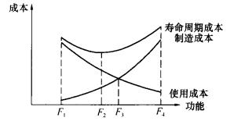
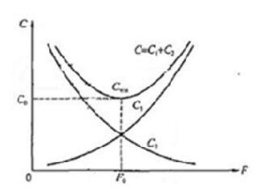

价值工程的核心是（）。

A.产品研发
B.功能分析  (正确)
C.方案策划
D.方案落实
解析：
价值工程的核心，是对产品进行功能分析

【知识点】价值工程的特点

【考点】价值工程的核心，是对产品进行功能分析

【考查方向】概念释义

【难度】易

【题库维护老师：hejiade】 

    价值工程中，寿命周期成本是指（ &nbsp; &nbsp;）。

A.销售成本和使用及维修成本
B.试验、试制成本和使用及维修成本
C.生产成本和使用及维修成本  (正确)
D.科研、设计成本和使用及维修成本
解析：
产品的寿命周期成本由生产成本和使用及维护成本组成。

【知识点】价值工程的特点

【考点】价值工程的特点

【考查方向】概念释义

【难度】易

【题库维护老师：hejiade】

关于价值工程的说法，不正确的是( &nbsp; )。

A.价值工程旨在提高所研究对象价值的思想方法和管理技术
B.价值工程的核心，是对产品进行功能分析
C.价值工程的目标是最大限度地提高产品功能  (正确)
D.价值工程强调不断改革和创新
解析：
价值工程旨在提高所研究对象价值的思想方法和管理技术。价值工程的特点包括：(1)价值工程的目标，是以最低的寿命周期成本，使产品具备它所必须具备的功能；(2)价值工程的核心，是对产品进行功能分析；(3)价值工程将产品价值、功能和成本作为一个整体同时来考虑；(4)价值工程强调不断改革和创新；(5)价值工程要求将功能定量化；(6)价值工程是以集体智慧开展的有计划、有组织、有领导的管理活动。

【知识点】价值工程的特点

【考点】价值工程的特点

【考查方向】概念释义

【难度】易

【题库维护老师：hejiade】

在价值工程活动中， 描述某一个产品零部件“是干什么用的？”，属于 （ ） 的工作内容。

A.产品功能分析  (正确)
B.产品结构分析
C.对象选择
D.产品设计
解析：
价值工程中的功能是指对象能够满足某种要求的一种属性，具体来说功能就是某种特定效能、功用或效用。对于一个具体的产品来说，“它是干什么用的？”是对产品功能的分析。

【知识点】价值工程的特点

【考点】价值工程的核心，是对产品进行功能分析

【考查方向】概念释义

【难度】易

【题库维护老师：hejiade】

价值工程的核心是对产品进行（ ） 。

A.成本分析
B.信息搜集
C.方案创新
D.功能分析  (正确)
解析：
价值工程的核心，是对产品进行功能分析

【知识点】价值工程的特点

【考点】价值工程的核心，是对产品进行功能分析

【考查方向】概念释义

【难度】易

【题库维护老师：hejiade】

价值工程的核心是( &nbsp; &nbsp;)。

A.以最低的寿命周期成本，使产品具备它所必须具备的功能
B.将产品价值、功能和成本作为一个整体同时来考虑
C.对产品进行结构分析
D.对产品进行功能分析  (正确)
解析：
价值工程的核心，是对产品进行功能分析。

【知识点】价值工程的特点

【考点】价值工程的核心，是对产品进行功能分析

【考查方向】概念释义

【难度】易

【题库维护老师：hejiade】

价值工程中的寿命周期费用是指（）。

A.生产过程发生的全部成本
B.从开始使用至报废过程中发生的费用总和
C.产品存续期的总成本
D.生产费用、使用费用及维护费用之和  (正确)
解析：
产品的寿命周期成本由生产成本和使用及维护成本组成。

【知识点】价值工程的特点

【考点】价值工程的特点

【考查方向】概念释义

【难度】易

【题库维护老师：hejiade】

在建筑产品生产中应用价值工程原理的说法，正确的是()。

A.在分析结构、材质等问题的同时，对产品的必要功能进行定义
B.首先确定建筑产品的设计方案，然后再进行功能分析和评价
C.在分析功能的基础上，再去研究结构材质等问题  (正确)
D.在分析结构、施工工艺的基础上，确定建筑产品的功能
解析：
企业生产的目的，也是通过生产获得用户所期望的功能，而结构、材质等是实现这些功能的手段，目的是主要的，手段可以广泛选择。因此，价值工程分析产品，首先不是分析它的结构，而是分析它的功能，是在分析功能的基础之上，再去研究结构、材质等问题，以达到保证用户所需功能的同时降低成本，实现价值提高的目的。

价值工程的核心，是对产品进行功能分析。

【知识点】价值工程的特点

【考点】价值工程的核心，是对产品进行功能分析

【考查方向】概念释义

【难度】易

【题库维护老师：hejiade】

价值工程中关于功能和成本之间关系的说法，错误的是()。

A.处理好功能与成本的对立统一关系
B.主要追求高功能、多功能水平  (正确)
C.提高功能与成本之间的比值水平
D.研究产品功能和成本的最佳配置
解析：
价值工程的特点强调，价值工程将产品价值、功能和成本作为一个整体同时来考虑。不是单纯追求低成本水平，也不片面追求高功能、多功能水平，而是力求正确处理好功能与成本的对立统一关系，提高它们之间的比值水平，研究产品功能和成本的最佳配置。故选项B正确。

【知识点】价值工程的特点

【考点】价值工程的特点

【考查方向】概念释义

【难度】易

【题库维护老师：hejiade】

在一定范围内，产品生产成本与使用及维护成本的关系是()。

A.随着产品功能水平的提高，产品的生产成本增加，使用及维护成本降低  (正确)
B.随着产品功能水平的提高，产品的生产成本减少，使用及维护成本降低
C.随着产品功能水平的降低，产品的生产成本增加，使用及维护成本提高
D.随着产品功能水平的降低，产品的生产成本减少，使用及维护成本降低
解析：
在一定范围内，产品的生产成本与使用及维护成本存在此消彼长的关系。随着产品功能水平的提高，产品的生产成本增加，使用及维护成本降低；反之，产品功能水平降低，其生产成本降低但是使用及维护成本增加。故选项A正确。

【知识点】价值工程的特点

【考点】价值工程的特点

【考查方向】概念释义

【难度】易

【题库维护老师：hejiade】

价值工程中总成本是指（ &nbsp; ）。

A.生产成本
B.产品寿命周期成本  (正确)
C.使用成本
D.使用和维修费用成本
解析：
价值工程中总成本是指产品寿命周期成本。

【知识点】价值工程的特点

【考点】价值工程的特点

【考查方向】概念释义

【难度】易

【题库维护老师：hejiade】

关于价值工程特点的说法,正确的有( &nbsp; &nbsp;)。

A.价值工程的核心是对产品进行功能分析  (正确)
B.价值工程并不单纯追求降低产品的生产成本  (正确)
C.价值工程要求将产品的功能定量化  (正确)
D.价值工程的目标是以最低的寿命周期成本使产品具备最大功能
E.价值工程的主要工作是用传统的方法获得产品稳定的技术经济效益
解析：
选项D，价值工程的目标是以最低的寿命周期成本使产品具备它所必须具备的功能，而非最大的功能; 选项E,价值工程强调不断改革和创新，所以使用传统的方式是错误的。

【知识点】价值工程的特点

【考点】价值工程的特点

【考查方向】概念释义

【难度】易

【题库维护老师：hejiade】

价值工程涉及价值、功能和寿命周期成本等三个基本要素，关于价值工程特点的说法，正确的有(&nbsp; &nbsp; &nbsp; &nbsp;)。

A.价值工程的目标是以最低的寿命周期成本，使产品具备它所必须具备的功能  (正确)
B.价值工程的核心是对产品进行价值分析
C.价值工程将产品价值、功能和成本作为一个整体同时来考虑  (正确)
D.价值工程强调是功能最大化
E.价值工程是以集体智慧开展的有计划、有组织、有领导的管理活动  (正确)
解析：
由价值工程的概念可知，价值工程涉及价值、功能和寿命周期成本等三个基本要素，它具有以下特点：一是价值工程的目标，是以最低的寿命周期成本，使产品具备它所必须具备的功能；二是价值工程的核心，是对产品进行功能分析；三是价值工程将产品价值、功能和成本作为一个整体同时来考虑；四是价值工程强调不断改革和创新；五是价值工程要求将功能定量化；六是价值工程是以集体智慧开展的有计划、有组织、有领导的管理活动。故选项A、C、E正确。

【知识点】价值工程的特点

【考点】价值工程的特点

【考查方向】概念释义

【难度】易

【题库维护老师：hejiade】

    某产品的功能与成本关系如下图所示，功能水平F1、F2、F3、F4均能满足用户要求，从价值工程的角度，最适宜的功能水平应是（ &nbsp; &nbsp;）。

    

A.F1
B.F2  (正确)
C.F3
D.F4
解析：
在F2点，产品功能既能满足用户的需求，制造成本和使用成本两条曲线叠加所对应的寿命周期成本为最小值，体现了比较理想的功能与成本的关系。

【知识点】价值工程的特点

【考点】价值工程的特点

【考查方向】概念释义

【难度】易

【题库维护老师：hejiade】

对某产品进行价值分析，其产品功能与成本关系如下图所示，图中C1最有可能表示( &nbsp; )随产品功能变动的变化规律。

A.用户购买产品的费用  (正确)
B.产品使用成本
C.产品维护成本
D.产品报废拆除所需费用
解析：
产品生产成本，是指发生在生产企业内部的成本，也是用户购买产品的费用，包括产品的科研、实验、设计、试制、生产、销售等费用及税金等。产品生产成本C1是指发生在生产企业内部的成本，也是用户购买产品的费用，包括产品的科研、实验、设计、试制、生产、销售等费用及税金等。

【知识点】价值工程的特点

【考点】价值工程的特点

【考查方向】概念释义

【难度】易

【题库维护老师：hejiade】

