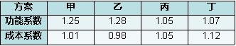
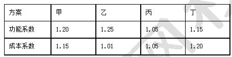
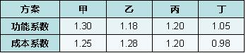
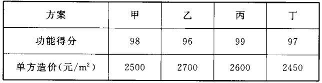
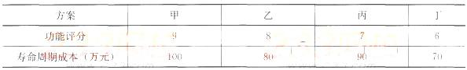
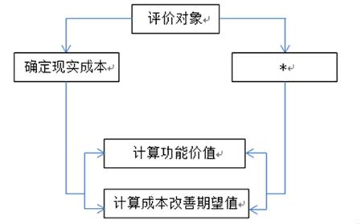
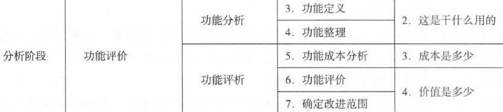
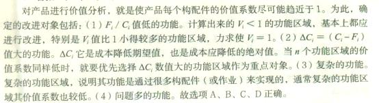

某产品所具备的功能超出用户预期与需求甚多，该功能属于（）。

A.多余功能
B.重复功能
C.过剩功能  (正确)
D.必要功能
解析：
过剩功能是指某些功能虽属必要，但满足需要有余，在数量上超过用户要求或标准功能水平，这将导致成本增加，给用户造成不合理的负担。

【知识点】价值工程分析阶段 【考点】价值工程分析阶段 【考查方向】概念释义 【难度】易 【题库维护】yxf

某单位工程由甲、乙、丙和丁4个分部工程组成，相关数据如下表，运用价值工程原理判断，应作为优先改进对象的是（ &nbsp;）。 
<table border="1" cellspacing="0" style="border: none;"><tbody><tr style="height:9px"><td width="113" valign="top" style="width:114px;padding:0 7px 0 7px ;border-left:1px solid #000;border-right:1px solid #000;border-top:1px solid #000;border-bottom:1px solid #000">
项目
</td><td width="113" valign="top" style="width:114px;padding:0 7px 0 7px ;border-left:none;border-right:1px solid #000;border-top:1px solid #000;border-bottom:1px solid #000">
甲
</td><td width="113" valign="top" style="width:114px;padding:0 7px 0 7px ;border-left:none;border-right:1px solid #000;border-top:1px solid #000;border-bottom:1px solid #000">
乙
</td><td width="113" valign="top" style="width:114px;padding:0 7px 0 7px ;border-left:none;border-right:1px solid #000;border-top:1px solid #000;border-bottom:1px solid #000">
丙
</td><td width="113" valign="top" style="width:114px;padding:0 7px 0 7px ;border-left:none;border-right:1px solid #000;border-top:1px solid #000;border-bottom:1px solid #000">
丁
</td></tr><tr style="height:10px"><td width="113" valign="top" style="width:114px;padding:0 7px 0 7px ;border-left:1px solid #000;border-right:1px solid #000;border-top:none;border-bottom:1px solid #000">
现实成本(万元)
</td><td width="113" valign="top" style="width:114px;padding:0 7px 0 7px ;border-left:none;border-right:1px solid #000;border-top:none;border-bottom:1px solid #000">
1100
</td><td width="113" valign="top" style="width:114px;padding:0 7px 0 7px ;border-left:none;border-right:1px solid #000;border-top:none;border-bottom:1px solid #000">
2350
</td><td width="113" valign="top" style="width:114px;padding:0 7px 0 7px ;border-left:none;border-right:1px solid #000;border-top:none;border-bottom:1px solid #000">
1220
</td><td width="113" valign="top" style="width:114px;padding:0 7px 0 7px ;border-left:none;border-right:1px solid #000;border-top:none;border-bottom:1px solid #000">
1630
</td></tr><tr><td width="113" valign="top" style="width:114px;padding:0 7px 0 7px ;border-left:1px solid #000;border-right:1px solid #000;border-top:none;border-bottom:1px solid #000">
目标成本(万元）
</td><td width="113" valign="top" style="width:114px;padding:0 7px 0 7px ;border-left:none;border-right:1px solid #000;border-top:none;border-bottom:1px solid #000">
1000
</td><td width="113" valign="top" style="width:114px;padding:0 7px 0 7px ;border-left:none;border-right:1px solid #000;border-top:none;border-bottom:1px solid #000">
2000
</td><td width="113" valign="top" style="width:114px;padding:0 7px 0 7px ;border-left:none;border-right:1px solid #000;border-top:none;border-bottom:1px solid #000">
1230
</td><td width="113" valign="top" style="width:114px;padding:0 7px 0 7px ;border-left:none;border-right:1px solid #000;border-top:none;border-bottom:1px solid #000">
1500
</td></tr><tr style="height:6px"><td width="113" valign="top" style="width:114px;padding:0 7px 0 7px ;border-left:1px solid #000;border-right:1px solid #000;border-top:none;border-bottom:1px solid #000">
功能价值
</td><td width="113" valign="top" style="width:114px;padding:0 7px 0 7px ;border-left:none;border-right:1px solid #000;border-top:none;border-bottom:1px solid #000">
0.909
</td><td width="113" valign="top" style="width:114px;padding:0 7px 0 7px ;border-left:none;border-right:1px solid #000;border-top:none;border-bottom:1px solid #000">
0.851
</td><td width="113" valign="top" style="width:114px;padding:0 7px 0 7px ;border-left:none;border-right:1px solid #000;border-top:none;border-bottom:1px solid #000">
1.008
</td><td width="113" valign="top" style="width:114px;padding:0 7px 0 7px ;border-left:none;border-right:1px solid #000;border-top:none;border-bottom:1px solid #000">
0.92
</td></tr></tbody></table>
A.甲
B.乙  (正确)
C.丙
D.丁
解析：
本题考查价值工程改进对象的相关内容。对产品进行价值分析，就是使产品每个构配件的价值系数尽可能趋近于1。为此，确定的改进对象是：Vi=Fi/Ci值低的功能计算出来的Vi&lt;1的功能区域，基本上都应进行改进，特别是Vi值比1小得较多的功能区域，力求使Vi=1。

【知识点】价值工程分析阶段

【考点】功能评价

【考查方向】概念释义

【难度】易

【题库维护老师：hejiade】

价值工程应用中，如果评价对象的价值系数V＜1，则正确的策略是（ &nbsp; &nbsp;）。

A.剔除不必要功能或降低现实成本
B.剔除过剩功能及降低现实成本  (正确)
C.不作为价值工程改进对象
D.提高现实成本或降低功能水平
解析：
功能的价值系数V＜1，此时功能现实成本大于功能评价值。表明评价对象的现实成本偏高，而功能要求不高，一种可能是存在着过剩的功能；另一种可能是功能虽无过剩，但实现功能的条件或方法不佳，以致使实现功能的成本大于功能的实际需要。

【知识点】价值工程分析阶段

【考点】功能评价

【考查方向】概念释义

【难度】易

【题库维护老师：hejiade】

功能按( &nbsp; )分类，可分为必要功能和不必要功能。

A.用户的需求  (正确)
B.功能的重要程度
C.功能的性质
D.功能的量化标准
解析：
按用户的需求分类，功能可分为必要功能和不必要功能。按功能的重要程度分类，产品的功能一般可分为基本功能和辅助功能。按功能的性质分类，功能可划分为使用功能和美学功能。按功能的量化标准分类，产品的功能可分为过剩功能与不足功能。

【知识点】价值工程分析阶段

【考点】功能定义

【考查方向】概念释义

【难度】易

【题库维护老师：hejiade】

价值工程应用中，功能整理的主要任务是( &nbsp; )。

A.划分功能类别
B.解剖分析产品功能
C.建立功能系统图  (正确)
D.进行产品功能计量
解析：
功能整理是用系统的观点将已经定义了的功能加以系统化，找出各局部功能相互之间的逻辑关系是并列关系还是上下位置关系，并用图表形式表达，以明确产品的功能系统，从而为功能评价和方案构思提供依据。

【知识点】价值工程分析阶段

【考点】功能整理

【考查方向】概念释义

【难度】易

【题库维护老师：hejiade】

关于价值工程中功能的价值系数的说法，正确的是()。*

A.价值系数越大越好
B.价值系数大于1表示评价对象存在多余功能
C.价值系数等于1表示评价对象的价值为最佳  (正确)
D.价值系数小于1表示现实成本较低，而功能要求较高
解析：
Vi＝l，表示功能评价值等于功能现实成本。这表明评价对象的功能现实成本与实现功能所必需的最低成本大致相当，说明评价对象的价值为最佳，一般无须改进。

【知识点】价值工程分析阶段

【考点】功能评价

【考查方向】概念释义

【难度】易

【题库维护老师：hejiade】

应用功能成本法计算功能价值V，测定实现应有功能所必须消耗的最低成本，同时计算为实现应有功能所耗费的现实成本，若Vi&lt;1，表明评价对象有可能(　　)。

A.功能不足
B.现实成本偏低
C.成本支出与功能相当
D.现实成本偏高  (正确)
解析：
Vi＜1，此时功能现实成本大于功能评价值。表明评价对象的现实成本偏高，而功能要求不高，一种可能是存在着过剩的功能；另一种可能是功能虽无过剩，但实现功能的条件或方法不佳，以致使实现功能的成本大于功能的实际需要。

【知识点】价值工程分析阶段

【考点】功能评价

【考查方向】概念释义

【难度】易

【题库维护老师：hejiade】

通过求得对象的价值系数和成本降低期望值，确定价值工程的改进对象。如果评价对象的价值为最佳，一般无须改进，其功能系数应为(　　)。

A.V=1  (正确)
B.V&lt;1
C.V&gt;1
D.V=0
解析：
Vi＝1，表示功能评价值等于功能现实成本。这表明评价对象的功能现实成本与实现功能所必需的最低成本大致相当，说明评价对象的价值为最佳，一般无须改进。

【知识点】价值工程分析阶段

【考点】功能评价

【考查方向】概念释义

【难度】易

【题库维护老师：hejiade】

作为价值工程活动的重点对象选择应该是(　　)。

A.功能价值高、改善期望值大的功能
B.功能价值低、改善期望值大的功能  (正确)
C.功能价值高、改善期望值小的功能
D.功能价值低、改善期望值小的功能
解析：
选择功能价值低、改善期望值大的功能作为价值工程活动的重点对象。

【知识点】价值工程分析阶段

【考点】价值工程分析阶段

【考查方向】概念释义

【难度】易

【题库维护老师：hejiade】

某公司为了站稳市场，对占市场份额比较大的四种产品进行功能价值分析，得到相应的价值系数分别是：V甲=0.5，V乙=0.8，V丙=1.1，V丁=1.5，该公司应重点研究改进的产品是(　　)。

A.产品甲  (正确)
B.产品乙
C.产品丙
D.产品丁
解析：
应用功能成本法计算功能价值V，是通过一定的测算方法，测定实现应有功能所必须消耗的最低成本，同时计算为实现应有功能所耗费的现实成本，经过分析、对比，求得对象的价值系数和成本降低期望值，确定价值工程的改进对象。研究V最小的。远小于1的。

【知识点】价值工程分析阶段

【考点】功能评价

【考查方向】概念释义

【难度】易

【题库维护老师：hejiade】

某企业为了站稳市场，对占有份额比较大的四种产品甲、乙、丙、丁进行功能价值分析，得到相应的价值系数分别是：V甲=0.5，V乙=0. 8，V丙=1.1，V丁 =1.2，该公司应重点研究改进的是产品（ &nbsp; &nbsp;）。

A.甲  (正确)
B.乙
C.丙
D.丁
解析：
V=1无须改进,V&lt;1需要改进，特别是比1小得较多的功能区域,v&gt;1具体问题具体分析。

【知识点】价值工程分析阶段

【考点】功能评价

【考查方向】概念释义

【难度】易

【题库维护老师：hejiade】
<!--1需要改进，特别是比1小得较多的功能区域,v-->

某分项工程施工采用方案A的成本为5万元，在相同条件下，采用其他方案的合理成本为4.5万元。对方案实施价值工程，可以认为方案A的价值系数为（ &nbsp; &nbsp; &nbsp;） 。

A.0.90  (正确)
B.0.10
C.0.53
D.1.11
解析：
价值工程中价值系数的计算公式Vi=Fi/Ci ；题目中设定在相同条件下，且采用其他方案的合理成本为4.5万元。故可假定其他方案为最优方案即Vi =1 .则其功能成本为4.5万元；故A方案的V i=4.5/5.0=0.9 。

【知识点】价值工程分析阶段

【考点】功能评价

【考查方向】概念释义

【难度】易

【题库维护老师：hejiade】

通过计算产品功能价值，对产品进行价值分析，使产品每个构配件的价值系数尽可能趋近于1，为此，确定的改进对象不包括( &nbsp; )

A.Fi/Ci值低的功能
B.△Ci＝(Gi－Fi)值小的功能  (正确)
C.复杂的功能
D.问题多的功能
解析：
通过计算产品功能价值，对产品进行价值分析，使产品每个构配件的价值系数尽可能趋近于1，为此，确定的改进对象包括：(1)Fi/Ci值低的功能；(2)△Ci＝(Ci－Fi)值大的功能；(3)复杂的功能；(4)问题多的功能。

【知识点】价值工程分析阶段

【考点】功能评价

【考查方向】概念释义

【难度】易

【题库维护老师：hejiade】

反映结构工程中混凝土工艺方案技术特性的指标是()。

A.方案占地面积
B.现浇混凝土强度  (正确)
C.构配件是否能保证供应
D.主要专用设备是否能保证供应
解析：
结构工程中混凝土工艺方案的技术性指标可用现浇混凝土强度、现浇工程总量、最大浇筑量等表示。故选项B正确。

【知识点】新技术应用方案的技术分析

【考点】技术特性指标

【考查方向】概念释义

【难度】易

【题库维护老师：hejiade】

运用价值工程优选设计方案，分析计算结果为：方案一的单方造价为1500元，价值系数为1.13；方案二的单方造价为1550元，价值系数为1.25；方案三的单方造价为1300元，价值系数为0.89；方案四的单方造价分为1320元，价值系数为1.08。因此，最佳方案是()。

A.方案一
B.方案二
C.方案三
D.方案四  (正确)
解析：
价值系数接近1是最佳方案D

【知识点】价值工程分析阶段

【考点】功能评价

【考查方向】概念释义

【难度】易

【题库维护老师：hejiade】

住宅必须具有遮风、避雨、保温、隔热、采光、通风、隔声、防潮、防火、防震等功能，这些功能属于()。

A.总体功能
B.并列功能  (正确)
C.局部功能
D.上下位功能
解析：
并列功能是指产品功能之间属于并列关系，如住宅必须具有遮风、避雨、保温、隔热、采光、通风、隔声、防潮、防火、防震等功能，这些功能之间是属于并列关系的。

【知识点】价值工程分析阶段

【考点】功能分类

【考查方向】概念释义

【难度】易

【题库维护老师：hejiade】

对产品的功能分析中，应突出于使用功能的是()。

A.壁画
B.地下管道  (正确)
C.外观造型
D.墙纸
解析：
无论是使用功能和美学功能，他们都是通过基本功能和辅助功能来实现的。产品的使用功能和美学功能要根据产品的特点而有所侧重。<strong>有的产品应突出其使用功能，例如地下电缆、地下管道等</strong>；有的应突出其美学功能，例如墙纸、陶瓷壁画等。当然，有的产品如房屋建筑、桥梁等二者功能兼而有之。

【知识点】价值工程分析阶段

【考点】功能分类

【考查方向】概念释义

【难度】易

【题库维护老师：hejiade】

计算功能现实成本，当一个构配件只具有一个功能时，该构配件的成本就是它本身的()。

A.功能成本  (正确)
B.目标成本
C.现实成本
D.生产成本
解析：
具体地讲，当一个构配件只具有一个功能时，该构配件的成本就是它本身的功能成本；当一项功能要由多个构配件共同实现时，该功能的成本就等于这些构配件的成本之和。

【知识点】价值工程分析阶段

【考点】功能现实成本的计算

【考查方向】概念释义

【难度】易

【题库维护老师：hejiade】

价值工程中，功能整理是用系统的观点将已定义了的功能加以系统化，找出各局部功能相互之间的逻辑关系是并列关系还是上下位置关系，表达这种功能之间关系可用()。

A.功能系统图  (正确)
B.功能评价图
C.成本构成图
D.功能定义图
解析：
功能整理是用系统的观点将已经定义了的功能加以系统化，找出各局部功能相互之间的逻辑关系是并列关系还是上下位置关系，并用功能系统图表的形式表达，以明确产品的功能系统，从而为功能评价和方案构思提供依据。故选项A正确。

【知识点】价值工程分析阶段

【考点】功能整理

【考查方向】概念释义

【难度】易

【题库维护老师：hejiade】

价值工程的定义中，功能一般是指产品的( &nbsp; )。

A.基本功能
B.使用功能
C.主要功能
D.必要功能  (正确)
解析：
不必要的功能包括三类：一是多余功能，二是重复功能，三是过剩功能。不必要的功能必然产生不必要的费用，这不仅增加了用户的经济负担，而且还浪费资源。因此，价值工程的功能，一般是指必要功能，即充分满足用户必不可少的功能要求。

【知识点】价值工程分析阶段

【考点】价值工程分析阶段

【考查方向】概念释义

【难度】易

【题库维护老师：hejiade】

价值工程分析阶段的工作有（ &nbsp;&nbsp;）。

A.对象选择
B.方案评价
C.功能定义  (正确)
D.功能整理  (正确)
E.功能评价  (正确)
解析：
本题考查的是价值工程的工作程序。价值工程分析阶段的工作有功能定义、功能整理、功能成本分析、功能评价、确定改进范围。主要工作是<strong>功能定义、功能整理</strong>与<strong>功能评价</strong>。

【知识点】价值工程分析阶段

【考点】价值工程分析阶段

【考察方向】概念释义

【难度】易

【题库维护老师：ZKQ】

价值工程分析中，将功能按用户的需求分类，有必要功能和不必要功能，下列功能中，属于不必要的功能有( )。

A.美学功能
B.辅助功能
C.多余功能  (正确)
D.重复功能  (正确)
E.过剩功能  (正确)
解析：
必要功能就是指用户所要求的功能以及与实现用户所需求功能有关的功能，使用功能、美学功能、基本功能、辅助功能等均为必要功能;不必要功能是指不符合用户要求的功能。不必要的功能包括三类:一是多余功能，二是重复功能，三是过剩功能。

【知识点】价值工程分析阶段

【考点】功能分类

【考查方向】概念释义

【难度】易

【题库维护老师：hejiade】

价值工程中，不符合用户要求的功能称为不必要功能，包括(　)。

A.辅助功能
B.多余功能  (正确)
C.重复功能  (正确)
D.次要功能
E.过剩功能  (正确)
解析：
不必要的功能包括三类：一是多余功能，二是重复功能，三是过剩功能。

【知识点】价值工程分析阶段

【考点】功能定义

【考查方向】概念释义

【难度】易

【题库维护老师：hejiade】

某施工企业对建筑物的外墙进行功能分析的说法，正确的有（）。

A.承重外墙的基本功能是承受荷载  (正确)
B.防风防雨是外墙的过剩功能
C.分隔空间是外墙的上位功能
D.隔热保温是外墙的辅助功能  (正确)
E.造型美观是外墙的美学功能  (正确)
解析：
本题考核功能的分类，设计多个例子，各个方面，完全选对有一定的难度，但得分难度并不大，首先B选项很容易排除掉，防风防雨肯定不是过剩的功能；然后，分隔空间和外墙的关系不大，而是内墙的基本功能，上位功能室目的性的，不能说外墙的目的就是为了分隔空间，所以C是错误的，其他几个都是对的。

【知识点】价值工程分析阶段

【考点】功能分类

【考查方向】概念释义

【难度】易

【题库维护老师：hejiade】

按功能的量化标准分类，产品的功能可分为（ &nbsp; &nbsp;）。

A.使用功能
B.过剩功能  (正确)
C.不足功能  (正确)
D.不必要功能
E.必要功能
解析：
按功能的量化标准分类，产品的功能可分为过剩功能与不足功能。

【知识点】价值工程分析阶段

【考点】功能定义

【考查方向】概念释义

【难度】易

【题库维护老师：hejiade】

计算功能价值，对成本功能的合理匹配程度进行分析，若零部件的价值系数小于1，表明该零部件有可能()。

A.成本支出偏高  (正确)
B.成本支出偏低
C.功能过剩  (正确)
D.功能不足
E.成本支出与功能相当
解析：
价值系数小于1，此时功能实现成本大于功能评价值。表明评价对象的现实成本偏高，而功能要求不高，一种可能是存在过剩的功能；另一种可能是功能虽无过剩，但实现功能的条件或方法不佳。

【知识点】价值工程分析阶段

【考点】功能评价

【考查方向】概念释义

【难度】易

【题库维护老师：hejiade】

四个互斥性施工方案的功能系数和成本系数如下表，从价值工程角度看，最优的方案是（ &nbsp;）。 

A.甲
B.乙
C.丙  (正确)
D.丁
解析：
从价值功能角度，V=1为最优。 【知识点】价值工程分析阶段 【考点】价值工程分析阶段 【考查方向】概念释义 【难度】易 【题库维护】yxf

四个互斥性施工方案的功能系数和成本系数如下表。从价值工程角度最优的方案是（　　）

A.甲
B.乙
C.丙  (正确)
D.丁
解析：
V=F/C。甲方案=1.20/1.15=1.043；乙方案=1.25/1.01=1.238；丙方案=1.05/1.05=1；丁方案=1.15/1.20=0.958。V＝1，表示功能评价值等于功能现实成本。这表明评价对象的功能现实成本与实现功能所必需的最低成本大致相当，说明评价对象的价值为最佳，一般无须改进。所以答案为C。

【知识点】价值工程分析阶段

【考点】功能评价

【考查方向】概念释义

【难度】易

【题库维护老师：hejiade】

四个互斥性施工方案的功能系数和成本系数如下表，从价值工程角度看，应优先进行改进方案是（）。 

A.甲
B.丙
C.乙  (正确)
D.丁
解析：
Vi&lt; 1，此时功能现实成本大于功能评价值；计算出来的Vi&lt;1的功能区域，基本上都应进行改进，特别是比1小得较多的功能区域。 【知识点】价值工程分析阶段 【考点】功能评价 【考查方向】概念释义 【难度】易 【题库维护】yxf

某项目，有甲、乙、丙、丁共四个设计方案，通过专业人员测算和分析，四个方案功能得分和单方造价如下表所示。按照价值工程原理，应选择实施的方案是( &nbsp; )。

A.乙方案，因为其价值系数最低
B.甲方案，因为其价值系数最高
C.丙方案，因为其功能得分最高
D.丁方案，因为其价值系数最高  (正确)
解析：
由价值系数的计算公式V＝F／C，将题中数据代入，可得价值系数分别为0.0392、0.0356、0.0381、0.0396。因此，丁方案的价值系数最高，故选D项。

【知识点】价值工程分析阶段

【考点】功能评价

【考查方向】概念释义

【难度】易

【题库维护老师：hejiade】

现有四个施工方案可供选择，其功能评分和寿命周期成本相关数据见下表，则根据价值工程原理应选择的最佳方案是()。

A.乙  (正确)
B.甲
C.丙
D.丁
解析：
利用公式V=F／C求出最大值，即为最佳方案。本题的计算过程如下：V甲=9／100=0.09；V乙=8／80=0.1；V丙=7／90=0.08；V丁=6／70=0.09；乙方案的价值系数最大，故应选A项。

【知识点】1Z101062 价值工程在工程建设应用中的实施步骤

【考点】价值工程分析阶段

【考查方向】概念释义

【难度】易

【题库维护老师：hejiade】

价值工程功能评价的程序如下图，图中“*”位置应进行的工作是（）。  &nbsp; &nbsp;

A.整理功能之间的逻辑关系
B.确定功能评价值  (正确)
C.确定目标成本
D.确定基本功能
解析：
 

【知识点】价值工程分析阶段

【考点】功能评价

【考查方向】概念释义

【难度】易

【题库维护老师：hejiade】

下列工作步骤属于价值工程分析阶段的是（ ）。

A.功能整理  (正确)
B.功能评价  (正确)
C.概略评价
D.功能定义  (正确)
E.详细评价
解析：
分析结算的工作步骤有：功能定义、功能整理、功能成本分析、功能评价、确定改进范围。概略评价和详细评价步骤属于创新阶段。 

【知识点】价值工程分析阶段

【考点】价值工程分析阶段

【考查方向】概念释义

【难度】易

【题库维护老师：hejiade】

对产品进行价值分析，就是使产品每个构配件的价值系数尽可能趋近于1。为此，确定的改进对象包括()。

A.Fi／Ci值低的功能  (正确)
B.∆Ci/=（Ci-Fi,）值大的功能  (正确)
C.复杂的功能  (正确)
D.问题多的功能  (正确)
E.辅助的功能
解析：
 

【知识点】价值工程分析阶段

【考点】功能评价

【考查方向】概念释义

【难度】易

【题库维护老师：hejiade】

