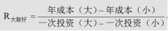

下列选项中，属于反映方案技术条件指标的一项是（）。

A.施工专业化协作  (正确)
B.设计生产能力
C.钢结构构件最大吊装起重量
D.装配式构件预制率
解析：
BCD选项均为反应技术特性指标，所以排除 【知识点】新技术应用方案的技术分析 【考点】技术条件指标 【考查方向】概念释义 【难度】易 【题库维护】yxf

新技术应用方案的技术分析是通过对其技术特性和条件指标进行对比与分析完成的，下列指标中，属于反应方案技术特征的指标是（ &nbsp;&nbsp;）。

A.施工专业化协作
B.方案生产能力  (正确)
C.构配件供应保证率
D.方案占地面积
解析：
新技术应用方案的技术分析，是通过对其方案的技术特性和条件指标进行对比与分析来完成的。反映技术特性的指标如：结构工程中混凝土工艺方案的技术性指标可用现浇混凝土强度、现浇工程总量、最大浇筑量等表示；安装工程则可用安装“构件”总量、最大尺寸、最大重量、最大安装高度等表示。

【知识点】新技术应用方案的技术分析

【考点】技术特性指标

【考察方向】概念释义

【难度】易

【题库维护老师：hejiade】

下列不能反映结构工程中混凝土工艺方案的技术特性的指标的是( &nbsp; )。

A.现浇混凝土强度
B.现浇混凝土总量
C.搅拌机是否供应  (正确)
D.最大浇筑量
解析：
新技术应用方案的技术分析，是通过对其方案的技术特性和技术指标进行对比与分析来完成的。反映技术特性的指标如：结构工程中混凝土工艺方案的技术性指标可用现浇混凝土强度、现浇混凝土总量、最大浇筑量等表示。

【知识点】新技术应用方案的技术经济分析分类

【考点】新技术应用方案的技术经济分析分类

【考查方向】概念释义

【难度】易

【题库维护老师：hejiade】

新技术应用方案的技术分析中，下列不属于反映技术条件指标的是：()

A.对工程质量的保证程度
B.主要材料、构配件等资源是否能保证供应
C.能否降低物质消耗  (正确)
D.主要专业工种工人是否能保证供应
解析：
反映技术条件的指标主要包括：方案占地面积；所需的主要材料、构配件等资源是否能保证供应；所需的主要专用设备是否能保证供应；所需的施工专业化协作、主要专业工种工人是否能保证供应；采用的方案对工程质量的保证程度，对社会运输能力的要求及能否得到服务，对市政公用设施的要求及能否得到服务；采用的方案可能形成的施工公害或污染情况；采用的方案抗拒自然气候条件影响的能力；采用的方案要求的技术复杂程度和难易程度以及对技术准备工作的要求，施工的安全性；采用的方案对前导工序的要求和为后续工序创造的条件等表示。故选项C正确。

【知识点】新技术应用方案的技术分析

【考点】技术条件指标

【考查方向】概念释义

【难度】易

【题库维护老师：hejiade】

在进行新技术应用方案技术比较分析时，分析的内容主要包括()。

A.应用方案技术来源的可得性，若采用引进技术或专利，应比较所需费用  (正确)
B.应用方案是否符合节能、环保的要求  (正确)
C.计算增量投资收益率，判断对比方案相对经济效果
D.应用方案对工程质量的保证程度  (正确)
E.应用方案各工序间的合理衔接，工艺流程是否通畅、简捷  (正确)
解析：
在进行技术应用方案技术比较分析时，一般从以下几个方面着手： 1.分析与实施工程相关的国内外新技术应用方案，比较优缺点和发展趋势，选择先进适用的应用方案。 2.拟采用的新技术和新工艺应用方案应与采用的原材料相适应；新材料应用方案应与采用的工艺技术相适应。 3.分析应用方案的技术来源的可得性，若采用引进技术或专利，应比较所需费用。 4.分析应用方案是否符合节能、环保的要求。 5.分析应用方案对工程质量的保证程度。 6.分析应用方案各工序间的合理衔接，工艺流程是否通畅、简捷。

【知识点】新技术应用方案的技术经济分析分类

【考点】新技术应用方案的技术经济分析分类

【考查方向】概念释义

【难度】易

【题库维护老师：hejiade】

现有两个技术方案，旧方案需投资100万元，年生产成本30万元；在相同条件下，新方案需投资150万元，年生产成本22万元。已知基准投资收益率为10%，则（ &nbsp;）。

A.应选择旧方案
B.应选择新方案  (正确)
C.新旧两方案均可选择
D.新旧两方案都不可行
解析：
方案折算费用=生产成本+投资额×基准收益率  R=（30-22）/（150-100）=0.16&gt;10%，则选择新方案。 【知识点】新技术应用方案的技术分析 【考点】新技术应用方案的技术分析 【考查方向】计算 【难度】易 【题库维护】yxf

