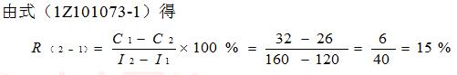
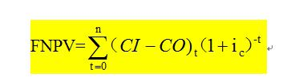
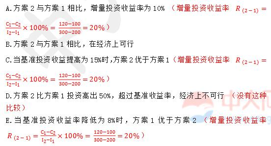

某施工项目有两个工艺方案：方案1需投资2000万元，年生产成本500万元；方案2与方案1应用环境 相同，需投资2800万元，年生产成本400万元。则两方案相比较的增量投资收益率为（　　）。

A.18.75%
B.12.50%  (正确)
C.25.00%
D.16.67%
解析：
所谓增量投资收益率就是增量投资所带来的经营成本（或生产成本）上的节约与增量投资之比。

现设I1、I2分别为旧、新方案的投资额，C1、C2为旧、新方案的经营成本（或生产成本）。

如I2＞I1，C2＜C1，则增量投资收益率R（2-1）为：

R（2-1）=C1-C2/（I2-I1）×100%

当R（2-1）大于或等于基准投资收益率时，表明新方案是可行的；当R（2-1）小于基准投资收益率时，则表明新方案是不可行的。

此题：设I2=2800，I1=2000，C2=400，C1=500，则R=（500-400）/（2800-2000）×100%=12.5%

【知识点】增量投资收益率法

【考点】增量投资收益率法

【考查方向】公式计算

【难度】难

【题库维护老师：hejiade】

某生产性企业若对原工艺方案进行改造需要投资100万元，改造后年运行成本50万元；若采用全新工艺方案需要投资200万元，年运行成本40万元，设基准投资收益率为12%。则两方案相比较的增量投资收益率为（ &nbsp; &nbsp;）。

A.5%
B.10%  (正确)
C.15%
D.20%
解析：
R（2-1）= （C1-C2）/（I2-I1）×100%带入数值为（50-40）/（200-100）=10%。

【知识点】增量投资收益率法

【考点】增量投资收益率法

【考查方向】公式计算

【难度】易

【题库维护老师：hejiade】

某工程施工有新、旧两个技术方案可供选择，新技术方案需投资200万元，年生产成本为35万元；旧技术方案需投资130万元，年生产成本为45万元。设基准投资收益率为12％，则关于新旧技术方案说法正确的是( &nbsp; )

A.新方案优于旧方案  (正确)
B.旧方案优于新方案
C.两个方案的经济效果相同
D.两个方案的折算费用相同
解析：
所谓增量投资收益率就是增量投资所带来的经营成本(或生产成本)上的节约与增量投资之比。现设I1、I2分别为旧、新方案的投资额，C1、C2为旧、新方案的经营成本(或生产成本)。如I2＞I1，C2＜C1，则增量投资收益率的计算公式：R(2－1)＝(C1－C2)/(I2－I1)×100％，当R(2－1)大于或等于基准投资收益率时，表明新方案是可行的；当R(2－1)小于基准投资收益率时，则表明新方案是不可行的。代入数据计算可得R(2－1)＝(45－35)/(200－130)×100％＝14.3％＞12％，表明新技术方案在经济上可行，优于旧技术方案。若采用折算费用法，其计算公式：Zj＝Cj＋Pj·Rc，在多方案比较时，可以选择折算费用最小的方案，即min{Zj}为最优方案。新方案的折算费用Z新＝35＋200×12％＝59(万元)。旧方案的折算费用Z旧＝45＋130×12％＝60.6(万元)，Z新＜Z旧，故新方案经济效果优于旧方案。 

【知识点】增量投资收益率法

【考点】增量投资收益率法

【考查方向】公式计算

【难度】中等

【题库维护老师：hejiade】

某原技术方案的投资额为120万元，年生产成本为32万元，新技术方案的投资为160万元，年生产成本为26万元，设基准收益率为12%，则增量投资收益率是( &nbsp; &nbsp;)，新方案( &nbsp; &nbsp;)。

A.10%，不可行
B.15%，可行  (正确)
C.10%，可行
D.15%，不可行
解析：
增量投资收益率公式应用R=（32-26）/(160-120)*100%=15%

15%&gt;12%

当R 大于或等于基准投资收益率时，表明新方案是可行的；当 R小于基准投资收益率时，则表明新方案是不可行的。

【知识点】增量投资收益率法

【考点】增量投资收益率法

【考查方向】公式计算

【难度】中等

【题库维护老师：hejiade】

某企业拟引进新生产线，已知新生产线的投资额为400万元，新生产线的经营成本为每年12万元；旧生产线的投资额为300万元，经营成本为每年14万元。该行业的基准投资收益率为2.5%，则下列说法正确的有()。

A.引进后的增量投资收益率为1%
B.引进后的增量投资收益率为2%  (正确)
C.引进后的增量投资收益率为2.5%
D.应引进该生产线
E.不应引进该生产线  (正确)
解析：
引进后增量投资收益率=经营成本节约额／投资增加额=（14-12）／(400-300)=2%&lt;2.5%（该行业的基准投资收益率），应选择投资小的方案，即不应引进该生产线。故选项B、E正确。

【知识点】增量投资收益率法

【考点】增量投资收益率法

【考查方向】公式计算

【难度】中等

【题库维护老师：hejiade】

某企业计划改进生产工艺。若在原生产工艺的基础上进行改造更新（方案甲），则需要投资150万元，改造后年运行成本120万元；若采用全新的生产工艺（方案乙），则需要一次性投资270万元，更新后年运行成本80万元。基准收益率为15%，则从经济效果上看，下列选项说法正确的是（）。

A.应选择方案甲
B.应选择方案乙  (正确)
C.方案甲与方案乙效果相同
D.方案甲与方案乙均不可行
解析：
 根据上式：R=（120-80）/（270-150）=33.33%&gt;15%，所以选择新方案。 【知识点】增量投资收益率法 【考点】增量投资收益率法 【考查方向】计算 【难度】易 【题库维护】yxf

某工程施工有两个技术方案可供选择，甲方案需投资190万元，年生产成本为42万元；乙方案需投资210万元，年生产成本为40万元。设基准投资收益率为12%。若采用增量投资收益率评价方案，则( &nbsp; )。

A.甲方案优于乙方案  (正确)
B.乙方案优于甲方案
C.甲乙两个方案的效果相同
D.甲乙两个方案的折算费用相同
解析：
增量投资收益率就是增量投资所带来的经营成本(或生产成本)上的节约与增量投资之比。根据增量投资收益率公式，低于基准投资收益率，故投资额较小方案为优。

【知识点】增量投资收益率法

【考点】增量投资收益率法

【考查方向】公式计算

【难度】中等

【题库维护老师：hejiade】

某工程施工现有两个对比技术方案。方案一是过去应用过的，需投资120万元，年生产成本为32万元；方案二是新技术方案，在与方案一应用环境相同的情况下，需投资160万元，年生产成本为26万元。设基准投资收益率为12%，该新技术方案的增量投资收益率为()。

A.10%
B.15%  (正确)
C.20%
D.25%
解析：

【知识点】增量投资收益率法

【考点】增量投资收益率法

【考查方向】公式计算

【难度】中等

【题库维护老师：hejiade】

在财务评价中，如果方案可以考虑接受，则投资收益率应大于（ &nbsp; ）。

A.财务净现值率
B.银行贷款利率
C.基准投资收益率  (正确)
D.银行存款利率
解析：
所谓增量投资收益率就是增量投资所带来的经营成本（或生产成本）上的节约与增量投资之比。

现设I1、I2分别为旧、新方案的投资额，C1、C2为旧、新方案的经营成本（或生产成本）。

如I2＞I1，C2＜C1，则增量投资收益率为R（2-1） 

 

当R(2-1)大于或等于基准投资收益率时，表明新方案是可行的；当R(2-1) 小于基准投资收益率时，则表明新方案是不可行的。

 

【知识点】增量投资收益率法

【考点】增量投资收益率法

【考查方向】公式计算

【难度】易

【题库维护老师：hejiade】

某工程施工现有两个对比的技术方案，方案1需投资200万元，年生产成本120万元；方案2与方案1应用环境相同的情形下，需投资300万元，年生产成本100万元。设基准投资收益率为10%，采用增量投资收益率法选择方案，正确的有( &nbsp; &nbsp;)。

A.方案2与方案1相比，增量投资收益率为10%
B.方案2与方案1相比，在经济上可行  (正确)
C.当基准投资收益提高为15%时，方案2优于方案1  (正确)
D.方案2比方案1投资高出50%，超过基准收益率，经济上不可行
E.当基准投资收益率降低为8%时，方案1优于方案2
解析：
本题考查的是增量投资收益率的概念。 

【知识点】增量投资收益率法

【考点】增量投资收益率的概念

【考查方向】公式计算

【难度】难

【题库维护老师：hejiade】

