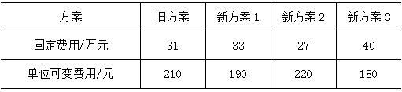
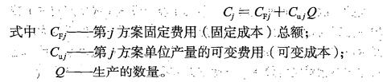

某工地欲加工4000吨钢筋，现有两个方案，甲方案为现场加工，固定费用10万元，每吨钢筋加工费用200元；方案乙为外包，每吨钢筋加工费用300元，无需固定费用。则（ &nbsp;）。

A.应选择甲方案  (正确)
B.应选择乙方案
C.新旧两方案均可选择
D.新旧两方案都不可行
解析：
计算两个方案的总费用： 甲方案：10+200×0.4=90万元 乙方案：0+300×0.4=120万元 【知识点】折算费用法 【考点】折算费用法 【考查方向】计算 【难度】易 【题库维护】yxf

工地欲加工一批钢筋，现有两个方案，甲方案为现场加工，固定费用10万元，每吨钢筋加工费用200元；方案乙为外包，每吨钢筋加工费用300元，无需固定费用。则当加工数量（ &nbsp;）时，应选择方案乙。

A.不超过2000吨
B.达到1000吨以上
C.不超过1000吨  (正确)
D.达到2000吨以上
解析：
计算两个方案的总费用：  甲方案：10w+200Q，乙方案：300Q。  欲选择方案乙，则需该方案花钱少 【知识点】折算费用法 【考点】折算费用法 【考查方向】计算 【难度】易 【题库维护】yxf

某施工项目有四个可选择的技术方案，其效果相同。方案一：需要投资240万元，年生产成本为64万元；方案二：需要投资320万元，年生产成本为52万元；方案三：需要投资360万元，年生产成本为45万元；方案四：需要投资400万元，年生产成本为36万元。不考虑税收因素，当基准投资收益率为12%时，运用折算费用法选择的方案应是（ &nbsp;）。

A.方案一
B.方案二
C.方案三
D.方案四  (正确)
解析：
采用方案需要增加投资时，比较各方案年折算费用的大小选择方案： 【计算公式】Zj=Cj+Pj×Rc； Zj：第j方案的年折算费用； Cj：第j方案的年生产成本； Pj：用于第j方案的投资额（包括建设投资和流动资金）；Rc：准投资收益率。 在多方案比较时，可以选择年折算费用最小的方案为最优方案。 方案一：Z1=C1+P1×Rc=64+240*12%=92.8万元； 方案二：Z2=C2+P2×Rc=52+320*12%=90.4万元； 方案三：Z3=C3+P3×Rc=45+360*12%=88.2万元； 方案四：Z4=C4+P4×Rc=36+400*12%=84万元； 方案四的年折算费用最小，故方案四最优。

【知识点】折算费用法

【考点】折算费用法

【考查方向】公式计算

【难度】易

【题库维护老师：hejiade】

某建设工程有4个实施方案可供选择，方案一的投资额是100万元，年运行成本为15万元；方案二的投资额是110万元，年运行成本为18万元；方案三的投资额是125万元，年运行成本为11万元；方案四的投资额是130万元，年运行成本为16万元。各方案的应用环境相同，设基准投资率为8％，则采用折算费用法选择的最优方案是（ &nbsp; &nbsp;）。

A.方案一
B.方案三  (正确)
C.方案二
D.方案四
解析：
折算费用法的计算公式为：Zj＝Cj＋Pj•Rc，式中，Zj表示第j方案的折算费用；Cj表示第j方案的生产成本；Pj表示用于第j方案的投资额（包括建设投资和流动资金）；Rc表示基准投资收益率。本题的计算过程为：方案一的折算费用＝15＋100×8％＝23万元；方案二的折算费用＝18＋110×8％＝26.8万元；方案三的折算费用＝11＋125×8％＝21万元；方案四的折算费用＝16＋130×8％＝26.4万元。选择折算费用最小的方案为最优方案，故应选择方案三。

【知识点】折算费用法

【考点】折算费用法

【考查方向】公式计算

【难度】中等

【题库维护老师：hejiade】

某施工现场钢筋加工有两个方案，均不需要增加投资。采用甲方案固定费用50万元，每吨钢筋加工的可变费用是300元；采用乙方案需固定费用90万元，每吨钢筋加工的可变费用是250元。现场需加工钢筋1万t，如果用折算费用法选择方案，则（ &nbsp; &nbsp;）。

A.甲乙两个方案的费用相同
B.甲乙两个方案在经济上均不可行
C.应该选用甲方案
D.应该选用乙方案  (正确)
解析：
本题中运用折算费用法选择方案的过程如下：甲方案＝50＋300×1＝350万元；乙方案＝90＋250×1＝340万元。在方案比较时，应选择折算费用小的方案，甲方案大于乙方案，因此应选择乙方案。

【知识点】折算费用法

【考点】折算费用法

【考查方向】公式计算

【难度】中等

【题库维护老师：hejiade】

    某工程有四个实施方案可供选择，各方案的应用环境相同。甲、乙、丙、丁，四个方案的投资额依次是60万元、80万元、100万元、120万元；四个方案的年运行成本依次是16万元、13万元、10万元和6万元。若基准投资率为10%，则采用折算费用法的最优方案为（ &nbsp; &nbsp;）。

A.丁  (正确)
B.甲
C.乙
D.丙
解析：
四个方案的折算费用依次为：Z（甲）=16+60×10%=22（万元）；Z（乙）=13+80×10%=21（万元）；Z（丙）=10+100×10%=20（万元）；Z（丁）=6+120×10%=18（万元）。因此，丁方案最佳

【知识点】折算费用法

【考点】折算费用法

【考察方向】公式计算

【难度】中等

【题库维护老师：ZKQ】

某施工项目现有两个对比工艺方案，甲方案是过去曾经应用过的，乙方案是新方案，两方案均不需增加投资。但应用甲方案需固定费用60万元，单位产量的可变费用300元；应用乙方案需固定费用80万元，单位产量的可变费用250元。设生产数量为10000个单位，运用折算费用法选择方案，则( &nbsp; &nbsp;)。

A.应该采用甲方案
B.甲、乙方案经济效益相同
C.应该采用乙方案  (正确)
D.不能判断应该采用哪个方案
解析：
Z甲=C甲=CF甲+Cu甲Q=60+300×1=360万元 Z乙=C乙=CF乙+Cu乙Q=80+250×1=330万元，因为Z甲＞Z乙，表明乙方案的经济效益好于甲方案。故选C。

【知识点】折算费用法

【考点】折算费用法

【考查方向】公式计算

【难度】中等

【题库维护老师：hejiade】

已知某新技术应用方案的投资额为200万元，年工程成本为20万元，基准收益率为12%，则该方案的折算费用为( &nbsp; &nbsp; )万元。

A.44.00  (正确)
B.12.40
C.26.67
D.53.00
解析：
Zj=Cj+Pj×Rc=(20+200×12%)=44万

【知识点】折算费用法

【考点】折算费用法

【考查方向】公式计算

【难度】易

【题库维护老师：hejiade】

某企业欲从国外引进甲或乙两种先进技术，假如两种技术的生产效率相同，引进甲技术的一次性投资为300万元，年生产成本为20万元，引进乙技术的一次性投资为400万元，年生产成本为10万元，设基准收益率为6%，则( &nbsp; &nbsp;)。

A.应该引进乙技术  (正确)
B.甲、乙技术经济效益相同
C.应该引进甲技术
D.不能判断应该引进哪种技术
解析：
用折算费用法比较两方案的费用：Z甲=20+300×6%=38（万元）；Z乙=10+400×6% =34（万元），Z乙&lt;Z甲，故选乙方案。

【知识点】折算费用法

【考点】折算费用法

【考查方向】公式计算

【难度】易

【题库维护老师：hejiade】

已知某新技术应用方案的投资额为100万元，年工程成本为20万元，基准投资收益率为12%，则该方案的折算费用为( &nbsp; )万元。

A.32.00  (正确)
B.102.40
C.206.67
D.853.23
解析：
折算费用=方案工程成本+方案投资额X基准收益率Zj=Cj+Pj×Rc=20+100×12%=32万。

【知识点】折算费用法

【考点】折算费用法

【考查方向】公式计算

【难度】中等

【题库维护老师：hejiade】

某施工企业欲引进施工工艺，预计年工程产量为10000立方米。甲工艺的年固定成本为500万元，单位工程量变动成本为200元；乙工艺的年固定成本为600万元，单位工程量变动成本为120元，则（ &nbsp; &nbsp;）。

A.应该引进甲工艺  (正确)
B.应该引进乙工艺
C.都可以
D.无法判断
解析：
此题考核的是折算费用法的具体应用。 根据折算费用法计算公式计算得： 甲：500+1*200=700（万元）； 乙：600+1*120=720（万元）。 甲工艺费用低于乙工艺，所以应该引进甲工艺。

【知识点】折算费用法

【考点】折算费用法

【考查方向】公式计算

【难度】易

【题库维护老师：hejiade】

某项目施工所需机械有两种方案满足要求。方案一为购置方案,购置费用120万元,单位产量可变费用为500元;方案二为租赁方案,单位产量可变费用为800元。关于机械方案选择的说法,正确的是( &nbsp; &nbsp;)。

A.施工数量大于2400小于4000个生产单位时,应选择方案一
B.施工数量大于4000个生产单位时,应选择方案二
C.施工数量为2400个生产单位时,应选择方案一或方案二
D.施工数量为4000个生产单位，可选择方案一或方案二  (正确)
解析：
Q0= =（0-1200000）/（500-800）=4000(生产单位) 当产量Q&gt;4000时，方案1优；当产量Q&lt;4000时，方案2优，当处于临界产量4000时，方案一方案二都是可以的。所以本题选择D。

【知识点】折算费用法

【考点】折算费用法

【考查方向】公式计算

【难度】中等

【题库维护老师：hejiade】

某企业欲引进生产线，预计年产量为800万件。若引进甲生产线，其固定成本为400万元，单位产品可变成本为0.6元；若引进乙生产线，其固定成本为500万元，单位产品可变成本为0.4元，则下列说法正确的是()。

A.应该引进甲生产线
B.应该引进乙生产线  (正确)
C.甲乙生产线都不引进
D.无法判断应该引进哪一条生产线
解析：
采用甲生产线，总成本为C甲=400+800×0.6=880万元；采用乙生产线，总成本为C乙,=500+800×0.4=820万元；C乙&lt;C甲，说明采用乙生产线总成本低，应引进乙生产线。故选项B正确。

【知识点】折算费用法

【考点】折算费用法

【考查方向】公式计算

【难度】中等

【题库维护老师：hejiade】

当方案的有用成果相同时，决定方案优劣和取舍，一般可比较（）。

A.费用的大小  (正确)
B.投资额的大小
C.经营成本的大小
D.总产量的大小
解析：
    当方案的有用成果相同时，一般可通过比较费用的大小，来决定优劣和取舍。

    【知识点】折算费用法

    【考点】折算费用法

    【考查方向】概念释义

    【难度】中等

    【题库维护老师：hejiade】

某企业欲从国外引进先进技术，现有甲、乙两种技术方案可选。假如两种技术的生产效率相同，引进甲技术的一次性投资为300万元，年生产成本为20万元；引进乙技术的一次性投资为400万元，年生产成本为10万元。设基准收益率为6%，则下列说法正确的是()。

A.应该引进甲技术
B.甲、乙技术经济效益相同
C.应该引进乙技术  (正确)
D.不能判断应该引进哪种技术
解析：
用折算费用法比较两方案的费用：Z甲=20+300×6%=38（万元）；Z乙=10+400×6%=34(万元)，Z乙&lt;Z甲，故选乙方案。

【知识点】折算费用法

【考点】折算费用法

【考查方向】公式计算

【难度】中等

【题库维护老师：hejiade】

某施工企业欲引进施工工艺，预计年工程产量为10000m。甲工艺的年固定成本为500万元，单位工程量变动成本为200元；乙工艺的年固定成本为600万元，单位工程量变动成本为120元，则( &nbsp; &nbsp;)。

A.应该引进甲工艺  (正确)
B.应该引进乙工艺
C.都可以
D.无法判断
解析：
折算费用法计算得：甲：500+1×200=700(万元)；乙：600+1×120=720(万元)。

【知识点】折算费用法

【考点】折算费用法

【考查方向】公式计算

【难度】易

【题库维护老师：hejiade】

某企业现有新旧四套生产方案，四种方案均不需要增加投资，各方案所需固定费用和单位可变费用如下表所示，当生产数量为5000个单位时，在经济上最可行的方案是( &nbsp; ) 

A.旧方案
B.新方案1  (正确)
C.新方案2
D.新方案3
解析：
本题可采用折算费用法对方案进行选择，已知四种方案均不增加投资，则Zj＝Cj通过比较各方案生产成本的大小选择方案。Zj＝Cj＝CFj＋CujQ，式中CFj——第j方案固定费用(固定成本)总额；Cuj——第j方案单位产量的可变费用(可变成本)；Q——生产的数量。代入数据计算可得：四个方案生产成本分别为136万元、128万元、137万元、130万元。其中新方案1生产成本最低，在经济上是最可行的。

【知识点】1Z101073 新技术、新工艺和新材料应用方案的经济分析

【考点】折算费用法

【考查方向】公式计算

【难度】易

【题库维护老师：hejiade】

某企业欲使用一批预制构件，若自行加工，需固定费用100万元，且每生产一个预制构件需单独消耗500元；若将改预制构件加工任务外包，则无需固定费用，每个预制构件加工费900元。在此情况下，下列选项正确的是（）。

A.自行加工方案优于外包方案
B.外包方案优于自行加工方案
C.预制构件用量超过2000个时，应选择自行加工方案
D.预制构件用量少于2500个时，应选择外包方案  (正确)
解析：
 1000000+500Q＞900Q，Q＜2500。所以，选择D选项。 

【知识点】折算费用法

【考点】折算费用法

【考查方向】计算

【难度】易

【题库维护】yxf

