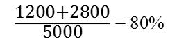
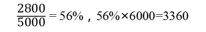

某承包公司与业主签订了一份修筑公路的合同，公路总长度为15公里，总造价45亿元，第1年完成了4公里，第2年完成了8公里，则第2年合同完工进度是（）。

A.80%  (正确)
B.20%
C.26.67%
D.53.33%
解析：
本题考查的是建造合同收入的确认。根据完工百分比法（产出衡量法），并结合当年的累计完工进度，则有第2年的合同完工进度=（4+8）/15=80%。 【知识点】建造（施工）合同收入的确认 【考点】建造（施工）合同收入的确认

某造价合同总价为6000万元，合同工期3年，若第一年完工进去为20%，第二年完工进度为60%，第三年工程全部完工交付使用。则第三年应确认的合同收入为（ &nbsp;&nbsp;）万元。

A.6000
B.3600
C.2400  (正确)
D.1200
解析：
当期完成的建造合同，应当按照实际合同总收入扣除以前会计期间累计已确认收入后的金额，确认为当期合同收入。同时，按照累计实际发生的合同成本扣除以前会计期间累计已确认费用后的金额，确认为当期合同费用。

由题意，第1年确认的合同收入＝6000×20％＝1200（万元）；第2年确认的合同收入＝6000×60％－1200＝2400（万元）；第3年确认的合同收入＝6000×（1－60％）＝2400（万元）。

【知识点】建造(施工)合同收入的确认

【考点】现浇混凝土结构质量验收

【考察方向】公式计算

【难度】易

【题库维护老师：ZKQ】

《企业会计准则第15号--建造合同》中推行的确认合同收入和结转成本费用的方法是（ &nbsp;&nbsp;）。

A.完工百分比法  (正确)
B.竣工结算法
C.分段结算法
D.按月结算法
解析：
本题考查的是工程成本核算的程序。根据《企业会计准则-建造合同》，推行“<strong>完工百分比法</strong>”确认工程收入和结转成本费用。

【知识点】建造(施工)合同收入的确认

【考点】建造(施工)合同收入的确认

【考察方向】概念释义

【难度】易

【题库维护老师：ZKQ】

某跨年度建设项目合同总造价50000万元，预计总成本40000万元，2013年资产负债表日累计确认收入30000万元，2014年资产负债表日工程已完成总进度的90%，则2014年应确认的合同收入为（ &nbsp;&nbsp;）万元。

A.6000
B.15000  (正确)
C.27000
D.45000
解析：
当期完成的建造（施工）合同收入应当按照实际合同总收入扣除以前会 计期间累计已确认收入后的金额，确认为当期合同收入，即：当期确认的合同收入=实际合同总收入一以前会计期间累计已确认收入。50000 X 90% - 30000=15000(万元)

【知识点】建造(施工)合同收入的确认

【考点】合同结果能够可靠估计时建造(施工)合同收入的确认

【考察方向】公式计算

【难度】易

【题库维护老师：ZKQ】

根据《企业会计准则》，若企业在资产负债表日提供劳务交易结果不能够可靠估计，且已经发生的劳务成本预计不能的得到补偿，则收入确认的方式是（ &nbsp;&nbsp;）。

A.按照已经发生的劳务成本确认收入
B.按照合同金额确认收入
C.不确认提供劳务收入  (正确)
D.按合同完工百分比确认收入
解析：
不管是建造合同收入，还是劳务收入，一旦结果不能可靠估计，则不能采用完工百分比法计算收入，应根据能收回多少确认多少，本题中<strong>已经发生的劳务成本预计不能得到补偿</strong>，所以本着谨慎性原则，<strong>不确认收入</strong>。

【知识点】建造{施工)合同收入的确认

【考点】建造{施工)合同收入的确认

【考察方向】概念释义

【难度】中等

【题库维护老师：ZKQ】

某施工企业签订了总造价为2000万元的固定总价合同,工期为2年。经测算,第1年完工进度为60%,实际收到工程结算款1000万元;第2年工程全部完工。则按完工百分比法确认该企业第2年的收入为（ &nbsp;）万元。

A.800  (正确)
B.1000
C.1200
D.2000
解析：
本题考察的是建造(施工)合同收入的确认，该企业第2年的收入=(合同总收入×完工进度)-以前会计期间累计已确认的收入=2000*100%-2000*60%=800万元。

【知识点】建造（施工)合同收入的确认

【考点】建造（施工)合同收入的确认

【考查方向】公式计算

【难度】中等

【题库维护老师：hejiade】

利用完工百分比法确定建造（施工）合同完工进度的方法不包括（）。

A.根据实际合同收入与预计收入的比例确定  (正确)
B.根据累计实际发生的合同成本占合同预计总成本的比例确定
C.根据已完成合同工作的技术测量确定
D.根据已经完成的合同工作量占合同预计总工作量的比例确定
解析：
完工百分比法是指根据合同完工进度来确认合同收入与费用的方法。完工百分比法的运用分两个步骤：第一步，确定工程的完工进度，计算出完工百分比；第二步，根据完工百分比确认和计量当期的合同收入。确定建造（施工）合同完工进度有以下三种方法：(1）根据累计实际发生的合同成本占合同预计总成本的比例确定；（2）根据已经完成的合同工作量占合同预计总工作量的比例确定；（3）根据已完成合同工作的技术测量确定。

【知识点】建造（施工)合同收入的确认

【考点】合同结果能够可靠估计时建造(施工)合同收入的确认

【考查方向】概念释义

【难度】易

【题库维护老师：hejiade】

某施工企业与业主订立的一项总造价为5000万元的施工合同，合同期为3年，第一年实际发生合同成本1600万元，年末预计为完成合同尚需发生成本3000万元，则第一年合同完工进度为（ &nbsp; ）。

A.92.0%
B.34.8%  (正确)
C.53.3%
D.32.0%
解析：
本题考查完工百分比法。完工百分比法是指根据合同完工进度来确认合同收入与费用的方法。

根据累计实际发生的合同成本占合同预计总成本的比例确定=1600÷（1600＋3000）=34.8%

【知识点】建造（施工)合同收入的确认

【考点】合同结果能够可靠估计时建造(施工)合同收入的确认

【考查方向】公式计算

【难度】中等

【题库维护老师：hejiade】

某施工企业签订一项总金额为1000万元的建造合同，工期3年。经统计，第1年完工进度为30%，第2年完工进度为50%，第3年工程全部完工，则第3年应确认的合同收入为( &nbsp; )万元。

A.200
B.500  (正确)
C.800
D.1000
解析：
本题考查完工百分比法。完工百分比法是指根据合同完工进度来确认合同收入与费用的方法。

需要注意的是，第2年完工进度为50%，是到第二年，两年时间一共完成了整个项目的50%。容易出错。 

第三年应确认的合同收入：(1－50%)×1000＝500(万元)。

【知识点】建造（施工)合同收入的确认

【考点】合同结果能够可靠估计时建造(施工)合同收入的确认

【考查方向】公式计算

【难度】中等

【题库维护老师：hejiade】

某施工企业签订一项总金额为1000万元的建造合同，工期3年。经统计，第1年完工进度为30%，第2年完工进度为80%，第3年工程全部完工，则第3年应确认的合同收入为( &nbsp; )万元。

A.100
B.200  (正确)
C.800
D.1000
解析：
本题考查完工百分比法。完工百分比法是指根据合同完工进度来确认合同收入与费用的方法。

需要注意的是，第2年完工进度为80%，是到第二年，两年时间一共完成了整个项目的80%。容易出错。

第三年应确认的合同收入：(1－80%)×1000＝200(万元)。

【知识点】建造（施工)合同收入的确认

【考点】完工百分比法

【考查方向】公式计算

【难度】中等

【题库维护老师：hejiade】

根据会计准则，下列不属于判断提供劳务的交易结果能否可靠估计的条件是( &nbsp; )。

A.收入的金额能够可靠地计量
B.交易的完工进度能够可靠地确定
C.相关的经济利益很可能流入企业
D.企业已将商品所有权上的主要风险和报酬转换给购货方  (正确)
解析：
根据《企业会计准则》，提供劳务交易的结果能够可靠估计，是指同时满足下列条件：

(1)收入的金额能够可靠地计量；

(2)相关的经济利益很可能流入企业；

(3)交易的完工进度能够可靠地确定；

(4)交易中已发生和将发生的成本能够可靠地计量。

【知识点】建造（施工)合同收入的确认

【考点】建造（施工)合同收入的确认

【考查方向】概念释义

【难度】易

【题库维护老师：hejiade】

某建筑业企业与B交通局签订修建一条180km公路的建造(施工)合同，合同约定工程总造价为60000万元，建设期为3年。该建筑公司第1年修建了70km，第2年修建了85km。则第2年合同完工进度为( &nbsp; )。

A.38.9%
B.47.2%
C.77.3%
D.86.1%  (正确)
解析：
本题的计算过程为：第1年合同完工进度＝70／180×100%＝38.89%；第2年合同完工进度＝(70＋85)／180×100%＝86.1%。

【知识点】建造（施工)合同收入的确认

【考点】建造（施工)合同收入的确认

【考查方向】公式计算

【难度】中等

【题库维护老师：hejiade】

某承包商与业主就某一建筑工程项目，签订了总造价为5000万元的合同，合同约定工期为3年。假定经计算后第1年完工进度为25％，第2年完工进度为75％，第3年该工程全部完成交付使用。则第2年确认的合同收入是( &nbsp; )万元。

A.1250
B.1750
C.2250
D.2500  (正确)
解析：
当期完成的建造(施工)合同收入应当按照实际合同总收入扣除以前会计期间累计已确认收入后的金额，确认为当期合同收入。

其计算公式：当期确认的合同收入＝实际合同总收入－以前会计期间累计已确认收入。第1年确认的合同收入为5000×25％＝1250(万元)；第2年确认的合同收入为5000×75％－1250=2500(万元)。

【知识点】建造（施工)合同收入的确认

【考点】建造（施工)合同收入的确认

【考查方向】公式计算

【难度】中等

【题库维护老师：hejiade】

某施工单位与某开发商签订了一项总造价为6000万元的建造合同，合同约定工期为3年，第1年实际发生合同成本1500万元，年末预计为完成合同尚需发生成本3500万元，第2年实际发生合同成本2100万元，年末预计为完成合同尚需发生成本1400万元，则第1年和第2年的合同完工进度分别为( &nbsp; &nbsp; &nbsp;)。

A.30%, 42%
B.25%，60%
C.30%，72%  (正确)
D.25%, 35%
解析：
合同完工进度=累计实际发生的合同成本/合同预计总成本  则第1年合同完工进度＝1500/(1500+3500)=30% 第2年合同完工进度=(1500+2100)/ (1500+2100+1400)=72%

【知识点】建造{施工)合同收入的确认

【考点】完工百分比法

【考查方向】公式计算

【难度】中等

【题库维护老师：hejiade】

某项工程合同总收入为6000万元，到本期末累计完成工程进度的60%。已知据完工百分比法确认的当期合同收入为1000万元，则上期末累计的合同收入是（ &nbsp; ）。

A.1000万元
B.2600万元  (正确)
C.3600万元
D.4600万元
解析：
上期末累计的合同收入=合同总收入×60%-当期合同收入=6000×60%-1000=2600。 

【知识点】建造（施工)合同收入的确认

【考点】建造（施工)合同收入的确认

【考查方向】公式计算

【难度】易

【题库维护老师：hejiade】

某工程合同总收人为3000万元，到本期末累计完工进度为60%，已经确认的合同收入为1000万元，则依据完工百分比法本期还应确认的收入为( &nbsp; &nbsp;)万元。

A.1800
B.1200
C.800  (正确)
D.1600
解析：
本期应确认的收入=3000×60%-1000=800（万元）。 知识点：工程成本的确认和结算方法

【知识点】建造（施工）合同收入的确认

【考点】合同结果能够可靠估计时建造(施工)合同收入的确认——完工百分比法

【考察方向】概念释义

【难度】易

【题库维护老师：ZKQ】

根据《企业会计准则第15号—建造合同》，判断成本加成合同的结果能够可靠计量，至少需同时具备的条件有（ &nbsp;&nbsp;）。

A.与合同相关的经济利益很可能流入企业  (正确)
B.合同总收入能够可靠的计量
C.为完成合同尚需发生的成本能够可靠地确定
D.合同奖励金额能够可靠地计量
E.实际发生的合同成本能够清楚地区分和可靠地计量  (正确)
解析：
成本加成合同的结果能否可靠估计，依据以下两个条件进行判断，如果同时满足两个 条件，则成本加成合同的结果能够可靠估计：

（1)<strong>与合同相关的经济利益很可能流入企业</strong>；（2) <strong>实际发生的合同成本</strong>能够<strong>清楚地区分和可靠地计量</strong>。如果不同时满足两个条件，则成本加成合同的结果不能可靠地估计。

【知识点】建造(施工)合同收入的确认

【考点】合同结果能够可靠估计时建造(施工)合同收入的确认

【考察方向】原文挖空

【难度】易

【题库维护老师：ZKQ】

根据《企业会计准则第15号—建造合同》，按累计实际发生的合同成本占合同预计总成本的比例确定合同完工进度时，累计实际发生的合同成本不包括（ &nbsp;&nbsp;）。

A.已订立采购合同但尚未运抵现场的材料成本  (正确)
B.已采购进场但施工中尚未安装的材料成本  (正确)
C.在分包工程的工作量完成之前预付给分包单位的款项  (正确)
D.已经完成并验收合格的设备安装工程的价款
E.已经完成并验收合格的分包工程的合同价款
解析：
累计实际发生的合同成本不包括<strong>施工中尚未安装或使用的材料成本</strong>等与合同未来活动相关的合同成本，也不包括在<strong>分包工程的工程量完成之前预付给分包单位的款项</strong>。

【知识点】建造(施工)合同收入的确认

【考点】合同结果能够可靠估计时建造(施工)合同收入的确认

【考察方向】概念释义

【难度】易

【题库维护老师：ZKQ】

成本加成合同的结果能够可靠估计应同时具备的条件有( &nbsp; )。

A.合同总收入能够可靠地计量
B.与合同相关的经济利益很可能流入企业  (正确)
C.实际发生的合同成本能够清楚地区分和可靠地计量  (正确)
D.合同完工进度和为完成合同尚需发生的成本能够可靠地确定
E.与合同相关的经济利益确定会流入企业
解析：
建造合同分为固定造价合同和成本加成合同，不同类型的建造合同判断其能否可靠估计的条件也不相同。判断成本加成合同的结果能够可靠估计，需同时具备的条件有：

(1)与合同相关的经济利益很可能流入企业；

(2)实际发生的合同成本能够清楚地区分和可靠地计量。

【知识点】建造（施工)合同收入的确认

【考点】合同结果能够可靠估计时建造(施工)合同收入的确认

【考查方向】概念释义

【难度】易

【题库维护老师：hejiade】

关于建造(施工)合同收入核算的说法，正确的有( )。

A.在确定交易价格时，应当考虑可变对价的影响  (正确)
B.企业代第三方收取的款项应计入交易价格
C.企业预期退还给客户的款项，不计入交易价格  (正确)
D.应计入交易价格的可变对价金额确定后不得变动
E.企业应当在各单项履约义务之间按比例分摊合同折扣  (正确)
解析：
A正确，企业应当根据合同条款，并结合其以往的习惯做法确定交易价格。在确定交易价格时，企业应当考虑可变对价、合同中存在的重大融资成分、非现金对价、应付客户对价等因素的影响。 B错误，C正确，企业代第三方收取的款项以及企业预期将退还给客户的款项，应当作为负债进行会计处理，不计入交易价格。 D错误，每一资产负债表日，企业应当重新估计应计入交易价格的可变对价金额。可变对价金额发生变动的，按照《企业会计准则第14号一一收入》规定进行会计处理。 E正确，企业应当按照分摊至各单项履约义务的交易价格计量收入。

【知识点】建造（施工)合同收入的确认

【考点】建造（施工)合同收入的确认

【考查方向】概念释义

【难度】易

【题库维护老师：hejiade】

确定建造(施工)合同完工进度的方法有( &nbsp; )。

A.根据实际合同收入与预计收入的比例确定
B.根据累计实际发生的合同成本占合同预计总成本的比例确定  (正确)
C.根据已经完成的合同工作量占合同预计总工作量的比例确定  (正确)
D.根据已完成合同工作的技术测量确定  (正确)
E.根据合同初始价格与工程预算价格的比例确定
解析：
确定建造(施工)合同完工进度的方法有：(1)根据累计实际发生的合同成本占合同预计总成本的比例确定；(2)根据已经完成的合同工作量占合同预计总工作量的比例确定；(3)根据已完成合同工作的技术测量确定。

【知识点】建造（施工)合同收入的确认

【考点】建造（施工)合同收入的确认

【考查方向】概念释义

【难度】易

【题库维护老师：hejiade】

某建筑企业与甲公司签订了一项总造价为1400万元的建造合同，建设期为2.5年。第1年，实际发生工程成本550万元，双方均履行了合同规定的义务，但在第1年年末，由于建筑企业对该项工程的完工进度无法可靠的估计，所以与甲公司只办理了工程价款结算470万元，随后甲公司陷入财务危机而面临破产清算，导致其余款项可能无法收回。则关于该合同收入与费用确认的说法，正确的有( &nbsp; )

A.470万元确认为当年的收入  (正确)
B.550万元应确认为当年费用  (正确)
C.合同收入确认方法应采用完工百分比法.
D.1400万元可确认为合同收入
E.80万元应确认为当年费用
解析：
对建造(施工)合同收入进行核算时，要准确地进行合同收入的确认与计量，首先应判断建造合同的结果能否可靠地估计。如果建造合同能够可靠地估计，应在。资产。负债表日根、据完工百分比法确认当期的合同收入。如果建造合同的结果不能可靠地估计，就不能皂根据完工百分比法确认合同收入。此时，应区别以下两种情况进行处理：(1)合同成本能够回收的，合同收入根据能够收回的实际合同成本来确认，合同成本在其发生的当期确认为费用。(2)合同成本不能回收的，应在发生时立即确认为费用，不确认收入。由题意可知第1年实际结算的。工程价款470万元，确认为当年的收入；实际发生的工程成本550万元，应确认为当年费用。

【知识点】建造（施工)合同收入的确认

【考点】合同结果不能可靠地估计时建造(施工)合同收入的确认

【考查方向】概念释义

【难度】易

【题库维护老师：hejiade】

某总造价5000万元的固定总价建造合同，约定工期为3年。假定经计算期第1年完工进度为30%，第2年完工进度为70%，第3年全部完工交付使用。则关于合同收入确认的说法，正确的有( &nbsp; )。

A.第2年确认的合同收入为3500万元
B.第3年确认的合同收入为0
C.第1年确认的合同收入为1500万元  (正确)
D.第3年确认的合同收入少于第2年  (正确)
E.3年累计确认的合同收入为5000万元  (正确)
解析：
第1年确认的合同收入=5000×30%=1500（万元）；

第2年确认的合同收入=5000×70%-1500=2000（万元）；

第3年确认的合同收入=5000-1500-2000=1500（万元）；

3年累计确认的合同收入=1500+2000+1500=5000（万元）。

【知识点】建造（施工)合同收入的确认

【考点】建造（施工)合同收入的确认

【考查方向】公式计算

【难度】难

【题库维护老师：hejiade】

某建设工程合同价6000万元，预计成本5000万元，建设期三年，第一年发生成本1200万元，第二年发生成本2800万元，第三年发生成本1000万元。则第二年的完工进度为（）。

A.24%
B.20%
C.56%
D.80%  (正确)
解析：
 

完工进度是“累计完成到”； 确认合同收入是“本年完成了”。 【知识点】建造（施工）合同收入的确认 【考点】完工百分比法 【考查方向】概念释义 【难度】易 【题库维护老师：yxf】

某建设工程合同价6000万元，预计成本5000万元，建设期三年，第一年发生成本1200万元，第二年发生成本2800万元，第三年发生成本1000万元。则第二年预计合同收入为（）。

A.4000万元
B.4800万元
C.2800万元
D.3360万元  (正确)
解析：
 完工进度是“累计完成到”； 确认合同收入是“本年完成了”。 【知识点】建造（施工）合同收入的确认 【考点】完工百分比法 【考查方向】概念释义 【难度】易 【题库维护老师：yxf】

