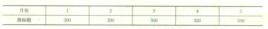
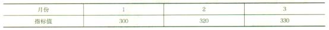
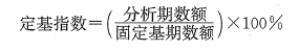
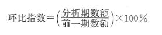

为了说明企业财务状况的变动趋势并预测企业未来发展前景，财务报表分析宜采用的方法是（ &nbsp;）。

A.水平分析法  (正确)
B.因素分析法
C.比率分析法
D.权重分析法
解析：
趋势分析法又称水平分析法，是通过对比两期或连续数期财务报告中相同指标，确定其增减变化的方向、数额和幅度，来说明企业财务状况、经营成果和现金流量变动趋势的分析方法。采用该方法，可以分析变化的原因和性质，并预测企业未来的发展前景。

【知识点】趋势分析法

【考点】趋势分析法

【考查方向】概念释义

【难度】易

【题库维护老师：hejiade】

在进行财务分析时，可以分析变化的原因和性质，并预测企业未来的发展前景的分析方法是（）。

A.趋势分析法  (正确)
B.比率分析法
C.因素分析法
D.差额分析法
解析：
趋势分析法又称水平分析法，是通过对比两期或连续数期财务报告中相同指标，确定其增减变化的方向、数额和幅度，来说明企业财务状况、经营成果和现金流量变动趋势的分析方法。采用该方法，可以分析变化的原因和性质，并预测企业未来的发展前景。

【知识点】趋势分析法

【考点】趋势分析法

【考查方向】概念释义

【难度】易

【题库维护老师：hejiade】

通过对比连续数期财务报告中相同指标，确定其增减变化的方向、数额和幅度，来说明企业财务状况、经营成果和现金流量变动趋势的分析方法是（ ）。

A.趋势分析法  (正确)
B.比率分析法
C.因素分析法
D.重点审查法
解析：
趋势分析法又称水平分析法，是通过对比两期或连续数期财务报告中相同指标，确定其增减变化的方向、数额和幅度，来说明企业财务状况、经营成果和现金流量变动趋势的分析方法。可以分为定基指数和环比指数两种方法。比率分析法是通过计算各种比率来确定经济活动变动程度的分析方法。比率分析法是财务分析最基本、最重要的方法。常用的比率主要有以下三种：构成比率、效率比率、相关比率。因素分析法主要是对计算的考察，包含连环替代法和差额计算法两种计算方法。

【知识点】趋势分析法

【考点】趋势分析法

【考查方向】概念释义

【难度】易

【题库维护老师：hejiade】

财务报告趋势分析法计算的指数不能直接确定该财务指标变动的( &nbsp;)。

A.方向
B.数额
C.原因  (正确)
D.幅度
解析：
趋势分析法通过对比两期或连续数期财务报告中相同指标得到的是指标变动的数额或者比例，所以指标本身并不能说明变动原因，但通过结合多个指标的关联性可以判定变动的原因及其对企业财务状况、经营成果和现金流量的影响。故正确选项为C。

【知识点】趋势分析法

【考点】趋势分析法

【考查方向】概念释义

【难度】易

【题库维护老师：hejiade】

财务报表趋势分析法对比依据的数据是( &nbsp;)。

A.两期或连续数期财务报告中相同的指标  (正确)
B.同一时期财务报告中相关的不同指标
C.同一时期本企业和同类企业相同的指标
D.两期或连续数期财务报告中不同的指标
解析：
趋势分析法又称水平分析法，是通过对比两期或连续数期财务报告中相同指标，确定其增减变化的方向、数额和幅度，来说明企业财务状况、经营成果和现金流量变动趋势的分析方法。

【知识点】趋势分析法

【考点】趋势分析法

【考查方向】概念释义

【难度】易

【题库维护老师：hejiade】

运用财务报告趋势分析法的正确做法有( &nbsp;)。

A.确保数据计算口径一致  (正确)
B.全面计算财务报告中每一项指标的变化
C.数据能反映正常的经营状况  (正确)
D.对有显著变化的指标进行重点分析  (正确)
E.剔除偶发项目对数据的影响  (正确)
解析：
趋势分析法通常采用定基指数，其优点是简便、直观。但在采用时，应注意以下问题： （1）用于对比的不同时期的指标，在计算口径上必须一致。 （2）剔除偶发项目的影响，使用于分析的数据能反映正常的经营状况。 （3）重点分析某项有显著变化的指标，研究其变动原因，以采取对策，趋利避害。

【知识点】趋势分析法

【考点】趋势分析法

【考查方向】概念释义

【难度】易

【题库维护老师：hejiade】

采用趋势分析法对不同时期财务指标比较的方法有( &nbsp;)。

A.定基指数  (正确)
B.循环指数
C.环比指数  (正确)
D.固定指数
E.等比指数
解析：
采用趋势分析法对不同时期财务指标的比较，可以有定基指数和环比指数两种方法。趋势分析法是通过对比两期或连续数期财务报告中相同指标，确定其增减变化的方向、数额和幅度，来说明企业财务状况、经营成果和现金流量变动趋势的分析方法。根据与分析期比较的时期不同，有各分析期均与固定基期比较和分析期与其上一期比较两种基本方法，没有循环比较的做法，一般也不可能是固定的或相等比例的比例关系，故A、C为正确选项。

【知识点】趋势分析法

【考点】趋势分析法

【考查方向】概念释义

【难度】易

【题库维护老师：hejiade】

企业某项财务指标1～5月指标数据如下表，1月为基期。该指标5月份的定基指数( &nbsp;)。

A.91%
B.97%
C.103%
D.110%  (正确)
解析：
选项A：300/330×100%=91%（定基指数比较关系错误） 选项B：320/330×100%=97%（环比指数比较关系错误） 选项C：330/320×100%=103%（环比指数） 选项D：330/300×100%=110%（定基指数） 故D为正确选项。

【知识点】趋势分析法

【考点】趋势分析法

【考查方向】公式计算

【难度】易

【题库维护老师：hejiade】

企业某项财务指标1～3月指标数据如下表，1月为基期。该指标3月份的环比指数为( &nbsp;)。

A.97%
B.103%  (正确)
C.106%
D.110%
解析：
选项B：330/320×100%=103%（环比指数）故B为正确选项。

【知识点】趋势分析法

【考点】趋势分析法

【考查方向】公式计算

【难度】易

【题库维护老师：hejiade】

某企业净利润金额自2011至2015年分别为100万元、120万元、130万元、150万元、180万元。以2011年为基期，该企业2015年的净利润定基指数为（ &nbsp;）。

A.1.8  (正确)
B.1.3
C.1.5
D.1.2
解析：
 净利润定基指数=180/100=1.8 【知识点】趋势分析法

【考点】趋势分析法

【考查方向】计算

【难度】易

【题库维护老师：yxf】

某企业净利润金额自2011至2015年分别为100万元、120万元、130万元、150万元、180万元。该企业2015年净利润环比指数为（ &nbsp;）。

A.1.8
B.1.3
C.1.5
D.1.2  (正确)
解析：
 

环比指数=180/150=1.2

【知识点】趋势分析法 【考点】趋势分析法 【考查方向】计算 【难度】易 【题库维护老师：yxf】

