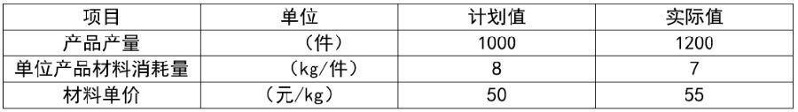
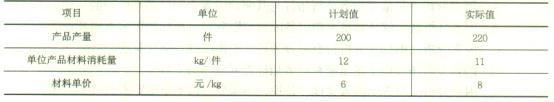
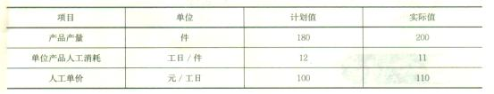
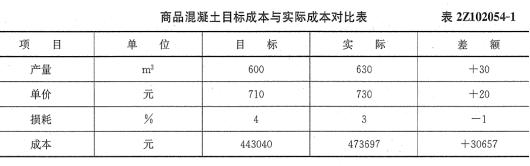
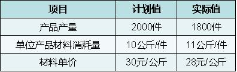

要分别分析材料消耗量和采购单价对工程材料费用的影响，可采用的财务分析方法是( &nbsp; )。

A.趋势分析法
B.差额分析法
C.比率分析法
D.因素分析法  (正确)
解析：
因素分析法是依据分析指标与其驱动因素之间的关系，从数量上确定各因素对分析指标的影响方向及程度的分析方法。因素分析法的优点是既可以全面分析各因素对经济指标的影响，又可以单独分析某因素对经济指标的影响。

【知识点】因素分析法

【考点】因素分析法

【考查方向】概念释义

【难度】易

【题库维护老师：hejiade】

依据分析指标与其驱动因素之间的关系，从数量上确定各因素对分析指标的影响方向及程度的分析方法是( &nbsp; )。

A.趋势分析法
B.因果分析法
C.因素分析法  (正确)
D.比率分析法
解析：
因素分析法是依据分析指标与其驱动因素之间的关系，从数量上确定各因素对分析指标的影响方向及程度的分析方法。

【知识点】因素分析法

【考点】因素分析法

【考查方向】概念释义

【难度】易

【题库维护老师：hejiade】

某施工企业8月份钢筋原材料的实际费用为22万元，而计划值为20万元，由于钢筋原材料费由工程数量.单位工程量钢筋耗用量和钢筋单价三个因素乘积构成，若分析这三个因素对钢筋原材料的影响方向及程度，适宜采用的财务分析方法是（）。

A.概率分析法
B.因素分析法  (正确)
C.结构分析法
D.趋势分析法
解析：
因素分析法是依据分析指标与其驱动因素之间的关系，从数量上确定各因素对分析指标的影响方向及程度的分析方法。这种方法的分析思路是，当有若干因素对分析指标产生影响时，在假设其他各因素都不变的情况下，顺序确定每个因素单独变化对分析指标产生的影响。

【知识点】因素分析法

【考点】因素分析法

【考查方向】概念释义

【难度】易

【题库维护老师：hejiade】

连环替代法依据各个因素对于分析指标的影响，顺次用各因素的（ &nbsp; &nbsp;）替代基准值，据以分析各个因素对指标的影响。

A.标准值
B.计划值
C.差值
D.实际值  (正确)
解析：
连环替代法是将分析指标分解为各个可以计量的因素，并根据各个因素之间的依存关系，顺次用各因素的比较值（通常为实际值）替代基准值（通常为标准值或计划值），据以测定各因素对指标的影响。

【知识点】因素分析法

【考点】因素分析法

【考查方向】概念释义

【难度】易

【题库维护老师：hejiade】

关于连环替代法和差额计算法的说法，正确的是( &nbsp; )

A.连环替代法与差额计算法的复杂程度相等
B.差额计算法与连环替代法均属于比率分析法
C.差额计算法是连环替代法的一种简化形式  (正确)
D.连环替代法是利用各因素的实际数与基准值之间的差额，计算各因素对分析指标的影响
解析：
因素分析法根据其分析特点可分为连环替代法和差额计算法两种。连环替代法是将分析指标分解为各个可以计。量的因素，并根据各个因素之间的依存关系，顺次用各因素的比较值(通常为实际值)替代基准值(通常为标准值或计划值)，据以测定各因素对指标的影响。差额计算法是连环替代法的一种简化形式，它是利用各因素的实际数与基准值之间的差额，计算各因素对分拆指标的影响。

【知识点】因素分析法

【考点】因素分析法

【考查方向】概念释义

【难度】易

【题库维护老师：hejiade】

在财务分析方法中，既可以全面分析各因素对经济指标的影响，又可以单独分析某因素对经济指标的影响的分析方法是( &nbsp; )

A.因素分析法  (正确)
B.比率分析法
C.水平分析法
D.趋势分析法
解析：
在财务分析方法中，因素分析法是依据分析指标与其驱动因素之间的关系，从数量上确定各因素对分析指标的影响方向及程度的分析方法。因素分析法的优点是既可以全面分析各因素对经济指标的影响，又可以单独分析某因素对经济指标的影响。

【知识点】因素分析法

【考点】因素分析法

【考查方向】概念释义

【难度】易

【题库维护老师：hejiade】

因素分析法是一种从数量上确定( &nbsp;)的分析方法。

A.各因素对分析指标的影响方向及程度  (正确)
B.分析指标对各因素影响方向和程度
C.影响分析指标的各因素之间相互关系
D.各项分析指标之间相互影响方向和程度
解析：
因素分析法是依据分析指标与其驱动因素之间的关系，从数量上确定各因素对分析指标的影响方向及程度的分析方法。

【知识点】因素分析法

【考点】因素分析法

【考查方向】概念释义

【难度】易

【题库维护老师：hejiade】

下列财务分析方法中，属于因素分析法的是（ &nbsp;）。*

A.定期指数
B.环比指数
C.连环替代法  (正确)
D.比率分析法
E.差额计算法  (正确)
解析：
因素分析法根据其分析特点可分为连环替代法和差额计算法两种。

【知识点】因素分析法

【考点】因素分析法

【考查方向】概念释义

【难度】易

【题库维护老师：hejiade】

采用因素分析法进行财务指标变动分析时，具体的方法有( &nbsp;)。

A.连环替代法  (正确)
B.头脑风暴法
C.敏感性分析法
D.差额计算法  (正确)
E.盈亏平衡法
解析：
因素分析法根据其分析特点可分为连环替代法和差额计算法两种。

【知识点】因素分析法

【考点】因素分析法

【考查方向】概念释义

【难度】易

【题库维护老师：hejiade】

关于财务分析中因素分析法的说法，正确的有( &nbsp;)。

A.因素分析法是依据财务分析指标与其驱动因素之间的关系建立的一种方法  (正确)
B.因素分析法能够从数量上确定各因素对财务分析指标的影响方向及程度  (正确)
C.因素分析法根据其分析特点可分为盈亏平衡法和差额计算法
D.因素分析法提供了定量解释财务指标差异成因的工具  (正确)
E.因素分析法对影响因素要逐一替换，不需要考虑各影响因素的替换顺序
解析：
因素分析法是依据分析指标与其驱动因素之间的关系，从数量上确定各因素对分析指标的影响方向及程度的分析方法。这种方法的分析思路是，当有若干因素对分析指标产生影响时，在假设其他各因素都不变的情况下，顺序确定每个因素单独变化对分析指标产生的影响。因素分析法根据其分析特点可分为连环替代法和差额计算法两种。

【知识点】因素分析法

【考点】因素分析法

【考查方向】概念释义

【难度】中等

【题库维护老师：hejiade】

某企业本月产品产量和材料消耗情况如下表，用因素分析法（三个因素的重要性按表中顺序）计算。本月单位产品材料消耗量变化对材料费用总额的影响是（ &nbsp;）。 

A.节约5万元
B.增加5万元
C.节约6万元  (正确)
D.增加6万元
解析：
本题考查的是差额计算法。（7-8）*1200*50=-60000

【知识点】因素分析法

【考点】差额计算法

【考查方向】概念释义

【难度】易

【题库维护老师：hejiade】

企业10月份某材料成本计划值14400元，实际值19360元，有关材料成本资料如下表。则产品产量变化导致材料成本变动为( &nbsp;)元。

A.-1440
B.-1320
C.1440  (正确)
D.1920
解析：
A. (200-220)×1Z×6--1440（先替换产品产量但增减方向错误） B. (200-220)×11x6--1320（先替换单位产品材料消耗量，顺序错误） C. (220-200)x1Z×6-1440（先将产品产量计划数替换为实际数） D. (220-200)×1Z×8-1920（先替换材料单价，顺序错误） 故正确选项为C。

【知识点】因素分析法

【考点】连环替代法

【考察方向】公式计算

【难度】中等

【题库维护老师：ZKQ】

某企业1月份人工成本计划为21.6万元，实际为24.2万元。人工成本基本参数如下表，则单位产品人工消耗变动对人工成本的影响是( &nbsp;)元。

A.-18000
B.-19800
C.-20000  (正确)
D.-22000
解析：
A. 180×(11-12)×100=-18000（替换顺序错误） B. 180×(11-12)×110=-19800（替换顺序错误） C. 200×(11-12)×100=-20000（第一步替换产品产量，第二步替换单位产品人工消耗，第三步替换人工单价，顺序正确） D. 200×(11-1Z)×110=-22000（替换顺序错误） 故正确选项为C。

【知识点】因素分析法

【考点】连环替代法

【考查方向】概念释义

【难度】易

【题库维护老师：hejiade】

某商品混凝土目标成本与实际成本对比表如下。采用因素分析法判断各个因素对成本的影响，已知替换顺序为产量、单价、损耗，则产量增加导致的成本增加金额为（ &nbsp;）元。

A.13104
B.22152  (正确)
C.22776
D.12978
解析：
公式：产量×单价×（1+损耗） 计算差值，前面实际值，后面计划值； 产量增加导致的成本增加金额为：30×710×1.04=22152元 【知识点】因素分析法 【考点】因素分析法 【考查方向】计算 【难度】易 【题库维护老师：yxf】

某企业本月生产产品消耗成本情况如下表所示。用因素分析法（因素的重要性排序以表内顺序为准）计算，本月材料单价变化对材料费用总额的影响是（）。

A.节约39600元  (正确)
B.节约40000元
C.增加39600元
D.增加40000元
解析：
1800×11×（28-30）=-39600 【知识点】因素分析法 【考点】因素分析法 【考查方向】计算 【难度】易 【题库维护老师：yxf】

