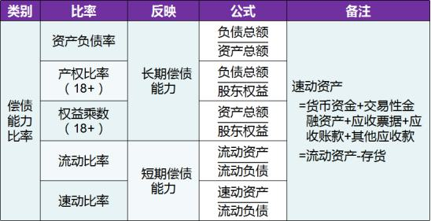

相比流动资产，速动资产中不包括（）。

A.货币资金
B.交易性金融资产
C.应收账款
D.存货  (正确)
解析：
速动资产=货币资金+交易性金融资产+应收票据+应收账款+其他应收款=流动资产-存货 【知识点】偿债能力比率 【考点】速动比率 【考查方向】概念释义 【难度】易 【题库维护老师：yxf】

下列关于速动比率的说法，错误的是（）。

A.影响速动比率可信性的重要因素就是应收票据及应收账款的变现能力
B.速动比率既能反映企业利用债权人提供资金进行经营活动的能力，也能反映企业经营风险的程度  (正确)
C.速动比率越低，企业的偿债能力越差
D.速动比率是对短期偿债能力的粗略估计
解析：
速动比率是指企业的速动资产与流动负债之间的比率关系。

速动比率是假设速动资产是可偿债资产，表明每1元流动负债有多少速动资产作为偿债保障，是对短期偿债能力的粗略估计。由于速动资产的变现能力较强，因此，经验认为，速动比率为1就说明企业有偿债能力，低于1则说明企业偿债能力不强，该指标越低，企业的偿债能力越差。

影响速动比率可信性的重要因素就是应收票据及应收账款的变现能力。资产负债率是企业总负债与总资产之比，它既能反映企业利用债权人提供资金进行经营活动的能力，也能反映企业经营风险的程度，是综合反映企业长期偿债能力的重要指标。

【知识点】偿债能力比率

【考点】 短期偿债能力比率——速动比率

【考察方向】概念释义

【难度】中等

【题库维护老师：ZKQ】

某企业资产负债表的流动资产总额为300万元(其中货币基金60万元，存货160万元，应收账款等80万元，流动负债总额为80万元，则该企业的流动比率为（ &nbsp;）。 &nbsp;

A.3.75  (正确)
B.1.75
C.1.25
D.0. 75
解析：
本题考查的是<strong>流动比率</strong>的计算。 （流动比率=流动资产/流动负债=300/80=3.75）（注意区分流动比率和速动比率）

【知识点】偿债能力比率

【考点】偿债能力比率

【考查方向】公式计算

【难度】中等

【题库维护老师：hejiade】

在流动资产总额一定的情况下，关于速动比率的说法，正确的是（）。

A.预付账款占流动资产比例越低，速动比率越高
B.存货占流动资产比例越低，速动比率越高  (正确)
C.应收账款占流动资产比例越高，速动比率越低
D.交易性金融资产占流动资产比例越高，速动比率越低
解析：
速动资产=流动资产-存货；速动比率=速动资产/流动负债。存货占比越低，则速动资产越高，速动比率越高。

【知识点】偿债能力比率

【考点】速动比率

【考查方向】概念释义

【难度】易

【题库维护老师：hejiade】

关于速动资产，较为准确的计算公式是（ ）。

A.货币资金+交易性金融资产
B.货币资金+交易性金融资产+存货
C.货币资金+交易性金融资产+应收票据及应收账款
D.货币资金+交易性金融资产+应收票据及应收账款+其他应收款  (正确)
解析：
速动资产是流动资产扣除存货后，能够迅速变现的部分。 其计算公式包括：速动资产=流动资产-存货；速动资产＝货币资金＋交易性金融资产＋应收票据及应收账款＋ 其他应收款。

【知识点】偿债能力比率

【考点】速动比率

【考查方向】原文挖空

【难度】易

【题库维护老师：hejiade】

某企业的资产负债率为 80%，则该企业的权益乘数为（ ）。

A.5  (正确)
B.4
C.0.2
D.1.25
解析：
权益乘数=资产/所有者权益，因为资产负债率=80%，若资产=100，则所有者权益=100-80=20，因此权益乘数=100/20=5。

【知识点】偿债能力比率

【考点】产权比率和权益乘数

【考查方向】公式计算

【难度】易

【题库维护老师：hejiade】

下列指标中，( &nbsp; )既能反映企业利用债权人提供资金进行经营活动的能力，也能反映企业经营风险的程度。

A.利息备付率
B.流动比率
C.资产负债率  (正确)
D.速动比率
解析：
资产负债率是企业总负债与总资产之比，它既能反映企业利用债权人提供资金进行经营活动的能力，也能反映企业经营风险的程度，是综合反映企业偿债能力的重要指标。

【知识点】偿债能力比率

【考点】资产负债率

【考查方向】原文挖空

【难度】易

【题库维护老师：hejiade】

能够表明每1元股东权益相对于负债的金额的财务分析指标是().

A.资产负债率
B.权益乘数
C.流动比率
D.产权比率  (正确)
解析：
产权比率表明每1元股东权益相对于负债的金额。权益乘数表明每1元股东权益相对于资产的金额。

【知识点】偿债能力比率

【考点】产权比率和权益乘数

【考查方向】概念释义

【难度】易

【题库维护老师：hejiade】

以下财务分析比率指标中，（ &nbsp; &nbsp; ）属于偿债能力比率。

A.总资产周转率
B.流动比率  (正确)
C.销售增长率
D.存货周转率
解析：
常用的短期偿债能力比率包括流动比率、速动比率等。常用的长期偿债能力比率包括资产负债率、产权比率、权益乘数等。

【知识点】偿债能力比率

【考点】短期偿债能力比率

【考查方向】概念释义

【难度】易

【题库维护老师：hejiade】

某施工企业年末流动资产合计数为66000万元，流动负债为32000万元，该企业流动比率为( &nbsp; &nbsp;)。

A.0.08
B.1.09
C.1.92
D.2.06  (正确)
解析：
流动比率是企业流动资产与流动负债的比率，主要反映企业的偿债能力;流动比率=流动资产/流动负债=66000/32000=2.06。

【知识点】偿债能力比率

【考点】偿债能力比率

【考查方向】公式计算

【难度】易

【题库维护老师：hejiade】

某企业流动比率为3.2，速动比率为1.5，该行业平均的流动比率和速动比率分别为3和2，关于该企业流动资产和偿债能力的说法，正确的是（ &nbsp;）。

A.该企业的偿债能力较强
B.该企业流动资产存货比例过大  (正确)
C.该企业的应收票据，应收账款比例较大
D.该企业流动资产中货帀资金比例较大
解析：
流动比率是企业流动资产与流动负债的比率，主要反映企业的偿债能力。速动比率是指企业的速动资产与流动负债之间的比率关系，反映企业对短期偿债能力的指标。流动比率=流动资产/流动负债，速动比率=速动资产/流动负债；速动资产=流动资产-存货。根据公式，该企业的流动比率比该行业平均的流动比率略大，而速动比率比该行业平均的速动比率小，说明其存货比例较大，速动资产比例较小。

【知识点】偿债能力比率

【考点】速动比率

【考查方向】概念释义

【难度】易

【题库维护老师：hejiade】

企业资产负债表日资产总额1200万元，其中流动资产500万元（含存货100万元），企业负债总额900万元，其中非流动负债300万元。资产负债表日企业的速动比率为( &nbsp;)。

A.0.60
B.0.67  (正确)
C.1.25
D.1.67
解析：
速动比率等于速动资产／流动负债，速动资产=流动资产-存货。本例中，速动资产为500-100=400万元，流动负债为900-300=600万元。速动比率=400/600=0.67。其他备选答案使用了错误数据计算。故正确选项为B。

【知识点】偿债能力比率

【考点】偿债能力比率

【考查方向】公式计算

【难度】中等

【题库维护老师：hejiade】

企业资产负债表日资产总额1200万元，其中流动资产500万元，企业负债总额900万元，其中非流动负债300万元。资产负债表日该企业的流动比率为( &nbsp;)。

A.0.56
B.0.6
C.0.67
D.0.83  (正确)
解析：
流动比率为流动资产和流动负债的比率，本例中，负债总额900万元，非流动负债300万元，则流动负债为600万元，正确的计算式为500/600=0.83。其他选项使用了错误数据计算。故正确选项为D。

【知识点】偿债能力比率

【考点】流动比率

【考查方向】公式计算

【难度】中等

【题库维护老师：hejiade】

流动比率的计算公式为( &nbsp;)。

A.流动资产／流动负债  (正确)
B.流动负债／流动资产
C.流动资产／长期负债
D.流动资产／固定资产
解析：
流动比率是企业流动资产与流动负债的比率。

【知识点】偿债能力比率

【考点】流动比率

【考查方向】公式计算

【难度】易

【题库维护老师：hejiade】

速动比率属于反映( &nbsp;)指标。

A.短期资产周转效率
B.短期偿债能力  (正确)
C.长期偿债能力
D.长期资产流动性
解析：
速动比率是假设速动资产是可偿债资产，表明每1元流动负债有多少速动资产作为偿债保障，是对短期偿债能力的粗略估计。

【知识点】偿债能力比率

【考点】流动比率

【考查方向】概念释义

【难度】易

【题库维护老师：hejiade】

从企业债权人角度看，资产负债率越低，说明( &nbsp;)。

A.企业偿债能力越强，债权人的权益就越有保障  (正确)
B.企业总资产与总负债的比率越低
C.企业偿付债权人到期债务的能力越低
D.债权人收回到期债务的风险越大
解析：
从企业债权人角度看，资产负债率越低，说明企业偿债能力越强，债权人的权益就越有保障。

【知识点】偿债能力比率

【考点】资产负债率

【考查方向】原文挖空

【难度】易

【题库维护老师：hejiade】

流动比率属于( &nbsp; &nbsp;)比率。

A.资产管理
B.盈利能力
C.偿债能力  (正确)
D.发展能力
解析：
常用的短期偿债能力比率包括流动比率、速动比率等。

【知识点】偿债能力比率

【考点】短期偿债能力比率

【考查方向】原文挖空

【难度】易

【题库维护老师：hejiade】

通常资产负债率反映企业利用借入资金进行经营活动的能力，要使企业风险与收益平衡，较为合适的指标值为( &nbsp; )。

A.10%
B.25%
C.50%  (正确)
D.100%
解析：
从企业债权人角度看，资产负债率越低，说明企业偿债能力越强，债权人的权益就越有保障。从企业所有者和经营者角度看，通常希望该指标高些，这有利于利用财务杠杆增加所有者获利能力。但资产负债率过高，企业财务风险也会增大。因此，一般地说，该指标为50%比较合适，有利于风险与收益的平衡。

【知识点】偿债能力比率

【考点】长期偿债能力比率

【考查方向】概念释义

【难度】易

【题库维护老师：hejiade】

下列选项中，属于速动资产的有（ &nbsp;）。

A.货币资金  (正确)
B.存货
C.应收票据  (正确)
D.应收账款  (正确)
E.交易性金融资产  (正确)
解析：
速动资产=流动资产-存货=货币资金+交易性金融资产+应收票据+应收账款+其他应收款 【知识点】偿债能力比率 【考点】速动比率 【考查方向】概念释义 【难度】易 【题库维护老师：yxf】

下列财务分析指标中，属于企业长期偿债能力指标的有（）。

A.速动比率
B.总资产周转率
C.产权比率  (正确)
D.资产负债率  (正确)
E.权益乘数  (正确)
解析：
长期偿债比率包括：资产负债率、产权比率和权益乘数

【知识点】偿债能力比率

【考点】长期偿债能力比率

【考查方向】概念释义

【难度】易

【题库维护老师：hejiade】

关于偿债能力指标的说法，正确的有( &nbsp; )。

A.速动比率低于1说明企业偿债能力不强，该指标越低，企业的偿债能力越差  (正确)
B.企业资产负债率为0比较合适，有利于风险与收益的平衡
C.生产性行业的流动比率应保持在2左右，流动比率过高，企业可能存在资产结构不合理的情况  (正确)
D.生产性行业的流动比率低于1，则说明企业偿债能力不强，该指标越低，企业的偿债能力越差
E.速动比率应保持在2左右，速动比率过高，企业可能存在资产结构不合理的情况
解析：
由于速动资产的变现能力较强，因此，经验认为，速动比率为1就说明企业有偿债能力，低于1则说明企业偿债能力不强，该指标越低，企业的偿债能力越差。从企业债权人角度看，资产负债率越低，说明企业偿债能力越强，债权人的权益就越有保障。一般地说，该指标为50%比较合适，有利于风险与收益的平衡。通常认为生产性行业合理的最低流动比率为2。如果流动比率过高，则要检查其原因，是否是由资产结构不合理造成的，或者是募集的长期资金没有尽快投入使用．或者是其他原因。如果流动比率过低，企业近期可能会有财务方面的困难。

【知识点】偿债能力比率

【考点】速动比率

【考查方向】概念释义

【难度】中等

【题库维护老师：hejiade】

分析企业债务清偿能力时，可列入速动资产的有（）。

A.货币资金  (正确)
B.应收票据  (正确)
C.应收账款  (正确)
D.存货
E.交易性金融资产  (正确)
解析：
速动资产＝货币资金＋交易性金融资产＋应收票据＋应收账款＋其他应收款。

【知识点】偿债能力比率

【考点】速动比率

【考查方向】概念释义

【难度】易

【题库维护老师：hejiade】

属于短期偿债能力指标的有（ &nbsp; &nbsp;）。

A.流动比率  (正确)
B.速动比率  (正确)
C.资产负债率
D.产权比率
E.权益乘数
解析：
常用的短期偿债能力比率包括流动比率、速动比率等

【知识点】偿债能力比率

【考点】短期偿债能力比率

【考查方向】概念释义

【难度】易

【题库维护老师：hejiade】

关于资产负债率的说法，正确的有( &nbsp;)。

A.资产负债率企业总资产与总负债之比
B.资产负债率是反映企业长期偿债能力的指标  (正确)
C.资产负债率越高说明企业偿债能力越强
D.资产负债率能反映企业利用债权人提供资金进行经营活动的能力  (正确)
E.资产负债率能反映企业经营风险的程度  (正确)
解析：
资产负债率是企业<strong>总负债与总资产之比</strong>，它既能反映企业利用<strong>债权人提供资金进行经营活动的能力</strong>，也能反映<strong>企业经营风险的程度</strong>，是综合反应<strong>企业长期偿债能力</strong>的重要指标。 从企业债权人角度看，<strong>资产负债率越低，说明企业偿债能力越强</strong>，债权人的权益就越有保障。

【知识点】偿债能力比率

【考点】资产负债率

【考查方向】中等

【难度】易

【题库维护老师：hejiade】

作为短期偿债能力指标的流动比率，适用于粗略比较( &nbsp;)的偿债能力。

A.同行业不同企业的同一时期  (正确)
B.不同行业的企业的同一时期
C.本企业不同时期  (正确)
D.不同行业的企业的不同时期
E.所有生产型企业同一时期
解析：
流动比率是对短期偿债能力的粗略估计。不同行业的流动比率通常有明显差别，此外，随着企业经营方式和金融环境的变化，流动比率有下降趋势，即随时间变化而变化，所以适合用于同行业横向比较以及本企业不同历史时期的纵向比较，以反映同期企业之间的差异和本企业不同时期的发展变化状况。故正确选项为A、C。

【知识点】偿债能力比率

【考点】流动比率

【考查方向】概念释义

【难度】易

【题库维护老师：hejiade】

下列选项中，属于财务比率中的偿债能力比率的是（ &nbsp;）。

A.总资产周转率
B.净资产收益率
C.资产负债率  (正确)
D.资本积累率
解析：
如下图  【知识点】偿债能力比率 【考点】偿债能力比率 【考查方向】概念释义 【难度】易 【题库维护老师：yxf】

下列选项中，属于短期偿债能力指标的是（）。

A.资产负债率
B.流动比率  (正确)
C.产权比率
D.权益乘数
解析：
 【知识点】偿债能力比率 【考点】短期偿债能力比率 【考查方向】概念释义 【难度】易 【题库维护老师：yxf】

某企业流动资产年末合计数为520000元。其中存货年末数为310000元，流动负债年末数为160000元，则该企业速动比率为( &nbsp; )。

A.0.76
B.1.313  (正确)
C.0.516
D.1.938
解析：

速动资产=货币资金+交易性金融资产+应收票据+应收账款+其他应收款。速动资产=流动资产一存货 =（520000-310000）/160000=1.313

【知识点】偿债能力比率

【考点】 速动比率

【考查方向】概念释义

【难度】易

【题库维护老师：hejiade】

