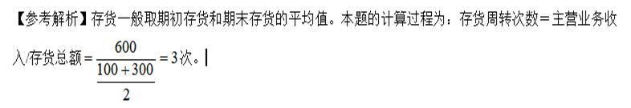

某企业在一个会计期间的营业收入为600万元，期初应收账款为70万元，期末应收账款为130万元，则该企业应收账款周转率为（&nbsp; ）。

A.4.62
B.6.00  (正确)
C.8.57
D.10.00
解析：
应收账款周转率=600/[（70+130）/2]=6.00 【知识点】营运能力比率

下列指标中，（ &nbsp; &nbsp;）是用于衡量公司资产管理效率的指标。

A.资产负债率
B.净资产收益率
C.资本积累率
D.总资产周转率  (正确)
解析：
营运能力比率是用于衡量公司资产管理效率的指标。常用的指标有总资产周转率、流动资产周转率、存货周转率、应收票据及应收账款周转率。

【知识点】营运能力比率

【考点】营运能力比率

【考查方向】概念释义

【难度】易

【题库维护老师：hejiade】

企业应收账款周转率与上一年度相比有明显提高，说明该企业的经营状况是（ ）。

A.企业管理效率降低
B.更容易发生坏账损失
C.收回赊销账款能力减弱
D.应收账款收回速度变快  (正确)
解析：
本题考查的是营运能力指标中应收账款周转率的概念。应收账款周转率高、周转天数越短越好，它表明企业应收账 款收回速度快，这样一方面可以节约资金，同时也说明企业信用状况好，不易发生坏账损失。

【知识点】营运能力比率

【考点】应收账款周转率

【考查方向】概念释义

【难度】易

【题库维护老师：hejiade】

某企业年初资产总额为500万元，年末资产总额为540万元，当年总收入为900万元，其中主营业务收入为832万元，则该企业一年中总资产周转率为(　)次。

A.1.80
B.1.73
C.1.60  (正确)
D.1.54
解析：
总资产周转率=主营业务收入÷资产总额。（资产总额一般取期初资产总额和期末资产总额的平均值计算）。总资产周转率=832÷[（500+540）÷2]=1.60。

【知识点】营运能力比率

【考点】总资产周转率

【考查方向】公式计算

【难度】中等

【题库维护老师：hejiade】

反映企业营运能力的比率( &nbsp; &nbsp;)。

A.净资产收益率
B.流动比率
C.速动比率
D.总资产周转率  (正确)
解析：
运营能力比率是用于衡量公司资产管理效率的指标。常用的指标有总资产周转率、流动资产周转率、存货周转率、应收票据及应收账款周转率等。

【知识点】营运能力比率

【考点】营运能力比率

【考查方向】概念释义

【难度】易

【题库维护老师：hejiade】

下列各项中，不反映营运能力分析的指标是( &nbsp; &nbsp;)。

A.总资产周转率
B.流动资产周转率
C.存货周转率
D.速动比率  (正确)
解析：
营运能力比率是用于衡量公司资产管理效率的指标。常用的指标有总资产周转率、流动资产周转率、存货周转率等。D是偿债能力分析。

【知识点】1Z102062 基本财务比率的计算和分析

【考点】营运能力比率

【考查方向】概念释义

【难度】易

【题库维护老师：hejiade】

下列财务指标中，可以反映企业资产管理效率的指标是（ &nbsp; &nbsp;）。

A.净资产收益率
B.存货周转率  (正确)
C.流动比率
D.资本积累率
解析：
运营能力比率是用于衡量公司资产管理效率的指标。常用的指标有总资产周转率、流动资产周转率、存货周转率、应收票据及应收账款周转率等。

【知识点】营运能力比率

【考点】营运能力比率

【考查方向】概念释义

【难度】易

【题库维护老师：hejiade】

下列财务指标中，数值越大则表示企业销售能力越强的指标是( &nbsp; &nbsp;)。

A.流动比率
B.净资产收益率
C.总资产周转率  (正确)
D.资产负债率
解析：
总资产周转率表明一年中总资产周转的次数，或者说明每1元总资产支持的主营业务收入。周转率越高，反映企业销售能力越强。

【知识点】营运能力比率

【考点】营运能力比率

【考查方向】概念释义

【难度】易

【题库维护老师：hejiade】

应收账款周转率通常用来测定企业在某一特定时期内( &nbsp; )的能力。

A.资金管理
B.投资回收
C.盈利
D.收回赊销账款  (正确)
解析：
在进行财物分析时，应收账款周转率通常用来测定企业在某一特定时期内收回赊销账款的能力，它既可以反映企业应收账款的变现速度，又可以反映企业的管理效率。一般认为应收账款周转率越高、周转天数越短越好。

【知识点】营运能力比率

【考点】营运能力比率

【考查方向】概念释义

【难度】易

【题库维护老师：hejiade】

下列选项中，不能用于衡量公司资产管理效率的指标是( &nbsp; )

A.总资产周转率
B.流动资产周转率
C.存货周转率
D.速动比率  (正确)
解析：
运营能力比率是用于衡量公司资产管理效率的指标。常用的指标有总资产周转率、流动资产周转率、存货周转率、应收账款周转率等。

【知识点】营运能力比率

【考点】营运能力比率

【考查方向】概念释义

【难度】易

【题库维护老师：hejiade】

企业8月份主营业务收入200万元，月初占用流动资产150万元，月末占用流动资产170万元，月末资产总额280万元，8月份企业流动资产周转率为( &nbsp;)。

A.1.33
B.1.25  (正确)
C.1.18
D.0.71
解析：
流动资产周转率=主营业务收入／流动资产平均值。本例中，流动资产平均值为(150+170)/2=160。流动资产周转率为200/160=1.25。故正确选项为B。

【知识点】营运能力比率

【考点】营运能力比率

【考查方向】公式计算

【难度】中等

【题库维护老师：hejiade】

营运能力比率可以衡量企业的( &nbsp;)效率。

A.生产管理
B.投资管理
C.资产管理  (正确)
D.销售管理
解析：
营运能力比率是用于衡量公司资产管理效率的指标。

【知识点】营运能力比率

【考点】营运能力比率

【考查方向】概念释义

【难度】易

【题库维护老师：hejiade】

企业6月份主营业务收入300万元，月初存货占用资金180万元，月末存货占用资金220万元。6月份企业存货周转天数为( &nbsp;)天。

A.18
B.20  (正确)
C.22
D.30
解析：
存货周转次数=主营业务收入／存货，存货按平均值计算。本月存货平均值=(180+220)/2=200万元，存货周转次数=300/200=1.5次，存货周转天数=30/1.5=20天。故正确选项为B

【知识点】营运能力比率

【考点】营运能力比率

【考查方向】公式计算

【难度】中等

【题库维护老师：hejiade】

据某公司期末会计资料，应收账款余额期初、期末分别为92000元和88000元，主营业务收入为800000元，则该公司应收账款周转率为( &nbsp; )。

A.9.09
B.8.70
C.7.33
D.8.89  (正确)
解析：
平均应收账款= (92000+88000)/2=90000元

应收账款周转率=主营业务收入/平均应收账款=800000/90000=8. 89

【知识点】营运能力比率

【考点】 应收账款周转率

【考查方向】公式计算

【难度】易

【题库维护老师：hejiade】

下列属于营运能力比率的是（）

A.流动比率
B.总资产报酬率
C.总资产周转率  (正确)
D.存货周转率  (正确)
E.流动资产周转率  (正确)
解析：
营运能力比率是用于衡量公司资产管理效率的指标。常用的指标有总资产周转率、流动资产周转率、存货周转率、应收票据及应收账款周转率等。

【知识点】营运能力比率

【考点】营运能力比率

【考察方向】原文挖空

【难度】易

【题库维护老师：ZKQ】

下列财务指标中，属于企业营运能力指标的有( &nbsp; &nbsp;)。

A.应收账周转率  (正确)
B.总资产周转率  (正确)
C.权益乘数
D.流动资产周转率  (正确)
E.存货周转天数  (正确)
解析：
本题考查的是营运能力指标等内容。营运能力比率是用于衡量公司资产管理效率的指标。常用的指标有总资产周转率、流 动资产周转率、存货周转率、应收账款周转率等。

【知识点】营运能力比率

【考点】营运能力比率

【考查方向】原文挖空

【难度】易

【题库维护老师：hejiade】

在下列指标中，属于反映企业营运能力的指标有（ ）。

A.总资产周转率  (正确)
B.流动资产周转率  (正确)
C.速动比率
D.资本积累率
E.存货周转率  (正确)
解析：
营运能力比率是用于衡量公司资产管理效率的指标。常用的指标有总资产周转率、流动资产周转率、存货周转率、应收账款周转率等。（凡是带“周转”两个字的都是运营能力比率）

【知识点】营运能力比率

【考点】营运能力比率

【考查方向】原文挖空

【难度】易

【题库维护老师：hejiade】

以下属于资产管理比率的是( &nbsp; )。

A.应收账款周转率  (正确)
B.存货周转率  (正确)
C.流动资产周转率  (正确)
D.流动比率
E.总资产报酬率
解析：
资产管理比率常用的指标有总资产周转率、流动资产周转率、存货周转率、应收账款周转率。

【知识点】营运能力比率

【考点】营运能力比率

【考查方向】概念释义

【难度】易

【题库维护老师：hejiade】

企业财务分析中,用于衡量资产管理效率的指标有( &nbsp;)。

A.应收账款周转率  (正确)
B.总资产净利率
C.存货周转率  (正确)
D.资本积累率
E.资产负债率
解析：
营运能力比率是用于衡量公司资产管理效率的指标。常用的指标有总资产周转率、流动资产周转率、存货周转率、应收账款周转率等。

【知识点】营运能力比率

【考点】营运能力比率

【考查方向】概念释义

【难度】易

【题库维护老师：hejiade】

下列财务比率中，属于营运能力比率的有( &nbsp;)。

A.流动比率
B.销售利润率
C.流动资产周转率  (正确)
D.应收账款周转率  (正确)
E.净现值率
解析：
营运能力比率是用于衡量公司资产管理效率的指标。常用的指标有总资产周转率、流动资产周转率、存货周转率、应收票据及应收账款周转率等。

【知识点】营运能力比率

【考点】营运能力比率

【考查方向】概念释义

【难度】易

【题库维护老师：hejiade】

对于流动资产周转率指标，下列表述正确的是（ &nbsp; ）。

A.在一定时期周转次数越少，流动资产运营能力超强
B.在一定时期内企业主营业务收入与平均流动资产总额之间的比率  (正确)
C.通常用周转次数、周转天数表示  (正确)
D.反映流动资产的周转速度  (正确)
E.反映流动资产的利用效率  (正确)
解析：
流动资产周转率是指企业在一定时期内企业主营业务收入与平均流动资产总额之间的比率，通常用周转次数和周转天数来表示。

【知识点】营运能力比率

【考点】流动资产周转率

【考查方向】概念释义

【难度】中等

【题库维护老师：hejiade】

某施工企业当期主营业务收入600万元，期初存货为100万元，期末存货为300万元，则存货周转次数为（ &nbsp; &nbsp;）次。

A.1.5
B.2
C.3  (正确)
D.6
解析：
如下图  

【知识点】营运能力比率

【考点】存货周转率

【考查方向】公式计算

【难度】易

【题库维护老师：hejiade】

据某公司期末会计报表资料，主营业务收入800000元；资产期初余额为500000元，期末余额为520000元；则该公司总资产周转率为（ &nbsp; ）。

A.1.57  (正确)
B.1.54
C.1.60
D.1.68
解析：
总资产周转率是指企业在一定时期内主营业务收入与总资产的比率。总资产周转率的计算公式如下： 

在上述公式中，资产总额一般取期初资产总额和期末资产总额的平均值计算。

【知识点】营运能力比率

【考点】营运能力比率

【考查方向】概念释义

【难度】易

【题库维护老师：hejiade】

