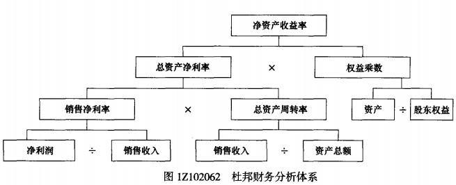

在杜邦财务分析体系中，核心指标是（ ）。

A.销售净利率
B.净资产收益率  (正确)
C.总资产报酬率
D.总资产周转率
解析：
杜邦财务分析体系是以净资产收益率为核心指标，以总资产净净利率和权益乘数为两方面，重点揭示企业获利能力及权益乘数对净资产收益率的影响，以及各相关指标之间的相互作用关系。

【知识点】财务指标综合分析

【考点】杜邦财务分析体系

【考察方向】原文挖空

【难度】易

【题库维护老师：ZKQ】

在杜邦财务分析体系中，重点揭示（ ）对净资产收益率的影响。

A.净利润及权益乘数
B.总资产净利率及权益乘数  (正确)
C.总资产净利率及平均利润率
D.平均利润率及净利润率
解析：
杜邦财务分析体系是利用各主要财务比率指标之间的内在联系对企业财务状况和经营成果进行综合系统评价的方法。该体系是以净资产收益率为核心指标，以总资产净净利率和权益乘数为两方面，重点揭示企业获利能力及权益乘数对净资产收益率的影响，以及各相关指标之间的相互作用关系。

【知识点】财务指标综合分析

【考点】杜邦财务分析体系

【考察方向】原文挖空

【难度】易

【题库维护老师：ZKQ】

财务指标综合分析方法中，比较典型的是( &nbsp; )。

A.杜邦分析法  (正确)
B.沃尔评分法
C.财务风险预警
D.绩效评价
解析：
在财务指标综合分析方法中，比较典型的是杜邦财务分析体系。

【知识点】财务指标综合分析一一杜邦财务分析体系

【考点】财务指标综合分析一一杜邦财务分析体系

【考察方向】原文挖空

【难度】易

【题库维护老师：ZKQ】

杜邦财务分析体系揭示的是(&nbsp; &nbsp; &nbsp; &nbsp;)对净资产收益率的影响。

A.总资产净利率及资产总额
B.企业获利能力及权益乘数  (正确)
C.资本积累及销售收入
D.营业增长率及资本积累
解析：
杜邦财务分析体系是以净资产收益率为核心指标，以总资产净利率和权益乘数为两个方面，重点揭示企业获利能力及权益乘数对净资产收益率的影响，以及各相关指标之间的相互作用关系。

【知识点】财务指标综合分析一一杜邦财务分析体系

【考点】财务指标综合分析一一杜邦财务分析体系

【考察方向】原文挖空

【难度】易

【题库维护老师：ZKQ】

杜邦财务分析体系是以( &nbsp; )作为两方面开展财务分析工作的。

A.总资产涤利率和计算基数
B.总资产净利率和权益乘数  (正确)
C.总资产周转率和计算基数
D.总资产周转率和权益乘数
解析：
杜邦财务分析体系，简称杜邦分析，是利用各主要财务比率指标之间的内在联系对企业财务状况和经营成果进行综合系统评价的方法。该体系是以净资产收益率为核心指标，以总资产净利率和权益乘数为两个方面，重点揭示企业获利能力及权益乘数对净资产收益率的影响，以及各相关指标之间的相互作用关系。

【知识点】财务指标综合分析一一杜邦财务分析体系

【考点】财务指标综合分析一一杜邦财务分析体系

【考察方向】原文挖空

【难度】易

【题库维护老师：ZKQ】

下列财务分析方法中，属于对企业财务状况和经营成果进行综合系统评价的方法的是( &nbsp;)。

A.差额计算法
B.连环替代法
C.杜邦分析法  (正确)
D.盈亏分析法
解析：
在财务指标综合分析方法中，比较典型的是杜邦财务分析体系，简称杜邦分析，是利用各主要财务比率指标之间的内在联系对企业财务状况和经营成果进行综合系统评价的方法。

【知识点】财务指标综合分析一一杜邦财务分析体系

【考点】财务指标综合分析一一杜邦财务分析体系

【考察方向】概念释义

【难度】易

【题库维护老师：ZKQ】

杜邦财务分析体系在净资产收益率计算和对比基础上，首先应分解研究的指标是( &nbsp;)。

A.总资产净利率和权益乘数  (正确)
B.销售净利率和总资产周转率
C.总资产净利率和总资产周转率
D.销售净利率和权益乘数
解析：
杜邦财务分析体系是以净资产收益率为核心指标，以总资产净利率和权益乘数为两个方面，重点揭示企业获利能力及权益乘数对净资产收益率的影响，以及各相关指标之间的相互作用关系。

【知识点】财务指标综合分析一一杜邦财务分析体系

【考点】财务指标综合分析一一杜邦财务分析体系

【考察方向】原文挖空

【难度】易

【题库维护老师：ZKQ】

杜邦财务分析体系是以( &nbsp;)为核心指标的综合财务分析体系。

A.总资产净利率
B.净资产收益率  (正确)
C.营业增长率
D.权益乘数
解析：
杜邦财务分析体系是以净资产收益率为核心指标，以总资产净利率和权益乘数为两个方面，重点揭示企业获利能力及权益乘数对净资产收益率的影响，以及各相关指标之间的相互作用关系。

【知识点】财务指标综合分析一一杜邦财务分析体系

【考点】财务指标综合分析一一杜邦财务分析体系

【考察方向】原文挖空

【难度】易

【题库维护老师：ZKQ】

杜邦财务分析体系的说法正确的有( &nbsp; )。

A.以净资产收益率和权益乘数为两个方面
B.核心指标为总资产净利率
C.简称杜邦分析  (正确)
D.重点揭示企业获利能力及权益乘数对净资产收益率的影响  (正确)
E.是一个多层次的财务比率分解体系  (正确)
解析：
杜邦财务分析体系(<strong>简称杜邦分析</strong>)是利用各主要财务比率指标之间的内在联系对企业财务状况和经营成果进行综合系统评价的方法。该体系是<strong>以净资产收益率为核心指标</strong>，以<strong>总资产净利率和权益乘数</strong>为两个方面，重点揭示<strong>企业获利能力及权益乘数对净资产收益率</strong>的影响，以及各相关指标之间的相互作用关系。杜邦财务分析体系是一种<strong>多层次的财务比率分解体系</strong>。

【知识点】财务指标综合分析一一杜邦财务分析体系

【考点】财务指标综合分析一一杜邦财务分析体系

【考察方向】原文挖空

【难度】中等

【题库维护老师：ZKQ】

综合分析中的杜邦分析法的特点有( &nbsp; &nbsp;)。

A.净资产收益率为核心指标  (正确)
B.核心指标为总资产报酬率
C.将若干财务比率按其内在联系有机结合起来  (正确)
D.以总资产净利率和权益乘数为两个方面  (正确)
E.将企业盈利状况、财务状况和营运状况统一为一个有机整体，最终通过净资产收益率来综合反映
解析：
在财务指标综合分析方法中，比较典型的是杜邦财务分析体系，简称杜邦分析，是利用各主要财务比率指标之间的内在联系对企业财务状况和经营成果进行综合系统评价的方法。该体系是以净资产收益率为核心指标，以总资产净利率和权益乘数为两个方面，重点揭示企业获利能力及权益乘数对净资产收益率的影响，以及各相关指标之间的相互作用关系。

【知识点】财务指标综合分析一一杜邦财务分析体系

【考点】财务指标综合分析一一杜邦财务分析体系

【考察方向】概念释义

【难度】中等

【题库维护老师：ZKQ】

在财务指标综合分析方法中，杜邦财务分析体系中的核心指标是净资产收益率，以（ &nbsp; ）为两个方面，重点揭示企业获利能力及权益乘数对净资产收益率的影响。

A.销售净利率
B.总资产报酬率
C.权益乘数  (正确)
D.总资产周转率
E.总资产净利率  (正确)
解析：
在财务指标综合分析方法中,杜邦财务分析体系以净资产收益率为核心指标。以<strong>总资产净利率和权益乘数</strong>为两个方面，重 点揭示企业获利能力及权益乘数对净资产收益率的影响以及各相关指标之间的相互作用关系。

【知识点】财务指标综合分析一一杜邦财务分析体系

【考点】财务指标综合分析一一杜邦财务分析体系

【考察方向】原文挖空

【难度】易

【题库维护老师：ZKQ】

关于杜邦财务分析体系的说法，正确的有( &nbsp; )

A.通过杜邦财务分析体系能发现企业资金的收支情况
B.杜邦财务分析利用各主要财务比率的指标之间内在联系对企业财务状况和经营成果进行综合系统评价  (正确)
C.杜邦财务分析体系是一个多层次的财务比率分解体系  (正确)
D.杜邦财务分析以净资产收益率为核心指标  (正确)
E.杜邦财务分析能研究各项资产的比重变化情况，揭示企业的盈利能力
解析：
杜邦财务分析体系，简称杜邦分析，是<strong>利用各主要财务比率指标之间的内在联系对企业财务状况和经营成果进行综合系统评价</strong>的方法。该体系是以<strong>净资产收益率为核心指标</strong>，以总资产净利率和权益乘数为两个方面，重点<strong>揭示企业获利能力及权益乘数对净资产收益率</strong>的影响，以及各相关指标之间的相互作用关系。

杜邦财务分析体系是一个<strong>多层次的财务比率分解体系</strong>。各项财务比率可以在每个层次上与本企业历史或同行业财务比率比较，比较之后向下一级分解。逐层向下分解，逐步覆盖企业经营活动的每个环节，以实现系统、全面评价企业经营成果和财务状况的目的。

【知识点】财务指标综合分析一一杜邦财务分析体系

【考点】财务指标综合分析一一杜邦财务分析体系

【考察方向】概念释义

【难度】中等

【题库维护老师：ZKQ】

关于杜邦财务分析体系的说法，正确的有( &nbsp; )。

A.通过杜邦分析体系能发现企业资本金的变动趋势
B.杜邦分析利用财务比率的内在联系对企业财务状况和经营成果进行评价  (正确)
C.杜邦分析将若干财务指标形成一个完整的指标体系  (正确)
D.杜邦分析以净资产收益率为核心指标  (正确)
E.杜邦分析能研究各项资产的比重变化情况，揭示企业的借债能力
解析：
在财务指标综合分析方法中，比较典型的是杜邦财务分析体系，简称杜邦分析，是<strong>利用各主要财务比率指标之间的内在联系对企业财务状况和经营成果进行综合系统评价</strong>的方法。该体系是<strong>以净资产收益率为核心指标</strong>，以总资产净利率和权益乘数为两个方面，重点<strong>揭示企业获利能力及权益乘数对净资产收益率的影响</strong>，以及各相关指标之间的相互作用关系。

【知识点】财务指标综合分析一一杜邦财务分析体系

【考点】 财务指标综合分析一一杜邦财务分析体系

【考察方向】概念释义

【难度】中等

【题库维护老师：ZKQ】

某企业2016年实现净利润为1000万元，销售收入为10000万元，总资产周转率为0.8，权益系数为1.5。不考虑其他因素。采用杜邦财务分析体系计算的净资产收益率是(&nbsp; &nbsp; &nbsp; )。

A.100％
B.15％
C.12％  (正确)
D.10％
解析：
   &nbsp; &nbsp;采用杜邦财务分析体系计算的净资产收益率为：总资产净利率×权益乘数=（销售净利率×总资产周转率）×权益乘数={（净利润/销售收入）×总资产周转率}×权益乘数=1000/10000x0.8x1.5=0.12=12%

【知识点】财务指标综合分析一一杜邦财务分析体系

【考点】财务指标综合分析一一杜邦财务分析体系 【考察方向】公式计算

【难度】易

【题库维护老师：ZKQ】

