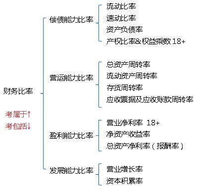
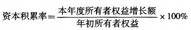
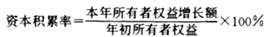

在财务比率分析中，资本积累率属于( &nbsp; )。

A.偿债能力比率
B.发展能力比率  (正确)
C.资产管理比率
D.盈利能力比率
解析：
企业发展能力的指标主要有：(1)营业增长率；(2)资本积累率。

【知识点】发展能力比率

【考点】发展能力比率

【考察方向】原文挖空

【难度】易

【题库维护老师：ZKQ】

下列，反映企业发展能力的指标是( &nbsp; &nbsp;)。

A.总资产收益率
B.流动资产周转率
C.利润增长率
D.营业增长率  (正确)
解析：
企业发展能力的指标主要有营业增长率和资本积累率等。

【知识点】发展能力比率

【考点】存货管理的ABC分析法

【考察方向】公式计算

【难度】易

【题库维护老师：ZKQ】

关于营业增长率的说法，正确的是( &nbsp;)。

A.营业增长率小于0，说明企业出现亏损
B.营业增长率小于1，说明企业增长很慢
C.营业增长率小于0，说明企业市场份额萎缩  (正确)
D.营业增长率小于1，说明企业市场份额萎缩
解析：
营业增长率表示与上期相比，营业收入的增减变化情况，是评价企业成长状况和发展能力的重要指标。该指标是衡量企业经营状况和市场占有能力、预测企业经营业务拓展趋势的重要标志，也是企业扩张资本的重要前提。

该指标若<strong>大于零</strong>，表明企业本期的<strong>营业收入有所增长</strong>，指标值越高，表明增长速度越快，企业市场前景越好；<strong>反之则说明企业市场份额萎缩</strong>。

【知识点】发展能力比率

【考点】营业增长率

【考察方向】概念释义

【难度】易

【题库维护老师：ZKQ】

资本积累率反映企业一定时期内( &nbsp;)的变动状况。

A.资产
B.负债
C.所有者权益  (正确)
D.营业收入
解析：
资本积累率是企业当年所有者权益总的增长率，反映了企业<strong>所有者权益在当年的变动水平</strong>。

【知识点】发展能力比率

【考点】资本积累率

【考察方向】原文挖空

【难度】易

【题库维护老师：ZKQ】

营业增长率反映的是企业( &nbsp;)的增长情况。

A.经营性资产
B.营业收入  (正确)
C.经营成本
D.营业利润
解析：
营业增长率表示与上期相比，<strong>营业收入的增减变化</strong>情况，是评价企业成长状况和发展能力的重要指标。该指标是衡量企业经营状况和市场占有能力、预测企业经营业务拓展趋势的重要标志，也是企业扩张资本的重要前提。

【知识点】发展能力比率

【考点】营业增长率

【考察方向】原文挖空

【难度】易

【题库维护老师：ZKQ】

企业资本积累率指标如为负值，表明企业的( &nbsp;)。

A.总资产减少
B.负债减少
C.固定资产减少
D.所有者权益受到损害  (正确)
解析：
资本积累率是企业当年所有者权益总的增长率，反映了企业所有者权益在当年的变动水平。该指标体现了企业资本的积累能力，是评价企业发展潜力的重要指标，也是企业扩大再生产的源泉。

资本积累率反映了投资者投入企业资本的保全性和增长性，该指标越高，表明企业的资本积累越多，企业资本保全性越强，应付风险、持续发展的能力越大；

该指标<strong>如为负值</strong>，表明<strong>企业资本受到侵蚀，所有者权益受到损害</strong>，应予以充分重视。

【知识点】发展能力比率

【考点】资本积累率

【考察方向】原文挖空

【难度】易

【题库维护老师：ZKQ】

表示与上期相比，营业收入的增减变化情况，是评价企业成长状况和发展能力的重要指标是指（ &nbsp; ）。

A.净资产收益率
B.资产负债率
C.资本积累率
D.营业增长率  (正确)
解析：
营业增长率是指企业本期营业收入增长额同上期营业收入总额的比率。

营业增长率表示与上期相比，<strong>营业收入的增减变化</strong>情况，是<strong>评价企业成长状况和发展能力的重要指标</strong>。该指标是衡量企业经营状况和市场占有能力、预测企业经营业务拓展趋势的重要标志，也是企业扩张资本的重要前提。

【知识点】发展能力比率

【考点】营业增长率

【考察方向】概念释义

【难度】易

【题库维护老师：ZKQ】

下列比率指标中，属于反映企业发展能力的指标有( &nbsp; )。

A.资本积累率  (正确)
B.资产负债率
C.总资产报酬率
D.净资产收益率
E.营业增长率  (正确)
解析：
企业发展能力的指标主要有<strong>营业增长率</strong>和<strong>资本积累率</strong>。

【知识点】发展能力比率

【考点】发展能力比率

【考察方向】原文挖空

【难度】易

【题库维护老师：ZKQ】

企业发展能力的指标主要包括（ &nbsp; &nbsp;）。

A.资本积累率  (正确)
B.总资产报酬率
C.流动比率
D.营业增长率  (正确)
E.净资产收益率
解析：
企业发展能力的指标主要有：（1）营业增长率；（2）资本积累率。

【知识点】发展能力比率

【考点】发展能力比率

【考察方向】原文挖空

【难度】易

【题库维护老师：ZKQ】

下列指标中属于发展能力指标的是有（ &nbsp; &nbsp;）。

A.总资产报酬率
B.营业增长率  (正确)
C.速动比率
D.资本积累率  (正确)
E.总资产周转率
解析：
企业发展能力的指标主要有营业增长率和资本积累率等。

【知识点】发展能力比率

【考点】发展能力比率

【考察方向】原文挖空

【难度】易

【题库维护老师：ZKQ】

财务比率分析中，营业增长率属于（ &nbsp;）。

A.偿债能力比率
B.营运能力比率
C.盈利能力比率
D.发展能力比率  (正确)
解析：
如下图  【知识点】发展能力比率 【考点】发展能力比率 【考查方向】概念释义 【难度】易 【题库维护老师：yxf】

下列选项中，属于发展能力比率的一项是（）。

A.资产负债率
B.存货周转率
C.净资产收益率
D.资本积累率  (正确)
解析：
 【知识点】发展能力比率 【考点】发展能力比率 【考查方向】概念释义 【难度】易 【题库维护老师：yxf】

某企业上年初所有者权益总额为5000万元，年末所有者权益相对年初减少200万元。本年末所有者权益总额为5500万元，则该企业本年度的资本积累率为（ &nbsp;）。

A.10.00%
B.10.42%
C.14.58%  (正确)
D.14.00%
解析：

本题，企业资本积累率=[5500-（5000-200）]÷（5000-200）=14.58%。

【知识点】发展能力比率

【考点】存货管理的ABC分析法

【考察方向】公式计算

【难度】易

【题库维护老师：ZKQ】

某建筑企业2010年初的所有者权益为4500万元，2010年末的所有者权益为5000万元，则该企业2010年度的资本积累率为（ &nbsp; ）。

A.5.26%
B.11.11%  (正确)
C.47.37%
D.52.63%
解析：
资本积累率是指企业本年所有者权益增长额同年初所有者权益的比率。资本积累率的计算公式为： 

列式计算：资本积累率=（5000-4500）/4500×100%≈11.11%

【知识点】发展能力比率&nbsp;

【考点】资本积累率

【考察方向】公式计算

【难度】易

【题库维护老师：ZKQ】

