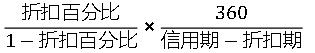

下列选项中，属于商业信用方式进行短期筹资的有（ &nbsp;）。

A.生产周转借款
B.应付账款  (正确)
C.应付票据  (正确)
D.结算借款
E.预收账款  (正确)
解析：
商业信用的具体形式有应付账款、应付票据、预收账款等。 【知识点】短期筹资的特点和方式 【考点】短期筹资的方式 【考查方向】概念释义 【难度】易 【题库维护老师：yxf】

企业选择银行时，重要的是要选用适宜的借款种类、借款成本和借款条件，此外还应考虑（）。

A.银行对贷款风险的政策  (正确)
B.银行对企业的态度  (正确)
C.银行的所有制形式
D.贷款的专业化程度  (正确)
E.银行的稳定性  (正确)
解析：
企业选择银行时，重要的是要选用适宜的借款种类、借款成本和借款条件，此外还应考虑下列有关因素：(1）银行对贷款风险的政策。通常银行对其贷款风险有着不同的政策，有的倾向于保守，只愿承担较小的贷款风险；有的富于开拓，敢于承担较大的贷款风险；（2）银行对企业的态度。不同银行对企业的态度不－样。有的银行肯于积极地为企业提供建议，帮助企业分析潜在的财务问题，乐于为具有发展潜力的企业发放大量贷款，在企业遇到困难时帮助其渡过难关；也有的银行很少提供咨询服务，在企业遇到困难时一昧地为清偿贷款而施加压力；（3）贷款的专业化程度。一些大银行设有不同的专业部门，分别处理不同类型、不同行业的贷款。企业与这些拥有丰富专业化贷款经验的银行合作，会更多地受益川的银行的稳定性。稳定的银行可以保证企业的借款不致中途发生变故。银行的稳定性取决于它的资本规模、存款水平波动程度和存款结构。一般来讲，资本雄厚、存款水平波动小、定期存款比重大的银行稳定性好，反之稳定性较差。

【知识点】短期筹资的特点和方式

【考点】短期负债筹资的方式

【考查方向】概念释义

【难度】易

【题库维护老师：hejiade】

与长期负债筹资相比，短期负债筹资的特点有（ &nbsp; &nbsp;）。

A.筹资速度快  (正确)
B.限制条件较多
C.筹资成本较高
D.筹资弹性好  (正确)
E.筹资风险高  (正确)
解析：
短期负债筹资的特点包括：（1）筹资速度快，容易取得；（2）筹资弹性好；（3）筹资成本较低；（4）筹资风险高。

【知识点】短期筹资的特点和方式

【考点】短期负债筹资的特点

【考察方向】原文挖空

【难度】易

【题库维护老师：ZKQ】

下列筹资方式中，属于商业信用形式的有( &nbsp; &nbsp;)。

A.应付票据  (正确)
B.应付账款  (正确)
C.抵押贷款
D.融资租赁
E.预收账款  (正确)
解析：
本题考查的是短期筹资的特点和方式。商业信用是指在商品交易中由于延期付款或预收货款所形成的企业间的借贷关系。其具体形式有应付账款、应付票据、预收账款等。

【知识点】短期筹资的特点和方式

【考点】短期负债筹资的方式——商业信用&nbsp;&nbsp;

【考察方向】原文挖空

【难度】易

【题库维护老师：ZKQ】

关于短期负债筹资特点的说法，正确的有（ ）。

A.筹资速度较快  (正确)
B.筹资弹性好  (正确)
C.筹资成本较低  (正确)
D.利率波动很小
E.筹资风险低
解析：
短期筹资是指一年以内或者超过一年的一个营业周期内到期的临时性流动资金需要。短期负债筹资通常具有筹资速度较快、筹资弹性好、筹资成本较低以及筹资风险高等特点。

【知识点】短期筹资的特点和方式

【考点】短期负债筹资的特点

【考察方向】原文挖空

【难度】易

【题库维护老师：ZKQ】

作为短期负债筹资最常用的方式有（ ）。

A.融资租赁
B.商业信用  (正确)
C.短期借款  (正确)
D.普通股股票筹资
E.可转换债券筹资
解析：
短期负债筹资最常用的方式是商业信用和短期借款。融资租赁、可转换债券筹资属于长期债券筹资，普通股股票筹资属于长期股权筹资。

【知识点】短期筹资的特点和方式

【考点】短期负债筹资的方式

【考察方向】原文挖空

【难度】易

【题库维护老师：ZKQ】

企业短期筹资时，贷款的实际利率高于名义利率的利息支出方法有（ ）。

A.收款法
B.贴现法  (正确)
C.固定利率法
D.浮动利率法
E.加息法  (正确)
解析：
贴现法和加息法都是实际利率高于名义利率的利息支出方法。

贴现法是银行向企业发放贷款时，先从本金中扣除利息部分，而到期时借款 企业则要偿还贷款全部本金的一种计息方法。采用这种方法，企业可利用的贷款额只有本 金减去利息部分后的差额，因此贷款的实际利率高于名义利率。

加息法是银行发放分期等额偿还贷款时采用的利息收取方法。在分期等额偿 还贷款的情况下，银行要将根据名义利率计算的利息加到贷款本金上，计算出贷款的本息 和，要求企业在贷款期内分期偿还本息之和的金额。由于贷款分期均衡偿还，借款企业实 际上只平均使用了贷款本金的半数，却支付全额利息。这样，企业所负担的实际利率便高 于名义利率大约 倍。

【知识点】短期筹资的特点和方式

【考点】短期负债筹资的方式——短期借款

【考察方向】概念释义

【难度】易

【题库维护老师：ZKQ】

作为短期负债筹资最常用的方式之一，短期借款主要有( &nbsp; )。

A.生产周转借款  (正确)
B.临时借款  (正确)
C.结算借款  (正确)
D.应付账款
E.预收账款
解析：
短期借款指企业向银行和其他非银行金融机构借人的期限在 年以内的借款。在短期 负债筹资中，短期借款的重要性仅次于商业信用。短期借款可以随企业的需要安排，便于 灵活使用，且取得亦较简便。但其突出的缺点是短期内要归还，特别是在带有诸多附加条件的情况下更是风险加剧。

短期借款的形式主要有生产周转借款、临时借款、结算借款等。

【知识点】短期筹资的特点和方式

【考点】短期负债筹资的方式——短期借款

【考察方向】原文挖空

【难度】易

【题库维护老师：ZKQ】

下列短期负债筹资方式中，属于商业信用形式的有( &nbsp; )。

A.商业承兑汇票  (正确)
B.抵押贷款
C.应付账款  (正确)
D.预收账款  (正确)
E.银行承兑汇票  (正确)
解析：
商业信用的具体形式有应付账款、应付票据、预收账款等。应付票据包括商业承兑汇票和银行承兑汇票。

【知识点】短期筹资的特点和方式

【考点】短期负债筹资的方式——商业信用

【考察方向】原文挖空

【难度】易

【题库维护老师：ZKQ】

短期负债筹资通常有以下特点(　　)。

A.筹资速度快  (正确)
B.筹资弹性好  (正确)
C.筹资成本较低  (正确)
D.筹资手续简便
E.筹资风险高  (正确)
解析：
短期负债筹资通常具有如下特点：1.筹资速度快，容易取得。2.筹资弹性好。3.筹资成本较低。4.筹资风险高。

【知识点】短期筹资的特点和方式

【考点】短期负债筹资的特点

【考察方向】原文挖空

【难度】易

【题库维护老师：ZKQ】

短期借款的利率多种多样，主要包括(　　)。

A.社会平均利率
B.优惠利率  (正确)
C.浮动优惠利率  (正确)
D.超额累进利率
E.非优惠利率  (正确)
解析：
短期借款的利率多种多样，利息支付方法亦不一，银行一般根据借款企业的情况选用。&nbsp;

借款利率分为优惠利率、浮动优惠利率和非优惠利率。

优惠利率是银行向财力雄厚、经营状况好的企业贷款时收取的名义利率，为贷款利率的最低限。

浮动优惠利率是一种随其他短期利率的变动而浮动的优惠利率，即随市场条件的变化而随时调整变化的优惠利率。

非优惠利率是银行贷款给一般企业时收取的高于优惠利率的利率，这种利率经常在优惠利率的基础上加一定的百分比。

【知识点】短期筹资的特点和方式

【考点】短期负债筹资的方式——短期借款

【考察方向】原文挖空

【难度】易

【题库维护老师：ZKQ】

对筹资方而言，短期负债筹资的特点有（ &nbsp; &nbsp;）。 &nbsp; &nbsp; &nbsp; &nbsp; &nbsp; &nbsp; &nbsp; &nbsp; &nbsp; &nbsp; &nbsp;

A.筹资速度快  (正确)
B.筹资风险高  (正确)
C.筹资难度大
D.限制条件较多
E.筹资成本较高
解析：
与长期负债筹资相比，短期负债筹资通常具有如下特点：  1.筹资速度快，容易取得。由于短期筹资的到期日短，债权人承担风险相对较低，不需要和长期筹资一样对筹资方进行全面的财务调查，因此更容易筹集。 2.筹资弹性好。在筹集长期资金时资金提供方出于资金安全的考虑往往提出较多的限制条件，而短期筹资的限制条件相对较少，使得筹资方在资金的使用上更加灵活、富有弹性。 3.筹资成本较低。由于短期筹资到期日短，债权人承担的风险也相对较低，因此，一半短期负债的利率低于长期负债。 4.筹资风险高。短期筹资需要在短期内偿还，因此要求筹资方要能在较短时间内拿出足够资金偿还债务，这对筹资方的资金营运提出了较高要求。此外，短期筹资的利率通常波动较大，因此有可能高于长期负债的利率水平。

【知识点】短期筹资的特点和方式

【考点】短期负债筹资的特点

【考察方向】原文挖空

【难度】易

【题库维护老师：ZKQ】

在短期筹资策略中，流动资产组合策略包括( &nbsp; )

A.临时型筹资策略
B.永久型筹资策略
C.稳健型筹资策略  (正确)
D.激进型筹资策略  (正确)
E.配合型筹资策略  (正确)
解析：
在短期筹资策略中，企业的流动资产一般分为临时性资产(波动性流动资产)和永久性资产两部分。流动资产组合策略是指如何配置流动资产，调整临时性与永久性流动资产两者的比例问题。其筹资策略有配合型筹资策略、激进型筹资策略、稳健型筹资策略。

【知识点】短期筹资的特点和方式

【考点】短期筹资的特点和方式

【考察方向】概念释义

【难度】中等

【题库维护老师：ZKQ】

借款企业支付银行贷款利息的方法一般有( &nbsp; )

A.担保法
B.收款法  (正确)
C.加息法  (正确)
D.抵押法
E.贴现法  (正确)
解析：
一般来讲，借款企业可以用以下三种方法支付银行贷款利息：

(1)收款法是在借款到期时向银行支付利息的方法。银行向工商企业发放的贷款大都采用这种方法收息。

(2)贴现法是银行向企业发放贷款时，先从本金中扣除利息部分，而到期时借款企业则要偿还贷款全部本金的一种计息方法。

(3)加息法是银行发放分期等额偿还贷款时采用的利息收取方法。

【知识点】短期筹资的特点和方式

【考点】短期负债筹资的方式—— 短期借款

【考察方向】原文挖空

【难度】易

【题库维护老师：ZKQ】

下列选项中，属于短期负债筹资特点的有( &nbsp; )

A.筹资弹性好  (正确)
B.筹资速度快  (正确)
C.筹资成本高
D.筹资风险低
E.借款的限制性条款较多
解析：
短期筹资是指为满足企业临时性流动资金需要而进行的筹资活动，一般是在一年以内或超过一年的一个营业周期内到期，常用的方式是通过流动负债方式取得，因此，也称为流动负债筹资或短期负债筹资。短期负债筹资特点：筹资速度快、筹资弹性好、筹资成本较低、筹资风险高。

【知识点】短期筹资的特点和方式

【考点】短期负债筹资的特点

【考察方向】原文挖空

【难度】易

【题库维护老师：ZKQ】

某企业与其开户银行有多种借款业务，以下是借款合同协议中的相关条款：在正式协议下约定企业的信用额度为50万元；企业需就贷款限额未使用部分向银行支付承诺费，承诺费率为0.5％；企业在银行中保持按贷款限额20％计算的最低存款余额。上述合同条款中，涉及的短期借款方式有( &nbsp; )

A.信贷限额  (正确)
B.周转信贷协定  (正确)
C.保证贷款
D.补偿性余额  (正确)
E.质押贷款
解析：
银行发放短期借款的主要方式：信贷限额、周转信贷协定、补偿性余额、担保贷款。

【知识点】短期筹资的特点和方式

【考点】短期负债筹资的方式——短期借款

【考察方向】原文挖空

【难度】易

【题库维护老师：ZKQ】

银行发放短期借款附带的信用条件通常有( &nbsp;)。 &nbsp; &nbsp; &nbsp; &nbsp; &nbsp; &nbsp; &nbsp; &nbsp; &nbsp; &nbsp; &nbsp; &nbsp; &nbsp; &nbsp; &nbsp; &nbsp;

A.信贷限额  (正确)
B.信贷利率
C.补偿性余额  (正确)
D.周转信贷协定  (正确)
E.贷款期限
解析：
按照国际惯例，银行发放短期借款往往带有一些信用条件，主要有：

1.信贷限额；2.周转信贷协定；3.补偿性余额；4.借款抵押；5.偿还条件；6.其他承诺。

【知识点】短期筹资的特点和方式

【考点】短期负债筹资的方式——短期借款

【考察方向】原文挖空

【难度】易

【题库维护老师：ZKQ】

作为短期负债筹资的商业信用，其具体方式有( &nbsp;)。 &nbsp; &nbsp; &nbsp; &nbsp; &nbsp; &nbsp; &nbsp; &nbsp; &nbsp; &nbsp; &nbsp; &nbsp; &nbsp; &nbsp; &nbsp; &nbsp;

A.应收账款
B.预收账款  (正确)
C.应付票据  (正确)
D.应付账款  (正确)
E.预付账款
解析：
有收账款和预付账款属于企业资产，预收账款、应付票据、应付账款才是企业的负债，形成短期债务筹资，故B、C、D为正确选项。

【知识点】短期筹资的特点和方式

【考点】短期负债筹资的方式——商业信用

【考察方向】原文挖空

【难度】易

【题库维护老师：ZKQ】

企业短期借款的形式主要有( &nbsp;)。 &nbsp; &nbsp; &nbsp; &nbsp; &nbsp; &nbsp; &nbsp; &nbsp; &nbsp; &nbsp; &nbsp; &nbsp; &nbsp; &nbsp; &nbsp; &nbsp;

A.投资借款
B.基本建设借款
C.生产周转借款  (正确)
D.临时借款  (正确)
E.结算借款  (正确)
解析：
短期借款的形式主要有生产周转借款、临时借款、结算借款等。投资借款、基本建设借款的使用期限一般很长，短期借款不能满足要求，且发放借款一方条件也不相同；而生产周转、结算过程及临时性需要资金可以通过短期借款方式解决。正确选项为C、D、E。

【知识点】短期筹资的特点和方式

【考点】短期负债筹资的方式——短期借款

【考察方向】原文挖空

【难度】易

【题库维护老师：ZKQ】

借款企业支付银行贷款利息的方法有( &nbsp;)。

A.付款法
B.收款法  (正确)
C.加息法  (正确)
D.终值法
E.贴现法  (正确)
解析：
借款企业一般可以用以下三种方法支付银行贷款利息:

（1）收款法。是在借款到期时向银行支付利息的方法。银行向工商企业发放的贷款大都采用这种方法收息。  （2）贴现法。贴现法是银行向企业发放贷款时，先从本金中扣除利息部分，而到期时借款企业则要偿还贷款全部本金的一种计息方法。采用这种方法，企业可利用的贷款额只有本金减去利息部分后的差额，因此贷款的实际利率高于名义利率。  （3）加息法。加息法是银行发放分期等额偿还贷款时采用的利息收取方法。在分期等额偿还贷款的情况下，银行要将根据名义利率计算的利息加到贷款本金上计算出贷款的本息和，要求企业在贷款期内分期偿还本息之和的金额。由于贷款分期均衡偿还，借款企业实际上只平均使用了贷款本金的半数，而却支付全额利息。这样，企业所负担的实际利率便高于名义利率的大约1倍。

【知识点】短期筹资的特点和方式

【考点】短期负债筹资的方式——短期借款

【考察方向】原文挖空

【难度】易

【题库维护老师：ZKQ】

在融资租赁费用中，有些费用项目是可以在税前列支的，这些费用项目主要包括（ &nbsp; ）。

A.利息  (正确)
B.手续费  (正确)
C.设备折旧费  (正确)
D.管理费
E.保险费
解析：
利息 ，手续费 ，设备折旧可以不交税。

【知识点】 筹资方式

【考点】短期筹资的特点和方式

【考查方向】概念释义

【难度】易

【题库维护老师：hejiade】

下列选项中属于以商业信用方式进行短期筹资的方式的一项是（）。

A.应付账款  (正确)
B.临时借款
C.认股权证
D.融资租赁
解析：
B选项，短期借款方式进行短期筹资；C、D选项为长期筹资。 【知识点】短期筹资的特点和方式 【考点】短期负债筹资的方式 【考查方向】概念释义 【难度】易 【题库维护老师：yxf】

短期借款是企业向金融机构借入的期限在（&nbsp; &nbsp; ）的借款。

A.3个月内
B.6个月内
C.1年内  (正确)
D.2年内
解析：
短期借款指企业向银行和其他非银行金融机构借入的期限在1年以内的借款。主要有生产周转借款、临时借款、结算借款等。 【知识点】短期筹资的特点和方式 【考点】短期借款 【考查方向】概念释义 【难易程度】易 【题库维护老师】yxf

某企业获得的周转信贷额为3000万元承诺费率为0.5%，企业在借款年度内使用2000万元，则企业该年度向银行支付的承诺费为（ &nbsp;）万元。

A.10
B.15
C.5  (正确)
D.25
解析：
本题考察的是短期借款的信用条件——周转信贷协定，对于银行具有发了义务地承诺提供不超过某一最高限额的贷款协定，协议有效期通常超过1年；在协议期内银行必须满足企业任何时候提出的借款要求（最高限额内）；最高限额未使用部分需要企业交纳一定的承诺费，故企业该年度向银行支付的承诺费为：（3000-2000）×0.5%=5万元。

【知识点】 短期筹资的特点和方式&nbsp;

【考点】短期负债筹资的方式 ——短期借款&nbsp;

【考察方向】公式计算

【难度】易

【题库维护老师：ZKQ】

根据承兑人的不同，应付票据分为商业承兑汇票和银行承兑汇票两种，支付期最长不超过（）个月。

A.3
B.4
C.5
D.6  (正确)
解析：
应付票据是企业进行延期付款商品交易时开具的反映债权债务关系的票据。根据承兑人的不同，应付票据分为商业承兑汇票和银行承兑汇票两种，支付期最长不超过6个月。

【知识点】短期筹资的特点和方式

【考点】短期负债筹资的方式—— 商业信用&nbsp;

【考察方向】原文挖空

【难度】易

【题库维护老师：ZKQ】

短期借款筹资的优点是（ &nbsp; &nbsp;）。

A.筹资成本较低  (正确)
B.筹资风险小
C.短期内不需要归还
D.使用灵活
解析：
短期借款速度快容易取得；筹资弹性好；筹资成本较低；筹资风险高。

【知识点】短期筹资的特点和方式

【考点】短期负债筹资的方式——短期借款

【考察方向】概念释义

【难度】易

【题库维护老师：ZKQ】

采用周转信贷协议向银行借款时，企业（ &nbsp; &nbsp;）。

A.在有效期和最高限额内，可在任何时候借款  (正确)
B.必须按规定的周期和固定的金额借款
C.可以周转使用信贷资金，不必偿还本金
D.可以周转使用信贷资金，贷款额度不受限制
解析：
周转信贷协定是银行具有法律义务地承诺提供不超过某一最高限额的贷款协定。在协定的有效期内，只要企业的借款总额未超过最高限额，银行必须满足企业任何时候提出的借款要求。企业享用周转信贷协定，通常要就贷款限额的未使用部分付给银行一笔承诺费。

【知识点】短期筹资的特点和方式

【考点】短期负债筹资的方式——短期借款

【考察方向】原文挖空

【难度】易

【题库维护老师：ZKQ】

某施工企业按2/10、1/20、n/30的条件购入材料40万元，关于该项业务付款的说法，正确的是（ &nbsp;）。

A.若银行借款年利率为6%，该企业应放弃现金折扣
B.若该企业在第9天付款，需支付39.2万元  (正确)
C.若该企业在第21天付款，需支付39.6万元
D.若该企业在第29天付款，则放弃现金折扣的成本为2%
解析：
本题考查的是短期筹资的特点和方式。若企业在第9天付款，则需支付40×(1-2%)=39.2。故选项B正确。若企业在第21天付款，则需按40万全额支付。故选项C有误。若企业在第29天付款，则放弃现金折扣的成本为(2%/98%)×360/(29-10)=38.67%。故选项A、D有误。

【知识点】短期筹资的特点和方式

【考点】短期筹资的特点和方式

【考察方向】公式计算

【难度】易

【题库维护老师：ZKQ】

某建筑企业按2/10，n/30的条件购入货物100万元，若该企业在第30天付款，则放弃现金折扣的成本为（）。

A.2.00%
B.2.04%
C.36.73%  (正确)
D.73.47%
解析：
放弃现金折扣成本=折扣百分比/（1-折扣百分比）x360/（信用期-折扣期）=2%/（1-2%）x360/（30-10）=36.73%

【知识点】短期筹资的特点和方式

【考点】短期筹资的特点和方式

【考察方向】公式计算

【难度】易

【题库维护老师：ZKQ】

在银行发放短期借款的主要方式中，补偿性余额条款是指（ ）。

A.银行通常对借款人规定无担保贷款的最高额
B.借款人要对贷款限额未使用部分向银行支付承诺费
C.借款人在银行中保持按实际借用额的一定比例计算的最低存款余额  (正确)
D.银行向某些借款人发放贷款时，可能需要抵押品
解析：
在银行方法贷款的主要方式中，有信贷限额、周转信贷协议、补偿性余额和担保贷款等。其中，补偿性余额条款是指银行要求借款人在银行中，保持按贷款限额或实际借用额的一定比例（10%～20%）计算的最低存款余额。

【知识点】短期筹资的特点和方式

【考点】短期负债筹资的方式——短期借款

【考察方向】原文挖空

【难度】易

【题库维护老师：ZKQ】

某企业按“2/10，n/30”的条件购入货物 40 万元。如果企业在 10 天内付款，则该企业得到的免费信用额为 （ ）万元。

A.0.8
B.4.0
C.36.0
D.39.2  (正确)
解析：
由于在 10 天内付款，享受了 10 天的免费信用期，并获得了 40×2%=0.8（万元）的现金折扣。因此，免费信用额度为 40-0.8=39.2（万元）。

【知识点】短期筹资的特点和方式

【考点】短期筹资的特点和方式

【考察方向】公式计算

【难度】易

【题库维护老师：ZKQ】

某施工企业按3/10,n/30的信用条件购入材料100万元。已知企业可以3%的年利率从银行取得流动资金借款。则关于这批材料款支付的合理做法是()。*

A.企业向银行借款,在10天内付款  (正确)
B.企业向银行借款,在11天到30天之间付款
C.企业不借款,在11天到30天之间付款
D.企业不借款,在30天后付款
解析：
由题意可知：3/10．n/30表示的是10天之内付款会有3％的折扣，在11天到30天之间付款没有折扣，而超过30天就需要额外支付利息。同时．企业可以3％的年利率从银行取得流动资金借款。故在不动用自己的本金的情况下，企业向银行借款，并在10天内付款是最合理的做法。

【知识点】短期筹资的特点和方式

【考点】短期筹资的特点和方式

【考查方向】概念释义

【难度】易

【题库维护老师：hejiade】

短期负债筹资的特点有（ &nbsp; &nbsp;）。

A.债权人承担的风险相对较大
B.限制条件相对较多
C.筹资成本较高
D.筹资风险高  (正确)
解析：
短期负债筹资通常具有如下特点：

①筹资速度快；

②筹资弹性好（限制条件相对较少）；

③筹资成本较低（债权人承担的风险相对较低）；

④筹资风险高。

【知识点】短期筹资的特点和方式

【考点】短期负债筹资的特点

【考察方向】原文挖空

【难度】易

【题库维护老师：ZKQ】

下列不属于商业信用的具体形式的是（ &nbsp; &nbsp;）。

A.应付票据
B.应付账款
C.应收账款  (正确)
D.预收账款
解析：
商业信用的具体形式有应付账款、应付票据和预收账款等。而应收账款是商业信用的直接产物。

【知识点】短期筹资的特点和方式

【考点】短期负债筹资的方式——商业信用

【考察方向】原文挖空

【难度】易

【题库维护老师：ZKQ】

某施工企业需要从银行借款200万元，期限1年，有甲、乙、丙、丁四家银行愿意提供贷款，年利率均为7%，但利息支付方式不同，甲要求采用贴现法，乙要求采用收款法，丙、丁均要求采用加息法，并且丙要求12个月内等额还本付息，丁要求12个月内等额本金偿还，利息随各期的本金一起支付，其他贷款条件都相同，则该企业借款应选择的银行是 （ &nbsp; ）。

A.甲
B.乙  (正确)
C.丙
D.丁
解析：
收款法是在借款到期时向银行支付利息的方法（名=实），贴现法是银行向企业发放贷款时，先从本金中扣除利息部分，而到期时借款企业则要偿还贷款全部本金的一种计息方法（实&gt;名），加息法是银行发放分期等额偿还贷款时采用的利息收取方法，企业所负担的实际利率便高于名义利率大约1倍。（实&gt;名）。选择支付利息最小的银行，即乙银行。

【知识点】短期筹资的特点和方式

【考点】短期负债筹资的方式——短期借款

【考察方向】概念释义

【难度】中等

【题库维护老师：ZKQ】

下列筹资方式中，属于商业信用筹资方式的是（ &nbsp; ）。 &nbsp;

A.短期借款
B.长期借款
C.预付账款
D.预收账款  (正确)
解析：
商业信用的具体形式有应付账款、 应付票据、预收账款等。

【知识点】短期筹资的特点和方式

【考点】短期负债筹资的方式——商业信用

【考察方向】原文挖空

【难度】易

【题库维护老师：ZKQ】

加息法是银行发放分期等额偿还贷款时采用的利息收取方法，在此方法下，企业所负担的实际利率与名义利率之间的关系是( &nbsp; )

A.实际利率高于名义利率  (正确)
B.实际利率低于名义利率
C.实际利率与名义利率相同
D.实际利率与名义利率没有可比性
解析：
加息法是银行发放分期等额偿还贷款时采用的利息收取方法。在分期等额偿还贷款的情况下，银行要将根据名义利率计算的利息加到贷款本金上，计算出贷款的本息和，要求企业在贷款期内分期偿还本息之和的金额。由于贷款分期均衡偿还，借款企业实际上只平均使用了贷款本金的半数，却支付全额利息。这样，企业所负担的实际利率便高于名义利率大约1倍。

【知识点】一、短期筹资的特点和方式（1Z102072&nbsp;筹资方式）

【考点】2.短期借款（(二)短期负债筹资的方式）

【考察方向】概念释义

【难度】易

【题库维护老师：ZKQ】

施工企业从建设单位取得的工程预付款，属于施工企业筹资方式中的( &nbsp; )筹资。

A.商业信用  (正确)
B.融资租赁
C.短期借款
D.长期借款
解析：
商业信用是指在商品交易中由于延期付款或预收货款所形成的企业间的借贷关系。它运用广泛，在短期负债筹资中占有相当大的比重。商业信用的具体形式有应付账款、应付票据、预收账款等。

【知识点】短期筹资的特点和方式

【考点】短期负债筹资的方式——商业信用

【考察方向】概念释义

【难度】易

【题库维护老师：ZKQ】

企业短期筹资常用的方式是通过( &nbsp;)取得所需资金。

A.融资租赁方式
B.流动负债方式  (正确)
C.私募方式
D.同行拆借方式
解析：
短期筹资是指为满足企业临时性流动资金需要而进行的筹资活动，一般是在一年以内或超过一年的一个营业周期内到期，常用的方式是通过流动负债方式取得，因此，也称为流动负债筹资或短期负债筹资。

【知识点】短期筹资的特点和方式

【考点】短期筹资的特点和方式

【考察方向】原文挖空

【难度】易

【题库维护老师：ZKQ】

企业开出的应付票据分为( &nbsp;)。

A.企业承兑汇票和担保人承兑汇票
B.商业承兑汇票和银行承兑汇票  (正确)
C.担保人承兑汇票和银行承兑汇票
D.担保人承兑汇票和商业承兑汇票
解析：
应付票据是企业进行延期付款商品交易时开具的反映债权债务关系的票据。根据承兑人的不同，应付票据分为商业承兑汇票和银行承兑汇票两种，支付期最长不超过6个月。

【知识点】短期筹资的特点和方式

【考点】短期负债筹资的方式——商业信用

【考察方向】原文挖空

【难度】易

【题库维护老师：ZKQ】

企业按2/15、n/30的条件购入货物30万元。如果该企业在第10天付款，则企业获得的折扣和免费信用额为( &nbsp;)万元。

A.0.6，29.4  (正确)
B.0.6，30
C.0.3,29.4
D.0.2，29.8
解析：
企业在免费信用期内付款，可以获得折扣为30×2%=0.6万元，实际支付的金额30-0.6=29.4万元，相当于信用期内免费使用了该项资金。故A为正确选项。

【知识点】短期筹资的特点和方式

【考点】短期负债筹资的方式——商业信用

【考察方向】公式计算

【难度】易

【题库维护老师：ZKQ】

应付票据的支付期最长不超过( &nbsp;)个月。

A.1
B.3
C.6  (正确)
D.9
解析：
根据承兑人的不同，应付票据分为商业承兑汇票和银行承兑汇票两种，支付期最长不超过6个月。

【知识点】短期筹资的特点和方式

【考点】短期负债筹资的方式商业信用

【考察方向】原文挖空

【难度】易

【题库维护老师：ZKQ】

短期借款中的信贷限额是银行对借款人规定的( &nbsp;)。

A.无担保贷款的最高额  (正确)
B.抵押贷款的最高额
C.有担保贷款的最低额
D.抵押贷款抵押物的最低额
解析：
信贷限额是银行对借款人规定的无担保贷款的最高额。信贷限额的有效期限通常为1年，但根据情况也可延期1年。一般来讲，企业在批准的信贷限额内，可随时使用银行借款。但是，银行并不承担必须提供全部信贷限额的义务。

【知识点】短期筹资的特点和方式

【考点】短期负债筹资的方式——短期借款

【考察方向】概念释义

【难度】易

【题库维护老师：ZKQ】

相对于长期负债筹资方式，关于短期负债筹资特点的说法，正确的是( &nbsp;)。

A.资金提供人对资金使用的限制较多
B.资金成本较高
C.筹资方获取资金速度较快  (正确)
D.短期内偿付债务的财务压力较小
解析：
长期债务筹资方式下，由于期限较长，可能遇到的风险因素较多，因而资金提供人对债务人的审查更严格，要求的资金代价也较高，所以A、B是长期债务融资的特点，而短期债务筹资特点相反，A、B不正确。由于短期债务资金使用期限较短，债务人短期内偿债压力较大，所以D不正确。正确选项为C。

【知识点】短期筹资的特点和方式

【考点】短期负债筹资的特点

【考察方向】原文挖空

【难度】易

【题库维护老师：ZKQ】

短期筹资一般是在一年以内或( &nbsp;)到期的筹资。

A.超过一年不超过管理者一个任期
B.不超过三年
C.超过一年的一个营业周期内  (正确)
D.不超过五年
解析：
短期筹资是指为满足企业临时性流动资金需要而进行的筹资活动，一般是在一年以内或超过一年的一个营业周期内到期，常用的方式是通过流动负债方式取得，因此，也称为流动负债筹资或短期负债筹资。

【知识点】短期筹资的特点和方式

【考点】短期筹资的特点和方式

【考察方向】原文挖空

【难度】易

【题库维护老师：ZKQ】

企业享有的周转信贷额为1000万元，承诺费率为0.5%，借款企业年度内使用了700万元，余额300万元，借款企业该年度要向银行支付的承诺费为( &nbsp;)万元。

A.0
B.1.5  (正确)
C.3.5
D.5.0
解析：
周转信贷协定是银行具有法律义务地承诺提供不超过某一最高限额的贷款协定。在有效期内，只要企业的借款总额未超过最高限额，银行必须满足企业任何时候提出的借款要求。企业享用周转信贷协定，通常要就贷款限额的未使用部分付给银行一笔承诺费。该协定的有效期通常超过1年。本案例中，企业年度内有300万元未使用，应向银行支付承诺费1.5万元(=300×0.5%)，故正确选项为B。

【知识点】短期筹资的特点和方式

【考点】 短期负债筹资的方式——短期借款

【考察方向】公式计算

【难度】易

【题库维护老师：ZKQ】

企业按年利率5.9%向银行借款800万元，银行要求维持借款限额8%的补偿性余额，该项借款的有效年利率为( &nbsp;)。

A.5.428%
B.5.9%
C.6.372%
D.6.413%  (正确)
解析：
补偿性余额是银行要求借款企业在银行中保持按贷款限额或实际借用额一定百分比的最低存款余额，相当于企业实际可用的资金减少，利息按照借款额计算。本例中企业年利息为800×5.9%=47.2万元，实际可使用的资金为800×(1—8%)=736万元，企业实际利率为47.2/736×100%-6.413%。所以D正确。

【知识点】短期筹资的特点和方式

【考点】短期负债筹资的方式——短期借款

【考察方向】公式计算

【难度】易

【题库维护老师：ZKQ】

企业向银行一次性借款、按协议分期偿还本息的借款方式下，企业向银行支付利息的方法属于( &nbsp;)。

A.收款法
B.贴现法
C.终值法
D.加息法  (正确)
解析：
加息法是银行发放分期等额偿还贷款时采用的利息收取方法。

【知识点】短期筹资的特点和方式

【考点】短期负债筹资的方式——短期借款

【考察方向】概念释义

【难度】易

【题库维护老师：ZKQ】

信用期限30天，10天内付款有2%的折扣，10天至20天内付款有1%折扣，超过20天全额付款，该信用条件的符号表达式为（ &nbsp; ）。

A.1/10,n/30
B.1/10,0/20,n/30
C.1/20,n/30
D.2/10,1/20,n/30  (正确)
解析：
免费信用，即买方企业在规定的折扣期内享受折扣而获得的信用；有代价信用，即买方企业放弃折扣付出代价而获得的信用；展期信用，即买方企业超过规定的信用期推迟付款而强制获得的信用。

【知识点】一、短期筹资的特点和方式（1Z102072&nbsp;筹资方式）

【考点】1.商业信用（(二)短期负债筹资的方式）

【考察方向】概念释义

【难度】易

【题库维护老师：ZKQ】

补偿性余额是指银行要求借款人在银行中保持按贷款限额或实际借用额的一定百分比计算的最低存款余额，该百分比一般是( &nbsp; )。

A.10%
B.10%~15%
C.15%～20%
D.10%~20%  (正确)
解析：
补偿性余额是银行要求借款企业在银行中保持按贷款限额或实际借用额一定百分比（一般为10%--20%）的最低存款余额。从银行的角度讲，补偿性余额可降低贷款风险，补偿遭受的贷款损失。对于借款企业来讲，补偿性余额则提高了借款的实际利率。

【知识点】短期筹资的特点和方式

【考点】短期负债筹资的方式—— 短期借款

【考察方向】原文挖空

【难度】易

【题库维护老师：ZKQ】

应付票据是一种期票，是应付账款的书面证明。与银行借款相比，下面关于应付票据的利率、筹资成本和风险表述正确的是( &nbsp; )。

A.利率更低、筹资成本更高、风险更大
B.利率更高、筹资成本更低、风险更小
C.利率更低、筹资成本更低、风险更大  (正确)
D.利率更高、筹资成本更高、风险更大
解析：
应付票据的利率一般比银行的借款利率低，且不用保持相应的补偿余额和支付协议费，所以应付票据的筹资成本低于银行借款成本。但是应付票据到期必须归还，如若延期便要交付罚金，因而风险较大。

【知识点】短期筹资的特点和方式

【考点】短期负债筹资的方式——商业信用

【考察方向】原文挖空

【难度】易

【题库维护老师：ZKQ】

某施工企业按照2/15、n/30的信用条件购入货物100万元，该企业在第28天付款，则其放弃现金折扣的成本是（　）。

A.48.98%  (正确)
B.56.51%
C.26.23%
D.8.33%
解析：
 

【知识点】短期筹资的特点和方式

【考点】短期筹资的特点和方式

【考查方向】公式计算

【难度】易

【题库维护老师：yxf】

某施工企业按照3/7、n/20的信用条件购入货物100万元，在第15天付款，放弃现金折扣成本是(　)。

A.55.67%
B.74.23%
C.85.65%  (正确)
D.139.18%
解析：
 

由上式得3%/(1−3%)×360/(20−7)=85.65%

【知识点】短期筹资的特点和方式 【考点】短期筹资的特点和方式 【考查方向】公式计算 【难度】易 【题库维护老师：yxf】

某施工企业按2/10、n/30的条件购入钢材50万元，企业在第30天支付了全部货款50万元，那么该企业放弃现金折扣的成本为（ &nbsp;）。

A.36.73%  (正确)
B.2.00%
C.2.04%
D.11.11%
解析：

[2%÷(1-2%)]X [360÷(30-10)]=36.7%

【知识点】短期筹资的特点和方式

【考点】短期负债筹资的方式

【考察方向】公式计算

【难度】易

【题库维护老师：ZKQ】

如信用条件为“2／10，n／30”，放弃现金折扣的成本为( &nbsp; )。

A.2%
B.36.4%
C.36.7%  (正确)
D.3%
解析：
放弃现金折扣的成本＝＝36.7%

【知识点】短期筹资的特点和方式

【考点】短期负债筹资的方式——商业信用

【考察方向】公式计算

【难度】易

【题库维护老师：ZKQ】

某施工企业按照 2/15、n/30 的信用条件购入货物 100 万元，该企业在第 28 天付款，则其放弃现金折扣的成本是（ &nbsp; &nbsp;） 。 &nbsp; &nbsp; &nbsp; &nbsp; &nbsp; &nbsp; &nbsp; &nbsp; &nbsp; &nbsp; &nbsp; &nbsp; &nbsp; &nbsp; &nbsp; &nbsp;

A.48.98%  (正确)
B.56.51%
C.26.23%
D.8.33%
解析：

列式计算：[2%÷（1-2%）]×[360÷（30-15）]=48.98%

【知识点】短期筹资的特点和方式

【考点】短期负债筹资的方式——商业信用

【考察方向】公式计算

【难度】易

【题库维护老师：ZKQ】

