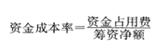

某施工企业从银行借款3000万元，手续费率为0.5%，年利率为6%，期限为3年，每年年末计息并支付，到期一次还本，企业所得税率为25%，则该笔借款的资金成本率为（ &nbsp;&nbsp;）

A.6.03%
B.4.52%  (正确)
C.6.00%
D.4.50%
解析：
资金成本率=资金占用费/筹资净额。3000*6%*（1-25%）/3000*（1-0.5%）=135/2985=4.52%

【知识点】资金成本的概念

【考点】资金成本的概念

【考察方向】公式计算

【难度】易

【题库维护老师：ZKQ】

资金占用费是指企业占用资金支付的费用，下列属于资金占用费的是（ &nbsp; &nbsp;）。

A.银行借款利息  (正确)
B.发行债券支付的印刷费
C.代理发行费
D.广告费
解析：
资金占用费是指企业占用资金支付的费用，如银行借款利息和债券利息等。选项B.C.D均属于筹资费用。

【知识点】资本结构分析与优化

【考点】资金成本的概念

【考察方向】原文挖空

【难度】易

【题库维护老师：ZKQ】

下列各项中，不属于筹资费用的是( &nbsp; )。

A.发行债券印刷费
B.银行借款手续费
C.债券利息  (正确)
D.代理发行费
解析：
筹资费用是指在资金筹集过程中支付的各项费用，如发行债券支付的印刷费、代理发行费、律师费、公证费、广告费等，它通常是在筹措资金时一次性支付，在使用资金的过程中不再发生。因此，筹资费用可看作资金成本的固定费用，一般视为筹资数额的一项扣除。 资金占用费和筹集资金的数额、资金占用时间的长短有直接联系，可看作是资金成本的变动费用。

【知识点】资金成本的概念

【考点】资金成本的概念

【考察方向】原文挖空

【难度】易

【题库维护老师：ZKQ】

下列属于资金成本中的资金占用费的是( &nbsp; )。

A.债券利息  (正确)
B.银行的借款手续费
C.广告费
D.公证费
解析：
资金成本包括资金占用费和筹资费用，资金占用费是指企业占用资金支付的费用，如银行借款利息和债券利息等，BCD项是筹资费用。

【知识点】资金成本的概念

【考点】资金成本的概念

【考察方向】概念释义

【难度】易

【题库维护老师：ZKQ】

某施工企业从银行取得一笔借款1000万元，银行手续费为1.5%，借款年利率为6%，期限为2年，每年计算并支付利息，到期一次还本，企业所得税税率为25%，则在财务上这笔借款的资金成本率为( &nbsp; )。

A.4.57%  (正确)
B.6.09%
C.4.50%
D.6.00%
解析：
资金成本和筹资总额、筹资费用和资金占用费之间的关系式为：资金成本率＝资金占用费／筹资净额，筹资净额＝筹资总额－筹资费＝筹资总额×(1－筹资费率)。本题中，该笔借款的资金成本率＝1000×6%×(1－25%)／[1000×(1－1.5%)]＝4.57%。

【知识点】资金成本的概念

【考点】资金成本的概念

【考察方向】公式计算

【难度】易

【题库维护老师：ZKQ】

企业以发行债券方式融资产生的资金成本中，属于资金占用费的是(　)。

A.债券代理发行费
B.债券公证费
C.债券发行广告费
D.债券利息  (正确)
解析：
资金占用费是指企业占用资金支付的费用，如银行借款利息和债券利息等。

【知识点】资金成本的概念

【考点】资金成本的概念

【考察方向】原文挖空

【难度】易

【题库维护老师：ZKQ】

资金成本包括资金占用费和筹资费用两部分。下列不属于资金占用费的有( &nbsp; )。

A.借款手续费  (正确)
B.债券利息
C.发行债券支付的印刷费  (正确)
D.筹资过程中支付的广告费  (正确)
E.贷款利息
解析：
资金成本包括资金占用费和筹资费用两部分。其中，资金占用费是指企业占用资金支付的费用，如银行借款利息和债券利息等。筹资费用是指在资金筹集过程中支付的各项费用，如银行的借款手续费，发行债券支付的印刷费、代理发行费、律师费、公证费、广告费等，它通常是在筹措资金时一次性支付，在使用资金的过程中不再发生。

【知识点】资金成本的概念

【考点】资金成本的概念

【考察方向】原文挖空

【难度】易

【题库维护老师：ZKQ】

下列资金成本中，属于资金占用费的有（ &nbsp; &nbsp;）。

A.借款手续费
B.发行债券支付的印刷费
C.筹资过程中支付的广告费
D.债券利息  (正确)
E.借款利息  (正确)
解析：
资金占用费是指企业占用资金支付的费用，如银行借款利息和债券利息等。

【知识点】1Z102073 资金成本的计算与应用

【考点】一、资金成本的概念

【考察方向】原文挖空

【难度】易

【题库维护老师：ZKQ】

下列各项中，属于筹资费用的是( &nbsp; &nbsp;)。

A.债券利息
B.银行借款手续费  (正确)
C.发行债券印刷费  (正确)
D.代理发行费  (正确)
E.发行债券支出的广告费  (正确)
解析：
筹资费用是指在资金筹集过程中支付的各项费用，如发行债券支付的印刷费、代理发行费、律师费、公证费、广告费等，它通常是在筹措资金时一次性支付，在使用资金的过程中不再发生。

【知识点】资金成本的概念

【考点】资金成本的概念

【考察方向】原文挖空

【难度】易

【题库维护老师：ZKQ】

某公司从银行取得一笔长期借款1000万元，手续费0.5%，年利率为8%，期限3年，每年结息一次，到期一次还本，企业所得税率为25%，则这笔借款的资金成本率为( &nbsp; &nbsp; )。

A.5.98%
B.6.03 %  (正确)
C.6.06%
D.6.09 %
解析：
 

=年资金占用费×（1-所得税率）/筹资总额（1-筹资费率） =[1000×8%×(1-25%)]/[1000×(1-0.5%）]=6.03%

【知识点】资本结构的优化

【考点】资金成本的计算——个别资金成本

【考察方向】公式计算

【难度】易

【题库维护老师：ZKQ】

