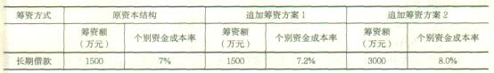
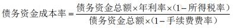
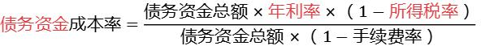
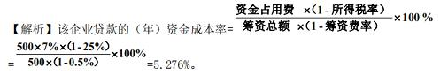

某公司现有长期资本总额1亿元，其中长期借款3000万元，长期债券3000万元，普通股4000万元，其资金成本率分别为5%、6%、10%，则该公司综合资金成本率为（ &nbsp;）。

A.7.3%  (正确)
B.7%
C.6.4%
D.5.8%
解析：
取加权平均5%×0.3+6%×0.3+10%×0.4 【知识点】资金成本的计算 【考点】资金成本的计算 【考查方向】计算 【难度】易 【题库维护老师：yxf】

某企业从银行借入一笔长期贷款2000万元，手续费率为0.2% ，年利率为7% ，期限为5年，每年结息一次，年末付息，到期一次还本，企业所得税税率为25%，则该项借款的资金成本率为（ )。

A.7.27%
B.7.21%
C.5.26%  (正确)
D.5.46%
解析：
7%×（1-25%）/（1-0.2%）=5.26%，本题主要考核“资金成本率”知识点。 

【知识点】资金成本的计算

【考点】资金成本的计算

【考察方向】公式计算

【难度】易

【题库维护老师：ZKQ】

某企业拟从银行取得一笔贷款2000万元，期限3年，每年年末付息，到期一次还本。有四家银行提出的贷款条件见下表：&nbsp;

<table cellspacing="0"><tbody><tr style="height:31px" class="firstRow"><td width="131" valign="center" style="padding: 0px 7px; border-width: 1px; border-color: windowtext; word-break: break-all;">
费率

银行
</td><td width="131" valign="center" style="padding: 0px 7px; border-width: 1px; border-color: windowtext; word-break: break-all;">
甲
</td><td width="131" valign="center" style="padding: 0px 7px; border-width: 1px; border-color: windowtext; word-break: break-all;">
乙
</td><td width="131" valign="center" style="padding: 0px 7px; border-width: 1px; border-color: windowtext; word-break: break-all;">
丙
</td><td width="131" valign="center" style="padding: 0px 7px; border-width: 1px; border-color: windowtext; word-break: break-all;">
丁
</td></tr><tr><td width="131" valign="center" style="padding: 0px 7px; border-left-width: 1px; border-left-color: windowtext; border-right-width: 1px; border-right-color: windowtext; border-top: none; border-bottom-width: 1px; border-bottom-color: windowtext; word-break: break-all;">
手续费率
</td><td width="131" valign="center" style="padding: 0px 7px; border-left-width: 1px; border-left-color: windowtext; border-right-width: 1px; border-right-color: windowtext; border-top: none; border-bottom-width: 1px; border-bottom-color: windowtext; word-break: break-all;">
0.1%
</td><td width="131" valign="center" style="padding: 0px 7px; border-left-width: 1px; border-left-color: windowtext; border-right-width: 1px; border-right-color: windowtext; border-top: none; border-bottom-width: 1px; border-bottom-color: windowtext; word-break: break-all;">
0.2%
</td><td width="131" valign="center" style="padding: 0px 7px; border-left-width: 1px; border-left-color: windowtext; border-right-width: 1px; border-right-color: windowtext; border-top: none; border-bottom-width: 1px; border-bottom-color: windowtext; word-break: break-all;">
0.5%
</td><td width="131" valign="center" style="padding: 0px 7px; border-left-width: 1px; border-left-color: windowtext; border-right-width: 1px; border-right-color: windowtext; border-top: none; border-bottom-width: 1px; border-bottom-color: windowtext; word-break: break-all;">
0.2%
</td></tr><tr><td width="131" valign="center" style="padding: 0px 7px; border-left-width: 1px; border-left-color: windowtext; border-right-width: 1px; border-right-color: windowtext; border-top: none; border-bottom-width: 1px; border-bottom-color: windowtext; word-break: break-all;">
年利率
</td><td width="131" valign="center" style="padding: 0px 7px; border-left-width: 1px; border-left-color: windowtext; border-right-width: 1px; border-right-color: windowtext; border-top: none; border-bottom-width: 1px; border-bottom-color: windowtext; word-break: break-all;">
7%
</td><td width="131" valign="center" style="padding: 0px 7px; border-left-width: 1px; border-left-color: windowtext; border-right-width: 1px; border-right-color: windowtext; border-top: none; border-bottom-width: 1px; border-bottom-color: windowtext; word-break: break-all;">
8%
</td><td width="131" valign="center" style="padding: 0px 7px; border-left-width: 1px; border-left-color: windowtext; border-right-width: 1px; border-right-color: windowtext; border-top: none; border-bottom-width: 1px; border-bottom-color: windowtext; word-break: break-all;">
6%
</td><td width="131" valign="center" style="padding: 0px 7px; border-left-width: 1px; border-left-color: windowtext; border-right-width: 1px; border-right-color: windowtext; border-top: none; border-bottom-width: 1px; border-bottom-color: windowtext; word-break: break-all;">
7.5%
</td></tr></tbody></table>

该企业所得税率为25%，仅从资金成本的角度考虑，该企业应从（ &nbsp;&nbsp;）银行贷款。

A.甲
B.乙
C.丙  (正确)
D.丁
解析：
资金成本是指企业为筹措和使用资本而付出的代价，是资金使用者向资金所有者和中介机构支付的占用费和筹集费用，包括资金占用费和筹资费用两部分。由题意得： 甲银行资金成本率＝资金占用费/筹资净额＝2000×7％×（1－25％）/2000×（1－0.1％）＝5.26％； 乙银行资金成本率＝资金占用费/筹资净额＝2000×8％×（1－25％）/2000×（1－0.2％）＝6.01％； 丙银行资金成本率＝资金占用费/筹资净额＝2000×6％×（1－25％）/2000×（1－0.5％）＝4.52％； 丁银行资金成本率＝资金占用费/筹资净额＝2000×7.5％×（1－25％）/2000×（1－0.2％）＝5.64％。 丙银行资金成本率最小，故该企业应从丙银行贷款。

【知识点】资金成本的计算

【考点】资金成本的计算

【考察方向】公式计算

【难度】中等

【题库维护老师：ZKQ】

某企业现有长期资本总额为15000万元，其中长期借款4000万元，长期债券5000万元，普通股6000万元。期限均为3年，每年结息一次，到期一次还本。长期借款资金成本率为5％，长期债券资金成本率为6％，普通股资金成本率为8％。则该公司综合资金成本率为（ &nbsp; &nbsp;）。

A.4.00％
B.4.20％
C.6.53％  (正确)
D.7.60％
解析：
本题的计算过程如下： 第一步，计算各种长期资本占全部资本的比例。 长期借款资金比例＝4000÷15000×100％＝26.67％ 长期债券资金比例＝5000÷15000×100％＝33.33％ 普通股资金比例＝6000÷15000×100％＝40.00％ 第二步，测算综合资金成本。 综合资金成本＝5％×26.67％＋6％×33.33％＋8％×40％＝6.53％。

【知识点】资金成本的计算

【考点】综合资金成本

【考察方向】公式计算

【难度】中等

【题库维护老师：ZKQ】

某企业现有长期资本总额为8000万元，其中长期借款2000万元，长期债券3000万元，普通股3000万元，各种长期资金成本率分别为5％.6％和10％。则该企业综合资金成本率为（ &nbsp; &nbsp;）。

A.7.13％
B.6.63％
C.7.25％  (正确)
D.7％
解析：
本题的计算过程为： （1）计算各种长期资本占全部资本的比例。 长期借款资金比例＝2000÷8000×100％＝25％； 长期债券资金比例＝3000÷8000×100％＝37.5％； 普通股资金比例＝3000÷8000×100％＝37.5％； （2）计算综合资金成本。 综合资金成本＝5％×25％＋6％×37.5％＋10％×37.5％＝7.25％。

【知识点】资金成本的计算

【考点】综合资金成本

【考察方向】公式计算

【难度】中等

【题库维护老师：ZKQ】

企业从银行取得5年的长期借款1000万元，该笔借款的担保费费率为0.5%,利率为6%，每年结息一次，到期一次还本，企业所得税税率为25%，则该笔借款年资本金成本率为( &nbsp;)。

A.4.50%
B.4.52%  (正确)
C.6.00%
D.6.03%
解析：
本题考查的是资金成本的计算。[1000×6%X(1-25%)]/[1000×(1-0.5%)]=4.52%。

【知识点】资金成本的计算

【考点】个别资金成本

【考察方向】公式计算

【难度】易

【题库维护老师：ZKQ】

某建筑企业年初从银行借款1000万元，期限5年，年利率为8%，每年末结息一次，到期一次还本，企业所得税率为25%。则该笔借款的年资金成本率为（）。

A.1.60%
B.8.00%
C.8.24%
D.6.00%  (正确)
解析：
1000x8%x（1-25%）/1000=6%

【知识点】资金成本的计算

【考点】个别资金成本

【考察方向】公式计算

【难度】易

【题库维护老师：ZKQ】

某项目贷款筹资总额 18 万元，筹资费率为 10%，贷款年利率为 9%，不考虑资金的时间价值，则该项贷款的资金成本率为（ ）。

A.8.10%
B.9.00%
C.10.00%  (正确)
D.11.10%
解析：
资金成本率是用相对数来表示资金成本的，在不考虑时间价值的情况下，资金成本率是指资金的使用费占筹资净额的比率。其公式为：资金成本率=资金使用费用/筹资总额×（1-筹资费率）  在资金成本率的计算中，资金的筹集费是作为筹资总额的减项来处理的,不包括在资金使用费之中。 资金使用费是指占用资金支付的费用，如股票的股利、银行借款利息和债券利息等。因而该项贷款的资金成本率为：18×9%/18×（1-10%）=10%。

【知识点】资金成本的计算

【考点】个别资金成本

【考察方向】公式计算

【难度】易

【题库维护老师：ZKQ】

某企业通过长期借款和长期债券两种方式筹资，其中长期借款3000万元，债券2000万元，期限均为3年，每年结息一次，到期一次还本，长期借款利率为6%，手续费率2%；长期债券年利率为6.5%；手续费率1.5%，企业所得税率25%。关于该企业资金成本的说法，错误的是(&nbsp; &nbsp;)。

A.长期债券的资本成本率为4.95%
B.长期借款的资金成本率为4.59%
C.两种筹集成本均属于债务资金成本
D.企业筹资的综合资金成本4.77%  (正确)
解析：
资金成本和筹资总额、筹资费用和资金占用费之间的关系为：

资金成本率=资金占用费／筹资净额，其中筹资净额=筹资总额一筹资费=筹资总额×(1一筹资费率)。

长期债券资金成本率=2000×6.5%(1 - 25 %)/[2000×(1一1.5%)]=4.95%；

长期借款的资金成本率=3000×6%×(1-25%)／[3000×(1—2%)]=4.59%；综合资金成本率=4. 95%×40%+4. 59%×60%=4. 73%

【知识点】资金成本的计算

【考点】综合资金成本

【考察方向】公式计算

【难度】中等

【题库维护老师：ZKQ】

企业拥有长期资本6000万元，其中长期借款1000万元，长期负债3000万元，优先股2000万元，三种资金来源的资金成本分别为6％、8％、10％。该企业综合资金成本为（ &nbsp; ）。

A.7.51%
B.8.2%
C.8.33%  (正确)
D.8.7%
解析：
计算综合资金成本，既要考虑负债资金，也要考虑权益资金，借款、债券、优先股的资金成本均纳入综合成本计算，且应按照各种来源资金的份额加权平均计算。  综合资金成本率可按两步测算： 第一步，计算各种长期资本占全部资本的比例。 长期借款资金比例=1000 ÷6000×100% = 17% 长期负债资金比例=3000÷6000×100% = 50% 优先股资金比例=2000÷6000×100% = 33% 第二步，测算综合资金成本。 综合资金成本=6%×17% + 8%×50% + 10%×33% = 8.33%

【知识点】资金成本的计算

【考点】综合资金成本

【考察方向】公式计算

【难度】中等

【题库维护老师：ZKQ】

某施工企业向银行借款5000万元，借款期限2年，借款年利率4%，每年计算并支付利息，到期一次偿还本金，企业适用的所得税率25%，则该笔资金的资金成本率为( &nbsp; )。

A.1%
B.3%  (正确)
C.4%
D.8%
解析：
资金成本率=资金占用费/筹资净额，5000×4%（1-25%）/5000=3%.

【知识点】资金成本的计算

【考点】个别资金成本

【考察方向】公式计算

【难度】易

【题库维护老师：ZKQ】

企业从银行借款500万元，年利率为8%，因该项借款发生筹资费用10万元，每年结息一次，到期一次还本，企业所得税率为25%，该项借款的资金成本率为( &nbsp;)。

A.6%
B.6.12%  (正确)
C.8%
D.8.16%
解析：
选项A=500×8%×(1-25%)／(500)=6% 选项B=500×8%×(1-25%)／(500-10)=6.12% 选项C=8%利率 选项D=500×8%/（500-10）=8.16% 利息支付可以在所得税前计算，影响应交所得税，同时筹资费用一次性发生，导致企业实际可利用资金减少，本例中筹资500万元，发生筹资费用10万元，实际可利用资金490万元。B为正确选项。

【知识点】资金成本的计算

【考点】个别资金成本

【考察方向】公式计算

【难度】易

【题库维护老师：ZKQ】

某企业2016年综合资金成本为12%,全部投资收益率为8%，2017年拟投资新项目的最低投资收益预计为10%。不考虑其他因素，关于该企业资金成本的说法正确的有( &nbsp; &nbsp; )。

A.2016年全部投资收益率低于综合资金成本,说明经营业绩欠佳，需要改善经营  (正确)
B.2016年全部投资收益率低于综合资金成本,说明企业当年一定亏损
C.拟投资项目最低收益率低于资金成本，从资金成本角度考虑不宜投资  (正确)
D.拟投资项目应选择满足资金需求且资金成本最低的筹资方式  (正确)
E.2016年综合资金成本为12%，说明企业应支付的借款及债权的利率为12%
解析：
2016年综合资金成本为12%,投资收益8%小于12%，所以选项A正确；

由于未给出筹措资金和自有资金的比例，所以无法判断整体是否亏损，选项B错误；

从企业投资决策的角度来讲，通常将资金成本率视为一个投资项目的最低收益率或必要报酬率，所以选项C正确；

从筹资决策的角度来讲，企业力求选择资金成本最低的筹资方式，所以选项D正确；

综合资金成本的组成包含很多种类,所以在没有给出各类筹资的权重时，不能判断各类筹资的个别资金成本，所以选项E错误。

【知识点】资金成本的计算

【考点】资金成本的计算

【考察方向】概念释义

【难度】中等

【题库维护老师：ZKQ】

某企业计划扩大规模，在现有资本结构基础上拟定了两个追加筹资5000万元的方案如下表。从筹资成本最低考虑，企业应做出的决策是( &nbsp;)。

 

A.选择方案1，因为其最低资金成本低于方案2
B.选择方案2，因为其最高资金成本筹资额低于方案1
C.选择方案1，因为其平均资金成本为11.3%，低于方案2的11.5%
D.选择方案2，因为其资金成本为9.5%。低于方案1的10.66%  (正确)
解析：
决策应考虑综合资金成本，不能按照单一资金来源做出决策。所以AB不正确。

综合资金成本应按照加权平均计算，不能采用简单平均法计算。

方案1资金成本简单平均值为：(7.2%+9%+13%+16%)／4=11.3%，

方案2的资金成本简单平均值为：(8%+9%+13%+16%)／4=11.5%。C不正确。

追加筹资方案1的资金成本为：(7.2%×1500+9%×1500+13%×1000+16%×1000)/5000=10.66%。

追加筹资方案2的资金成本为：(8%×3000+9%×1000+13%×500+16%×500)／5000=9.5%。D为正确选项。

【知识点】资金成本的计算

【考点】个别资金成本

【考察方向】公式计算

【难度】易

【题库维护老师：ZKQ】

某公司从银行贷款1.4亿元，手续费费率1%，年利率为5%，期限5年，每年年末结息一次，到期一次还本付息，该企业所得税率为25%，则这笔贷款的资金成本率为（ &nbsp;）。

A.5.03%
B.5.25%
C.3.94%
D.3.79%  (正确)
解析：
 

【知识点】资金成本的计算

【考点】资金成本的计算

【考查方向】公式计算

【难度】易

【题库维护老师：yxf】

某企业借入一笔长期贷款40000万元，期限10年，年利率为8% ，手续费率为0.5% ，每年结息一次，年末付息，到期一次还本，企业所得税税率为25%，则该项借款的资金成本率为（ )。

A.8.42%
B.8.04%
C.6.31%
D.6.03%  (正确)
解析：
 【知识点】资金成本的计算 【考点】资金成本的计算 【考查方向】公式计算 【难度】易 【题库维护老师：yxf】

某施工企业从银行取得一笔借款 500 万元，银行手续费为 0.5%，借款年利率为 7%，期限 2 年，每年计算并支付利息，到期一次还本，企业所得税率为 25%。则这笔借款的资金成本率为（ ）。

A.5.25%
B.7.00%
C.5.28%  (正确)
D.7.04%
解析：
如图 

【知识点】资金成本的计算

【考点】个别资金成本

【考察方向】公式计算

【难度】易

【题库维护老师：ZKQ】

