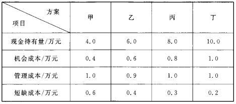
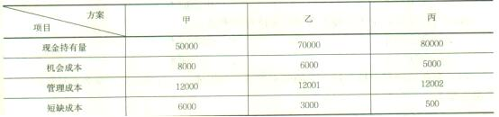
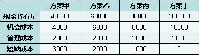
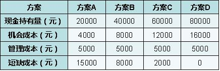
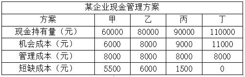
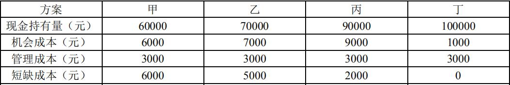

企业持有现金的成本包括（ &nbsp;）。

A.机会成本  (正确)
B.管理成本  (正确)
C.沉没成本
D.短缺成本  (正确)
E.计划成本
解析：
（1）机会成本。占用资金的代价； （2）管理成本。是一种固定成本； （3）短缺成本。缺钱不能应付业务开支而蒙受损失。 【知识点】最佳现金持有量分析 【考点】最佳现金持有量分析 【考查方向】概念释义 【难度】易 【题库维护老师：yxf】

采用成本分析模式确定企业现金持有量时，考虑的成本有（）。

A.沉没成本
B.外部成本
C.机会成本  (正确)
D.短缺成本  (正确)
E.管理成本  (正确)
解析：
成本分析模式是通过分析持有现金的成本，寻找得有成本最低的现金持有量。企业持有的现金，将会有三种成本：（1）机会成本；（2）管理成本；（3）短缺成本。

【知识点】最佳现金持有量分析

【考点】最佳现金持有量分析

【考察方向】原文挖空

【难度】易

【题库维护老师：ZKQ】

下列关于企业现金持有量分析中的成本分析模式的说法，错误的是（ ）。

A.最佳现金持有量为机会成本、管理成本和短缺成本之和最小对应的现金持有量
B.管理成本与现金持有量之间一般有显著的比例关系  (正确)
C.可以通过加速现金流转速度降低管理成本  (正确)
D.现金的短缺成本随现金持有量的增加而上升  (正确)
E.成本分析模式是通过分析持有现金的成本，寻找持有成本最低的现金持有量
解析：
成本分析模式是通过分析持有现金的成本，寻找持有成本最低的现金持有量。企业持有的现金，将会有三种成本：（1）机会成本。和现金持有量之间正比例关系；（2）管理成本。管理成本是一种固定成本，与现金持有量之间无明显的比例关系；（3）短缺成本。现金的短缺成本，是因缺乏必要的现金，不能应付业务开支所需，而使企业蒙受损失或为此付出的代价。现金的短缺成本随现金持有量的增加而下降，随现金持有量的减少而上升。上述三项成本之和最小的现金持有量，就是最佳现金持有量。

【知识点】最佳现金持有量分析

【考点】最佳现金持有量分析

【考察方向】概念释义

【难度】中等

【题库维护老师：ZKQ】

常用的确定现金持有量的方法有( &nbsp; )。

A.成本分析模式  (正确)
B.平衡模式
C.收支管理模式
D.随机模式  (正确)
E.存货模式  (正确)
解析：
常用的确定现金持有量的方法有成本分析模式、存货模式和随机模式。

【知识点】最佳现金持有量分析

【考点】最佳现金持有量分析

【考察方向】原文挖空

【难度】易

【题库维护老师：ZKQ】

关于现金持有量与现金持有成本关系的说法，正确的有( &nbsp;)。

A.现金机会成本随现金持有量增加而增加  (正确)
B.现金短缺成本随现金持有量增加而下降  (正确)
C.现金管理成本随现金持有量增加而下降
D.现金管理成本与现金持有量关联性强
E.现金持有成本由一定现金持有量的机会成本、管理成本、短缺成本综合而成  (正确)
解析：
持有现金的机会成本是现金放弃用于生产经营周转获取效果的成本，是一种机会成本，数量越多，成本越高，所以A正确；

管理成本是一种固定成本，与现金持有量之间无明显的比例关系，所以C、D不正确；

短缺成本是因缺乏必要的现金不能应付业务开支所需而使企业蒙受损失，现金越多，这种损失可能性越小，所以B正确。

现金成本由上述三项成本构成，E正确。故A、B、E为正确选项。

【知识点】最佳现金持有量分析

【考点】最佳现金持有量分析

【考察方向】概念释义

【难度】中等

【题库维护老师：ZKQ】

企业确定现金持有量的方法有( &nbsp;)。

A.成本分析模式  (正确)
B.存货模式  (正确)
C.ABC分析法
D.经济批量模式
E.随机模式  (正确)
解析：
常用的确定现金持有量的方法有成本分析模式、存货模式和随机模式三种。

【知识点】最佳现金持有量分析

【考点】最佳现金持有量分析

【考察方向】原文挖空

【难度】易

【题库维护老师：ZKQ】

现金的成本分析模式中，企业持有的现金成本有( &nbsp; &nbsp;)。

A.机会成本  (正确)
B.购置成本
C.管理成本  (正确)
D.现金成本
E.短缺成本  (正确)
解析：
成本分析模式是通过分析持有现金的成本，寻找持有成本最低的现金持有量。企业持有的现金，将会有三种成本:：机会成本、管理成本和短缺成本三种成本。

【知识点】最佳现金持有量分析

【考点】最佳现金持有量分析

【考察方向】原文挖空

【难度】易

【题库维护老师：ZKQ】

某企业现金管理有四个方案可供选择，其最佳现金持有量方案为（ &nbsp;&nbsp;）方案。
<table cellspacing="0"><tbody><tr class="firstRow"><td width="114" valign="center" style="padding: 0px 7px; border-width: 1px; border-color: windowtext;">
方案
</td><td width="114" valign="center" style="padding: 0px 7px; border-width: 1px; border-color: windowtext;">
甲
</td><td width="114" valign="center" style="padding: 0px 7px; border-width: 1px; border-color: windowtext;">
乙
</td><td width="114" valign="center" style="padding: 0px 7px; border-width: 1px; border-color: windowtext;">
丙
</td><td width="114" valign="center" style="padding: 0px 7px; border-width: 1px; border-color: windowtext;">
丁
</td></tr><tr><td width="114" valign="center" style="padding: 0px 7px; border-left-width: 1px; border-left-color: windowtext; border-right-width: 1px; border-right-color: windowtext; border-top: none; border-bottom-width: 1px; border-bottom-color: windowtext;">
现金持有量
</td><td width="114" valign="center" style="padding: 0px 7px; border-left-width: 1px; border-left-color: windowtext; border-right-width: 1px; border-right-color: windowtext; border-top: none; border-bottom-width: 1px; border-bottom-color: windowtext;">
50000
</td><td width="114" valign="center" style="padding: 0px 7px; border-left-width: 1px; border-left-color: windowtext; border-right-width: 1px; border-right-color: windowtext; border-top: none; border-bottom-width: 1px; border-bottom-color: windowtext;">
70000
</td><td width="114" valign="center" style="padding: 0px 7px; border-left-width: 1px; border-left-color: windowtext; border-right-width: 1px; border-right-color: windowtext; border-top: none; border-bottom-width: 1px; border-bottom-color: windowtext;">
80000
</td><td width="114" valign="center" style="padding: 0px 7px; border-left-width: 1px; border-left-color: windowtext; border-right-width: 1px; border-right-color: windowtext; border-top: none; border-bottom-width: 1px; border-bottom-color: windowtext;">
100000
</td></tr><tr><td width="114" valign="center" style="padding: 0px 7px; border-left-width: 1px; border-left-color: windowtext; border-right-width: 1px; border-right-color: windowtext; border-top: none; border-bottom-width: 1px; border-bottom-color: windowtext;">
机会成本
</td><td width="114" valign="center" style="padding: 0px 7px; border-left-width: 1px; border-left-color: windowtext; border-right-width: 1px; border-right-color: windowtext; border-top: none; border-bottom-width: 1px; border-bottom-color: windowtext;">
5500
</td><td width="114" valign="center" style="padding: 0px 7px; border-left-width: 1px; border-left-color: windowtext; border-right-width: 1px; border-right-color: windowtext; border-top: none; border-bottom-width: 1px; border-bottom-color: windowtext;">
7700
</td><td width="114" valign="center" style="padding: 0px 7px; border-left-width: 1px; border-left-color: windowtext; border-right-width: 1px; border-right-color: windowtext; border-top: none; border-bottom-width: 1px; border-bottom-color: windowtext;">
8800
</td><td width="114" valign="center" style="padding: 0px 7px; border-left-width: 1px; border-left-color: windowtext; border-right-width: 1px; border-right-color: windowtext; border-top: none; border-bottom-width: 1px; border-bottom-color: windowtext;">
11000
</td></tr><tr><td width="114" valign="center" style="padding: 0px 7px; border-left-width: 1px; border-left-color: windowtext; border-right-width: 1px; border-right-color: windowtext; border-top: none; border-bottom-width: 1px; border-bottom-color: windowtext;">
管理成本
</td><td width="114" valign="center" style="padding: 0px 7px; border-left-width: 1px; border-left-color: windowtext; border-right-width: 1px; border-right-color: windowtext; border-top: none; border-bottom-width: 1px; border-bottom-color: windowtext;">
8000
</td><td width="114" valign="center" style="padding: 0px 7px; border-left-width: 1px; border-left-color: windowtext; border-right-width: 1px; border-right-color: windowtext; border-top: none; border-bottom-width: 1px; border-bottom-color: windowtext;">
8000
</td><td width="114" valign="center" style="padding: 0px 7px; border-left-width: 1px; border-left-color: windowtext; border-right-width: 1px; border-right-color: windowtext; border-top: none; border-bottom-width: 1px; border-bottom-color: windowtext;">
8000
</td><td width="114" valign="center" style="padding: 0px 7px; border-left-width: 1px; border-left-color: windowtext; border-right-width: 1px; border-right-color: windowtext; border-top: none; border-bottom-width: 1px; border-bottom-color: windowtext;">
8000
</td></tr><tr><td width="114" valign="center" style="padding: 0px 7px; border-left-width: 1px; border-left-color: windowtext; border-right-width: 1px; border-right-color: windowtext; border-top: none; border-bottom-width: 1px; border-bottom-color: windowtext;">
短缺成本
</td><td width="114" valign="center" style="padding: 0px 7px; border-left-width: 1px; border-left-color: windowtext; border-right-width: 1px; border-right-color: windowtext; border-top: none; border-bottom-width: 1px; border-bottom-color: windowtext;">
6000
</td><td width="114" valign="center" style="padding: 0px 7px; border-left-width: 1px; border-left-color: windowtext; border-right-width: 1px; border-right-color: windowtext; border-top: none; border-bottom-width: 1px; border-bottom-color: windowtext;">
4500
</td><td width="114" valign="center" style="padding: 0px 7px; border-left-width: 1px; border-left-color: windowtext; border-right-width: 1px; border-right-color: windowtext; border-top: none; border-bottom-width: 1px; border-bottom-color: windowtext;">
1000
</td><td width="114" valign="center" style="padding: 0px 7px; border-left-width: 1px; border-left-color: windowtext; border-right-width: 1px; border-right-color: windowtext; border-top: none; border-bottom-width: 1px; border-bottom-color: windowtext;">
0
</td></tr></tbody></table>
A.甲
B.乙
C.丙  (正确)
D.丁
解析：
成本分析模式确定最佳现金持有量就是要使现金持有成本最低，现金持有成本包括<strong>机会成本、管理成本和短缺成本</strong>。四种现金持有量方案的成本如下。

丙方案现金持有量方案成本最低，故C为正确选项。

【知识点】最佳现金持有量分析

【考点】最佳现金持有量分析

【考察方向】概念释义

【难度】易

【题库维护老师：ZKQ】

用成本分析模式确定企业最佳现金持有量时，随着现金持有量增加而降低的现金持有成本是（ &nbsp;）。

A.管理成本
B.机会成本
C.交易成本
D.短缺成本  (正确)
解析：
本题考查的是、最佳现金持有量分析。现金的短缺成本，是因缺乏必要的现金，不能应付业务开支所需，而使企业蒙受损失或为此付出的代价。现金的短缺成本随现金持有量的增加而下降，随现金持有量的减少而上升。

【知识点】最佳现金持有量分析

【考点】短缺成本

【考察方向】概念释义

【难度】易

【题库维护老师：ZKQ】

企业持有现金的成本不包括( &nbsp; )。

A.管理成本
B.短缺成本
C.沉没成本  (正确)
D.机会成本
解析：
成本分析模式是通过分析持有现金的成本，寻找持有成本最低的现金持有量。企业持有的现金，将会有三种成本：机会成本、管理成本、短缺成本。

【知识点】最佳现金持有量分析

【考点】最佳现金持有量分析

【考察方向】原文挖空

【难度】易

【题库维护老师：ZKQ】

现金的( &nbsp; )随现金持有量的增加而下降，随现金持有量的减少而上升。

A.重置成本
B.管理成本
C.短缺成本  (正确)
D.机会成本
解析：
企业持有的现金成本包括：机会成本、管理成本、短缺成本。现金的短缺成本随现金持有量的增加而下降，随现金持有量的减少而上升。

【知识点】最佳现金持有量分析

【考点】短缺成本

【考察方向】原文挖空

【难度】易

【题库维护老师：ZKQ】

现金作为企业的一项资金占用，是有代价的，这种代价就是它的( &nbsp; )。

A.机会成本  (正确)
B.沉没成本
C.管理成本
D.短缺成本
解析：
企业持有的现金，将会有三种成本：机会成本、管理成本和短缺成本。现金作为企业的一项资金占用，是有代价的，这种代价就是它的机会成本。

【知识点】最佳现金持有量分析

【考点】机会成本

【考察方向】原文挖空

【难度】易

【题库维护老师：ZKQ】

关于企业现金持有成本的说法,正确的是(&nbsp; &nbsp; )。

A.最佳现金持有量为机会成本，管理成本和短缺成本之和最小对应的现金持有量  (正确)
B.管理成本与现金持有量之间一股有显著的比例关系
C.可以通过加速现金流转速度降低管理成本
D.现金的短缺成本随现金持有量的增加而上升
解析：
成本分析模式是通过分析持有现金的成本，寻找持有成本最低的现金持有量。企业持有的现金，将会有三种成本：

(1)机会成本。现金作为企业的一项资金占用，是有代价的，这种代价就是它的机会成本。

(2)管理成本。管理成本是一种固定成本，与现金持有量之间无明显的比例关系。

(3)短缺成本。现金的短缺成本，是因缺乏必要的现金，不能应付业务开支所需，而使企业蒙受损失或为此付出的代价。现金的短缺成本随现金持有量的增加而下降，随现金持有量的减少而上升。

上述三项成本之和最小的现金持有量，就是最佳现金持有量。

【知识点】最佳现金持有量分析

【考点】最佳现金持有量分析

【考察方向】概念释义

【难度】中等

【题库维护老师：ZKQ】

某企业有甲、乙、丙、丁四个现金持有方案，各方案的现金持有量依次是3000元、5000元、27000元和110000元。四个方案的机会成本均为现金持有量的10%，管理成本均为20000元，短缺成本依次是8000元、3000元、2500元和0元。若采用成本分析模式进行现金持有量决策，该企业应采用（ &nbsp; &nbsp;）方案。

A.甲
B.乙  (正确)
C.丙
D.丁
解析：
本题考查的是流动资金管理（最佳现金持有量）。下表列出了成本分析模式之下，4个方案所对应的机会成本、管理成本、短缺成本以及总成本。其中，三项成本之和最小者（乙方案），即为最佳现金持有量。 方案 【知识点】最佳现金持有量分析 

【考点】最佳现金持有量分析

【考察方向】概念释义

【难度】易

【题库维护老师：ZKQ】

对于企业而言，（ &nbsp; &nbsp;）之和最小的现金持有量，就是最佳现金持有量。

A.机会成本、管理成本、短缺成本  (正确)
B.机会成本、生产成本、短缺成本
C.管理成本、取得成本、短缺成本
D.管理成本、购置成本、取得成本
解析：
企业持有的现金，将会有三种成本：机会成本、管理成本和短缺成本，这三项成本之和最小的现金持有量，就是最佳持有量。

【知识点】最佳现金持有量分析

【考点】最佳现金持有量分析

【考察方向】概念释义

【难度】易

【题库维护老师：ZKQ】

下列现金成本中，与现金持有量呈反方向变化的是( &nbsp; )

A.机会成本
B.管理成本
C.短缺成本  (正确)
D.沉没成本
解析：
企业持有的现金，将会有三种成本：(1)机会成本。(2)管理成本。管理成本是一种固定成本，与现金持有量之间无明显的比例关系。(3)短缺成本。现金的短缺成本随现金持有量的增加而下降，随现金持有量的减少而上升。上述三项成本之和最小的现金持有量，就是最佳现金持有量。

【知识点】最佳现金持有量分析

【考点】短缺成本

【考察方向】原文挖空

【难度】易

【题库维护老师：ZKQ】

某企业有甲、乙、丙、丁四个现金持有方案，各方案的现金持有量依次是5000元、8000元、75000元、130000元。四个方案的机会成本分别为700元、500元、8400元、12000元，管理成本均为24000元，短缺成本依次是8000元、3200元、2500元和0元。若采用成本分析模式确定最佳现金持有量，则该企业应采用的方案是( &nbsp; )

A.甲方案
B.乙方案  (正确)
C.丙方案
D.丁方案
解析：
机会成本、管理成本和短缺成本三项成本之和最小的现金持有量，即最佳现金持有量。计算见下表，由表可知乙方案的总成本最低，故该企业应该采用乙方案。 

【知识点】最佳现金持有量分析

【考点】最佳现金持有量分析

【考察方向】概念释义

【难度】易

【题库维护老师：ZKQ】

某施工企业有四种现金持有方案，它们各自的机会成本、管理成本和短缺成本如下表所示，则该企业的最佳现金持有量方案为( &nbsp; )。

A.甲方案
B.乙方案  (正确)
C.丙方案
D.丁方案
解析：
企业持有的现金，将会有三种成本：机会成本、管理成本、短缺成本。上述三项成本之和最小的现金持有量，就是最佳现金持有量。由题中数据可得，甲、乙、丙、丁的三项成本之和分别为2.0万元、1.9万元、2.1万元、2.2万元，则该企业最佳现金持有量方案为乙方案。

【知识点】最佳现金持有量分析

【考点】最佳现金持有量分析

【考察方向】概念释义

【难度】易

【题库维护老师：ZKQ】

甲、乙、丙三种现金持有方案的成本预测如下表，其中预测不合理的成本项目是( &nbsp;)。 

A.机会成本  (正确)
B.管理成本
C.短缺成本
D.现金持有成本
解析：
持有现金机会成本是因现金占用资金而不能用于生产经营周转放弃的收益，是一种机会成本，一般随现金持有量增加而增加；

管理成本是一种固定成本，与现金持有量之间无明显的比例关系；

短缺成本是因缺乏必要的现金，不能应付业务开支所需，而使企业蒙受损失或为此付出的代价。现金的短缺成本随现金持有量的增加而下降，随现金持有量的减少而上升。

所以成本预测中机会成本不合理。选项A正确。

【知识点】最佳现金持有量分析

【考点】最佳现金持有量分析

【考察方向】概念释义

【难度】中等

【题库维护老师：ZKQ】

某企业关于现金持有量有如下四种方案，每种方案的机会成本、管理成本、短缺成本如下表所示，最佳方案是（ &nbsp;）。 

A.方案甲  (正确)
B.方案乙
C.方案丙
D.方案丁
解析：
企业持有现金成本包括机会成本、管理成本、短缺成本三者之和最小的现金持有量最佳。 

【知识点】最佳现金持有量分析

【考点】最佳现金持有量分析

【考查方向】概念释义

【难度】易

【题库维护老师：yxf】

某企业现金管理有四个方案供选择，其最佳现金持有量方案为（）方案。 

A.方案B
B.方案C  (正确)
C.方案A
D.方案D
解析：
选择总成本最低的，经过计算方案C总成本最低。 【知识点】最佳现金持有量分析 【考点】最佳现金持有量分析 【考查方向】概念释义 【难度】易 【题库维护老师：yxf】

某企业有甲.乙.丙.丁4个现金持有方案，各方案的相关数据见下表（单位：元）。若采用成本分析模式进行现金持有量决策，该企业应采用（ &nbsp; &nbsp;）方案。

A.甲
B.乙
C.丙  (正确)
D.丁
解析：
成本分析模式是通过分析持有现金的成本，寻找持有成本最低的现金持有量。机会成本.管理成本.短缺成本之和最小的现金持有量，就是最佳现金持有量。本题的计算过程见下表：

 由上表可知，丙方案的总成本最低，故该企业应采用丙方案。

【知识点】最佳现金持有量分析

【考点】最佳现金持有量分析

【考察方向】概念释义

【难度】易

【题库维护老师：ZKQ】

某施工企业有四种现金持有方案如下表，按成本分析模式选择的最佳现金持有方案应为（ ）

A.丁  (正确)
B.甲
C.乙
D.丙
解析：
机会、管理、短缺三项成本之和最小的现金持有量，就是最佳现金持有量。

【知识点】最佳现金持有量分析

【考点】最佳现金持有量分析

【考察方向】概念释义

【难度】易

【题库维护老师：ZKQ】

企业四种现金持有量方案的成本如下。采用成本分析模式时，该企业最佳现金持有量方案为( &nbsp;)。

A.甲方案
B.乙方案
C.丙方案  (正确)
D.丁方案
解析：
成本分析模式确定最佳现金持有量就是要使现金持有成本最低，现金持有成本包括机会成本、管理成本和短缺成本。四种现金持有量方案的成本如下。 丙方案现金持有量方案成本最低，故C为正确选项。

【知识点】最佳现金持有量分析

【考点】最佳现金持有量分析

【考察方向】概念释义

【难度】易

【题库维护老师：ZKQ】

