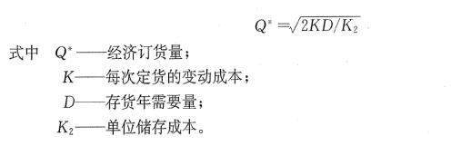
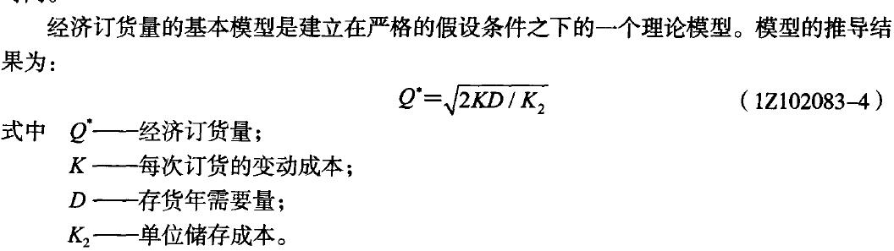
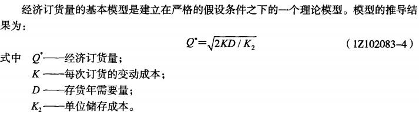
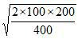
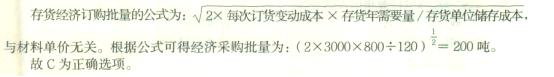
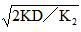

某施工企业所需的一种材料，年度采购总量为2000吨。材料单价为1000元/吨，一次订购成本为3000元，材料的年平均储存成本为100元/吨，则该材料的经济采购批量为( &nbsp; &nbsp;)吨。

A.1000.00
B.666.67
C.346.41  (正确)
D.244.95
解析：
本题考核的是经济经订货量的计算。根据公式：

Q*=√（2KD/K2）

式中Q*——经济订货量；

K——每次订货的变动成本；

D——存货年需要量；

K2——单位储存成本。

列式计算：Q*=√（2×3000×2000÷100）=346.41（t）

【知识点】存货决策

【考点】存货决策

【考察方向】公式计算

【难度】易

【题库维护老师：ZKQ】

企业存货管理的目的是通过合理的进货批量和进货时间安排，使存货的( &nbsp;)最低。

A.总成本  (正确)
B.缺货成本
C.购置成本
D.订购成本
解析：
按照存货管理的目的，需要通过合理的进货批量和进货时间，使存货的总成本最低。

【知识点】存货决策

【考点】存货决策

【考察方向】概念释义

【难度】易

【题库维护老师：ZKQ】

某企业生产所需甲材料，年度采购总量为50000吨，材料单价为400元/吨，一次订货成本为5000元，每吨材料年平均储备成本20元。在此情况下，该材料的经济采购批量为（ &nbsp;）。

A.5000  (正确)
B.8000
C.10000
D.20000
解析：

【知识点】存货决策

【考点】存货决策

【考察方向】公式计算

【难度】易

【题库维护老师：ZKQ】

某企业生产所需某种材料，年度采购总量为5000吨，一次订货成本为4000元，每吨材料的年平均储备成本为1000元，则该材料的经济采购批量为（）吨。

A.100
B.200  (正确)
C.500
D.1000
解析：
 Q=(2*5000*4000/1000)^0.5 【知识点】存货决策 【考点】存货决策 【考查方向】公式计算 【难度】易 【题库维护老师：yxf】

某建筑业企业施工生产需要A材料，年度采购总量为500t，单价为400元／t，每吨的平均储备成本为7元，一次订货变动成本为280元，则该材料的经济采购批量为( &nbsp; )吨。

A.200  (正确)
B.400
C.144
D.245
解析：
考察经济采购批量  

列式计算：Q*=√（2×500×280÷7）=200（t）

【知识点】存货决策

【考点】存货决策

【考察方向】公式计算

【难度】易

【题库维护老师：ZKQ】

企业生产所需某种材料，年度采购总量为8000吨，材料单价为4000元/吨，一次订货的变动成本为3000元，每吨材料的平均储备成本为300元。则该材料的经济采购批量为（）吨。

A.114
B.200
C.400  (正确)
D.300
解析：
   列式计算：经济采购批量：    【知识点】存货决策

【考点】存货决策 【考察方向】公式计算 【难度】易 【题库维护老师：ZKQ】

某建筑业企业施工生产需要A材料，年度采购总量为800t，单价为300元／t，每吨的平均储备成本为8元，一次订货变动成本为200元，则该材料的经济采购批量为( &nbsp; &nbsp;)吨。

A.200  (正确)
B.400
C.141
D.245
解析：
本题考查经济采购批量公式的运用。 &nbsp;

列式计算： 

【知识点】存货决策

【考点】存货决策

【考察方向】公式计算

【难度】易

【题库维护老师：ZKQ】

某施工企业生产所需甲材料，年度采购总量为500吨，每吨单价为2000元，一次订货成本为2000元。每吨材料的年平均储备成本为200元。则该材料的经济采购批量为（ &nbsp; ）吨。

A.200
B.160
C.100  (正确)
D.800
解析：
 经济采购批量Q*=√2KD/K2=√2*2000*500/200=100吨。

【知识点】存货决策

【考点】存货决策

【考察方向】公式计算

【难度】易

【题库维护老师：ZKQ】

某施工企业生产所需甲材料，年度采购总量为200吨，每吨单价为1000元，一次订货变动成本为100元，每吨材料的年平均储备成本为400元，则该材料的经济采购批量为( &nbsp; )吨。

A.6.32
B.7.07
C.10.00  (正确)
D.100.00
解析：
经济订货量公式：

Q*＝√2KD/K2

式中Q*——经济订货量；

K——每次定货的变动成本；

D——存货年需要量；

K2——单位储存成本。

则经济订货量＝＝10.00(吨)。

【知识点】存货决策

【考点】存货决策

【考察方向】公式计算

【难度】易

【题库维护老师：ZKQ】

企业生产所需的某种材料年度采购总量为800吨，材料单价为4500元／吨，一次订货成本为3000元，每吨材料的年平均储备成本为120元。则该材料的经济采购批量为( &nbsp;)吨。

A.100
B.141
C.200  (正确)
D.245
解析：

【知识点】存货决策

【考点】存货决策

【考察方向】公式计算

【难度】易

【题库维护老师：ZKQ】

施工企业需要采购某种材料单价为200元／t，一次订货成本为400元，其中固定成本80元，每吨材料的年平均储备成本为1元。已知该材料的经济采购批量为800t，则企业该种材料的年度采购总量为( &nbsp; &nbsp;)t。

A.2000
B.1600
C.1000  (正确)
D.800
解析：
本题考查经济订货量的计算。

Q*＝，式中：

Q*——经济订货量；K——每次订货的变动成本；D——存货年需要量；K2——单位储存成本。

则D＝K2Q²／(2K)＝1×800²／[2×（400-80）]＝1000(t)。

【知识点】存货决策

【考点】存货决策

【考察方向】公式计算

【难度】易

【题库维护老师：ZKQ】

