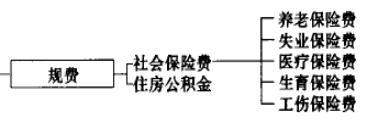
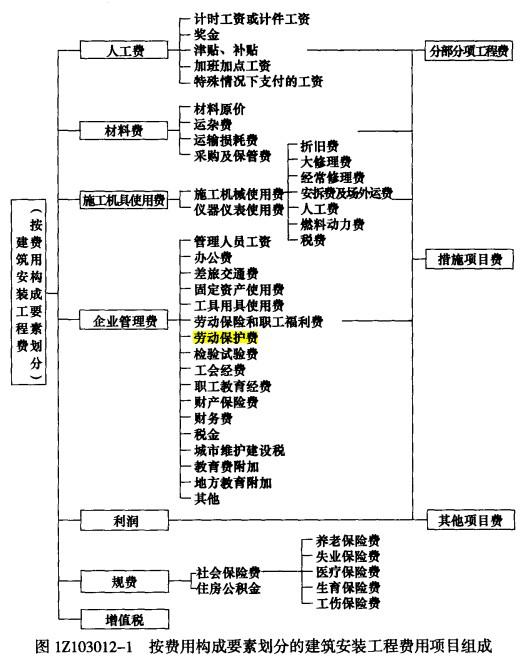
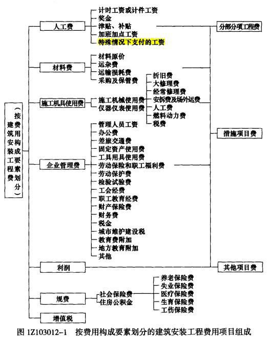

在建筑安装工程费中，不得作为竞争性费用的有（ &nbsp;）。

A.分部分项工程费
B.措施项目费
C.其他项目费
D.规费  (正确)
E.税金  (正确)
解析：
不可竞争费：规费+税金+安全文明施工费。 

【知识点】按费用构成要素划分的建设安装工程费用项目组成

【考点】税金

【考查方向】概念释义

【难度】易

【题库维护】yxf

将建筑安装工程费用按照费用构成要素进行划分，包括（ &nbsp;）。

A.分部分项工程费
B.人工费、材料费、施工机具使用费  (正确)
C.企业管理费  (正确)
D.利润  (正确)
E.规费、税金  (正确)
解析：
按照费用构成要素进行划分，包括人材机管利规税。 【知识点】按费用构成要素划分的建设安装工程费用项目组成 【考点】按费用构成要素划分的建设安装工程费用项目组成 【考查方向】概念释义 【难度】易 【题库维护】yxf

按《建筑安装工程费用项目组成》的规定，下列各项中属于材料费的有（ &nbsp; &nbsp;）。

A.材料原价  (正确)
B.运杂费  (正确)
C.检验试验费
D.二次搬运费
E.不可避免的运输损耗费  (正确)
解析：
材料费的内容包括：

1材料原价：是指材料、工程设备的出厂价格或商家供应价格。

2.运杂费：是指材料、工程设备自来源地运至工地仓库或指定堆放地点所发生的全部费用。

3.运输损耗费：是指材料在运输装卸过程中不可避免的损耗。

4.采购及保管费：是指为组织采购、供应和保管材料、工程设备的过程中所需要的各项费用。包括采购费、仓储费、工地保管费、仓储损耗。

【知识点】按费用构成要素划分的建筑安装工程费用项目组成

【考点】材料费

【考察方向】原文挖空

【难度】易

【题库维护老师：ZKQ】

根据《建筑安装工程费用项目组成》（建标[2013]44 号）的有关规定，施工机械使用费包括（ ）。

A.机械操作人员的工资  (正确)
B.大型机械设备安拆费
C.燃料动力费  (正确)
D.大修理费  (正确)
E.折旧费  (正确)
解析：
施工机械使用费中的台班单价，包括折旧费、大修理费、经常修理费、安拆费及场外运费、人工费、燃料动力费及相关税费（车船使用费、保险费及年检费）等 7 项内容。大型机械设备安拆费，属于措施费。

【知识点】按费用构成要素划分的建筑安装工程费用项目组成

【考点】施工机具使用费

【考察方向】概念释义

【难度】易

【题库维护老师：ZKQ】 

根据《建筑安装工程项目组成》（建标[2013]44号），下列费用中，属于规费的有( &nbsp;)。

A.社会保险费  (正确)
B.安全施工费
C.环境保护费
D.住房公积金  (正确)
E.劳动保护费
解析：
【2014真题，仅供参考】本题考查的是规费。规费是指按国家法律、法规规定，由省级政府和省级有关权力部门规定必须缴纳或计取的费用。包括：<strong>社会保险费、住房公积金、工程排污费</strong>。（<strong>工程排污费已于2019年取消</strong>）

【知识点】按费用构成要素划分的建筑安装工程费用项目组成

【考点】规费

【考察方向】概念释义

【难度】易

【题库维护老师：ZKQ】

下列费用中,属于建筑安装工程人工费的有( &nbsp;)。

A.生产工人的技能培训费用
B.生产工人的流动施工津贴  (正确)
C.生产工人的增收节支奖金  (正确)
D.项目管理人员的计时工资
E.生产工人在法定节假日的加班工资  (正确)
解析：
人工费是指按工资总额构成规定，支付给从事建筑安装工程施工的生产工人和附属生产单位工人的各项费用。内容包括：

1.计时工资或计件工资：是指按计时工资标准和工作时间或对已做工作按计件单价支付给个人的劳动报酬。

2.奖金：是指对超额劳动和增收节支支付给个人的劳动报酬。如节约奖、劳动竞赛奖等。

3.津贴补贴：是指为了补偿职工特殊或额外的劳动消耗和因其他特殊原因支付给个人的津贴，以及为了保证职工工资水平不受物价影响支付给个人的物价补贴。如流动施工津贴、特殊地区施工津贴、高温（寒）作业临时津贴、高空津贴等。

4.加班加点工资：是指按规定支付的在法定节假日工作的加班工资和在法定日工作时间外延时工作的加点工资。

5.特殊情况下支付的工资

【知识点】按费用构成要素划分的建筑安装工程费用项目组成

【考点】人工费

【考察方向】概念释义

【难度】易

【题库维护老师：ZKQ】

按费用构成要素，建筑安装工程费的组成项目包括( &nbsp;)。

A.人、料、机费  (正确)
B.企业管理费  (正确)
C.措施费
D.利润和增值税  (正确)
E.规费  (正确)
解析：
根据建标[2013] 44号关于印发《建筑安装工程费用项目组成》的通知的规定：建筑安装工程费由人工费、材料费、施工机具使用费、企业管理费、利润、规费和增值税组成。 

【知识点】按费用构成要素划分的建筑安装工程费用项目组成

【考点】按费用构成要素划分的建筑安装工程费用项目组成

【考察方向】概念释义

【难度】易

【题库维护老师：ZKQ】

根据《建筑安装工程费用项目组成》(建标[2013]44号)，属于建筑安装工程费中的人工费的有( &nbsp; )

A.高温(寒)作业临时津贴  (正确)
B.管理人员工资
C.劳动竞赛奖  (正确)
D.工伤保险费
E.机上司机人工费
解析：
按费用构成要素划分的建筑安装工程费中的人工费包括计时工资或计件工资、奖金、津贴补贴、加班加点工资、特殊情况下支付的工资。其中，奖金是指对超额劳动和增收节支支付给个人的劳动报酬，如节约奖、劳动竞赛奖等。津贴补贴包括流动施工津贴、特殊地区施工津贴、高温(寒)作业临时津贴、高空津贴等。

【知识点】按费用构成要素划分的建筑安装工程费用项目组成

【考点】人工费

【考察方向】概念释义

【难度】易

【题库维护老师：ZKQ】

根据《建筑安装工程费用项目组成》(建标[2013]44号)，下列属于规费的有( &nbsp; )

A.医疗保险费  (正确)
B.职工福利费
C.养老保险费  (正确)
D.财产保险费
E.劳动保护费
解析：
规费是指按国家法律、法规规定，由省级政府和省级有关权力部门规定必须缴纳或计取的费用。包括社会保险费、住房公积金和工程排污费。其中社会保险费包括：养老保险费、失业保险费、医疗保险费、生育保险费和工伤保险费。

【知识点】按费用构成要素划分的建筑安装工程费用项目组成

【考点】规费

【考察方向】概念释义

【难度】易

【题库维护老师：ZKQ】

下列建筑安装工程费用中，属于企业管理费中的检验试验费的有( &nbsp; )

A.对建筑物进行一般鉴定所发生的费用  (正确)
B.自设实验室进行试验所耗用材料的费用  (正确)
C.新材料的试验费用
D.构件破坏性试验费用
E.发包人委托检测机构进行检测的费用
解析：
检验试验费：是指施工企业按照有关标准规定，对建筑以及材料、构件和建筑安装物进行一般鉴定、检查所发生的费用，包括自设试验室进行试验所耗用的材料等费用。不包括新结构、新材料的试验费，对构件做破坏性试验及其他特殊要求检验试验的费用和发包人委托检测机构进行检测的费用，对此类检测发生的费用，由发包人在工程建设其他费用中列支。但对施工企业提供的具有合格证明的材料进行检测其结果不合格的，该检测费用由施工企业支付。

【知识点】按费用构成要素划分的建筑安装工程费用项目组成

【考点】企业管理费

【考察方向】概念释义

【难度】易

【题库维护老师：ZKQ】

下列费用中，属于企业管理费的有( &nbsp; )

A.管理人员工资  (正确)
B.差旅交通费  (正确)
C.劳动保护费  (正确)
D.检验试验费  (正确)
E.失业保险费
解析：
企业管理费是指建筑安装企业组织施工生产和经营管理所需的费用。包括管理人员工资、办公费、差旅交通费、固定资产使用费、工具用具使用费、劳动保险和职工福利费、劳动保护费、检验试验费、工会经费、职工教育经费、财产保险费、财务费、税金、城市维护建设税、教育费附加、地方教育附加及其他。

【知识点】按费用构成要素划分的建筑安装工程费用项目组成

【考点】企业管理费

【考察方向】概念释义

【难度】易

【题库维护老师：ZKQ】

根据《建设工程工程量清单计价规范》GB50500-2013，对施工成本进行划分，应计入企业管理费用的有( &nbsp;)。

A.固定资产使用费  (正确)
B.工程用材料购置费
C.管理人员工资  (正确)
D.工程排污费
E.工伤保险费
解析：
选项B属于材料费的内容，选项E属于规费的内容。

【知识点】按费用构成要素划分的建筑安装工程费用项目组成

【考点】企业管理费

【考察方向】概念释义

【难度】易

【题库维护老师：SUT】

下列应计入企业管理费中税金的有( &nbsp;)。

A.房产税  (正确)
B.增值税
C.车船使用税  (正确)
D.印花税  (正确)
E.消费税
解析：
企业管理费税金是指企业按规定缴纳的房产税、车船使用税、土地使用税、印花税等，故选项A、C、D正确。

【知识点】按费用构成要素划分的建筑安装工程费用项目组成

【考点】企业管理费

【考察方向】概念释义

【难度】易

【题库维护老师：ZKQ】

下列费用中，属于建安工程费中的规费的有( &nbsp;)。

A.工程排污费
B.医疗保险费  (正确)
C.失业保险费  (正确)
D.意外伤害保险费
E.工伤保险费  (正确)
解析：
规费是指按国家法律、法规规定，由省级政府和省级有关权力部门规定必须缴纳或计取的费用。包括：

1.社会保险费

（1）养老保险费：是指企业按照规定标准为职工缴纳的基本养老保险费。

（2）失业保险费：是指企业按照规定标准为职工缴纳的失业保险费。

（3）医疗保险费：是指企业按照规定标准为职工缴纳的基本医疗保险费。

（4）生育保险费：是指企业按照规定标准为职工缴纳的生育保险费。

（5）工伤保险费：是指企业按照规定标准为职工缴纳的工伤保险费。

2.住房公积金：是指企业按规定标准为职工缴纳的住房公积金。

【知识点】按费用构成要素划分的建筑安装工程费用项目组成

【考点】规费

【考察方向】概念释义

【难度】易

【题库维护老师：ZKQ】

下列费用中，应计入施工机械台班单价的有( &nbsp;)。

A.折旧费  (正确)
B.日常维护费  (正确)
C.安拆及场外运费  (正确)
D.动力费  (正确)
E.采购人员工资
解析：
施工机械台班单价应由下列七项费用组成：（1）折旧费（2）大修理费（3）经常修理费（4）安拆费及场外运费（5）人工费（6）燃料动力费（7）税费。配合机械人员的人工费不在机械费中，选项D属于措施费

【知识点】按费用构成要素划分的建筑安装工程费用项目组成

【考点】施工机具使用费

【考察方向】概念释义

【难度】中等

【题库维护老师：SUT】

下列费用中，应计入建筑安装工程材料费的有( &nbsp;)。

A.材料原价  (正确)
B.材料运杂费  (正确)
C.材料二次搬运发生的损耗
D.材料采购和保管费  (正确)
E.对材料进行一般鉴定和检查的费用
解析：
材料费是指工程施工过程中耗费的各种原材料、半成品、构配件的费用，以及周转材料等的摊销、租赁费用。内容包括： 1)材料原价：是指材料、工程设备的出厂价格或商家供应价格。 2)运杂费：是指材料、工程设备自来源地运至工地仓库或指定堆放地点所发生的全部费用。 3)运输损耗费：是指材料在运输装卸过程中不可避免的损耗。 4)采购及保管费：是指为组织采购、供应和保管材料、工程设备的过程中所需要的各项费用。包括采购费、仓储费、工地保管费、仓储损耗。 因此本题中A、B、D是正确选项。C属于措施项目费中的二次搬运费，E属于企业管理费中的检验试验费。

【知识点】按费用构成要素划分的建筑安装工程费用项目组成

【考点】材料费

【考察方向】概念释义

【难度】中等

【题库维护老师：ZKQ】

建筑安装工程费按照费用构成要素可划分为( &nbsp;)。

A.人工费、材料费、施工机具使用费  (正确)
B.工程建设其他费
C.措施项目费
D.企业管理费和利润  (正确)
E.规费和增值税  (正确)
解析：
建筑安装工程费按照费用构成要素划分为人工费、材料(包含工程设备)费、施工机具使用费、企业管理费、利润、规费和增值税7部分。

【知识点】按费用构成要素划分的建筑安装工程费用项目组成

【考点】按费用构成要素划分的建筑安装工程费用项目组成

【考察方向】概念释义

【难度】易

【题库维护老师：SUT】

下列选项中，属于建安工程费中税金内容的一项是（ &nbsp;）。

A.所得税
B.城市维护建设税
C.增值税  (正确)
D.印花税
解析：
建安工程费中税金指的就是增值税。 【知识点】按费用构成要素划分的建设安装工程费用项目组成 【考点】税金 【考查方向】概念释义 【难度】易 【题库维护】yxf

下列选项中，属于建筑安装工程费之中人工费的一项是（）。

A.项目经理的年终奖
B.钢筋工的加班费  (正确)
C.塔吊司机的高温津贴
D.装卸工的计件工资
解析：
人工费：计时工资或计件工资；奖金；津贴、补贴；加班加点工资；特殊情况下支付的工资。 A选项为企业管理费。 C选项为施工机具使用费。 D选项为材料费中的运杂费。 【知识点】按费用构成要素划分的建筑安装工程费用项目组成 【考点】人工费、企业管理费等 【考查方向】概念释义 【难度】易 【题库维护老师：ZKQ】

检验试验费属于（&nbsp; &nbsp; ）。

A.材料费
B.企业管理费  (正确)
C.工程建设其他费用
D.措施费
解析：
检验试验费属于企业管理费，是指施工企业按照有关标准规定，对建筑以及材料、构件和建筑安装物进行一般鉴定、检查所发生的费用。 【知识点】按费用构成要素划分的建筑安装工程费用项目组成 【考点】企业管理费 【考查方向】概念释义 【难易程度】易 【题库维护老师】yxf

根据《建筑安装工程费用项目组成》（建标【2013】44号），工程施工中所使用的仪器仪表的维修费用应计入（ &nbsp;&nbsp;）。

A.施工机具使用费  (正确)
B.工具用具使用费
C.固定资产使用费
D.企业管理费
解析：
本题考查的是按费用构成要素划分的建筑安装工程费用项目组成。根据现行规定，在建筑安装工程费用中，施工机具使用费包括<strong>施工机械使用费和仪器仪表使用费</strong>两大部分。至于B、C，分别属于企业管理费的范畴。

【知识点】按费用构成要素划分的建筑安装工程费用项目组成

【考点】施工机具使用费

【考察方向】原文挖空

【难度】易

【题库维护老师：ZKQ】

下列施工中发生的与材料有关的费用，属于建筑安装工程费中材料费的是（ &nbsp;）。

A.对原材料进行一般鉴定，检查所发生的费用
B.原材料在运输装卸过程中不可避免的损耗费  (正确)
C.施工机械场外运输所需的辅助材料费
D.机械设备日常保养所需的材料费用
解析：
材料费是指工程施工过程中耗费的各种原材料、半成品、构配件的费用，以及周转材料等的摊销、租赁费用。内容包括：

1.材料原价：是指材料、工程设备的出厂价格或商家供应价格。  2.运杂费：是指材料、工程设备自来源地运至工地仓库或指定堆放地点所发生的全部费用。 3.运输损耗费：是指材料在运输装卸过程中不可避免的损耗。 4.采购及保管费：是指为组织采购、供应和保管材料、工程设备的过程中所需要的各项费用。包括采购费、仓储费、工地保管费、仓储损耗。对原材料进行一般鉴定，检查所发生的费用属于企业管理费的检验试验费。

【知识点】按费用构成要素划分的建筑安装工程费用项目组成

【考点】材料费

【考察方向】概念释义

【难度】易

【题库维护老师：ZKQ】

施工机械台班单价不包括（）。

A.施工机械在规定的使用年限内，陆续收回其原值的费用
B.机上司机（司炉）和其他操作人员的人工费
C.施工机械按照国家规定应缴纳的车船使用税、保险费及年检费
D.大型机械在现场进行安装与拆卸所需的人工、材料、机械和试运转费用以及机械辅助设施的折旧、搭设、拆除等费用  (正确)
解析：
施工机械使用费是指施工机械作业发生的使用费或租赁费。以施工机械台班耗用量乘以施工机械台班单价表示，施工机械台班单价应由下列七项费用组成：(1）折旧费 是指施工机械在规定的使用年限内，陆续收回其原值的费用；

(2 ) 检修费：是指施工机械在规定的耐用总台班内，按规定的检修间隔进行必要的检修 ，以恢复其正常功能所需的费用。

(3 ) 维护费：是指施工机械在规定的耐用总、台班内按规定的维护间隔进行各级维护和临时故障排除所需的费用。包括为保障机械正常运转所需替换设备与随机配备工具附具的摊销和维护费用，机械运转中日常保养所需润滑与擦拭的材料费用及机械停滞期间的维护和保养费用等。

(4）安拆费及场外运费：安拆费指施工机械（大型机械除外）在现场进行安装与拆卸所需的人工、材料、机械和试运转费用以及机械辅助设施的折旧、搭设、拆除等费用；场外运费指施工机械整体或分体自停放地点运至施工现场或由一施工地点运至另一施工地点的运输、装卸、辅助材料及架线等费用；（5）人工费：是指机上司机（司炉）和其他操作人员的人工；（6）燃料动力费：是指施工机械在运转作业中所消耗的各种燃料及水、电等产生的费用；（7）税费：是指施工机械按照国家规定应缴纳的车船使用税、保险费及年检费等。 

【知识点】按费用构成要素划分的建筑安装工程费用项目组成

【考点】施工机具使用费

【考查方向】概念释义

【难度】易

【题库维护老师：hejiade】

建筑安装工程费中的人工费不包括生产工人的（ &nbsp; &nbsp;）。

A.高温作业临时津贴
B.医疗保险费  (正确)
C.劳动竞赛奖金
D.计件工资
解析：
人工费是指按工资总额构成规定，支付给从事建筑安装工程施工的生产工人和附属生产单位工人的各项费用。包括计时工资或计件工资、奖金、津贴补贴、加班加点工资、特殊情况下支付的工资。选项B属于规费。

【知识点】按费用构成要素划分的建筑安装工程费用项目组成

【考点】人工费

【考察方向】概念释义

【难度】易

【题库维护老师：ZKQ】

按费用构成要素划分的建筑安装工程费用项目中，仓储损耗费应计入（ &nbsp; &nbsp;）。

A.材料运杂费
B.企业管理费
C.检验试验费
D.材料采购及保管费  (正确)
解析：
材料费包括材料原价、运杂费、运输损耗费及采购及保管费，采购及保管费又包括采购费、仓储费、工地保管费、仓储损耗。

【知识点】按费用构成要素划分的建筑安装工程费用项目组成

【考点】材料费

【考察方向】原文挖空

【难度】易

【题库维护老师：ZKQ】

按照费用构成要素划分的建筑安装工程费用项目中，管理部门使用的交通工具的油料费属于（ &nbsp; &nbsp;）。

A.施工机具使用费
B.规费
C.企业管理费  (正确)
D.材料费
解析：
企业管理费的内容包括：管理人员工资、办工费、差旅交通费、固定资产使用费、工具用具使用费、劳动保险和职工福利费、劳动保护费、检验试验费、工会经费、职工教育经费、财产保险费、财务费、税金、城市维护建设费、教育费附加、地方教育附加和其他。其中管理部门使用的交通工具的油料、燃料费属于差旅交通费。

【知识点】按费用构成要素划分的建筑安装工程费用项目组成

【考点】企业管理费

【考察方向】原文挖空

【难度】易

【题库维护老师：ZKQ】

从事建筑安装工程施工生产的工人，工伤期间的工资属于人工费中的（ &nbsp;）。

A.计时工资
B.津贴补贴
C.加班加点工资
D.特殊情况支付的工资  (正确)
解析：
本题考查的是建安工程费用的划分。 特殊情况下支付的工资：是指根据国家法律、法规和政策规定，因病、工伤、产假、计划生育假、婚丧假、事假、探亲假、定期休假、停工学习、执行国家或社会义务等原因按计时工资标准或计时工资标准的一定比例支付的工资。

【知识点】按费用构成要素划分的建筑安装工程费用项目组成

【考点】人工费

【考察方向】概念释义

【难度】易

【题库维护老师：ZKQ】

根据《建设工程工程量清单计价规范》，施工企业为建筑安装施工人员支付的失业保险费属于建筑安装工程费中的（ &nbsp;）。

A.规费  (正确)
B.人工费
C.措施费
D.企业管理费
解析：
规费是指按国家法律、法规规定，由省级政府和省级有关权力部门规定必须缴纳或计取的费用。包括:

1.社会保险费

(1)养老保险费:是指企业按照规定标准为职工缴纳的基本养老保险费。

(2)失业保险费:是指企业按照规定标准为职工缴纳的失业保险费。

(3)医疗保险费:是指企业按照规定标准为职工缴纳的基本医疗保险费。

(4)生育保险费:是指企业按照规定标准为职工缴纳的生育保险费。

(5)工伤保险费:是指企业按照规定标准为职工缴纳的工伤保险费。

2. 住房公积金:是指企业按规定标准为职工缴纳的住房公积金。其他应列而未列人的规费，按实际发生计取。

【知识点】按费用构成要素划分的建筑安装工程费用项目组成

【考点】规费

【考察方向】概念释义

【难度】易

【题库维护老师：ZKQ】

为保障施工机械正常运转所需的随机配备工具附具的摊销和维护费用，属于施工机具适用费中的（）。

A.折旧费
B.经常修理费  (正确)
C.施工仪器使用费
D.安拆费
解析：
经常修理费，是指施工机械除大修理以外的各级保养和临时故障排除所需的费用。包括为保障机械正常运转所需替换设备与随机配备工具附具的摊销和维护费用，机械运转中日常保养所需润滑与擦拭的材料费用及机械停滞期间的维护和保养费用等。 

【知识点】按费用构成要素划分的建筑安装工程费用项目组成

【考点】施工机具使用费

【考察方向】概念释义

【难度】易

【题库维护老师：ZKQ】 

根据《建设工程工程量清单计价规范》，施工企业为从事危险作业的建筑安装工人员缴纳的工伤保险费应计入建筑安装程造价的（ ）。

A.措施费
B.规费  (正确)
C.企业管理费
D.人工费
解析：
规费是指按国家法律、法规规定，由省级政府和省级有关权力部门规定必须缴纳或计取的费用。包括: 1.社会保险费 (1)养老保险费:是指企业按照规定标准为职工缴纳的基本养老保险费。 (2)失业保险费:是指企业按照规定标准为职工缴纳的失业保险费。 (3)医疗保险费:是指企业按照规定标准为职工缴纳的基本医疗保险费。 (4)生育保险费:是指企业按照规定标准为职工缴纳的生育保险费。 (5)工伤保险费:是指企业按照规定标准为职工缴纳的工伤保险费。 2. 住房公积金:是指企业按规定标准为职工缴纳的住房公积金。 

【知识点】按费用构成要素划分的建筑安装工程费用项目组成

【考点】规费

【考察方向】概念释义

【难度】易

【题库维护老师：ZKQ】 

根据现行《建筑安装工程费用项目组成》（建标[2013]44 号），职工的劳动保险费应计入（ ）。

A.规费
B.企业管理费  (正确)
C.措施费
D.人工费
解析：
劳动保险和职工福利费属于企业管理费：是指由企业支付的职工退职金、按规定支付给离休干部的经费，集体福利费、夏季防暑降温费、冬季取暖补贴、上下班交通补贴等。

【知识点】按费用构成要素划分的建筑安装工程费用项目组成

【考点】企业管理费

【考察方向】概念释义

【难度】易

【题库维护老师：ZKQ】

根据《建筑安装工程费用项目组成》（建标[2013]44 号），以下属于人工费的是（ ）。

A.职工福利费
B.装载车司机工资
C.公司安全监督人员的工资
D.电焊工及产、婚假期的工资  (正确)
解析：
人工费是指按工资总额构成规定，支付给从事建筑安装工程施工的生产工人和附属生产单位工人的各项费用。职工福利费属于企业管理费；装载车司机工资是施工机械使用费；公司安全监督人员工资是企业管理费中的管理人员工资。

【知识点】按费用构成要素划分的建筑安装工程费用项目组成

【考点】人工费

【考察方向】概念释义

【难度】中等

【题库维护老师：ZKQ】 

按照费用构成要素划分，下列哪一项不属于建筑安装工程费（ ）。

A.人工费
B.材料费
C.利润
D.其他项目费  (正确)
解析：
按照费用构成要素划分，建筑安装工程费由人工费、材料费、施工机具使用费、企业管理费、利润、规费和税金组成。其他项目费是按造价形式划分的。

【知识点】按费用构成要素划分的建筑安装工程费用项目组成

【考点】按费用构成要素划分的建筑安装工程费用项目组成

【考察方向】概念释义

【难度】易

【题库维护人：ZKQ】

根据《建筑安装工程费用项目组成》（建标44 号文），建筑安装工程生产工人的高温作业临时津贴应计入（ ）。

A.劳动保护费
B.规费
C.企业管理费
D.人工费  (正确)
解析：
根据《建筑安装工程费用项目组成》，建筑安装工程生产工人的高温作业临时津贴应计入人工费。

【知识点】按费用构成要素划分的建筑安装工程费用项目组成

【考点】人工费

【考察方向】原文挖空

【难度】易

【题库维护老师：ZKQ】

施工中发生的下列与材料有关的费用中，属于建筑安装工程费中材料费的是（ ）。

A.对原材料进行鉴定发生的费用
B.施工机械整体场外运输的辅助材料费
C.原材料在运输装卸过程中不可避免的损耗费  (正确)
D.机械设备日常保养所需的材料费用
解析：
A 选项属于企业管理费中的检验试验费，BD 属于施工机具使用费。  材料费包括：  1）材料原价：是指材料、工程设备的出厂价格或商家供应价格。  2）运杂费：是指材料、工程设备自来源地运至工地仓库或指定堆放地点所发生的全部费用。  3）运输损耗费：是指材料在运输装卸过程中不可避免的损耗。  4）采购及保管费：是指为组织采购、供应和保管材料、工程设备的过程中所需要的各项费用。包括采购费、仓储费、工地保管费、仓储损耗。

【知识点】按费用构成要素划分的建筑安装工程费用项目组成

【考点】材料费

【考察方向】概念释义

【难度】易

【题库维护老师：ZKQ】 

按费用构成要素划分，建筑安装工程费包括人工费、材料费、施工机具使用费、企业管理费、利润、( &nbsp; )。

A.规费和增值税  (正确)
B.规费和税金
C.措施项目费和增值税
D.措施项目费和税金
解析：
按照费用构成要素划分，建筑安装工程费由人工费、材料(包含工程设备，下同)费、 施工机具使用费、企业管理费、利润、<strong>规费和增值税</strong>组成。

其中人工费、材料费、施工机 具使用费、企业管理费和利润包含在分部分项工程费、措施项目费、其他项目费中

【知识点】按费用构成要素划分的建筑安装工程费用项目组成

【考点】按费用构成要素划分的建筑安装工程费用项目组成

【考察方向】原文挖空

【难度】易

【题库维护老师：ZKQ】

根据《建筑安装工程费用项目组成》(建标[2013]44号)，以下属于企业管理费中的检验试验费的是( &nbsp; )。

A.新结构、新材料的试验费
B.自设实验室进行试验所耗用的材料  (正确)
C.发包人委托检测机构进行检测的费用
D.对构件做破坏性试验费用
解析：
检验试验费，是指施工企业按照有关标准规定，对建筑以及材料、构件和建筑安装物进行一般鉴定、检查所发生的费用，包括自设实验室进行试验所耗用的材料等费用。不包括新结构、新材料的试验费，对构件做破坏性试验及其他特殊要求检验试验的费用和发包人委托检测机构进行检测的费用，对此类检测发生的费用，由发包人在工程建设其他费用中列支。但对施工企业提供的具有合格证明的材料进行检测其结果不合格的，该检验费用由施工企业支付。

【知识点】按费用构成要素划分的建筑安装工程费用项目组成

【考点】企业管理费

【考察方向】概念释义

【难度】易

【题库维护老师：ZKQ】

施工企业按照规定标准对采购的建筑材料进行一般性鉴定、检查发生的费用应计入( &nbsp; &nbsp; &nbsp; &nbsp;)。

A.材料费
B.企业管理费  (正确)
C.人工费
D.措施项目费
解析：
检验试验费是指施工企业按照有关标准规定，对建筑以及材料、构件和建筑安装无法进行一般性检定、检查所发生的费用。检验试验费属于企业管理费

【知识点】按费用构成要素划分的建筑安装工程费用项目组成

【考点】企业管理费

【考察方向】概念释义

【难度】易

【题库维护老师：ZKQ】 

根据《建筑安装工程费用项目组成》（建标【2013】44号文），建筑安装工程生产工人的高温作业临时津贴应计入（ &nbsp; &nbsp;）。

A.劳动保护费
B.人工费  (正确)
C.规费
D.企业管理费
解析：
人工费是指按工资总额构成规定，支付给从事建筑安装工程施工的生产工人和附属生产单位工人的各项费用。内容包括：

1.计时工资或计件工资：是指按计时工资标准和工作时间或对已做工作按计件单价支付给个人的劳动报酬。

2.奖金：是指对超额劳动和增收节支支付给个人的劳动报酬。如节约奖、劳动竞赛奖等。

3.津贴补贴：是指为了补偿职工特殊或额外的劳动消耗和因其他特殊原因支付给个人的津贴，以及为了保证职工工资水平不受物价影响支付给个人的物价补贴。如流动施工津贴、特殊地区施工津贴、高温（寒）作业临时津贴、高空津贴等。

4.加班加点工资：是指按规定支付的在法定节假日工作的加班工资和在法定日工作时间外延时工作的加点工资。

5.特殊情况下支付的工资：是指根据国家法律、法规和政策规定，因病、工伤、产假、计划生育假、婚丧假、事假、探亲假、定期休假、停工学习、执行国家或社会义务等原因按计时工资标准或计时工资标准的一定比例支付的工资。

【知识点】按费用构成要素划分的建筑安装工程费用项目组成

【考点】人工费

【考察方向】概念释义

【难度】易

【题库维护老师：ZKQ】

职工的劳动保险费属于(　　)。

A.规费
B.措施费
C.人工费
D.企业管理费  (正确)
解析：
企业管理费：劳动保险和职工福利费：是指由企业支付的职工退职金、按规定支付给离休干部的经费，集体福利费、夏季防暑降温费、冬季取暖补贴、上下班交通补贴等。

【知识点】按费用构成要素划分的建筑安装工程费用项目组成

【考点】企业管理费

【考察方向】概念释义

【难度】易

【题库维护老师：ZKQ】

根据《建筑安装工程费用项目组成》(建标[2013]44号文），建筑安装工程生产工人的高温作业临时补贴应计入（ ）。

A.劳动保护费
B.人工费  (正确)
C.规费
D.企业管理费
解析：
人工费是指按工资总额构成规定，支付给从事建筑安装工程施工的生产工人和附属生产单位工人的各项费用。内容包括：3.津贴补贴：是指为了补偿职工特殊或额外的劳动消耗和因其他特殊原因支付给个人的津贴，以及为了保证职工工资水平不受物价影响支付给个人的物价补贴。如流动施工津贴、特殊地区施工津贴、高温（寒）作业临时津贴、高空津贴等。

【知识点】按费用构成要素划分的建筑安装工程费用项目组成

【考点】人工费

【考察方向】概念释义

【难度】易

【题库维护老师：ZKQ】

人工费不包括( &nbsp; &nbsp;)。

A.计时或计件工资
B.社会保险费  (正确)
C.特殊情况下支付的工资
D.加班加点工资
解析：
    人工费是指按工资总额构成规定，支付给从事建筑安装工程施工的生产工人和附属生产单位工人的各项费用。内容包括：1.计时工资或计件工资；2.奖金；3.津贴补贴；4.加班加点工资；5.特殊情况下支付的工资。社会保险费属于规费，故B不是人工费。

    【知识点】按费用构成要素划分的建筑安装工程费用项目组成

    【考点】人工费

    【考察方向】概念释义

    【难度】易

    【题库维护老师：ZKQ】

施工企业自设实验室进行试验所耗用的材料等费用属于（ &nbsp; &nbsp;）。

A.材料费
B.企业管理费  (正确)
C.措施项目费
D.其他项目费
解析：
自设试验室进行试验所耗用的材料等费用属于检验试验费，检验试验费属于企业管理费。

【知识点】按费用构成要素划分的建筑安装工程费用项目组成

【考点】企业管理费

【考察方向】概念释义

【难度】易

【题库维护老师：ZKQ】

施工中发生的下列与材料有关的费用，属于建筑安装工程费中的材料费的是( &nbsp; &nbsp;)。

A.对原材料进行鉴定发生的费用
B.施工机械整体场外运输的辅助材料费
C.原材料的运输装卸过程中不可避免的耗损费  (正确)
D.机械设备日常保养所需的材料费用
解析：
材料费是指施工过程中耗费的原材料、辅助材料、构配件、零件、半成品或成品、工程设备的费用。内容包括：

1．材料原价：是指材料、工程设备的出厂价格或商家供应价格。

2．运杂费：是指材料、工程设备自来源地运至工地仓库或指定堆放地点所发生的全部费用。

3．运输损耗费：是指材料在运输装卸过程中不可避免的损耗。

4．采购及保管费：是指为组织采购、供应和保管材料、工程设备的过程中所需要的各项费用。包括采购费、仓储费、工地保管费、仓储损耗。

【知识点】按费用构成要素划分的建筑安装工程费用项目组成

【考点】材料费

【考察方向】概念释义

【难度】易

【题库维护老师：ZKQ】

根据《建筑安裝工程费用项目组成》（建标2013-44号），工程施工中所使用的仪器仪表维修费应计入（ &nbsp; &nbsp; ）

A.施工机具使用费  (正确)
B.工具闲具使用费
C.固定资产使用费
D.企业管理费
解析：
施工机具使用费包括施工机械使用费和仪器仪表使用费。仪器仪表使用费是指工程施工所需使用的仪器仪表的摊销及维修费用。

【知识点】按费用构成要素划分的建筑安装工程费用项目组成

【考点】施工机具使用费

【考察方向】概念释义

【难度】易

【题库维护老师：ZKQ】

施工企业购入一批原材料，增值税专用发票上注明材料价款为20000元，增值税额为3400元，另外支付采购费300元，运输费100元，其他费用忽略不计，则该批材料的实际成本为( &nbsp; )元。

A.20300
B.20400  (正确)
C.23400
D.23800
解析：
材料费是指施工过程中耗费的原材料、辅助材料、构配件、零件、半成品或成品、工程设备的费用。其内容包括：(1)材料原价，是指材料、工程设备的出厂价格或商家供应价格。(2)运杂费，是指材料、工程设备自来源地运至工地仓库或指定堆放地点所发生的全部费用。(3)运输损耗费，是指材料在运输装卸过程中不可避免的损耗。(4)采购及保管费，是指为组织采购、供应和保管材料、工程设备的过程中所需要的各项费用，包括采购费、仓储费、工地保管费、仓储损耗。由题意可得该批材料的实际成本＝20000＋300＋100＝20400(元)。

【知识点】按费用构成要素划分的建筑安装工程费用项目组成

【考点】材料费

【考察方向】概念释义

【难度】中等

【题库维护老师：ZKQ】

根据《建筑安装工程费用项目组成》，建筑安装工程生产工人的高温作业临时津贴应计人( &nbsp;)。

A.劳动保护费
B.人工费  (正确)
C.规费
D.企业管理费
解析：
人工费是指按工资总额构成规定，支付给从事建筑安装工程施工的生产工人和附属生产单位工人的各项费用。内容包括：

1.计时工资或计件工资：是指按计时工资标准和工作时间或对已做工作按计件单价支付给个人的劳动报酬。

2.奖金：是指对超额劳动和增收节支支付给个人的劳动报酬。如节约奖、劳动竞赛奖等。

3.津贴补贴：是指为了补偿职工特殊或额外的劳动消耗和因其他特殊原因支付给个人的津贴，以及为了保证职工工资水平不受物价影响支付给个人的物价补贴。如流动施工津贴、特殊地区施工津贴、高温（寒）作业临时津贴、高空津贴等。

4.加班加点工资：是指按规定支付的在法定节假日工作的加班工资和在法定日工作时间外延时工作的加点工资。

5.特殊情况下支付的工资：是指根据国家法律、法规和政策规定，因病、工伤、产假、计划生育假、婚丧假、事假、探亲假、定期休假、停工学习、执行国家或社会义务等原因按计时工资标准或计时工资标准的一定比例支付的工资。

【知识点】按费用构成要素划分的建筑安装工程费用项目组成

【考点】人工费

【考察方向】概念释义

【难度】易

【题库维护老师：SUT】

根据《建筑安装工程费用项目组成》，施工企业在施工中所使用的仪器仪表的日常维修费用应计入( &nbsp;)。

A.施工机具使用费  (正确)
B.固定资产使用费
C.企业管理费
D.生产准备费
解析：
施工机具使用费包括施工机械使用费和仪器仪表使用费。仪器仪表使用费是指工程施工所需使用的仪器仪表的摊销及维修费用。

【知识点】按费用构成要素划分的建筑安装工程费用项目组成

【考点】施工机具使用费

【考察方向】概念释义

【难度】易

【题库维护老师：ZKQ】

施工企业按规定发放的生产工人的工作服和劳动手套的费用应计人( &nbsp;)。

A.规费
B.措施项目费
C.企业管理费  (正确)
D.人工费
解析：
劳动保护费是企业按规定发放的劳动保护用品的支出。如工作服、手套、防暑降温饮料以及在有碍身体健康的环境中施工的保健费用等。

【知识点】按费用构成要素划分的建筑安装工程费用项目组成

【考点】企业管理费

【考察方向】概念释义

【难度】易

【题库维护老师：SUT】

建筑安装工程费用构成中的增值税指的是( &nbsp;)。

A.应计入建筑安装工程造价内的增值税销项税额  (正确)
B.应计入建筑安装工程造价内的增值税进项税额
C.应计入建筑安装工程造价内的增值税销项税额一进项税额
D.建筑安装工程税前造价（扣除进项税额）与增值税率的乘积
解析：
建筑安装工程费用的增值税是指国家税法规定应计入建筑安装工程造价内的增值税销项税额。税前工程造价为人工费、 材料费、 施工机具使用费、 企业管理费、 利润和规费之和，各费用项目均以不包含增值税（可抵扣进项税额）的价格计算。

【知识点】按费用构成要素划分的建筑安装工程费用项目组成

【考点】增值税

【考察方向】概念释义

【难度】易

【题库维护老师：ZKQ】

施工企业自设实验室对建筑材料进行试验所耗用材料费应计入( &nbsp;)。

A.建安工程材料费
B.企业管理费  (正确)
C.规费
D.措施项目费
解析：
企业管理费是指建筑安装企业组织施工生产和经营管理所需的费用。其中包括的检验试验费是指施工企业按照有关标准规定，对建筑以及材料、构件和建筑安装物进行一般鉴定、检查所发生的费用，包括自设试验室进行试验所耗用的材料等费用，故B正确。

【知识点】按费用构成要素划分的建筑安装工程费用项目组成

【考点】企业管理费

【考察方向】概念释义

【难度】易

【题库维护老师：SUT】

按费用构成要素划分建设工程费，下列支出中应计入建筑安装工程人工费的是( &nbsp;)。

A.项目经理部人员的节假日加班工资
B.为生产工人发放的劳动保护用具的费用
C.高寒地区作业的临时津贴  (正确)
D.大型塔吊操作工人的工资
解析：
人工费是指按工资总额构成规定，支付给从事建筑安装工程施工的生产工人和附属生产单位工人的各项费用。津贴补贴：是指为了补偿职工特殊或额外的劳动消耗和因其他特殊原因支付给个人的津贴，以及为了保证职工工资水平不受物价影响支付给个人的物价补贴。如流动施工津贴、特殊地区施工津贴、高温（寒）作业临时津贴、高空津贴等。

【知识点】按费用构成要素划分的建筑安装工程费用项目组成 

【考点】人工费

【考察方向】概念释义

【难度】易

【题库维护老师：SUT】

材料费的内容不包括（ &nbsp; ）。

A.采购及保管费
B.运输损耗费
C.材料供应价格
D.材料保险费  (正确)
解析：
材料费是指工程施工过程中耗费的各种原材料、半成品、构配件的费用，以及周转材料等的摊销、租赁费用。内容包括： 1.材料原价：是指材料、工程设备的出厂价格或商家供应价格。2.运杂费：是指材料、工程设备自来源地运至工地仓库或指定堆放地点所发生的全部费用。3.运输损耗费：是指材料在运输装卸过程中不可避免的损耗。4.采购及保管费：是指为组织采购、供应和保管材料、工程设备的过程中所需要的各项费用。包括采购费、仓储费、工地保管费、仓储损耗。

【知识点】按费用构成要素划分的建筑安装工程费用项目组成

【考点】材料费

【考察方向】概念释义

【难度】易

【题库维护老师：ZKQ】

自设实验室进行试验所耗用的材料等费用属于( &nbsp; &nbsp;)。

A.人工费
B.材料费
C.利润
D.企业管理费  (正确)
解析：
自设试验室进行试验所耗用的材料等费用属于检验试验费，检验试验费属于企业管理费。

【知识点】按费用构成要素划分的建筑安装工程费用项目组成

【考点】企业管理费

【考察方向】概念释义

【难度】易

【题库维护老师：ZKQ】

仓储损耗属于下列费用中的( &nbsp; &nbsp; &nbsp;)。

A.运输损耗费
B.检验试验费
C.采购及保管费  (正确)
D.材料运杂费
解析：
采购及保管费：是指为组织采购、供应和保管材料、工程设备的过程中所需要的各项费用。包括采购费、仓储费、工地保管费、仓储损耗。

【知识点】按费用构成要素划分的建筑安装工程费用项目组成

【考点】材料费

【考察方向】概念释义

【难度】易

【题库维护人：ZKQ】

施工企业建筑材料、构件进行一般性鉴定性检查所发生的费用属于( &nbsp; )。

A.材料费
B.规费
C.检验试验费  (正确)
D.直接费
解析：
检验试验费：是指施工企业按照有关标准规定，对建筑以及材料、构件和建筑安装物进行一般鉴定、检查所发生的费用，包括自设试验室进行试验所耗用的材料等费用。不包括新结构、新材料的试验费，对构件做破坏性试验及其他特殊要求检验试验的费用和建设单位委托检测机构进行检测的费用，对此类检测发生的费用，由建设单位在工程建设其他费用中列支。但对施工企业提供的具有合格证明的材料进行检测不合格的，该检测费用由施工企业支付。

【知识点】按费用构成要素划分的建筑安装工程费用项目组成

【考点】企业管理费

【考察方向】概念释义

【难度】易

【题库维护老师：ZKQ】

下列选项中，属于规费的有（ &nbsp;）。

A.五险一金  (正确)
B.安全文明施工费
C.劳动保护费
D.工程排污费
解析：
 【知识点】按费用构成要素划分的建设安装工程费用项目组成 【考点】规费 【考查方向】概念释义 【难度】易 【题库维护】yxf

下列费用项目中，属于施工企业管理费的是( &nbsp;)。

A.生产工人津贴
B.短期借款利息支出
C.劳动保护费  (正确)
D.已完工程保护费
解析：
本题考查的是建筑安装工程费用项目组成。劳动保护费属于施工企业管理费。

【知识点】按费用构成要素划分的建筑安装工程费用项目组成

【考点】企业管理费

【考察方向】原文挖空

【难度】易

【题库维护老师：ZKQ】

根据《建筑安装工程费用项目组成》(建标[2013]44号)，以下属于人工费的是( &nbsp; )。

A.6个月以上病假人员的工资
B.装载车司机工资
C.公司安全监督人员的工资
D.电焊工婚假期的工资  (正确)
解析：
病假6个月以上的工资是企业管理费中的劳动保险费；装载车司机工资是施工机械费；公司安全监督人员工资是企业管理费中的管理人员工资。婚假工资属于人工费中的特殊情况下支付的工资。故D选项正确。

特殊情况下支付的工资:是指根据国家法律、法规和政策规定，因病、工伤、产假、 计划生育假、婚丧假、事假、探亲假、定期休假、停工学习、执行国家或社会义务等原因 按计时工资标准或计时工资标准的一定比例支付的工资。 

【知识点】按费用构成要素划分的建筑安装工程费用项目组成

【考点】人工费

【考察方向】概念释义

【难度】易

【题库维护老师：ZKQ】

