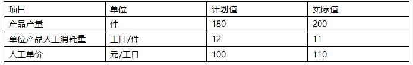
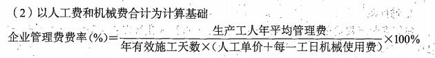
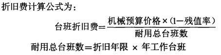
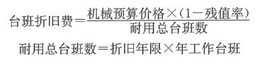
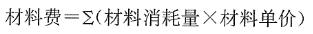
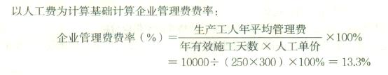
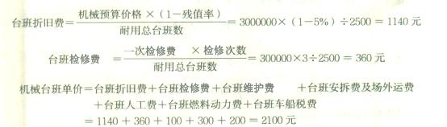
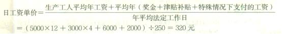

某施工企业投标报价时确定企业管理费率以人工费为基础计算，据统计资料，该施工企业生产工人年平均管理费为3万元，年有效施工天数为240天，人工单价为500元/天，人工费占分部分项工程费的比例为60%，则该企业的企业管理费率应为（）。

A.22.22%
B.25.00%  (正确)
C.15.00%
D.18.75%
解析：
企业管理费费率(%)=生产工人年平均管理费/[年有效施工天数×人工单价]=30000/（240×500）=25%。

【知识点】各费用构成要素计算方法如下

【考点】企业管理费费率

【考察方向】公式计算

【难度】易

【题库维护老师：ZKQ】

高级技工最低日工资单价不得低于工程所在地人力资源和社会保障部门所发布的最低工资标准的（）倍。

A.1.5
B.2
C.2.5
D.3  (正确)
解析：
工程造价管理机构确定日工资单价应根据工程项目的技术要求，通过市场调查，参考实物工程量人工单价综合分析确定，最低日工资单价不得低于工程所在地人力资源和社会保障部门所发布的最低工资标准的：普工1.3倍；一般技工2倍；高级技工3倍。&nbsp;

【知识点】各费用构成要素计算方法如下

【考点】人工费

【考察方向】原文挖空

【难度】易

【题库维护老师：ZKQ】

某施工材料采购原价为200元/t，运杂费为20元/t，运输损耗率为1％，采购保管费率为1.5％，则该材料的单价为（ &nbsp; &nbsp;）元/t。

A.205.03
B.223.30
C.225.53  (正确)
D.203.00
解析：
材料单价＝{（材料原价＋运杂费）×[1＋运输损耗率（％）]}×[1＋采购保管费率（％）]＝（200＋20）×（1＋1％）×（1＋1.5％）＝225.533元/t。

【知识点】各费用构成要素计算方法如下

【考点】材料费

【考察方向】公式计算

【难度】易

【题库维护老师：ZKQ】 

某施工机械预算价格为65万元，预算残值率为3%，折旧年限为5年（年限平均法折旧），每年工作250台班。折旧年限内预计每年检修1次，每次费用为3万元。机械台班人工费为130元，台班燃料动力费为15元，台班车船税费为10元，不计台班安拆费及场外运输费和维护费，则该机械台班单价为（ &nbsp; &nbsp; ）。

A.649.40
B.754.40
C.795.00
D.779.40  (正确)
解析：
【真题改编】每年折旧费为: 65万元x（1-3%）/5=12.61万元； 每个台班折旧费为：12.61x10000/250=504.4元； 每个台班检修费为：30000/250=120元； 机械台班单价为：504.4+120+130+15+10=779.40元

【知识点】各费用构成要素计算方法如下

【考点】施工机具使用费

【考察方向】公式计算

【难度】中等

【题库维护老师：ZKQ】

某工程采购的一批水泥的出厂价为 1990 元/吨，运费为 25 元/吨，运输损耗率为 0.5%，采购保管费率为 2%，则该批水泥的材料单价为（ ）元/吨。

A.2064.95
B.2039.45
C.2025.75
D.2065.58  (正确)
解析：
材料单价=（原材料+运杂费）×（1+运输损耗率）× （1+采购保管费率） =（1990+25）×（1+0.5%）×（1+2%）=2065.58 元/吨。

【知识点】各费用构成要素

【考点】材料费

【考察方向】公式计算

【难度】易

【题库维护老师：ZKQ】

某施工企业投标报价时确定企业管理费率<strong>以分部分项工程费为基础计算</strong>，据统计资料，该施工企业生产工人年平均管理费为 1.2 万元，年有效施工天数为 240 天，人工单价为 300 元/天，人工费占分部分项工程费的比例为 75%，则该企业的企业管理费费率应为（ ）。

A.12.15%
B.12.50%  (正确)
C.16.67%
D.22.22%
解析：
企业管理费=[生产工人年平均管理费/（年有效施工天数×人工工资）]×人工费占分部分项工程费比例=[12000/（240×300）]×75%=12.50%。

【知识点】各费用构成要素计算方法如下

【考点】企业管理费费率

【考察方向】公式计算

【难度】易

【题库维护老师：ZKQ】

某施工机械预算价格为 80 万元，折旧年限为 10 年，年平均工作 250 个台班，一次检修费为 18 万元，检修次数为 3 次，则该台机械台班检修费为（ ）元。

A.320
B.216  (正确)
C.240
D.264
解析：
台班检修费=一次检修费×检修次数/耐用总台班数=（3×180000）÷（10×250）=216 元

【知识点】各费用构成要素计算方法如下

【考点】施工机具使用费

【考察方向】公式计算

【难度】易

【题库维护老师：ZKQ】 

某工程采购的一批钢材的出厂价为 3980 元/吨，运费为 50 元/吨，运输损耗率为 0.5%，采购保管费为 2%，则该批钢材的材料单价为（ ）元/吨。

A.4129.90
B.4079.90
C.4050.15
D.4131.15  (正确)
解析：
材料单价= [ (材料原价+运杂费) x (1 +运输损耗率(%) ) ]x [1 +采购保管费率(%) ]

材料单价=（3980+50）×（1+0.5%）×（1+2%）=4131.153 元。

【知识点】各费用构成要素计算方法如下

【考点】材料费

【考察方向】公式计算

【难度】易

【题库维护老师：ZKQ】 

某施工机械预算价格为100万元，折旧年限为10年，年平均工作225个台班，残值率为4%，则该机械台班折旧费为（）元。

A.426.67  (正确)
B.444.44
C.4266.67
D.4444.44
解析：
台班折旧费=(机械预算价格X（1-残值率）)/耐用总台班数=100 X 10000 X（1- 4%)/(10 X225) =426. 67元 

【知识点】各费用构成要素计算方法如下

【考点】施工机具使用费

【考察方向】公式计算

【难度】易

【题库维护老师：ZKQ】 

施工企业采购的某建筑材料出厂价为3500元/吨,运费为400元/吨,运输损耗率为2%,采购保管费率为5%,则计入建筑安装工程材料费的该建筑材料单价为（ &nbsp; &nbsp; ）元/吨。

A.4176.9  (正确)
B.4173.0
C.3748.5
D.3745.0
解析：
材料单价=[（材料原价+运杂费）x[1+运输损耗率（%）〕]

x[1+采购保管费率（%）]=（3500+400）*（1+2%）*（1+5%）=4176.9

【知识点】各费用构成要素计算方法如下

【考点】材料费

【考察方向】公式计算

【难度】易

【题库维护老师：ZKQ】

建筑安装工程的社会保险费的计算基数一般应为（ &nbsp;）。

A.定额人工费+定额机械费
B.工程造价
C.定额人工费  (正确)
D.定额人工费+管理人员工资
解析：
社会保险费和住房公积金应以定额人工费为计算基础，根据工程所在地省、自治区、 直辖市或行业建设主管部门规定费率计算。

【知识点】各费用构成要素计算方法如下

【考点】规费

【考察方向】概念释义

【难度】易

【题库维护老师：ZKQ】

某施工企业投标报价时确定企业管理费率以人工费为基础计算，据统计资料，该企业生产工人年平均管理费为1.2万元，年有效施工天数为240天，人工单价为300元/天，人工费占分部分项工程费比例为75%，则该企业的企业管理费率应为（ &nbsp; &nbsp;）。

A.12.15%
B.12.50%
C.16.67%  (正确)
D.22.22%
解析：
企业管理费费率(%)=生产工人年平均管理费/[年有效施工天数×人工单价]=12000/（240×300）=16.67%。

【知识点】各费用构成要素计算方法如下

【考点】企业管理费费率

【考察方向】公式计算

【难度】易

【题库维护老师：ZKQ】

某施工材料采购原价为 190 元/吨，运杂费为 40 元/吨，运输损耗率为 1%，采购保管费率为 3%，则该材料的单价为（ &nbsp; &nbsp; ）元/吨。

A.234.28
B.237.66
C.239.20
D.239.27  (正确)
解析：
材料单价=[（材料原价+运杂费）×（1+运输损耗率）]×（1+采购保管费）=[（190+40）×（1+1%）]×（1+3%）=239.269。

【知识点】各费用构成要素计算方法如下

【考点】材料费

【考察方向】公式计算

【难度】易

【题库维护老师：ZKQ】 

某施工机械预算价格为80万元，残值率为3%，折旧年限为10年，年工作台班数为250个台班，则该机械的台班折旧费为( &nbsp; )元。

A.300.0
B.310.4  (正确)
C.320.0
D.329.6
解析：
折旧费计算公式：台班折旧费＝[机械预算价格×(1－残值率)]/耐用总台班数。其中，耐用总台班数＝折旧年限×年工作台班。由题意可得该机械的台班折旧费＝[80×104×(1－3%)]/(10×250)＝310.4(元)。

【知识点】各费用构成要素计算方法如下

【考点】施工机具使用费

【考察方向】公式计算

【难度】易

【题库维护老师：ZKQ】

某施工机械预算价格为200万元，折旧年限为10年，年平均工作225个台班，残值率为4％，则该机械台班折旧费为( &nbsp; )元。

A.757.5
B.767.4
C.832.5
D.853.3  (正确)
解析：
台班折旧费＝[机械预算价格×(1－残值率)]/耐用总台班数＝[200×104×(1－4％)]/(10×225)＝853.3(元)。

【知识点】各费用构成要素计算方法如下

【考点】施工机具使用费

【考察方向】公式计算

【难度】易

【题库维护老师：ZKQ】

某施工用机械，折旧年限为10年，年平均工作300个台班，台班折旧费为800元，残值率为5％，则该施工机械的预算价格为( &nbsp; )万元。

A.116.4
B.120.0
C.123.6
D.252.6  (正确)
解析：
施工机械台班折旧费计算公式：台班折旧费＝机械预算价格×(1－残值率)/耐用总台班数，故机械预算价格＝台班折旧费×耐用总台班数/(1－残值率)＝800×10×300/(1－5％)＝252.6(万元)。

【知识点】各费用构成要素计算方法如下

【考点】施工机具使用费

【考察方向】公式计算

【难度】易

【题库维护老师：ZKQ】

某新建工程，采购一批直径12的螺纹钢筋200吨，钢筋的供应价格为4280元／吨，运费为60元／吨，运输损耗为0.25%，采购保管费率为1%，则该钢筋的采购单价为（）。

A.3999.9元
B.4030元
C.4350.85元
D.4394.36元  (正确)
解析：
材料单价=【（材料原件＋运杂费）×（1+运输损耗率）】×（1+采购保管费率）=（4280+60）×（1+0.25％）×（1＋1％）=4394.36元

【知识点】各费用构成要素计算方法如下

【考点】材料费

【考察方向】公式计算

【难度】易

【题库维护老师：ZKQ】

根据《建筑安装工程费用项目组成》（建标【2013】44号文），以定额人工费为计费的基础规费有（ &nbsp;&nbsp;）。

A.养老保险费  (正确)
B.医疗保险费  (正确)
C.工伤保险费  (正确)
D.工程排污费
E.住房公积金  (正确)
解析：
社会保险费（养老、失业、医疗、生育、工伤）和住房公积金应以定额人工费为计算基础，根据工程所在地省、自治区、直辖市或行业建设主管部门规定费率计算。工程排污费等其他应列而未列入的规费应按工程所在地环境保护等部门规定的标准缴纳，按实计取列入。

【知识点】各费用构成要素计算方法如下

【考点】规费

【考察方向】原文挖空

【难度】易

【题库维护老师：ZKQ】

关于建筑安装工程人工费中日工资单价的说法，正确的有（ &nbsp; &nbsp;）。

A.日工资单价是施工企业技术较熟练的生产工人在每工作日应得的工资总额
B.工程造价管理机构应参考项目实物工程量人工单价综合分析确定日工资单价  (正确)
C.最低日工资单价不得低于工程所在地人力资源和社会保障部门发布的最低工资标准  (正确)
D.企业投标报价时应自主确定日工资单价
E.工程计价定额中应根据项目技术要求和工种差别划分多种日工资单价  (正确)
解析：
日工资单价是指施工企业平均技术熟练程度的生产工人在每工作日(国家法定工作时间内)按规定从事施工作业应得的日工资总额。工程造价管理机构确定日工资单价应根据工程项目的技术要求，通过市场调查，参考实物工程量人工单价综合分析确定，最低日工资单价不得低于工程所在地人力资源和社会保障部门所发布的最低工资标准。工程计价定额不可只列一个综合工日单价，应根据工程项目技术要求和工种差别适当划分多种日人工单价，确保各分部工程人工费的合理构成。

【知识点】各费用构成要素计算方法如下

【考点】人工费

【考察方向】概念释义

【难度】易

【题库维护老师：ZKQ】

根据《建筑安装工程费用项目组成》（建标44 号文），以定额人工费为基础的规费有（ ）。

A.工程排污费
B.养老保险费  (正确)
C.医疗保险费  (正确)
D.工伤保险费  (正确)
E.住房公积金  (正确)
解析：
社会保险费和住房公积金应以定额人工费为计算基础，根据工程所在地省、自治区、直辖市或行业建设主管部门规定费率计算。

【知识点】各费用构成要素计算方法如下

【考点】规费

【考察方向】原文挖空

【难度】易

【题库维护老师：ZKQ】 

根据《建筑安装工程费用项目组成》（建标[2013]44号文）以定额人工费为计算基础的规费有( &nbsp; &nbsp; )。

A.工程排污费
B.养老保险费  (正确)
C.医疗保险费  (正确)
D.工伤保险  (正确)
E.住房公积金  (正确)
解析：
社会保险费（养老、失业、医疗、生育、工伤）和住房公积金应以定额人工费为计算基础，根据工程所在地省、自治区、直辖市或行业建设主管部门规定费率计算。工程排污费等其他应列而未列入的规费应按工程所在地环境保护等部门规定的标准缴纳，按实计取列入。

【知识点】各费用构成要素计算方法如下

【考点】规费

【考察方向】原文挖空

【难度】易

【题库维护老师：ZKQ】

根据《关于做好建筑业营改增建设工程计价依据调整准备工作的通知》(建办标[2016]4号)，关于增值税的说法，正确的有( &nbsp; )

A.工程造价＝税前工程造价×(1＋7％)
B.建筑业适用的增值税税率为11％
C.税金＝税前工程造价×税率  (正确)
D.税金＝税前工程造价×征收率  (正确)
E.建筑安装工程费用的税金是指国家税法规定应计入建筑安装工程造价的增值税销项税额  (正确)
解析：
建筑安装工程费用的税金是指国家税法规定应计入建筑安装工程造价的增值税销项税额。根据《关于做好建筑业营改增建设工程计价依据调整准备工作的通知》(建办标[2016]4号)文件规定，工程造价可按以下公式计算：工程造价＝税前工程造价×(1＋10％)。式中10％为建筑业适用增值税税率。由此，税金计算公式：税金＝税前工程造价×税率(或征收率)，或税金＝工程造价/[1+税率(或征收率)]×税率(或征收率)。

【知识点】各费用构成要素计算方法如下

【考点】增值税

【考察方向】概念释义

【难度】易

【题库维护老师：ZKQ】

根据《建筑安装工程费用项目组成》，以定额人工费为计费基础的规费有( &nbsp;)。

A.养老保险费  (正确)
B.医疗保险费  (正确)
C.工程排污费
D.工伤保险费  (正确)
E.住房公积金  (正确)
解析：
社会保险费（（1）养老保险费（2）失业保险费（3）医疗保险费（4）生育保险费（5）工伤保险费）和住房公积金应以定额人工费为计算基础。

【知识点】各费用构成要素计算方法如下

【考点】规费

【考察方向】原文挖空

【难度】易

【题库维护老师：SUT】

某企业1月份人工成本计划值为21.6万元，实际值为24.2万元。构成该成本的三个因素的重要性排序和基本参数如下表。则“单位产品人工消耗量”变动对人工成本的影响为（）元。 

A.-26000
B.-20000  (正确)
C.-22000
D.-18000
解析：
1.产量替代:200*12*100=240000； 2.消耗量替代：200×11×100=220000； 单价替代：200×11×110=24200； 单位产品人工消耗量变动对成本的影响为220000-240000=-20000。 

【知识点】建筑安装工程费用计算

【考点】建筑安装工程费用计算

【考查方向】公式计算

【难度】易

【题库维护老师：hejiade】

某施工企业投标报价时确定企业管理费率以人工费和机械费合计为基础计算，据统计资料，该施工企业生产工人年平均管理费为1.2万元，年有效施工天数为240天，人工单价为300元/天，每个施工日机械工作1台班。机械台班使用费为800元，人工费占分部分项工程费的比例为75%，则该企业的企业管理费率应为（ &nbsp;）。

A.7.23%
B.6.67%
C.5.25%
D.4.55%  (正确)
解析：

【知识点】各费用构成要素计算方法

【考点】各费用构成要素计算方法

【考查方向】计算

【难度】易

【题库维护老师】yxf

某施工机械预算价格为200万元，预计可使用10年，每年平均工作250个台班，预计净残值40万元。按工作量法计算折旧，则该机械台班折旧费为（ &nbsp; &nbsp;）万元。

A.0.8
B.0.64
C.0.08
D.0.064  (正确)
解析：
 

台班折旧费=(200-40) /250×10=0.064。

【知识点】各费用构成要素计算方法如下

【考点】施工机具使用费

【考察方向】公式计算

【难度】易

【题库维护老师：ZKQ】

某施工机械预算价格68万元，折旧年限10年，年平均工作台班数250个台班，残值率5%，则该施工机械台班折旧费为（ &nbsp;）元。

A.216.5元
B.258.4元  (正确)
C.272元
D.289.8元
解析：
 【知识点】各费用构成要素计算方法 

【考点】各费用构成要素计算方法

【考查方向】计算

【难度】易

【题库维护老师】yxf

某企业投标时需确定管理费费率。已知在国内类似项目生产工人年平均的管理费为10000元／人／年，年有效施工天数平均为250天，人工单价平均为100元／人／天，类似项目的人工费占分部分项工程费比例为30%。则以分部分项工程费为计算基础计算的管理费费率为( &nbsp;)。

A.12%  (正确)
B.30%
C.40%
D.60%
解析：
 

【知识点】各费用构成要素计算方法如下

【考点】企业管理费费率

【考察方向】公式计算

【难度】易

【题库维护老师：ZKQ】

某施工机械预算价格为100万元，预计可使用8年，每年平均工作250个台班，预计净残值5万元。按工作量法计算折旧，则该机械台班折旧费为( &nbsp;)万元。

A.0.0475  (正确)
B.0.05
C.0.075
D.0.38
解析：
 

【知识点】各费用构成要素计算方法如下

【考点】施工机具使用费

【考察方向】公式计算

【难度】易

【题库维护老师：SUT】

某工程建设项目需用甲建筑材料1000公斤，该材料原价为40元/公斤，每吨运杂费为2000元，运输损耗率为2%，采购保管费费率3%。则该工程购买甲材料所花费的材料费为（ &nbsp;）。

A.44024元
B.44125.2元  (正确)
C.44100元
D.4400元
解析：

 【知识点】各费用构成要素计算方法 【考点】各费用构成要素计算方法 【考查方向】计算 【难度】易 【题库维护老师】yxf

某施工企业投标报价时确定企业管理费费率以人工费为基础计算。据统计资料，该施工企业生产工人年平均管理费为1万元，年有效施工天数为250天，人工单价为300元／天，人工费占分部分项工程费的比例为50%。则该企业的企业管理费费率应为( &nbsp;)。

A.6.65%
B.13.33%  (正确)
C.20.00%
D.26.60%
解析：
 

【知识点】各费用构成要素计算方法如下

【考点】企业管理费费率

【考察方向】公式计算

【难度】易

【题库维护老师：SUT】

某企业的一台施工机械，机械预算价格300万元，预计净残值率5%，耐用总台班数2500台班。该机械预计在某工程上每年使用250个台班，三年检修一次，检修费用预计为30万元。平时保养维护费用预计每台班100元，预计每台班人工费为300元。预计每台班燃料动力费为200元，其余费用均不考虑。则该机械台班单价应为( &nbsp;)元。

A.1740
B.1753.3
C.2100  (正确)
D.1820
解析：

【知识点】各费用构成要素计算方法如下

【考点】施工机具使用费

【考察方向】公式计算

【难度】易

【题库维护老师：ZKQ】

某施工企业的普通生产工人平均月工资为5000元，奖金平均每季度为3000元，津贴补贴平均每年为6000元，特殊情况下支付的工资每年平均为2000元，再无支付其他工资。年平均法定工作日为250天。则该企业的普工日工资单价应为( &nbsp;)元。

A.64
B.100
C.284
D.320  (正确)
解析：
 

【知识点】各费用构成要素计算方法如下

【考点】人工费

【考察方向】公式计算

【难度】易

【题库维护老师：ZKQ】

某施工机械原价为200万元，运杂费为原价的5%，采购保管费为机械原价加上运杂费的2%，折旧年限为10年，年平均工作250个台班，残值率为5%.则该机械台班折旧费为( &nbsp;)元。

A.775.20
B.798.00
C.813.20
D.813.96  (正确)
解析：
工程设备单价=（设备原价+运杂费）×[1+采购保管费率(%)]=200×(1+5%)×(1+2%)=214.2万元

【知识点】各费用构成要素计算方法如下

【考点】施工机具使用费

【考察方向】公式计算

【难度】易

【题库维护老师：ZKQ】

