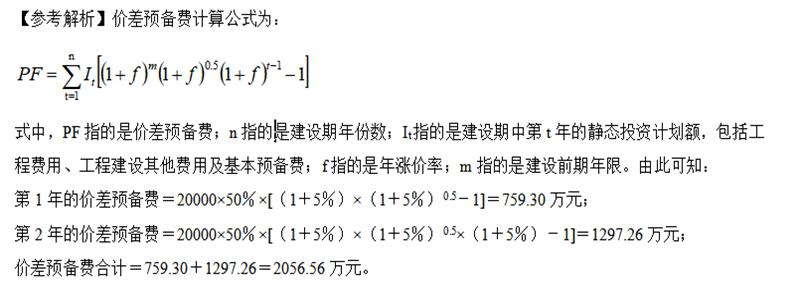
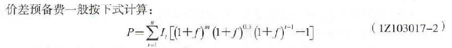
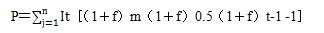
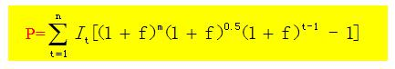

某项目建设期间，建安工程费 2000 万元，设备工器具购置费 1000 万元，工程建设其他费 500万元，基本预备费的费率为 10%，则价差预备费的基数为（ ）。

A.3000 万
B.3500 万
C.3300 万
D.3850 万  (正确)
解析：
价差预备费的基数=静态投资=建安工程费+设备工器具购置费+工程建设其他费+基本预备费=（建安工程费+设备工器具购置费+工程建设其他费）×（1+10%）=3850 万。

【知识点】价差预备费

【考点】价差预备费

【考察方向】概念释义

【难度】易

【题库维护老师：ZKQ】

某项目投资建设期为3年，第1年投资额是1000万元，且每年以15%速度增长，预计该项目年均投资价格上涨率为5%，则该项目建设期间价差预备费为( &nbsp; )万元。

A.283.57  (正确)
B.310.1
C.370.23
D.376.34
解析：
第1年末的价差预备费1000×[（1+5%）0.5-1]＝24.69(万元)；

第2年末的价差预备费：1000×(1＋15%)×[(1＋5%)1.5－1]＝87.32(万元)； 第3年末的价差预备费：1000×(1＋15%)²×[(1＋5%)2.5－1]＝171.56(万元)； 则该项目建设期的价差预备费＝24.69+87.32+171.56＝283.57(万元)。

【知识点】价差预备费

【考点】价差预备费

【考察方向】公式计算

【难度】中等

【题库维护老师：ZKQ】 

某建设工程项目在前期建设期1年估算的建筑安装工程费、设备及工器具购置费为5000万元，工程建设其它费1000万，已知基本预备费率为8%，按照项目进度计划，建设期为2年，第1年投资40%万元，第2年投资60%万元，预计建设期内价格总水平上涨率为每年5%，则该项目的价差预备费是（ &nbsp; &nbsp;）万元。

A.407.50
B.512.50
C.665.11
D.701.19  (正确)
解析：
此题考核价差预备费的计算： 价差预备费的计算基数为：工程费用、工程建设其他费用及基本预备费之和。 基本预备费=(工程费用+工程建设其他费用）x基本预备费费率 静态投资=工程费用（设备及工器具购置费+建筑安装工程费）+工程建设其他费用+基本预备费 P＝［（1＋f）m（1＋f）0.5（1＋f）t-1 -1］ 基本预备费＝（5000＋1000）×8％＝480万元 建设期第一年完成投资=（5000＋1000+480）×40％＝2592万元 &nbsp; 第一年价差备费为：＝2592×［（1＋5%）（1＋5%）0.5 -1］＝196.81万元 第二年完成投资＝（5000＋1000+480）×60％＝3888万元 第二年价差备费为：=3888［（1＋5%）（1＋5%）0.5（1+5%）-1］＝504.375万元 所以，建设期的价差备费为： P＝196.81＋504.375＝701.19万元

【知识点】价差预备费

【考点】价差预备费

【考察方向】公式计算

【难度】中等

【题库维护老师：ZKQ】

某项目建设前期年限为1年，投资建设期为3年，第1年投资额是1000万元，且每年以15%速度增长，预计该项目年均投资价格上涨率为5%，则该项目建设期间价差预备费为（ &nbsp; &nbsp;）万元。

A.471.39  (正确)
B.410.1
C.470.23
D.476.34
解析：
此题考核的是价差预备费的相关内容。 P＝ ［It（1＋f）m（1＋f）0.5（1＋f）t-1-1］ 第一年价差备费为：＝1000［（1＋5%）（1＋5%）0.5 -1］＝75.93万元 第二年完成投资＝1000×（1+15％）＝1150万元 第二年价差备费为：＝1150［（1＋5%）2（1＋5%）0.5-1］＝149.19万元 第三年完成投资＝1150×（1+15％）＝1322.5万元 第三年价差预备费为：＝1322.5［（1＋5%）3（1＋5%）0.5-1］＝246.27万元 所以，建设期的价差备费为： P＝75.93＋149.19＋246.27＝471.39万元。

【知识点】价差预备费

【考点】价差预备费

【考察方向】公式计算

【难度】中等

【题库维护老师：ZKQ】

价差预备费以（ ）之和为计算基数。

A.建筑安装工程费  (正确)
B.设备及工器具购置费  (正确)
C.工程建设其他费  (正确)
D.基本预备费  (正确)
E.建设期利息
解析：
价差预备费的内容包括:人工、设备、材料、施工机具的价差费，建筑安装工程费及工程建设其他费用调整，利率、汇率调整等增加的费用。 价差预备费以工程费用、工程建设其它费用及基本预备费之和为计算基数。

【知识点】价差预备费

【考点】价差预备费

【考察方向】概念释义

【难度】易

【题库维护老师：ZKQ】 

某建设项目静态投资20000万元，项目建设前期年限为1年，建设期为2年，计划每年完成投资50％，年均投资价格上涨率为5％，该项目建设期价差预备费为（ &nbsp; &nbsp;）万元。

A.1006.25
B.1525.00
C.2056.56  (正确)
D.2601.25
解析：
如下图 

【知识点】价差预备费

【考点】价差预备费

【考察方向】公式计算

【难度】中等

【题库维护老师：ZKQ】

某建设项目设备及工器具购置费为500万元，建筑工程费1600万元，安装工程费为400万元，工程建没其他费为300万元，基本预备费率为10%，开工准备1年，建设期2年。第1年计划投资40%，第2年计划投资60%，建设期内预计年平均价格总水平上涨率为5%，建设期贷款利息475万元，则该项目的建设投资为( &nbsp; )万元。

A.3708.75
B.3753.28
C.3888.28  (正确)
D.3758.75
解析：
基本预备费＝(500＋1600＋400＋300)×基本预备费率10%＝280(万元)；

第1年末的涨价预备费＝（500＋1600＋400＋300+280）×40%×[(1＋5%)1.5－1]＝93.55(万元)；

第2年末的涨价预备费＝（500＋1600＋400＋300+280）×60%×[(1+5%)2.5－1]＝239.73(万元)； 该项目建设期的涨价预备费＝93.55＋239.73＝333.28万元)； 建设投资＝500＋1600＋400＋300＋280＋333.28＋475＝3888.28(万元)。 

【知识点】价差预备费

【考点】价差预备费

【考察方向】公式计算

【难度】中等

【题库维护老师：ZKQ】

某建设项目设备及工器具购置费为3000万元，建筑安装工程费为6000万元，土地使用费5000万元，建设管理费600万元，可行性研究费100万元，联合试运转费200万元，已知项目建设前期年限为1年，项目建设期3年，各年投资计划值为30%，50%，20%，年均投资价格上涨率5%，基本预备费8%，其他因素不考虑。则该项目建设期间的价差预备费为（ &nbsp;）万元。

A.1123.96
B.1748.43
C.2009.70  (正确)
D.2349.60
解析：
价差预备费一般按下式计算： 价差预备费的计算基数为：工程费用、工程建设其他费用及基本预备费之和。 基本预备费=(工程费用+工程建设其他费用）×基本预备费费率 静态投资=工程费用（设备及工器具购置费+建筑安装工程费）+工程建设其他费用+基本预备费  基本预备费＝（6000＋3000＋5000＋600＋100＋200）×8％＝1192万元 静态投资＝6000＋3000＋5000＋600＋100＋200＋1192＝16092万元 建设期第一年完成投资=16092×30％＝4827.6万元 第一年价差备费为：＝4827.6［（1＋5%）（1＋ 5% ）0.5-1］＝366.6万元 第二年完成投资＝16092×50％＝8046万元 第二年价差备费为：= 8046 ［（1＋ 5% ）2（1＋ 5% ）0.5-1］＝1043.8万元 第三年完成投资＝16092×20％＝3218.4万元 第三年价差预备费为：= 3218.4 ［（1＋ 5% ）3（1＋ 5% ）0.5-1］＝599.3万元 所以，建设期的价差备费为： P＝366.6＋1043.8＋599.3＝2009.7万元

【知识点】价差预备费

【考点】价差预备费

【考察方向】公式计算

【难度】中等

【题库维护老师：ZKQ】

下列是价差预备费的计算基数的项目包括( &nbsp; )。

A.建筑安装工程费  (正确)
B.基本预备费  (正确)
C.工程建设其他费  (正确)
D.价格上涨指数
E.建设期
解析：
 

It——建设期第t年的投资计划额，包括工程费用、工程建设其他费用及基本预备费，即第t年的静态投资计划额；

【知识点】价差预备费

【考点】价差预备费

【考察方向】原文挖空

【难度】易

【题库维护老师：ZKQ】

