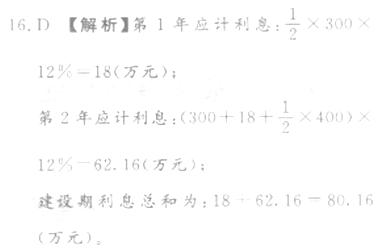
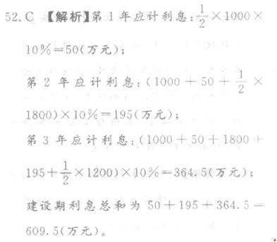
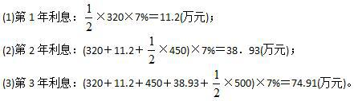
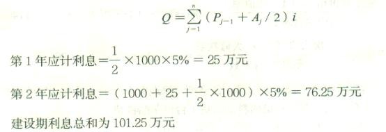
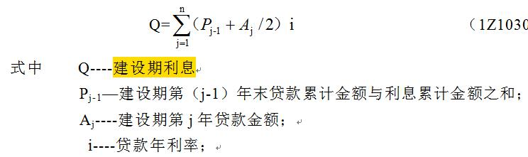

某新建项目，总投资150000万元，其中资本金占比60%。建设期三年，在建设期内各年贷款平均投入使用，均衡发放到位，年利率6%，并将于投产后第3年至第10年等额偿清本息。在此情况下，建设期第二年产生的利息金额为（）万元。

A.4800
B.2472
C.1836  (正确)
D.3868
解析：
150000×40%=60000（万元），每年贷款20000万 第一年利息：0.5×20000×6%=600万元 第二年利息：（20000+600+0.5×20000）×6%=1836（万元） 【知识点】资金筹措费的计算 【考点】资金筹措费的计算 【考查方向】计算 【难度】易 【题库维护老师：yxf】

在编制投资估算时，某建设工程项目第2年年初借款本息累计为5000万元，第2年当年借款额为600万元，借款利率为6％。则该年应计的建设期利息为（ &nbsp; &nbsp;）万元。

A.264
B.282
C.318  (正确)
D.336
解析：
该年应计利息＝（年初借款本息累计＋本年借款额/2）×年利率＝（5000＋600/2）×6％＝318万元。

【知识点】资金筹措费计算

【考点】 资金筹措费计算

【考察方向】公式计算

【难度】易

【题库维护老师：ZKQ】 

某新建项目，建设期为2年，共从银行贷款960万元，每年贷款额相等。贷款年利率为6％，则该项目建设期利息为（ &nbsp; &nbsp;）万元。

A.44.06
B.58.46  (正确)
C.88.13
D.116.93
解析：
各年应计利息＝（年初借款本息累计＋本年借款额/2）×年利率，本题的计算过程如下：第1年应计利息＝1/2×960/2×6％＝14.4万元；第2年应计利息＝（480＋14.4＋1/2×480）×6％＝44.06万元； 该项目建设期利息＝14.4＋44.06＝58.46万元。

【知识点】&nbsp;资金筹措费计算

【考点】&nbsp;资金筹措费计算

【考察方向】公式计算

【难度】易

【题库维护老师：ZKQ】 

某新建项目，建设期为3年，共向银行借款1300万元，其中第一年借款700万元，第二年借款600万元，借款在各年内均衡使用，年化率为6%，建设期每年计息，但不还本付息，则第3年应计的借款利息为（ &nbsp; ）万元。

A.0
B.82.94  (正确)
C.85.35
D.104.52
解析：
本题考查的是建设期利息的计算。当年本金算一半，往年本利全计算。第一年本金700万，利息700/2*6%=21万，第二年计息的本金为（700+21+600/2）=1021万，利息为1021*6%=61.26。第三年计息本金为700+21+600+61.26=1382.26万，利息为1382.26*6%=82.9356万元。

【知识点】资金筹措费计算

【考点】资金筹措费计算

【考察方向】公式计算

【难度】易

【题库维护老师：ZKQ】

某新建项目，建设期为 3 年，共向银行贷款 1300 万元，贷款时间为：第 1 年 300 万元，第 2 年 600 万元，第 3 年 400 万元，年利率为 6%，则建设期第二年应计利息为（ ）万元。

A.9.00
B.36.54  (正确)
C.68.73
D.114.27
解析：
第一年建设期利息=300/2×6%=9 万元；  第二年建设期利息=（300+9+600/2）×6%=36.54 万元。

【知识点】 资金筹措费计算

【考点】资金筹措费计算

【考察方向】公式计算

【难度】易

【题库维护老师：ZKQ】

某建设项目建设期是 3 年，其贷款分年拨付，三年贷款额分别为 300 万元、400 万元、500 万元，年利息率为 6%，建设期内利息只计息不支付，则该项投资的建设期贷款利息是( ）万元。

A.59.37
B.36
C.98.91  (正确)
D.72
解析：
利息的计算,为了简便计算,我们假设第一年在年中支付,所以第一年算 1/2,第二年开始算一整年.  第 1 年利息：1/2*300*6%=9(万元)；  第 2 年利息：(300+9+1/2*400)*6%=30.54（万元）；  第 3 年利息：（300+9+400+30.54+1/2*500）*6%=59.37 万元。  建设期利息总和为 9+30.54+59.37=98.91（万元）。

【知识点】1Z103018 资金筹措费计算

【考察方向】公式计算

【难度】易

【题库维护老师：ZKQ】 

某建设期为2年的建设项目，第1年贷款300万元，第2年贷款400万元，贷款年利率为10%。则该项目建设期利息为( &nbsp; )万元。

A.30
B.80
C.71.5
D.66.5  (正确)
解析：
第1年应计利息：1／2×300×10%＝15(万元)； 第2年应计利息：(300＋15＋1／2×400)×10%＝51.5(万元)； 建设期利息总和为：15＋51.5＝66.5(万元)。

【知识点】资金筹措费计算

【考点】资金筹措费计算

【考察方向】公式计算

【难度】易

【题库维护老师：ZKQ】

某项目建设期2年，建设期内第1年贷款700万元，第2年贷款600万元，年内均衡发放，且只计息不还款，年利率为8%。则编制该项目的投资估算时，建设期利息总和为()万元。*

A.104.00
B.110.24  (正确)
C.114.94
D.155.84
解析：
各年应计利息=（年初借款本息累计+本年借款额/2）*年利率。在建设期内，各年利息计算如下：第1年应计利息=0.5*700*8%=28万元第2年应计利息=(700+28+0.5*600)*8%=82.4万元建设期利息总和为82.4+28=110.24万元

【知识点】资金筹措费计算

【考点】资金筹措费计算

【考察方向】公式计算

【难度】易

【题库维护人：ZKQ】

某工程项目，建设期为2年，共向银行借款5000万元，其中第一年借入2000万元，第2年借入3000万元，年利率均为6%，借款在各年内均衡使用，建设期内只计息不付息，则建设期第2年应计利息为( &nbsp; &nbsp; &nbsp; &nbsp; )万元。

A.300.00
B.273.60
C.213.60  (正确)
D.180.00
解析：
根据建设期利息及其计算公式，该项目第一年贷款利息额=2000×6%÷2=60(万元)，第二年贷款利息额=(2000+60+3000÷2)×6%=213.6(万元)。

【知识点】资金筹措费计算

【考点】资金筹措费计算

【考察方向】公式计算

【难度】易

【题库维护老师：ZKQ】 

某项目建设期为2年,共向银行借款10000万元,借款年利率为6%第1和第2年借款比例均为50%借款在各年内均衡使用,建设期内只计息不付息。则编制投资估算时该项目建设期利息总和为( &nbsp;)万元。

A.609  (正确)
B.459
C.450
D.300
解析：
建设期利息是指项目借款在建设期内发生并计入固定资产的利息。为了简化计算，在编制投资估算时通常假定借款均在每年的年中支出，借款第一年按半年计息，其余各年份按全年计息。 经计算可得：第一年利息为150万，第二年利息为459万；二者相加即得609万。

【知识点】资金筹措费计算

【考点】资金筹措费计算

【考察方向】公式计算

【难度】中等

【题库维护老师：ZKQ】 

某新建建设项目，项目建设期为3年，共向银行贷款1200万元，第1年贷款500万元，第2年贷款400万元，第3年贷款300万元，贷款年利率为8%，则该项目建设期利息总和为( &nbsp; )万元。

A.165.5
B.166.6
C.167.8  (正确)
D.168.8
解析：
建设期利息是指项目借款在建设期内发生并计入固定资产的利息。为了简化计算，在编制投资估算时通常假定借款均在每年的年中支用，借款第一年按半年计息，其余各年份按全年计息。其计算公式：各年应计利息＝(年初借款本息累计＋本年借款额/2)×年利率。代入数据计算可得第1年应计利息＝1/2×500×8%＝20(万元)；第2年应计利息＝(500＋20＋1/2×400)×8%＝57.6(万元)；第3年应计利息＝(500＋20＋400＋57.6＋1/2×300)×8%＝90.2(万元)。建设期利息总和＝20＋57.6＋90.2＝167.8(万元)。

【知识点】资金筹措费计算

【考点】资金筹措费计算

【考察方向】公式计算

【难度】中等

【题库维护老师：ZKQ】

某新建项目，建设期为5年，共向银行贷款7500万元，建设期每年获取贷款金额相同，年利率为6％，则第3年应计利息额( &nbsp; )万元。

A.15.00
B.45.00
C.137.70
D.235.96  (正确)
解析：
建设期利息是指项目借款在建设期内发生并计入固定资产的利息。为了简化计算，在编制投资估算时通常假定借款均在每年的年中支用，借款第一年按半年计息，其余各年份按全年计息。其计算公式：各年应计利息＝(年初借款本息累计＋本年借款额/2)×年利率。由题意可知建设期每年获取贷款金额7500/5＝1500(万元)，第1年应计利息＝1/2×1500×6％＝45(万元)；第2年应计利息＝(1500+45+1/2×1500)×6％＝137.70(万元)；第3年应计利息＝(1500＋45＋1500+137.70+1/2×1500)×6％＝235.96(万元)。

【知识点】资金筹措费计算

【考点】资金筹措费计算

【考察方向】公式计算

【难度】中等

【题库维护老师：ZKQ】

某施工单位向银行贷款2000万元进行一项建设期为3年的项目建设，第1年贷款500万元，第2年贷款1000万元，第3年贷款500万元，年利率为10％，则第1年和第2年的建设期利息分别是( &nbsp; )

A.102.50万元；187.75万元
B.102.50万元；315.25万元
C.25万元；102.50万元  (正确)
D.25万元；187.75万元
解析：
建设期利息是指项目借款在建设期内发生并计入固定资产的利息。为了简化计算，在编制投资估算时通常假定借款均在每年的年中支用，借款第1年按半年计息，其余各年份按全年计息。其计算公式：各年应计利息＝(年初借款本息累计＋本年借款额/2)×年利率。由题意可得第1年利息＝500/2×10％＝25(万元)；第2年利息＝(500＋25＋1000/2)×10％＋102.50(万元)。

【知识点】资金筹措费计算

【考点】资金筹措费计算

【考察方向】公式计算

【难度】中等

【题库维护老师：ZKQ】

某建设期为2年的建设项目，第1年贷款300万元，第2年贷款400万元，贷款年利率为12%。则该项目建设期利息为(　　)万元。

A.18
B.43.44
C.61.44
D.80.16  (正确)
解析：
 【知识点】资金筹措费计算 【考点】资金筹措费计算 【考查方向】公式计算 【难度】易 【题库维护老师：gx】

某建设项目的建设期为2年，建设投资中共有1000万元债务资金，来源为银行贷款，贷款时间为第一年400万元，第二年600万元，年利率为8%。在此情况下，其建设期利息为（ &nbsp;）万元。

A.80
B.112
C.116.4
D.73.28  (正确)
解析：
  【知识点】资金筹措费计算 【考点】资金筹措费计算 【考查方向】计算 【难度】易 【题库维护老师】yxf

某建设项目，建设期为3年，建设期内各年借款额分别为1000万元、1800万元、1200万元，借款年利率为10%，则建设期应计利息为(　　)万元。

A.400.0
B.580.0
C.609.5  (正确)
D.780.0
解析：

【知识点】资金筹措费计算

【考点】资金筹措费计算

【考察方向】公式计算

【难度】中等

【题库维护老师：ZKQ】

某建设项目建设期是3年，其贷款分年拨付，三年贷款额分别为320万元、450万元、500万元。年利息率为7%，建设期内利息只计息不支付，则该项投资的建设期贷款利息是( &nbsp; )万元。

A.59.37
B.125.04  (正确)
C.98.91
D.127.15
解析：
 

建设期利息总和为11.2＋38.93＋74.91＝125.04(万元)。

【知识点】资金筹措费计算

【考点】资金筹措费计算

【考察方向】公式计算

【难度】易

【题库维护老师：ZKQ】

某新建项目，建设期两年，共向银行贷款2000万元，每年使用1000万元，按月均衡使用，银行贷款年利率5%，则在编制投资估算时建设期利息应为( &nbsp;)万元。

A.101.25  (正确)
B.102.50
C.126.25
D.127.50
解析：
建设期利息是指项目借款在建设期内发生并计人固定资产的利息。为了简化计算，在编制投资估算时通常假定借款均在每年的年中支用，借款第一年按半年计息，其余各年份按全年计息。根据不同资金来源及利率分别计算。

【知识点】资金筹措费计算

【考点】 资金筹措费计算

【考察方向】公式计算

【难度】中等

【题库维护人：QYD】 

某建设项目，建设期为2年，第一年贷款100万元，第二年贷款200万元，贷款年利率为10%。则该项目第二年的建设期利息为（ &nbsp; ）。

A.5万元
B.20.5万元  (正确)
C.25.5万元
D.35.5万元
解析：
 

第一年建设期利息=1/2×100×10%=5 

第二年建设期利息=(100+5+1/2×200)×10%=20.5

【知识点】资金筹措费计算

【考点】资金筹措费计算

【考察方向】公式计算

【难度】中等

【题库维护老师：ZKQ】 

