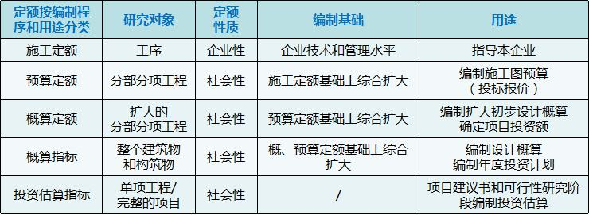
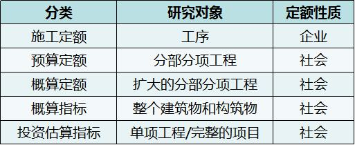

施工定额的研究对象是（）。

A.工序  (正确)
B.分部分项工程
C.扩大的分部分项工程
D.单位工程
解析：
施工定额是以同一性质的施工过程一一工序作为研究对象，表示生产产品数量与时间消耗综合关系的定额。

【知识点】按编制程序和用途分类

【考点】施工定额

【考察方向】原文挖空

【难度】易

【题库维护老师：ZKQ】

下列定额，属于企业定额性质的是（ &nbsp; &nbsp;）。

A.预算定额
B.概算定额
C.施工定额  (正确)
D.概算指标
解析：
施工定额是以同一性质的施工过程——工序作为研究对象，表示生产产品数量与时间消耗综合关系的定额。施工定额是施工企业（建筑安装企业）为组织生产和加强管理在企业内部使用的一种定额，属于企业定额的性质。

【知识点】按编制程序和用途分类

【考点】施工定额

【考查方向】原文挖空

【难度】易

【题库维护老师：hejiade】

下列定额中属于施工企业内部使用的，以工序为对象编制的定额是（ &nbsp;）。

A.预算定额
B.概算定额
C.费用定额
D.施工定额  (正确)
解析：
本题考查的是施工定额的定义。施工定额是以同一性质的施工过程一一工序作为研究对象，表示生产产品数量与时间消耗综合关系的定额。施工定额是施工企业(建筑安装企业)为组织生产和加强管理在企业内部使用的一种定额，属于企业定额的性质。

【知识点】按编制程序和用途分类

【考点】施工定额

【考察方向】概念释义

【难度】易

【题库维护老师：ZKQ】 

下列定额中，（ ）是建筑安装企业组织生产和加强管理在企业内部使用的一种定额，属于企业定额的性质。

A.预算定额
B.概算定额
C.人工定额
D.施工定额  (正确)
解析：
施工定额是以同一性质的施工过程——工序作为研究对象，表示生产产品数量与时间消耗综合关系的定额。施工定额是施工企业（建筑安装企业）组织生产和加强管理在企业内部使用的一种定额，属于企业定额的性质。

【知识点】按编制程序和用途分类

【考点】施工定额

【考察方向】原文挖空

【难度】易

【题库维护老师：ZKQ】 

建设工程施工定额的研究对象是（ ）。

A.分部分项工程
B.工序  (正确)
C.扩大的分部分项
D.整个建筑物或构筑物
解析：
施工定额是以同一性质的施工过程一一工序作为研究对象，表示生产产品数量与时间消耗综合关系的定额。

【知识点】按编制程序和用途分类

【考点】施工定额

【考察方向】原文挖空

【难度】易

【题库维护老师：ZKQ】 

( &nbsp; )是编制施工图预算的主要依据。

A.施工定额
B.概算定额
C.预算定额  (正确)
D.概算指标
解析：
预算定额是编制施工图预算的主要依据。

【知识点】按编制程序和用途分类

【考点】预算定额

【考察方向】原文挖空

【难度】易

【题库维护老师：ZKQ】 

( &nbsp; )是控制建设工程投资的基础和依据。

A.施工定额
B.预算定额  (正确)
C.概算定额
D.概算指标
解析：
预算定额是编制施工图预算的主要依据，是编制单位估价表、确定工程造价、控制建设工程投资的基础和依据。

【知识点】按编制程序和用途分类

【考点】预算定额

【考察方向】原文挖空

【难度】易

【题库维护老师：ZKQ】

在建设工程项目可行性研究阶段，计算投资应依据的定额或指标是(　　)。

A.投资估算指标  (正确)
B.预算定额
C.概算定额
D.概算指标
解析：
投资估算指标通常是以独立的单项工程或完整的工程项目为对象编制确定的生产要素消耗的数量标准或项目费用标准，是根据已建工程或现有工程的价格数据和资料，经分析、归纳和整理编制而成的。投资估算指标是在项目建议书和可行性研究阶段编制投资估算、计算投资需要量时使用的一种指标，是合理确定建设工程项目投资的基础。

【知识点】按编制程序和用途分类

【考点】投资估算指标

【考察方向】概念释义

【难度】易

【题库维护老师：ZKQ】

以建筑物或构筑物各个分部分项工程为对象编制的定额是（ &nbsp; &nbsp;）。

A.施工定额
B.预算定额  (正确)
C.材料消耗定额
D.概算定额
解析：
预算定额是以建筑物或构筑物各个分部分项工程为对象编制的定额。

【知识点】按编制程序和用途分类

【考点】预算定额

【考察方向】概念释义

【难度】易

【题库维护老师：ZKQ】

可作为建筑企业施工项目投标报价依据的定额是( &nbsp; &nbsp;)。

A.预算定额
B.施工定额  (正确)
C.概算定额
D.概算指标
解析：
施工定额是施工企业进行施工组织、成本管理、经济核算和投标报价的重要依据。

【知识点】按编制程序和用途分类

【考点】施工定额

【考察方向】原文挖空

【难度】易

【题库维护老师：ZKQ】

施工企业可以直接用来编制施工作业计划，签发施工任务单的定额是( &nbsp; &nbsp;)。

A.预算定额
B.概算定额
C.施工定额  (正确)
D.工器具定额
解析：
施工定额是施工企业进行施工组织、成本管理、经济核算和投标报价的重要依据。施工定额直接应用于施工项目的管理，用来编制施工作业计划、签发施工任务单、签发限额领料单，以及结算计件工资或计量奖励工资等。

【知识点】按编制程序和用途分类

【考点】施工定额

【考察方向】原文挖空

【难度】易

【题库维护老师：ZKQ】

建设工程定额中以扩大的分部分项工程作为编制对象的定额是( &nbsp; )

A.施工定额
B.预算定额
C.概算定额  (正确)
D.概算指标
解析：
概算定额是以扩大的分部分项工程为对象编制的定额。概算定额是编制扩大初步设计概算、确定建设项目投资额的依据。概算定额一般是在预算定额的基础上综合扩大而成的，每一综合分项概算定额都包含了数项预算定额。

【知识点】按编制程序和用途分类

【考点】概算定额

【考察方向】原文挖空

【难度】易

【题库维护老师：ZKQ】

施工定额直接应用于施工项目的管理，用来（）等。

A.编制单位估价表
B.编制施工作业计划  (正确)
C.结算计件工资或计量奖励工资  (正确)
D.签发施工任务单  (正确)
E.签发限额领料单  (正确)
解析：
本题考核的是施工定额。施工定额直接应用于施工项目的管理，用来编制施工作业计划、签发施工任务单、签发限额领料单以及结算计件工资或计量奖励工资等。

【知识点】按编制程序和用途分类

【考点】施工定额

【考察方向】原文挖空

【难度】易

【题库维护老师：ZKQ】

关于建设工程预算定额的说法，正确的有（ &nbsp; &nbsp;）。

A.预算定额是以施工定额为基础综合扩大编制的  (正确)
B.预算定额是企业性的
C.预算定额是编制概算定额的基础  (正确)
D.预算定额是确定工程造价的基础和依据  (正确)
E.预算定额是编制施工定额的主要依据
解析：
预算定额是以建筑物或构筑物各个分部分项工程为对象编制的定额。预算定额是以施工定额为基础综合扩大编制的，同时也是编制概算定额的基础。其中的人工.材料和机械台班的消耗水平根据施工定额综合取定，定额项目的综合程度大于施工定额。预算定额是编制施工图预算的主要依据，是编制单位估价表、确定工程造价、控制建设工程投资的基础和依据。与施工定额不同，预算定额是社会性的，而施工定额则是企业性的。

【知识点】按编制程序和用途分类

【考点】预算定额

【考察方向】概念释义

【难度】易

【题库维护老师：ZKQ】

下列关于建设工程预算定额的叙述正确的是（ &nbsp; &nbsp;）。

A.预算定额是以施工定额为基础综合扩大编制的  (正确)
B.预算定额是企业性的
C.预算定额是编制概算定额的基础  (正确)
D.预算定额是确定工程造价的基础和依据  (正确)
E.预算定额是编制施工定额的主要依据
解析：
预算定额是以建筑物或构筑物各个分部分项工程为对象编制的定额。预算定额是以施工定额为基础综合扩大编制的，同时也是编制概算定额的基础。其中的人工、材料和机械台班的消耗水平根据施工定额综合取定，定额项目的综合程度大于施工定额。预算定额是编制施工图预算的主要依据，是编制单位估价表、确定工程造价、控制建设工程投资的基础和依据。与施工定额不同，预算定额是社会性的，而施工定额则是企业性的。

【知识点】按编制程序和用途分类

【考点】预算定额

【考察方向】概念释义

【难度】易

【题库维护老师：ZKQ】

关于概算定额，以下说法正确的是( &nbsp; &nbsp;)。

A.概算定额是以扩大的分部分项工程为对象编制的定额  (正确)
B.概算定额是确定投资额的依据  (正确)
C.概算定额和预算定额的项目划分相同
D.概算定额是在概算指标的基础上综合而成的
E.概算定额一般是在预算定额的基础上扩大而成  (正确)
解析：
概算定额是以扩大的分部分项工程为对象编制的定额。概算定额是编制扩大初步设计概算、确定建设项目投资额的依据。概算定额一般是在预算定额的基础上综合扩大而成的，每一综合分项概算定额都包含了数项预算定额。

【知识点】按编制程序和用途分类

【考点】概算定额

【考察方向】概念释义

【难度】易

【题库维护老师：ZKQ】

在项目建议书和可行性研究阶段计算投资应适用的定额是（ &nbsp;）。

A.概算指标
B.预算定额
C.施工定额
D.投资估算指标  (正确)
解析：
 【知识点】接编制程序和用途分类 【考点】投资估算定额 【考查方向】概念释义 【难度】易 【题库维护】yxf

概算定额的研究对象是（ &nbsp;）。

A.工序
B.分部分项工程
C.扩大的分部分项工程  (正确)
D.单位工程
解析：
 【知识点】接编制程序和用途分类 【考点】概算定额 【考查方向】概念释义 【难度】易 【题库维护】yxf

在各种定额之中，属于企业性质的定额的是（ &nbsp;）。

A.施工定额  (正确)
B.预算定额
C.概算定额
D.概算指标
解析：
 【知识点】接编制程序和用途分类 【考点】接编制程序和用途分类 【考查方向】概念释义 【难度】易 【题库维护】yxf

下列定额中，属于企业性质的定额的是（）。

A.施工定额  (正确)
B.预算定额
C.概算定额
D.估算指标
解析：
 【知识点】按编制程序和用途分类 【考点】施工定额 【考查方向】概念释义 【难度】易 【题库维护老师：yxf】

概算指标的的研究对象是（）。

A.工序
B.分部分项工程
C.扩大的分部分项工程
D.整个建筑物和构筑物  (正确)
解析：
 【知识点】按编制程序和用途分类 【考点】施工定额 【考查方向】概念释义 【难度】易 【题库维护老师：yxf】

