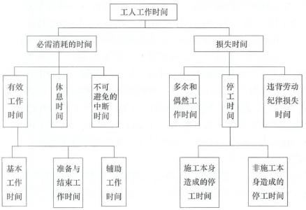
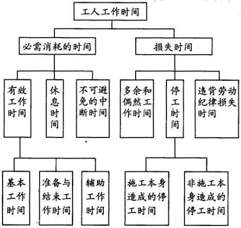
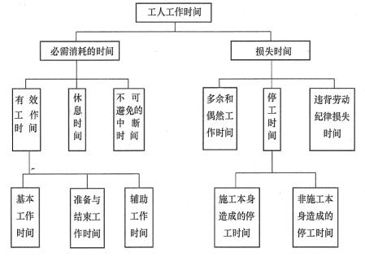

编制人工定额时，工人必需消耗的工作时间包括（ &nbsp;）。

A.多余和偶然工作时间
B.休息时间  (正确)
C.辅助工作时间  (正确)
D.施工本身造成的停工时间
E.准备与结束工作时间  (正确)
解析：
工人必需消耗的工作时间，包括有效工作时间（基本工作时间、准备与结束工作时间、辅助工作时间）、休息时间和不可避免的中断时间。

【知识点】人工定额的编制

【考点】工人工作时间消耗的分类

【考察方向】原文挖空

【难度】易

【题库维护老师：ZKQ】

工人在工作班内消耗的工作时间，按其消耗的性质可分为必需消耗的时间和损失时间。下列属于必需消耗的时间的是（）。

A.偶然工作时间
B.有效工作时间  (正确)
C.违背劳动纪律所引起的损失时间
D.休息时间  (正确)
E.不可避免的中断时间  (正确)
解析：
工人在工作班内消耗的工作时间，按其消耗的性质，基本可以分为两大类：必需消耗的时间和损失时间。必需消耗的时间是工人在正常施工条件下，为完成一定产品（工作任务）所消耗的时间。它是制定定额的主要依据。必需消耗的工作时间，包括有效工作时间、休息时间和不可避免的中断时间。损失时间，是与产品生产无关，而与施工组织和技术上的缺陷有关，与工人在施工过程中的个人过失或某些偶然因素有关的时间消耗。损失时间中包括多余和偶然工作、停工、违背劳动纪律所引起的损失时间。

【知识点】人工定额的编制

【考点】工人工作时间消耗的分类

【考察方向】原文挖空

【难度】易

【题库维护老师：ZKQ】

编制人工定额时，工人工作必须消耗的时间包括（ ）。

A.偶然工作时间
B.由于水源、电源的中断引起的停工时间
C.准备工作时间  (正确)
D.由于施工工艺特点引起的工作中断所必须的时间  (正确)
E.工人下班前清洗整理工具的时间  (正确)
解析：
本题考查工人工作时间分类。损失时间中偶然工作时间，由于水源、电源中断引起的停工时间属于损失时间。

【知识点】人工定额的编制

【考点】工人工作时间消耗的分类

【考察方向】原文挖空

【难度】易

【题库维护老师：ZKQ】 

编制施工机械台班使用定额时，属于机械工作时间中损失时间的有（ ）。

A.施工本身原因造成的停工时间  (正确)
B.非施工原因造成的停工时间  (正确)
C.违反劳动纪律引起的时间损失  (正确)
D.工人正常的休息时间
E.低负荷下的工作时间  (正确)
解析：
本题考查的是机械工作时间消耗。机械工作时间中损失时间有多余工作时间，停工时间，违背劳动纪律时间，低负荷下工作时间。 工人正常的休息时间属于必需消耗的工作时间。

【知识点】人工定额的编制

【考点】工人工作时间消耗的分类

【考察方向】原文挖空

【难度】易

【题库维护老师：ZKQ】 

编制人工定额时，属于工人有效工作时间的有( &nbsp; )。

A.基本工作时间  (正确)
B.辅助工作时间  (正确)
C.施工组织不善造成的停工时间
D.准备与结束工作时间  (正确)
E.违背劳动纪律损失时间
解析：
必需消耗的工作时间，包括有效工作时间、休息时间和不可避免的中断时间。其中，有效工作时间是从生产效果来看与产品生产直接有关的时间消耗。包括基本工作时间、辅助工作时间、准备与结束工作时间。 施工组织不善造成的停工时间、违背劳动纪律损失时间属于损失时间。

【知识点】人工定额的编制

【考点】工人工作时间消耗的分类

【考察方向】原文挖空

【难度】易

【题库维护老师：ZKQ】 

工人必须消耗时间包括( &nbsp; &nbsp; )。

A.休息时间  (正确)
B.施工本身造成的停工时间
C.基本工作时间  (正确)
D.停工时期
E.辅助工作时间  (正确)
解析：
必需消耗的工作时间，包括有效工作时间、休息时间和不可避免的中断时间。

【知识点】人工定额的编制

【考点】工人工作时间消耗的分类

【考察方向】原文挖空

【难度】易

【题库维护老师：ZKQ】

编制人工定额时需拟定施工的正常条件，其内容包括拟定( &nbsp; &nbsp;)。

A.施工作业内容  (正确)
B.施工作业方法  (正确)
C.施工企业技术水平
D.施工作业地点组织  (正确)
E.施工作业人员组织  (正确)
解析：
编制人工定额主要包括拟定正常的施工条件以及拟定定额时间两项工作;拟定施工的正常条件包括：拟定施工作业的内容、拟定施工作业的方法、拟定施工作业地点的组织、拟定施工作业人员的组织等。

【知识点】人工定额的编制

【考点】拟定正常的施工作业条件

【考察方向】原文挖空

【难度】易

【题库维护老师：ZKQ】

编制人工定额时，属于工人工作必需消耗的时间有( &nbsp; &nbsp;)。

A.多余和偶然工作时间
B.施工本身造成的停工时间
C.不可避免的中断时间  (正确)
D.辅助工作时间  (正确)
E.准备与结束工作时间  (正确)
解析：
必需消耗的时间是工人在正常施工条件下，为完成一定产品（工作任务）所消耗的时间。必需消耗的工作时间，包括有效工作时间、休息时间和不可避免的中断时间，有效工作时间包含基本工作时间、辅助工作时间、准备与结束时间。 

【知识点】人工定额的编制

【考点】工人工作时间消耗的分类

【考察方向】原文挖空

【难度】易

【题库维护老师：ZKQ】 

人工定额中拟定施工的正常条件包括( &nbsp;)。

A.拟定施工作业的内容  (正确)
B.拟定施_[作业的方法  (正确)
C.拟定施工作业地点的组织  (正确)
D.拟定施工作业人员的组织  (正确)
E.拟定的施工企业组织形式
解析：
拟定施工的正常条件包括：拟定施工作业的内容；拟定施工作业的方法；拟施工作业地点的组织；拟定施工作业人员的组织等。

【知识点】人工定额的编制

【考点】拟定正常的施工作业条件

【考察方向】原文挖空

【难度】易

【题库维护老师：ZKQ】

在编制人工定额时，对工人工作时间按其消耗性质进行分类，属于必须消耗的时间有( &nbsp;)。

A.工人完成一定产品的施工工艺过程所消耗的时间  (正确)
B.为保证基本工作能顺利完成所消耗的时间  (正确)
C.与施工过程、工艺特点有关的工作中断时间  (正确)
D.由于工程技术人员和工人的差错而引起的时间耗费
E.由于材料供应不及时、工作面准备工作做得不好引起的停工时间
解析：
必需消耗的工作时间，包括有效工作时间、休息时间和不可避免的中断时间。因此正确答案为A，B、C。

【知识点】人工定额的编制

【考点】工人工作时间消耗的分类

【考察方向】原文挖空

【难度】易

【题库维护老师：SUT】

下列选项所述工人工作时间，在编制人工定额的时候并不计入定额消耗水平，但在定额中应给与合理的考虑的一项是（）。

A.多余工作时间
B.非施工本身造成的停工时间  (正确)
C.休息时间
D.不可避免的中断时间
解析：
A选项为损失时间；C选项为必需消耗时间；D选项为必需消耗时间。 【知识点】人工定额的编制 【考点】人工定额的编制 【考查方向】概念释义 【难度】易 【题库维护老师：yxf】

编制人工定额时，基本工作结束后的整理劳动工具的时间应计入（&nbsp; &nbsp; ）。

A.休息时间
B.不可避免的中断时间
C.有效工作时间  (正确)
D.损失时间
解析：
在工人工作时间分类中，定额（消耗）时间包括有效工作时间、休息时间、不可避免的中断时间；其中，整理工具用具所需要的时间，属于有效工作时间中的准备与结束时间。 【知识点】人工定额的编制 【考点】工人工作时间消耗的分类 【考查方向】概念释义 【难易程度】易 【题库维护老师】yxf

关于工人有效工作时间的说法，错误的是（）。

A.基本工作时间的长短和工作量大小成正比例
B.辅助工作时间的结束，往往就是基本工作时间的开始
C.准备劳动工具和劳动对象的工作时间属于有效工作时间
D.不可避免的中断时间属于有效工作时间  (正确)
解析：
本题考核的是有效工作时间。有效工作时间是从生产效果来看与产品生产直接有关的时间消耗。包括基本工作时间、辅助工作时间、准备与结束工作时间。基本工作时间的长短和工作量大小成正比例。辅助工作时间是为保证基本工作能顺利完成所消耗的时间。准备与结束工作时间包括工作地点、劳动对象和劳动工具的准备工作时间。不可避免的中断时间属于必需消耗的时间，故选项D错误。

【知识点】人工定额的编制

【考点】工人工作时间消耗的分类

【考察方向】概念释义

【难度】易

【题库维护老师：ZKQ】

抹灰工修补墙上遗留的墙洞所耗费的时间属于消耗时间中的( &nbsp; &nbsp;)。

A.违背劳动纪律损失时间
B.不可避免的间断时间
C.停工时间
D.偶然工作时间  (正确)
解析：
    偶然工作是工人在任务外进行的工作，但能够获得一定产品，如抹灰工不得不补上偶然遗留的墙洞等。

    【知识点】人工定额的编制

    【考点】工人工作时间消耗的分类

    【考察方向】概念释义

    【难度】易

    【题库维护老师：ZKQ】

在进行施工作业时间研究时，下列方法中，属于计时测定方法的是（）。

A.图纸分析法
B.比较类推法
C.写实记录法  (正确)
D.经验估计法
解析：
计时测定的方法有许多种，如测时法、写实记录法、工作日写实法等。 

【知识点】人工定额的编制

【考点】人工定额的编制

【考查方向】概念释义

【难度】易

【题库维护老师：hejiade】

抹灰工修补墙上遗留的墙洞所耗费的时间属于消耗时间中的( &nbsp; )。

A.偶然工作时间  (正确)
B.不可避免的中断时间
C.辅助工作时间
D.多余工作时间
解析：
多余工作是指工人进行了任务以外而又不能增加产品数量的工作。多余工作的工时损失，一般都是由于工程技术人员和工人的差错而引起的，因此，不应计入定额时间。<strong>偶然工作也是工人在任务外进行的工作，但能够获得一定产品。如抹灰工不得不补上偶然遗留的墙洞等。</strong>

【知识点】人工定额的编制

【考点】工人工作时间消耗的分类

【考察方向】概念释义

【难度】易

【题库维护老师：ZKQ】 

编制人工定额时，工人定额工作时间中应予以合理考虑的情况是（）。

A.由于水源或电源中断引起的停工时间  (正确)
B.由于工程技术人员和工人差错引起的工时损失
C.由于劳动组织不合理导致工作中断所占用的时间
D.由于材料供应不及时引起的停工时间
解析：
施工本身造成的停工时间，是由于施工组织不善、材料供应不及时、工作面准备工作做得不好、工作地点组织不良等情况引起的停工时间。非施工本身造成的停工时间，是由于水源、电源中断引起的停工时间。前一种情况在拟定定额时不应该计算，后一种情况定额中则应给予合理的考虑。

【知识点】人工定额的编制

【考点】工人工作时间消耗的分类

【考察方向】概念释义

【难度】易

【题库维护老师：ZKQ】

编制人工定额时，基本工作结束后整理劳动工具时间应计入( )。

A.休息时间
B.不可避免的中断时间
C.有效工作时间  (正确)
D.损失时间
解析：
有效工作时间是从生产效果来看与产品生产直接有关的时间消耗。包括基本工作时间、辅助工作时间、准备与结束工作时间。基本工作结束后整理劳动工具时间应计入有效工作时间。

【知识点】人工定额的编制

【考点】工人工作时间消耗的分类

【考察方向】概念释义

【难度】易

【题库维护老师：ZKQ】

下列各项时间中属于工人工作必需消耗的工作时间是（ &nbsp; &nbsp;）。

A.与施工工艺原因无关的中断时间
B.工人下班前对搅拌机进行清洗的时间  (正确)
C.由于材料供应不及时造成的工人窝工时间
D.由于施工机械故障造成的工人窝工时间
解析：
工人下班前对搅拌机进行清洗的时间是准备与结束工作时间，属于有效工作时间，为必需消耗的时间。

【知识点】人工定额的编制

【考点】工人工作时间消耗的分类

【考察方向】概念释义

【难度】易

【题库维护老师：ZKQ】

编制人工定额时，基本工作结束后整理劳动工具所消耗的时间应计入( &nbsp; )

A.休息时间
B.不可避免的中断时间
C.有效工作时间  (正确)
D.损失时间
解析：
工人在工作班内消耗的工作时间，按其消耗的性质，基本可以分为两大类：必需消耗的时间和损失时间。其中，必需消耗的时间是工人在正常施工条件下，为完成一定产品(工作任务)所消耗的时间。它是制定定额的主要依据。必须消耗的时间包括：有效工作时间、休息时间、不可避免的中断时间。有效工作时间又包括基本工作时间、准备与结束工作时间、辅助工作时间。

【知识点】人工定额的编制

【考点】工人工作时间消耗的分类

【考察方向】概念释义

【难度】易

【题库维护老师：ZKQ】

在工程施工过程中，由于水源、电源中断引起的停工时间属于( &nbsp;)。

A.非施工本身造成的停工时间，定额中则应给予合理的考虑  (正确)
B.施工本身造成的停工时间，定额中则不应予以考虑
C.多余工作的工时损失，定额中则不应予以考虑
D.劳动组织不合理引起的，属于损失时间，不能计人定额时间
解析：
非施工本身造成的停工时间，是由于水源、电源中断引起的停工时间，在定额中则应给予合理的考虑。故A为正确选项。

【知识点】人工定额的编制

【考点】工人工作时间消耗的分类

【考察方向】概念释义

【难度】中等

【题库维护老师：ZKQ】

关于在工程施工过程中抹灰工不得不补上偶然遗留墙洞等工作所耗费时间的说法，正确的是( &nbsp;)。

A.属于多余的工作时间，拟定定额时不需考虑
B.属于违背劳动纪律造成的工作时间损失，在定额中予以考虑
C.该工作能获得一定产品，拟定定额时要适当考虑其影响  (正确)
D.由于施工工艺特点引起的工作中断所必需的时间，在定额中予以考虑
解析：
偶然工作也是工人在任务外进行的工作，但能够获得一定产品。如抹灰工不得不补上偶然遗留的墙洞等。由于偶然工作能获得一定产品，拟定定额时要适当考虑它的影响。故C为正确选项。

【知识点】人工定额的编制

【考点】工人工作时间消耗的分类

【考察方向】概念释义

【难度】易

【题库维护老师：ZKQ】

在合理的劳动组织与合理使用机械的条件下，完成单位合格产品所必须消耗的施工机械工作时间不包括( &nbsp; &nbsp;)。

A.有根据地降低负荷下的工作时间
B.不可避免的无负荷工作时间
C.非施工本身造成的停工时间  (正确)
D.不可避免的中断时间
解析：
停工时间是损失时间，A项、B项、D项都是必须消耗的时间。

【知识点】人工定额的编制

【考点】工人工作时间消耗的分类

【考察方向】原文挖空

【难度】易

【题库维护人：ZKQ】 

编制人工定额时，下列时间属于工人在工作班内必需消耗的时间有（ &nbsp;）。

A.辅助工作时间  (正确)
B.准备与结束工作时间  (正确)
C.材料供应不及时引起的停工时间建设工程
D.工人在工作过程中恢复体力所必需的休息时间  (正确)
E.施工组织不善造成的停工时间
解析：
本题考查的是人工定额的编制。 

【知识点】人工定额的编制

【考点】工人工作时间消耗的分类

【考察方向】原文挖空

【难度】易

【题库维护老师：ZKQ】 

下列时间消耗中，属于编制人工定额时，应计入工人工作必须消耗的时间的有( &nbsp; )

A.由于材料供应不及时引起的停工时间
B.工人擅自离开工作岗位造成的工时损失
C.准备工作时间  (正确)
D.由于施工工艺特点引起的工作中断所必需的时间  (正确)
E.工人下班前清洗整理工具的时间  (正确)
解析：
工人工作时间的分类见下图。其中，停工时间是工作班内停止工作造成的工时损失。停工时间按其性质可分为施工本身造成的停工时间和非施工本身造成的停工时间两种。施工本身造成的停工时间是由于施工组织不善、材料供应不及时、工作面准备工作做得不好、工作地点组织不良等情况引起的停工时间。非施工本身造成的停工时间，是由于水源、电源中断引起的停工时间。前一种情况在拟定定额时不应该计算，后一种情况定额中则应给予合理的考虑。违背劳动纪律造成的工作时间损失，是指工人在工作班开始和午休后的迟到、午饭前和工作班结束前的早退、擅自离开工作岗位、工作时间内聊天或办私事等造成的工时损失。此项。工时损失不应允许存在。故选项A、B不属于工人工作必须消耗的时间。

【知识点】人工定额的编制

【考点】工人工作时间消耗的分类

【考察方向】原文挖空

【难度】易

【题库维护老师：ZKQ】

下列选项中，应计入人工定额中施工作业的定额时间的有（ &nbsp;）。

A.不可避免的中断时间  (正确)
B.辅助工作时间  (正确)
C.偶然工作时间
D.基本工作时间  (正确)
E.准备与结束工作时间  (正确)
解析：
 【知识点】人工定额的编制 【考点】人工定额的编制 【考查方向】概念释义 【难度】易 【题库维护老师：yxf】

