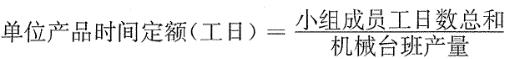

某产品时间定额为每立方米0.28个工日，则其产量定额为（ &nbsp;）。

A.0.72工日/立方米
B.0.28工日/立方米
C.1.39m³/工日
D.3.57m³/工日  (正确)
解析：
时间定额与产量定额互为倒数。 【知识点】人工定额的形式 【考点】人工定额的形式 【考查方向】计算 【难度】易 【题库维护老师】yxf

某施工工序的人工产量定额为4.56m³，则该工序的人工时间定额为( &nbsp; )工日。

A.0.23
B.0.22  (正确)
C.1.76
D.4.56
解析：
时间定额与产量定额互为倒数，即：时间定额＝1／产量定额＝1／4.56＝0.22工日。

【知识点】人工定额的形式

【考点】按表现形式的不同

【考察方向】公式计算

【难度】易

【题库维护老师：ZKQ】

生产某产品的工人小组由10人组成，产量定额为2m²／工日，则时间定额应为( &nbsp; )。

A.0.5工日／2m²
B.0.67工日／2m²
C.0.2工日／2m²
D.1工日／2m²  (正确)
解析：
时间定额以工日为单位，每一工日按八小时计算。其计算方法：单位产品时间定额(工日)＝1／每工日量；单位产品时间定额(工日)＝小组成员工日数总和／机械台班产量。根据题中条件，单位产品时间定额(工日)＝1／每工日量＝1／2＝0.5工日／m²，1工日／2m²所以答案选D。

【知识点】人工定额的形式

【考点】按表现形式的不同——时间定额

【考察方向】公式计算

【难度】易

【题库维护老师：ZKQ】

人工定额中的时间定额不包括( &nbsp; )。

A.工人下班前对搅拌机进行清洗时间
B.工人由于施工工艺原因必需的中断时间
C.由于设计错误造成的工人窝工时间  (正确)
D.工人必需的休息时间
E.由于施工机械故障造成的工人窝工时间  (正确)
解析：
人工定额按表现形式的不同，可分为时间定额和产量定额两种形式。时间定额是某种专业、某种技术等级工人班组或个人，在合理的劳动组织和合理使用材料的条件下，完成单位合格产品所必需的工作时间，包括准备与结束时间、基本工作时间、辅助工作时间、不可避免的中断时间及工人必需的休息时间。选项A属于准备与结束时间。

【知识点】人工定额的形式

【考点】按表现形式的不同——时间定额

【考察方向】原文挖空

【难度】易

【题库维护老师：ZKQ】 

某机械生产产品台班产量60立方米，该机械生产标准配置工人三名。则生产该产品的人工时间定额为（ &nbsp;）。

A.60立方米
B.20立方米
C.0.0167工日
D.0.05工日  (正确)
解析：
 

【知识点】人工定额的形式

【考点】人工定额的形式

【考查方向】计算

【难度】易

【题库维护老师】yxf

