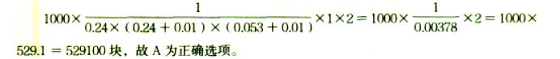

材料的损耗一般以损耗率表示，材料损耗率可以通过（）计算确定。

A.估价法
B.观察法  (正确)
C.定额法
D.统计法  (正确)
E.试验法
解析：
本题考核的是材料损耗量的确定。材料的损耗一般以损耗率表示。材料损耗率可以通过观察法或统计法计算确定。

【知识点】材料消耗定额的编制

【考点】材料损耗量的确定

【考察方向】原文挖空

【难度】易

【题库维护老师：ZKQ】 

编制材料消耗定额时，材料净用量的确定方法有( &nbsp; )。

A.理论计算法  (正确)
B.测定法  (正确)
C.图纸计算法  (正确)
D.定额单价法
E.经验法  (正确)
解析：
编制材料消耗定额时，材料净用量的确定，一般有以下几种方法：(1)理论计算法。理论计算法是根据设计、施工验收规范和材料规格等，从理论上计算材料的净用量。(2)测定法。根据试验情况和现场测定的资料数据确定材料的净用量。(3)图纸计算法。根据选定的图纸，计算各种材料的体积、面积、延长米或重量。(4)经验法。根据历史上同类项目的经验进行估算。

【知识点】材料消耗定额的编制

【考点】材料净用量的确定

【考察方向】原文挖空

【难度】易

【题库维护老师：ZKQ】

测定材料消耗定额时，定额中的损耗量是指操作过程中不可避免的废料和损耗以及不可避免的（ ）。

A.施工现场内运输损耗和场外运输损耗
B.采购过程中的计量误差
C.保管过程中的损耗
D.施工现场内运输损耗  (正确)
解析：
材料消耗定额（直接或一次性消耗材料）的组成，包括：直接使用在工程上的材料净用量；在施工现场内运输及操作过程中的不可避免的废料和损耗。

【知识点】材料消耗定额的编制

【考点】材料消耗定额的编制

【考察方向】原文挖空

【难度】易

【题库维护老师：ZKQ】

材料消耗定额中不可避免的消耗一般以损耗率表示（ ）。

A.损耗率=损耗量/材料消耗定额×100%
B.损耗率=损耗量/净用量×100%  (正确)
C.损耗率=损耗量/（净用量+损耗量）×100%
D.损耗率=损耗量/（净用量-损耗量）×100%
解析：
材料消耗量计算的公式：损耗率=损耗量/净用量×100%

【知识点】材料消耗定额的编制

【考点】材料损耗量的确定

【考察方向】公式计算

【难度】易

【题库维护老师：ZKQ】

材料消耗定额不包括( &nbsp; )。

A.仓储损耗  (正确)
B.操作过程中不可避免的废料
C.操作过程中不可避免的损耗
D.施工现场内运输损耗
解析：
编制材料消耗定额，主要包括确定直接使用在工程上的材料净用量和在施工现场内运输操作过程中不可避免的废料和损耗，仓储损耗属于材料费。

【知识点】材料消耗定额的编制

【考点】材料消耗定额的编制

【考察方向】原文挖空

【难度】易

【题库维护老师：ZKQ】

已知标准砖的尺寸为240mm×115mm×53mm，灰缝厚度为10mm，则砌1m3半砖墙的标准砖的净用砖量为( &nbsp; )块

A.385.0
B.527.1
C.529.1  (正确)
D.1017.5
解析：
标准砖砌体中，砌1m3标准砖墙的净用砖量计算公式：A＝1/[墙厚×(砖长+灰缝)×(砖厚+灰缝)]×K，式中K——墙厚的砖数×2(墙厚的砖数是0.5砖墙、1砖墙、1.5砖墙……)，墙厚的砖数是指用标准砖的长度来标明墙厚。例如：半砖墙指120厚墙、3/4砖墙指180厚墙，1砖墙指240厚墙。故砌1m3半砖墙的标准砖的净用砖量＝1/[0.12×(0.24＋0.01)×(0.053＋0.01)]×0.5×2＝529.1(块)。

【知识点】材料消耗定额的编制

【考点】材料净用量的确定——理论计算法

【考察方向】公式计算

【难度】易

【题库维护老师：ZKQ】

某建设工程项目，钢材的采购数量为100吨，在项目建设过程中钢材的净用量为80吨，损耗率为1%，则该项目钢材的总消耗量为( &nbsp;)吨。

A.80
B.80.8  (正确)
C.100
D.101
解析：
总消耗量=净用量+损耗量=净用量 (1+损耗率)。 80×(1+1%)=80.8。故B为正确选项。

【知识点】材料消耗定额的编制

【考点】材料损耗量的确定

【考察方向】公式计算

【难度】易

【题库维护老师：ZKQ】

砌1000m3的240mm厚标准砖墙的净用砖量为( &nbsp;)块。（标准砖尺寸为240mm×115mm×53mm，灰缝10mm）

A.529100  (正确)
B.530000
C.549100
D.553000
解析：

【知识点】材料消耗定额的编制

【考点】材料净用量的确定——理论计算法

【考察方向】公式计算

【难度】易

【题库维护人：ZKQ】 

